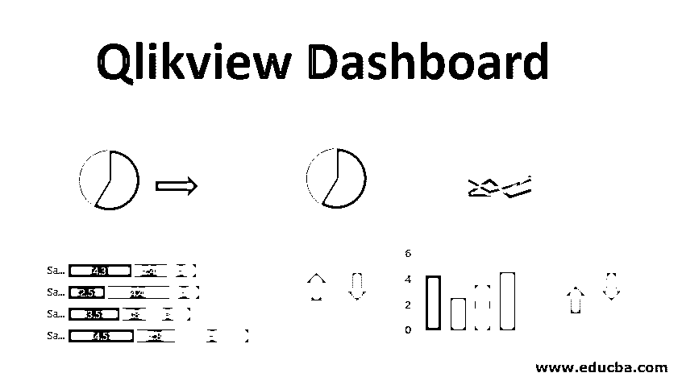

# Qlikview Dashboard

> 原文：<https://www.educba.com/qlikview-dashboard/>

## Qlikview Dashboard 简介

在我们了解 Qlikview dashboard 之前，让我们试着理解一下什么是 dashboard 以及它的需求是什么。当我们在日常工作中处理不同种类的数据时，我们需要从数据中提取正确的信息，而仪表盘可以帮助我们完成这项复杂的任务。它为我们提供了数据的概述，并从数据中讲述了故事。因此，选择正确的智能工具来呈现相关信息非常重要。

Qlikview 就是这样一个 BI 工具，它通过可视化帮助我们应对业务挑战。它由不同的工作表组成，这些工作表将数据加载到内存中。它可以连接到任何关系数据库或任何固定文件格式的数据，如 CSV/excel 等。并将数据加载到存储器中以执行处理。它可以同时集成各种源。有了内存中数据关联的惊人架构，我们可以在所有可视化中显示动态值。我们可以对数据执行聚合，并可以基于动态聚合的数据创建报告。

<small>Hadoop、数据科学、统计学&其他</small>

### 输入数据

Qlikview 可以同时从多个来源读取数据，如 RDMS 数据库、excel 文件、带分隔符的文件、基于 web 的文件、XML 文件，甚至可以通过内嵌来源读取数据。

您只需将 excel 文件拖放到 Qlikview 界面，就可以了！您已经将所有 excel 数据保存在 Qlikview 工作表中。您可以根据自己的要求使用界面上的配置。

通过选择编辑器中可用的菜单选项，可以将分隔文件加载到 Qlikview Dashboard 中。您需要打开应用程序的脚本编辑器窗口，然后单击“插入”菜单，选择“加载语句”并单击“从文件加载”。它将使您能够将 CSV 文件或任何其他固定格式的数据文件加载到应用程序中，以便您可以执行数据分析。

Qlikview 还可以从网络上读取数据，即 HTML 格式的文件。它可以通过将 URL 作为输入对象从网页中读取表格。要从 web 上提取数据，您需要打开脚本编辑器，然后选择“文件中的数据”选项卡，然后选择“Web 文件”。您将得到一个输入输入对象的提示，在这里您可以提供您的 URL。

Qlikview 可以连接到各种数据库，如 SQL Server、MySQL、PostgreSQL Server 等。它可以从表中提取数据以及其环境中的表结构，以执行关联和分析。

通过从剪贴板中键入或粘贴数据，也可以将内嵌数据插入 Qlikview。为此，您需要选择“插入”选项卡，然后选择“加载语句”，然后选择“内联加载”并执行操作。

### 仪表板创建

仪表板创建是一门艺术！您可以通过仪表板从数据中获得许多有用的见解。您只需要知道您想要在仪表板上显示的正确信息，以及您想要了解的数据之间的关联。您可以从在 Qlikview dashboard 中创建工作表对象开始，以加载数据并对数据值应用指标。给你。您已经准备好了一个好的仪表板！!

Qlikview dashboard 有四个组件，我们可以使用它们来设计我们的仪表盘，如下所示:

**1。图表:**多种图表可用，如条形图、饼图、折线图等。

**2。选择:**这将只选择选定的值和与之相关联的字段，并取消激活其余的全部。

**3。按钮:**这些按钮用于在纸张之间向前或向后移动。该功能将归入高级部分。

**4。指标:**总和或平均值或您想要计算的任何值都可以在 Qlikview 工作表中声明和使用。

### 例子

对于 Qlikview 仪表盘，您需要执行以下步骤:

#### 1.加载数据

要在 Qlikview 中创建仪表板，您需要首先将数据加载到 Qlikview 工作表中。您可以从文件菜单中的脚本编辑器浏览数据。从脚本编辑器中选择“文件中的数据”，然后选择“表格文件”。它会提示你选择你想要的文件。选择您的文件，然后单击“确定”。这将在 QlikView 工作表中加载您的数据文件。

#### 2.选择相关字段

我们可以只选择那些我们想要用来从数据中创建故事的字段。为此，我们需要在编辑器中单击“布局”，然后单击“选择字段”。一旦你点击它，你会看到一个窗口，显示所有可用的字段。选择您要使用的字段，然后单击“确定”。您也可以执行此操作来选择多个字段。

#### 3.图表选择

完成数据选择后，您可以选择自己的图表类型来进行可视化。要添加图表，请右键单击工作表中的任意位置，选择“新建工作表对象”，然后选择“图表”。这将为您打开一个选择图表类型的窗口。您可以从可用选项中选择条形图、饼图或任何其他图表。

#### 4.维度选择

您可以在“维度”选项卡下选择您想要查看其数值的维度。选择您的字段，然后单击“完成”。

#### 5.度量定义

您可以定义自己希望作为仪表板一部分看到的表达式。例如，几个月的总和(销售额)、平均值(销售额)。

#### 6.仪表板演示

万岁！!完成上述所有步骤后，您将准备好展示您的仪表板。您可以在不同的维度值上过滤您的仪表板，可视化将相应地改变。

### 结论

我们在这里看到了 Qlikview 仪表盘的实用性及其吸引人的功能。Qlikview 还可以处理各种来源的数据，并提供数据中涉及的关联。但是我们需要理解，最终重要的事情是我们需要根据业务需求设计一个仪表板，这是 Qlikview 最擅长的。Qlikview 的一些优势，它有助于创建动态报告，用户可以对数据和报告进行实时搜索。这里的缺点是，由于 Qlikview 以 GB 级工作，加载和重新加载数据会消耗大量时间。

### 推荐文章

这是 Qlikview 仪表盘的指南。这里我们讨论简介、输入数据、仪表板创建和示例。您也可以浏览我们推荐的其他文章，了解更多信息——

1.  [QlikView Tools](https://www.educba.com/qlikview-tools/)
2.  [免费数据分析工具](https://www.educba.com/free-data-analysis-tools/)
3.  [Tableau 替代方案](https://www.educba.com/tableau-alternatives/)
4.  [了解 QlikView Concatenate](https://www.educba.com/qlikview-concatenate/)

