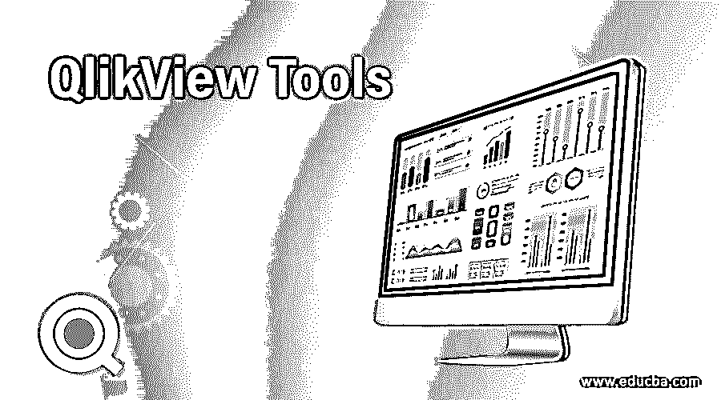
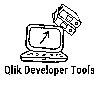

# QlikView Tools

> 原文：<https://www.educba.com/qlikview-tools/>

## QlikView 工具简介

QlikView 是一款数据可视化商业智能工具，可生成报告并执行内存数据处理。它们提供了高端的分析功能，对数据源的深刻见解，并结合了不同大小的数据集(关系型、平面文件)。您可以在移动应用程序中使用 QlikView 来访问 Qlik 文档。它们不需要任何特殊技能，通常用于市场营销、销售和人力资源，以监控业务流程和运营。QlikView 本身支持 ODBC 连接以访问大量数据源。

### 不同的 QlikView 工具

有不同的 QlikView 工具可用，它们简化了日常开发工作，提高了 QlikView 的使用寿命。目前，包括的工具有:

<small>Hadoop、数据科学、统计学&其他</small>

#### 1.Qlik 电动工具

电动工具是作为一组扩展功能使用的小软件程序，主要用于故障排除目的，不是无保修的官方 Qlik 产品。不同类型的 QlikView 电动工具有:

**a .共享文件查看器:**

QlikView Power tool 提供了修复大型共享文件和遗留文件的工具。它允许查看 Qlik 服务器存储库中的服务器对象和其他文件。这个工具支持查看二进制文件的内容。共享文件来修复它上面加载的文件。

**b. Qv 服务器对象连接器:**

在 Qlik 服务器上处理文档时，服务器对象可用。这是一个定制的数据连接器，用于将共享文件中的数据加载到文档中进行分析。

**c. QlikView 服务器代理:**

它有助于从一个位置更好地管理多个站点的许多服务器上的服务器服务。这是一个易于使用的工具。该工具可以一次停止和启动服务。

**d. QlikView Server 超级代理:**

这是一款免费使用的强大工具，可作为 QlikView server 的监控工具，并以电子邮件通知的形式报告其服务中断等状态。并且有助于在版本控制下维护 Qlik 框架。是电动工具维护者。

**e. QMS API 客户端:**

漂亮的 API 有助于与 Qlikview server 中的 QMS API 函数进行交互，无需代码交互。他们使用[数据结构](https://www.educba.com/what-is-data-structure/)进行动手练习，并通过利用来自 QMS API 的数据对每个基于呼叫的功能进行抽样测试来激活用户。

**f. Qv 用户经理:**

它的工作是通过分配、删除以 CSV 格式使用的 cars 来提示 CALs 过程。换句话说，有助于清除最近几天未使用的文档，并远程监控 QLik 服务器。

**g. QvsDetector:**

它用于测试 QVS 机器，并帮助检测来自同一网络上的服务器的 QVS。它有助于修复客户环境中使用相同凭据检测 QVS 的问题。

**h .服务器对象处理程序:**

它负责监控和管理位于远程的文档中的服务器对象。并且在选定程度的服务器对象上实现所有权改变过程。

**一、调度迁移工具:**

它概述了如何通过在升级后在 Publisher service 中出现问题来从分布式服务流程中删除旧工作。考虑从版本 9 迁移到版本 11/10 是 QlikView 管理员的责任。因为我们不使用共享存储，所以建议使用域服务来运行服务。

**j .共享文件修复:**

它是一个命令行工具，最好用作清理工具。它有助于对共享文件进行碎片整理以减小文件大小。它让 GUI 对更多的共享文件执行修复功能。

**k .服务器对象处理程序批处理**

它们对批处理脚本执行对象处理函数。

**l. XMLDBsviewer**

它们在 Qlikview 中识别用户和组，并允许在 QlikView Publisher 存储库数据库中以 [XML 格式](https://www.educba.com/what-is-xml/)搜索和编辑任务。

#### 2.Qlik 开发人员工具

该工具探索通过连接到其他开发人员而构建的资源，并且在 Qlik Sense 桌面中可以访问开发人员工具视图。它有助于在 QlikView 中链接多个数据信息。各种开发人员工具如下:

a. Qviewer:

这是一个付费工具，用于以表格形式查看 QVD 文件内容，并被命名为热门应用程序。这个工具能够验证或调试数据或模式

**b. QlikView 文档分析器:**

它旨在分析 QlikView 文档以提取其中的元数据。用户可以在几个方面有效地查看文档视图，另一个选择是使用这个分析器工具来监控他们的文档。

**c. QVSource:**

他们最擅长使用 Qlik web connectors 从各种数据源收集数据。他们通过 XML、电子表格、ODBC 或实时方式进行连接。

**d . n 打印:**

它是一种报告机制，有助于生成报告并通过发布报告的电子邮件分发给用户。

龟纹伊蚊:

这是一个控制源代码的免费软件，可以完全管理 Qlik 应用程序上的项目创建。

弗·斯纳吉特:

这个工具有一个内置的程序软件来读取屏幕录制和屏幕捕捉。你将能够编辑、分享和组织视觉效果来吸引用户的注意力。

**g. Notepad ++:**

它们是带有基本说明的自述文件，因其文本编辑工具和使用 Qlik 语言定义而广为人知。

**h .截图:**

这是一个流行的截图工具，特别是截图选定的地区。

**一、测绘工具:**

这将绘制 GIS 位置，并在地图上提供足够的点。

**j. Perfmon:**

他们负责性能监控和解释配置。它们监控 CPU、速度、网络性能、带宽和处理器的时钟计数器。

k. RightQlik:

该工具旨在通过单击 QVW 文件来添加上下文菜单。

### 结论

因此，我们讨论了最强大的 QlikView 工具及其功能。它有助于您了解 QlikView 及其组件。QlikView tool 是最大的赢家，因为它具有可视化分析等功能，使仪表盘看起来像是用户的眼睛。正如我们所见，由于后端系统中的 QlikView server，他们拥有良好的客户端-服务器通信。根据 Gartner 的预测，QlikView 是市场上领先的 BI 工具，被认为是未来的[商业智能工具](https://www.educba.com/business-intelligence-tool/)。

### 推荐文章

这是 QlikView 工具指南。这里我们分别讨论 QlikView 工具的概念、定义和各种基本类型。您也可以浏览我们推荐的其他文章，了解更多信息——

1.  [什么是 NoSQL 数据库](https://www.educba.com/what-is-nosql-database/)
2.  [什么是数据处理？](https://www.educba.com/what-is-data-processing/)
3.  [Qlikview Dashboard](https://www.educba.com/qlikview-dashboard/)
4.  [QlikView 备选方案](https://www.educba.com/qlikview-alternatives/)
5.  [QlikView Concatenate 完整指南](https://www.educba.com/qlikview-concatenate/)
6.  [QlikView 架构和优势](https://www.educba.com/qlikview-architecture/)

