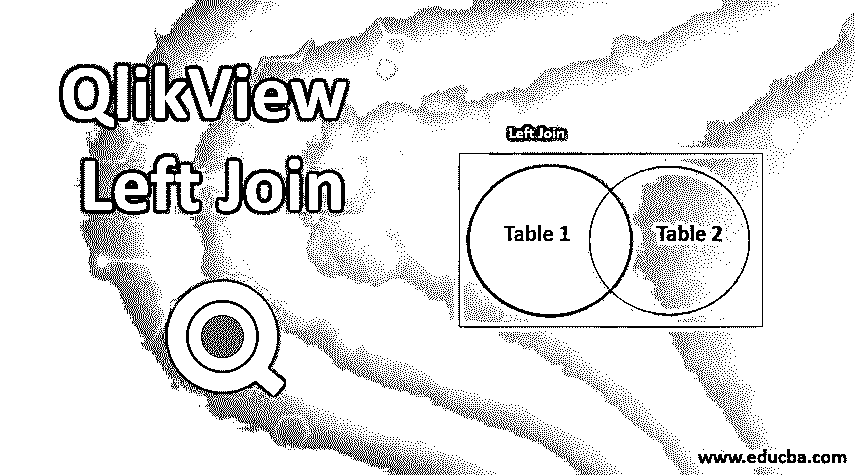
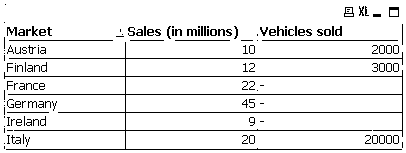

# QlikView 左接合

> 原文：<https://www.educba.com/qlikview-left-join/>




## QlikView Left Join 简介

联接是一种用于将两个表合并成一个表的操作。通常，我们在 QlikView 中用来分析的数据是多个数据源的组合，这些数据源以不同表格的形式出现。当这些表有一个公共字段(可用于唯一标识记录的字段)时，该字段可用于将两个表连接成一个虚拟表。通过从第二个表中向当前表添加列，得到的表是当前表的水平扩展。

### 如何在 QlikView 中使用 Left Join？

在 QlikView 中，连接是在脚本级别定义的。脚本中已经可用的表只能被连接。一旦表被连接，QlikView 将看不到单个的表，但它只对连接的表起作用。这将以单个内部表格的形式保存在 QlikView 中。在使用连接之前，我们需要考虑以下几点。

<small>Hadoop、数据科学、统计学&其他</small>

*   生成的表通常很大，这可能会降低仪表板的性能。
*   数据可能会丢失，原始表中的记录数可能与结果表中的记录数不同。
*   只有当两个表中有一个或多个相同的字段时，才能联接这两个表。
*   建议使用与用于连接的公共关键字字段相同的字段名称。
*   我们需要加入的公共字段的数量取决于我们的个人选择。
*   联接的字段必须是相同的数据类型。

在我们详细研究左连接之前，让我们了解所有可用的连接类型。这些连接概念与 SQL 中使用的概念相同。

1.  **内连接**:内连接用于合并并只显示左右表中可用的公共行。
2.  **外连接**:外连接用于合并显示左右表中所有可用的行。没有公共字段的地方，未合并的行将有空值。
3.  **右连接**:右连接用于合并和显示右表中的所有行，只显示左表中的匹配行或公共行。
4.  **Left Join** :相同的逻辑适用于 Left Join，显示左表中的所有行，只显示右表中的匹配行或公共行。

让我们看一个两个表的例子，以及当应用左连接时，结果表是什么样子。下面是两个示例数据源:销售数据和销售量数据。

| **销售数据** |
| **市场** | **销售额(百万元)** |
| 意大利 | Twenty |
| 德国 | Forty-five |
| 法国 | Twenty-two |
| 奥地利 | Ten |
| 芬兰 | Twelve |
| 爱尔兰 | Nine |

| **销量** |
| **市场** | **售出的车辆** |
| 不列颠，英国 | Forty thousand |
| 意大利 | Twenty thousand |
| 奥地利 | Two thousand |
| 芬兰 | Three thousand |
| 罗马尼亚 | Four thousand |
| 葡萄牙 | One thousand |

**输出:**

| **左连接输出** |
| **市场** | **销售额(百万元)** | **售出的车辆** |
| 意大利 | Twenty | Twenty thousand |
| 德国 | Forty-five | 空 |
| 法国 | Twenty-two | 空 |
| 奥地利 | Ten | Two thousand |
| 芬兰 | Twelve | Three thousand |
| 爱尔兰 | Nine | 空 |

我们会注意到，在上面的输出中，显示了左侧表“销售数据”中的所有记录，并且只显示了“销售量”表中的匹配行或公共行。哪里没有公共字段，哪里就有空值。

### QlikView Left Join 示例

以下是 QlikView Left Join 的示例:

#### 示例#1

打开 QlikView，使用脚本编辑器加载第一个表，并命名该表。该脚本看起来会像下面这样。

**代码:**

```
Sales_Data:
LOAD Market,
[Sales (in millions)]
FROM
[C:\Users\smoham87\Desktop\Sales Data.xlsx]
(ooxml, embedded labels, table is [Sales Data]);
```

#### 实施例 2

使用脚本编辑器加载第二个表，并用不同的名称命名该表。该脚本现在将如下所示。

**代码:**

```
Sales_Data:
LOAD Market,
[Sales (in millions)]
FROM
[C:\Users\smoham87\Desktop\Sales Data.xlsx]
(ooxml, embedded labels, table is [Sales Data]);
Sales_Volume:
LOAD Market,
[Vehicles sold]
FROM
[C:\Users\smoham87\Desktop\Sales Volume.xlsx]
(ooxml, embedded labels, table is [Sales Volume]);
```

#### 实施例 3

在脚本编辑器窗口的两个表之间添加左连接脚本，如下所示。

**代码:**

```
Sales_Data:
LOAD Market,
[Sales (in millions)]
FROM
[C:\Users\smoham87\Desktop\Sales Data.xlsx]
(ooxml, embedded labels, table is [Sales Data]);
LEFT JOIN(Sales_Data)
Sales_Volume:
LOAD Market,
[Vehicles sold]
FROM
[C:\Users\smoham87\Desktop\Sales Volume.xlsx]
(ooxml, embedded labels, table is [Sales Volume]);
```

在脚本编辑器窗口中单击确定，然后重新加载脚本。

#### 实施例 4

让我们通过添加两个表中的所有字段来创建一个表框，以显示连接的输出。表格框看起来会像下面这样。




我们会发现，在上面的表格框中，显示了左侧表格“销售数据”中的所有记录，并且只显示了“销售量”表格中的匹配行或公共行。

**QlikView 中的 Join 功能与 Concatenate 功能有何不同？:**

Join 函数用于合并多个表中的数据行。它使用一个公共字段将两个表中相似的行合并成一个，而 concatenate 表用于追加两个表。concatenate 函数将在没有公共字段的情况下工作。它将简单地追加两个表，即使行是重复的。连接的发生不需要满足任何条件，而只有当两个表有一个公共字段时，连接才起作用。

**QlikView 中的 Join 功能与 Keep 功能有何不同？:**

Join 函数将使用一个公共字段将两个表合并成一个表，而 Keep 函数将使用与 Join 函数相同的逻辑，但是它将分别维护这两个表。

### 结论

在大多数情况下，我们需要使用一个或多个数据源。只有将这些数据源进行逻辑合并，我们才能从中获得有意义的见解。因此，数据连接是使用两个表中的公共字段创建这些合并的一个重要功能。

### 推荐文章

这是 QlikView Left Join 的指南。这里我们讨论如何在 QlikView 中使用 Left Join 函数及其代码实现示例。您也可以浏览我们推荐的文章，了解更多信息——

1.  [QlikView 功能介绍](https://www.educba.com/qlikview-functions/)
2.  [Tableau 与 QlikView–主要差异](https://www.educba.com/tableau-vs-qlikview/)
3.  [使用 QlikView 图表的优势](https://www.educba.com/qlikview-charts/)
4.  [QlikView 十大面试问题](https://www.educba.com/qlikview-interview-questions/)
5.  [QlikView 架构完整指南](https://www.educba.com/qlikview-architecture/)


