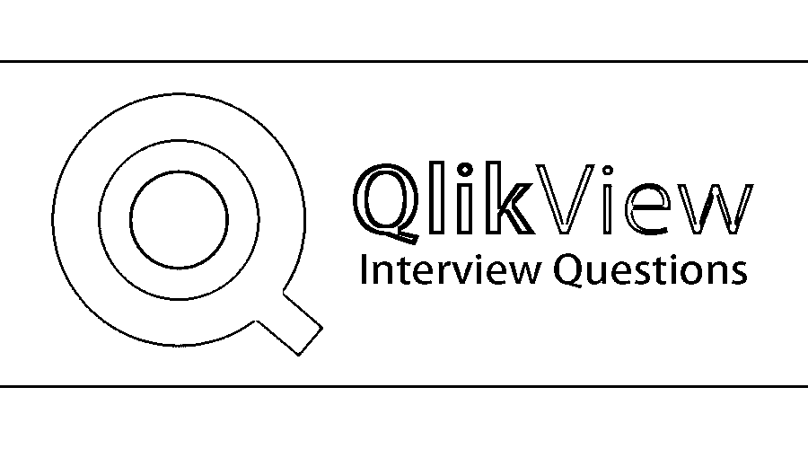

# QlikView 面试问题

> 原文：<https://www.educba.com/qlikview-interview-questions/>

## QlikView 面试问答简介

QlikView 是一个平台，用于根据公司要求或根据公司完成的任务发现各种类型的业务。与 BI [商业智能平台](https://www.educba.com/careers-in-artificial-intelligence/)相比，它具有更好的特性。它是数据分析工具，维护各种数据之间的关系，这些数据可以按照公司的要求以各种方式展示。它提供了许多搜索数据的方法，可以是直接的，也可以是间接的。它可以以各种列表的形式显示数据。在搜索到的数据上，可以应用各种颜色。让我们来讨论一下基础和高级面试问答。

**以下是 2022 年 QlikView 面试的 10 个重要问题和答案:**

<small>Hadoop、数据科学、统计学&其他</small>

它具有提供内存数据处理的特性，因此它可以非常快速地响应用户。它可以即时计算聚合，并将数据压缩到原始大小的 10%。QlikView 的开发人员和用户不维护数据之间的关系。这是通过 QlikView 的开箱即用功能实现的。

现在，如果您正在寻找与 QlikView 相关的工作，那么您需要准备 2022 QlikView 面试问题。的确，每个面试都因不同的职位而不同。在这里，我们准备了重要的 QlikView 面试问题和答案，将帮助您在面试中取得成功。这些问题分为以下两部分:

### 第 1 部分–QlikView 面试问题(基础)

第一部分包括基本的 QlikView 面试问题和答案。

#### Q1。QlikView 有哪些功能？

**答:**
QlikView 帮助从各种数据源创建各种报告，帮助公司展示各种主题。下面给出了几个特征:

*   **自动创建数据关联:**自动识别数据集中存储的每条数据之间的关系。用户不需要重新配置不同数据实体之间的关系。
*   **保存在快速内存中的数据:**它将各种用户的数据结构存储在 RAM 中，以实现快速用户体验，这使其成为与其他可用平台相比最具吸引力的平台。
*   **聚合是根据需要动态计算的:**它将数据存储在内存中，计算是动态完成的。因此不需要存储预先计算的合计值。
*   **用颜色表示关系:**数据之间的关系不是用箭头或线条来表示，而是用各种颜色来表示。选择一段数据会给相关数据赋予特定的颜色，给不相关的数据赋予另一种颜色。
*   **直接和间接搜索:**由于数据之间的关联，它提供了以直接和间接两种方式搜索数据的功能。由于数据关联，用户可以给出一些相关数据并得到确切的结果，而不是给出用户正在寻找的直接值。
*   **数据被压缩到原始大小的 10%:**它大量使用数据字典。任何分析都只需要存储器中的强制数据位。因此，它将原始数据压缩成较小的大小。

#### Q2。Keep、Join 和 Concatenate 有什么区别？

**回答:**
这是 QlikView 面试中问的基本问题。在 keep 的情况下，两个数据集都在 QlikView 的内存中可用，而在 join 的情况下，load 语句仅生成一个数据集，您必须从中选择列。没有外部保持的概念，而在连接的情况下我们有外部连接。Join 给出两个表的结果，因为记录包含两个表中的列。但是 Concatenate 只是将一个表中的行追加到另一个表中。

让我们进入下一个 QlikView 面试问题。

#### Q3。解释一下合成键，在 QlikView 中如何避免？

**答案:**
在 QlikView 数据结构中，跨多个表有多个公共键是不可取的。因此，QlikView 可能会使用复合密钥合成密钥来生成数据结构中的连接。合成键使用大量资源，可能会降低计算速度，在极端情况下，会降低应用程序的性能。这个键也使得文档难以理解和维护。在某些情况下，合成键是不可避免的(例如，间隔匹配表)，但是，一般来说，如果可以在加载脚本中对字段进行注释，则应该删除合成键，并使用 UNQUALIFY 运算符重命名字段。

#### Q4。解释直表和透视表的区别？

**回答:**
这是 QlikView 面试中问的基本问题。在排序方面，直表比数据透视表更好。我们可以根据任何列进行排序。分组就不好了。在直表中不能进行分类汇总。

虽然在数据透视表中很好地进行了分组，我们可以很容易地看到特定行属于哪个组，并且一个组也可以有小计。但是当你排序一个数据透视表时，我们必须先根据第一维排序，然后根据下一维排序。我们可以像十字表一样显示数据透视表，数据透视表不支持排序。

#### Q5。QlikView 中的常驻负载是什么？

**答:**
在 QlikView 中创建一个新的逻辑表，该表将基于先前加载的(常驻)表。

### 第 2 部分–QlikView 面试问题(高级)

现在让我们来看看高级 QlikView 面试问题。

#### Q6。解释 QlikView 中的集合分析？

**答:**
在 [QlikView 集合中，用于组集合的分析](https://www.educba.com/qlikview-set-analysis/)主要用于汇总函数，如当年与去年的销售额总和(年)

#### Q7。解释一下 QlikView 中的规范化和反规范化数据？

**答:**
规范化的数据是那些结构良好，没有任何冗余或重复的数据。这些数据是关系数据，主要用于 [OLTP](https://www.educba.com/what-is-oltp/) 一类的东西，而变形数据是那些有重复冗余的数据，这些数据在 OLAP 使用。

让我们进入下一个 QlikView 面试问题。

#### 8.QlikView 中的修改器是什么？

**答案:**
在 QlikView 中，修饰符用来处理字段的名称。
例如:sum({ $<Region =>} Sales)
将返回当前选择的销售额，但删除“区域”中的选择。

#### Q9。解释 QlikView 中的启动模式？

**答案:**
这是高级 QlikView 面试中问的问题。这是维度模型最简单的形式，在这种模型中，数据被组织成事实和维度。事实是被计数或测量的事件，就像销售或登录一样。该维度包含关于事实的参考信息，如日期、产品或客户。星型模式是通过将每个事实表及其关联的维度表[包围起来来绘制的。输出图给出了](https://www.educba.com/what-is-fact-table/)[星型模式定义](https://www.educba.com/what-is-star-schema/)；它是基于一组已知维度的数据聚合。它将数据存储在二维关系数据库管理系统中。

#### Q10。QlikView 中的容器是什么？

**答案:**
容器对象是用来把多个图表放在一起的。容器对象可用于在同一个框中保存多个图表。

### 推荐文章

这是 QlikView 面试问答列表的指南。这里我们列出了在面试中最常被问到的 10 个面试问题和答案，并给出了详细的回答。您也可以阅读以下文章，了解更多信息——

1.  [多线程面试问题](https://www.educba.com/multithreading-interview-questions/)
2.  [Power BI vs QlikView](https://www.educba.com/power-bi-vs-qlikview/)
3.  [ExtJS 面试问题](https://www.educba.com/extjs-interview-questions/)
4.  [Qlikview Dashboard](https://www.educba.com/qlikview-dashboard/)
5.  [QlikView 备选方案](https://www.educba.com/qlikview-alternatives/)
6.  【Tableau vs Power BI vs QlikView 的差异

