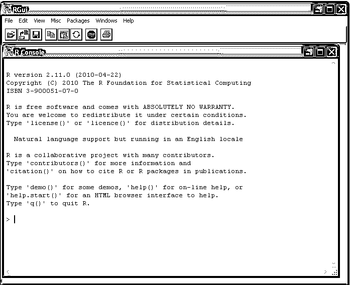
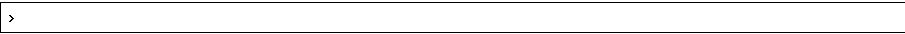

# 安装程序

> 原文：<https://www.educba.com/install-r/>

## 安装 R 简介

以下文章提供了 Install R 的概要。R 是市场上最常用的免费统计软件之一。这是市场上最常用的开源统计分析工具。它支持作为简单编程或交互模式的分析。

### 安装 R 的先决条件

r 程序需要安装在电脑上才能使用。

<small>Hadoop、数据科学、统计学&其他</small>

验证 R 已经安装在 windows 计算机上:

在机器上安装 R 之前，首先要做的是验证它是否已经安装。以下是验证它是否安装在机器中的步骤:

*   首先，验证计算机桌面上的 R 图标是否可用。如果是，R 已经安装在机器中，双击图标即可运行。
*   验证“开始”菜单中是否有 R 图标。可以通过首先点击 windows 桌面的开始菜单，然后点击所有程序菜单来选择它，它会弹出一个列表，其中会出现 R 图标。它可以通过选择图标来运行。

如果以上任何一个步骤都没有成功启动 R 程序，说明系统上没有安装 R，必须安装才能使用。

下一个任务是找出 R 程序的最新版本。CRAN 或 comprehensive R network 网站列出了 R 的所有版本，在那里可以选择所需的版本。如果不知道使用哪个版本，也可以选择获取最新版本。r 一直在定期发布新版本，并随着时间的推移积极改进。因此，总是建议定期安装最新版本，以确保与下载的所有 R 包兼容。

### 在 Windows 上安装 R 的步骤

下面是在 Windows 机器上安装 R 的步骤:

**第一步:**浏览以下网站获取最新 R 版本。网站-【http://ftp.heanet.ie/mirrors/cran.r-project.org/ T2】T3

**第二步:**会出现一个下载并安装 R 选项，我们需要点击其中的 windows 链接。

**第三步:**从子目录列表中，我们需要选择基本链接。

第四步:下一页将显示一个链接，显示类似 R 2.10.1 for Windows 的内容。x.x.x 表示 r 的版本。选择链接继续。

第五步:会有一个选项选择我们是否要保存或运行文件 R-2.10.1-赢 There。首先，我们必须将文件保存在我们希望的路径上。接下来双击文件的图标来运行设置。

当被问及选择哪种语言时，请选择英语。

**步骤 7:** 设置向导将出现在一个窗口中，我们需要在该窗口中选择下一步以继续设置。

**步骤 8:** 向导的下一页将在顶部显示信息。

**第 9 步:**请点击下一步继续设置。

**步骤 10:** 接下来的页面会要求选择我们要安装 r 的目标位置，默认情况下，该位置会是系统 c 盘的 program files 文件夹。位置- c:\program files。

**第十一步:**之后，点击下一步。

**步骤 12:** 接下来的页面会要求选择最上面的组件。单击“下一步”继续安装。

**步骤 13:** 接下来的页面会提示启动选项。单击“下一步”继续安装。

**步骤 14:** 接下来的页面会要求选择开始菜单文件夹。单击“下一步”继续安装。

**第 15 步:**接下来的页面会要求选择附加任务。单击“下一步”继续安装。

第 16 步:这应该会在机器上安装 R。这需要一些时间，之后，它会显示完成 windows 安装。单击“完成”结束安装。

**步骤 17:** 选择以下任一步骤启动 r。

**第十八步:**找到桌面上的 R 图标，双击图标启动程序。如果桌面上没有 R 图标，请执行以下步骤。

**第十九步:**选择开始菜单；从那里，选择所有程序选项；之后，你会发现 R 图标。点击图标运行程序。

**步骤 20:** 出现如下图的 R 控制台，R 程序开始。

### 关于 R 的简单工作知识

以下给出了关于 R 的简要工作知识:

1.R 命令必须写入控制台，以执行不同的分析。蓝色是 R 提示的一个例子。通过按回车键提交命令。

2.启动 R 后，可以向控制台提交命令，结果将立即被计算出来。以下是几个例子:

`> 2*3
[1] 6
> 10-3
[1] 7`

3.所有变量，包括标量、向量、矩阵等。由 R 创建的称为对象。使用 r 中的箭头给变量赋值。例如，我们可以使用下面的命令给变量 x 赋值 2*3。

`> x <- 2*3`

4.要查看任何对象的内容，只需输入其名称，内容就会显示出来。下面是一个例子:

`> x
[1] 6`

5.它们在 R 中不同类型的对象，如数组、矩阵、向量、标量、列表、表格、[和数据帧](https://www.educba.com/data-frames-in-r/)。上面显示的标量变量文本是 R 对象的一个例子。与包含单个元素的标量变量不同，向量由几个元素组成。存储在 vector 中的元素与数字或字符的类型相同。列表由不同类型的元素组成，包括数字或字符。

6.r 提供了一个帮助函数，它可以用来获得任何命令及其用法的细节。以下是获取日志功能帮助的示例:

`> help("log10")`

7.当某人不确定确切的功能或只知道一部分时，可以使用 help.search()和 RSiteSearch()函数进行搜索。

### 推荐文章

这是一个安装 r 的指南。在这里我们讨论基本概念，先决条件，安装的一步一步的过程，以及它如何工作的简要知识。您也可以阅读以下文章，了解更多信息——

1.  [R 为数据科学](https://www.educba.com/r-for-data-science/)
2.  [数据链路层协议](https://www.educba.com/data-link-layer-protocol/)
3.  [数据准备工具](https://www.educba.com/data-preparation-tools/)
4.  [数据结构基础](https://www.educba.com/fundamentals-of-data-structure/)

