# RStudio 是什么？

> 原文：<https://www.educba.com/what-is-rstudio/>

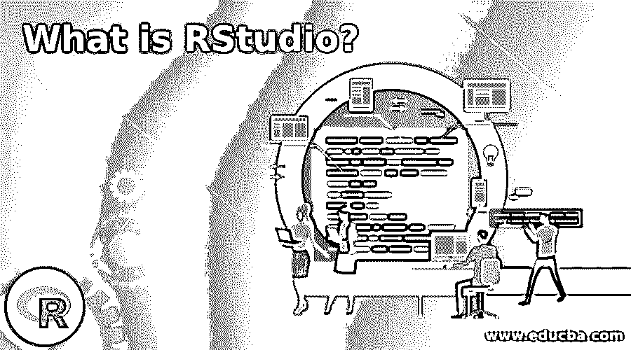

## RStudio 简介

RStudio 是一种与 R 编程交互的强大而简单的方法，被认为是集成开发环境(IDE)，为所有的统计计算和图形提供了一站式解决方案。RStudio 是 R 的一个更高级的版本，带有一个多窗格窗口设置，可以在一个屏幕上访问所有主要内容(如源代码、控制台、环境和历史、文件、照片、图表等)。

**Note:** You must have R software installed to install, run, and use RStudio on your desktop. A mandatory note you can assume.

### 我们为什么需要 RStudio？

我们应该选择 RStudio 而不是 R software 有几个原因。

<small>Hadoop、数据科学、统计学&其他</small>

我们在这里用例子列出一些现实生活中的原因。

**1。一个完全可靠且功能齐全的文本编辑器。**

你知道有一个文本编辑器，它允许你对不同的方面(代码、圆括号、方括号等)使用不同的语法。)，自动匹配括号，自动检测语法，等等。对于用户来说，它更经得起未来的考验。

**2。允许使用制表符补全功能轻松编写脚本。**

该工具非常智能，可以自动检测您正在查看的函数/文件/数据集的组件。

**举例:**

请看下面的截图，我们不知道“汽车”数据集包含的变量。然而，点击 tab 键会给出数据集中变量的确切列表。

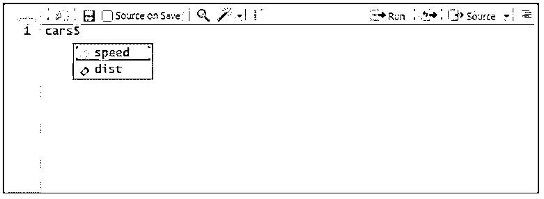

一幅图像显示了 tab 键完成代码是多么容易。

**3。存储在您环境中的对象可以通过“环境”选项卡轻松访问。**

这是一个有趣的特性。“环境”选项卡可让您访问所有对象(变量、数据集等。)中为会话创建的。

**举例:**

请看下面的截图，在这里我们可以看到存储在我的 RStudio 工作区的本地环境中的所有对象。

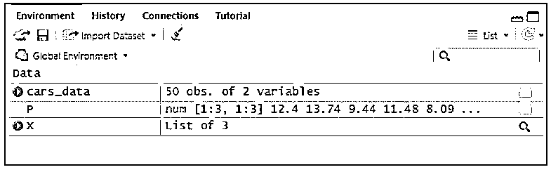

为会话存储在 RStudio 环境中的对象。

**4。访问你的计算机文件/文件夹和设置一个工作目录是小菜一碟。**

用 R 软件工作时，设置工作目录是一件很忙乱的工作。然而，有了 RStudio，事情就变得简单了，你可以通过一个下拉菜单从你的电脑上访问所有的文件和文件夹，然后轻松地设置工作目录。

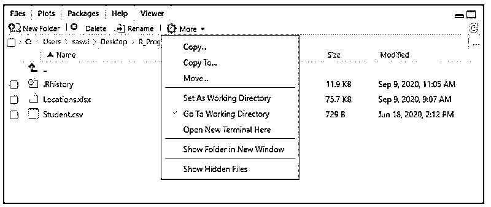

访问文件/文件夹和设置工作目录是如此简单。

### 如何安装 RStudio？

要安装，请遵循以下步骤。

1.去 https://rstudio.com/products/rstudio/.·豪威尔网站，你可以看到下载 RSTUDIO 桌面按钮。点击那个按钮。

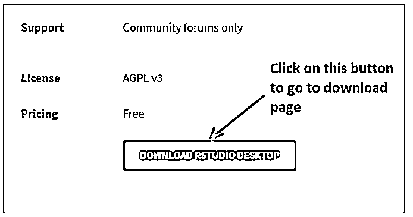

RStudio 的下载窗口。

2.点击页面后，您将导航至下载页面，并选择 RStudio 桌面选项。点击下载按钮。它将允许您下载 RStudio 桌面应用程序。

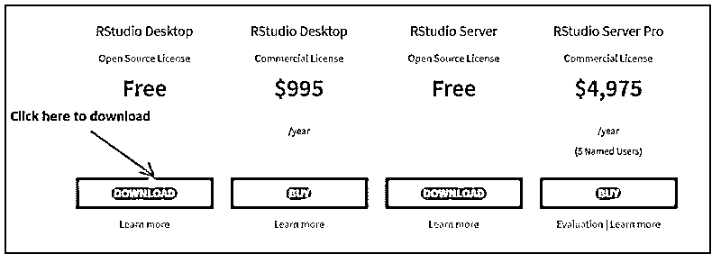

点击此按钮下载。

3.下载将开始，您可以看到。正在下载“exe”文件。

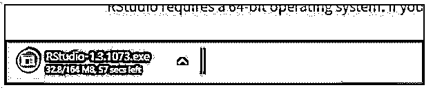

正在下载。exe”文件。

4.下载完成后，您需要双击已下载的设置，并按照说明下载 RStudio。

5.在出现的 RStudio 设置窗口中，点击下一步按钮，如下所示。

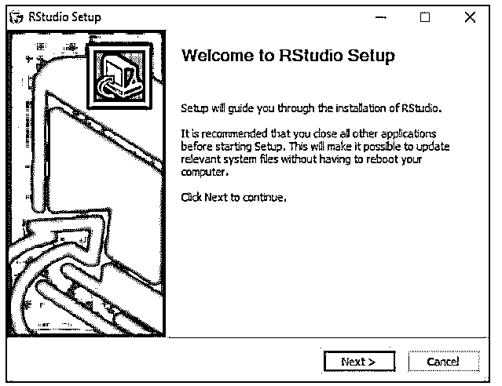

6.您可以浏览希望安装安装程序的路径。更好的方法是，保留系统选择的默认设置。点击下一步按钮。之后，点击安装按钮。

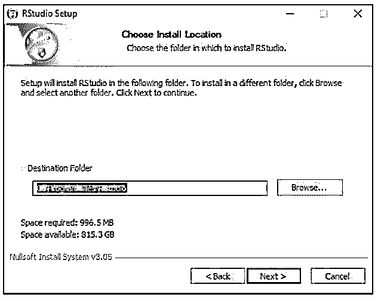

7.安装程序将开始安装，如下所示。

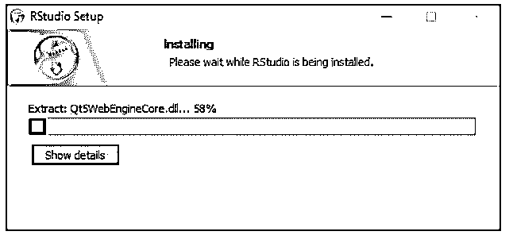

8.最后，安装完成后，点击 Finish 按钮。

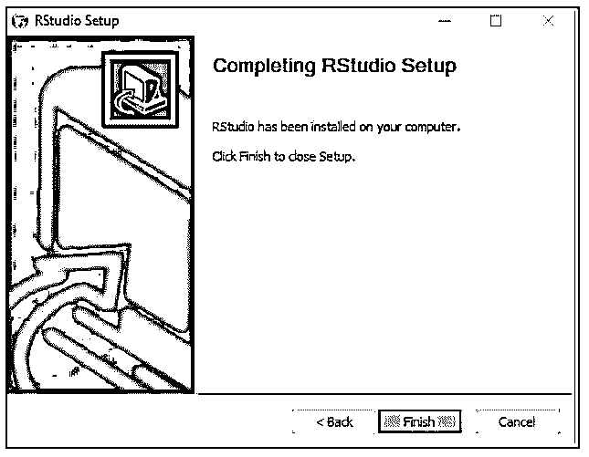

**Note:** Please note that you should have the R Software downloaded on your system. Otherwise, you’ll not be able to install the RStudio on your system.

### RStudio 怎么用？

一旦安装了 RStudio，您就可以使用它来进行编码和分析。

1.您可以使用 RStudio 加载您将要处理的数据集。

请看下面的例子，我们将“汽车”数据加载到 RStudio 的控制台中。

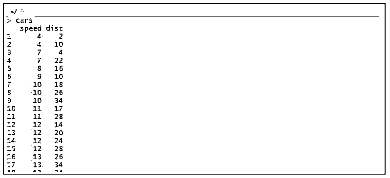

将“汽车”数据加载到 r。

您可以看到，我们需要做的只是写下数据集的名称，然后按 enter 键。按下 Enter 按钮后，数据将加载到控制台屏幕上。

2.您可以使用 RStudio 根据所提供的数据生成图表。

请看下面的例子，我们使用 hist 函数从“汽车”数据集中绘制“速度”变量的直方图。

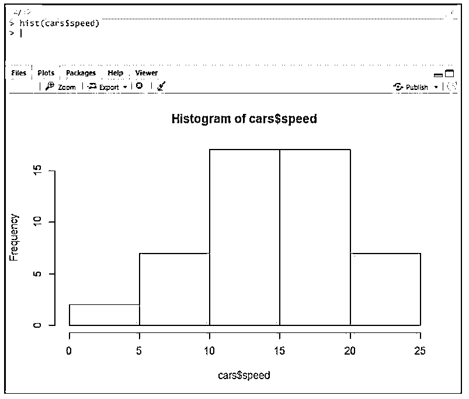

使用 RStudio 制作扩展图形。

像这样，我们还可以使用 RStudio 做许多其他事情。我们所需要的就是在我们的系统上安装这个漂亮的工具。

### 优势

它是一个多功能的图形用户界面(GUI ),为您提供了一个更加紧凑和用户友好的 R 环境。

下面列出了一些优点:

*   r 是一个集成开发环境(IDE)。这意味着您拥有该工具的可视化窗格的所有好处。拥有所有这些可视窗格使生活变得简单，不是吗？
*   该软件几乎可以在所有操作系统上运行。该工具可以在任何平台上运行，无论是 Windows、Linux 还是任何平台。
*   它有大量的功能。可能是包操作，版本控制，成千上万的数据集，还需要什么？
*   它具有代码完成功能。这允许我们通过提供多种建议来完成代码。它拥有一个体面的文本版本应该拥有的所有功能。圆括号匹配，函数补全，自动缩进，等等。
*   它有丰富的支持家庭的来源。这方面的支持社区时不时会以开发为目的。
*   RStudio 是一种开源编程语言。你不需要随时出去购物。
*   编程语言不断发展，但在使用时仍然稳定。我的意思是，你看不到像 r 这样稳定的编程语言。
*   丰富的软件包库源码。作为一项分析任务，你几乎可以做任何你期望的事情。
*   它有一个图形用户界面(GUI)，这意味着你可以通过使用菜单驱动的下拉菜单来完成许多任务。

### 结论

RStudio 是一个用于开发 R 程序的开源工具。这是一个可以让你做软件能做的所有工作的工具，但是更简单。RStudio 中的编码比 R 软件中的编码简单得多，这是因为它有一个带有大量特性的文本编辑器。《出埃及记》自动完成代码、括号匹配、自动缩进等。RStudio 是未来数据科学家的必备工具。

### 推荐文章

这是一个什么是 RStudio 的指南？这里我们讨论一下入门，为什么需要它，如何安装使用 RStudio？和优点。您也可以看看以下文章，了解更多信息–

1.  [预测 R 中的函数](https://www.educba.com/predict-function-in-r/)
2.  [R 中的标准偏差](https://www.educba.com/standard-deviation-in-r/)
3.  [R-studio-功能](https://www.educba.com/r-studio-function/)
4.  [R Studio UI 和 R Script 基础知识](https://www.educba.com/course/beginners-training-r-programming/)

