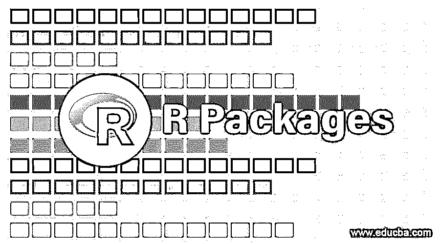

# r 包

> 原文：<https://www.educba.com/r-packages/>

## R 包介绍

R 包是一组预定义的函数，作为一个库，在部署 R 程序时使用，以实现可重用性和更少的代码。R 包是外部开发的，可以导入到 R 环境中，以便使用属于该包的可用功能。R 包由 R 社区网络管理，称为 CRAN，用于提供 R 编程语言。除了标准的 R 程序包，还有几个外部程序包可用于 R 程序。R 中流行的图形包之一是 ggplot2。

### 我们在哪里可以找到包裹？

软件包可以通过不同的来源在互联网上获得。但是，我们可以从某些可信的存储库中下载软件包。

<small>Hadoop、数据科学、统计学&其他</small>

这里有两个重要的在线资源库。

*   ******CRAN(综合 R 存档网络):**** 这是一个官方的 R 社区，拥有 FTP 和 web 服务器网络，包含 R 的最新代码和文档。在你将包发布到网上之前，它会经过一系列符合 CRAN 策略的测试。**
***   ******GitHub:****GitHub 是另一个著名的但不特定于 R 的库，在线社区可以与其他人共享他们的包，也用于版本控制。GitHub 是开源的，没有任何审核过程。****

 ****### 有用的 R 包列表

R 中有几个包，可以从 CRAN 或 GitHub 下载。以下是可用于特定目的的软件包。

#### **1。从外部来源加载数据**

 ***   ******Haven:**** R 从 SAS 读写数据。**
*****   ****【DBI】:T****o 在关系数据库和 R. **之间建立通信*****   ****RSQlite:**** 用于从关系数据库中读取数据。******

 ****#### **2。数据操作**

 ***   ****Dplyr:**** 用于子集化等数据操作，提供访问数据的快捷方式，生成 sql 查询。
*   ****Tidyr****——用于将数据转换成微小格式。
*   ****stringr****–操作字符串表达式和字符串。
*   ****【lubridate】-****处理数据和时间。

#### **3。数据可视化**

 ***   ******Rgl:**** 进行 3D 可视化工作。**
***   ****ggvis:**** 创建和构建语法图形。*   ****googlevis:**** 在 r 中使用 google 可视化工具**

 **#### 4.基于网络的软件包

1.  ****XML:**** 读写 r 中的 XML 文档
2.  ****Httpr:**** 与 http 连接一起工作。
3.  ****Jsonlite:**** 读取 json 数据表。

### 获取 R 包

我们可以通过使用下面的代码来检查 R 中的可用包。

*   ****available . packages():****CRAN 网络中大约有 5200 个可用的包。

CRAN 有任务视图，将包分组到特定的主题下。

### 安装 R 包

我们可以直接通过 IDE 或者通过命令来安装包。要安装软件包，我们使用下面的函数并指定软件包名称。

**语法:**

`install.packages()`****T4】****

 ****代码:**

`install.packages(“ggplot2”)`

以上代码安装 ggplot2 包及其依赖包(如果有)。

我们可以通过在一个字符向量下指定软件包的名称来一次安装几个软件包。

**语法:**

`install.packages(c(“package 1”,”package 2”,”package 3”))`

**代码:**

`install.packages(c(“ggplot2”,”slidify”,”deplyr”))`

### 使用 R Studio 安装

使用 R studio 的优势在于它是 GUI ( [图形用户界面](https://www.educba.com/what-is-gui/))。我们可以选择要安装的软件包和它们的源代码。

我们可以去工具->安装包。

#### 正在加载 R 包

在安装了 R 包之后，我们需要将它们加载到 R 中，以便开始使用已安装的包。

我们使用下面的函数来加载包。

**语法:**

`library(package name)`

**Note:** The package name need not be given in quotes.

**代码:**

`library(ggplot2)`

有些软件包在加载时会显示消息。有些人不知道。借助下面的代码，我们可以看到安装的库的细节。

**代码:**

`library(ggplot2)
search()`

****输出:****

"包:lattice " "包:ggplot2 " "包:makeslides "

" package:knitter " " package:slidify " " tools:r studio "

### 创建自己的包

在我们创建自己的包之前，我们应该记住下面的清单。

*   在包中编写代码时，组织代码是最重要的事情之一。我们浪费了一半的时间去寻找代码的位置，而不是改进代码。把所有的文件放在一个容易拿到的文件夹里。
*   记录代码有助于理解代码的用途。当我们不经常重访代码时，我们会忘记为什么要以某种方式编写代码。当与他人分享时，它还可以帮助人们更好地理解您的代码。
*   通过电子邮件分享脚本已经变得过时了。最简单的方法是上传你的代码并在 GitHub 上发布。你有可能得到可以帮助你增强代码的反馈。

要创建自己的包，我们必须安装 devtools 包。

**代码:**

`install.packages("devtools")`

为了帮助文档，我们可以使用下面的包。

**代码:**

`install.packages("roxygen2")`

安装 devtools 包后，您可以创建自己的包。

****代号:****

`devtools::create ("packagename")`

在“packagename”的位置，您可以给出您希望的名称。您现在可以在这个包下添加您的函数。

您可以创建与函数名相同的文件名。

****语法:****

`Devtools:create(“firstpackage”)`

### 分发包

您可以使用 devtools 包在 GitHub 上分发您的包。

我们使用下面的代码在 Github 上发布我们的包。

**代码:**

`devtools::install_github("yourusername/firstpackage")`

您可以给出您在上面创建的 github 用户名和包名。

### 以下是软件包所需的文件

*   功能
*   证明文件
*   数据

一旦我们有了以上所有的文件，我们就可以把它们发布到存储库中了。

### 推荐文章

这是一个 R 包的指南。这里我们讨论有用的 R 包列表，使用 R studio 安装包和创建自己的包等。您也可以阅读以下文章，了解更多信息——

1.  [什么是 R 编程语言？](https://www.educba.com/what-is-r-programming-language/)
2.  [R 编程职业](https://www.educba.com/careers-in-r-programming/)
3.  [R 编程 vs Python](https://www.educba.com/r-vs-python/)
4.  [MySQL vs SQLite](https://www.educba.com/mysql-vs-sqlite/)
5.  [R 包列表](https://www.educba.com/list-of-r-packages/)

******************