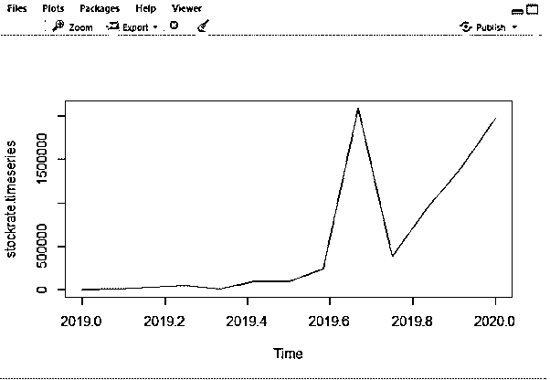
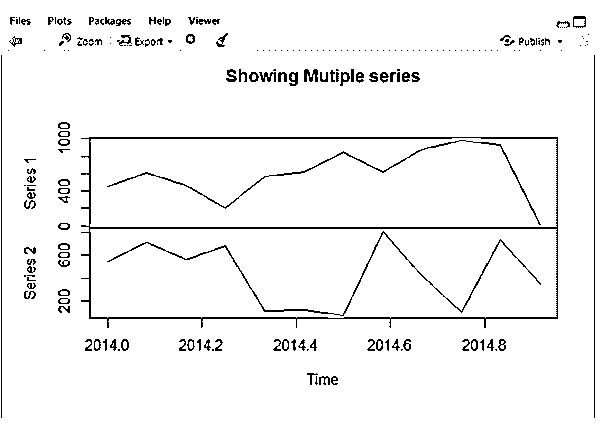
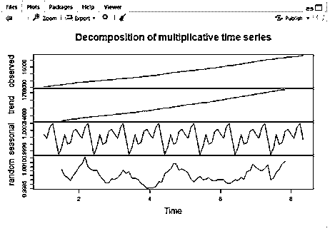
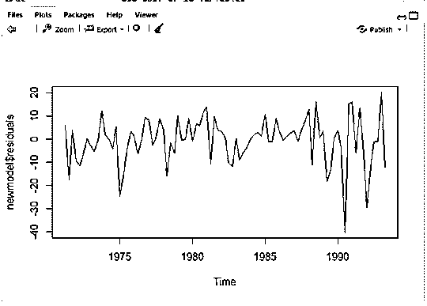
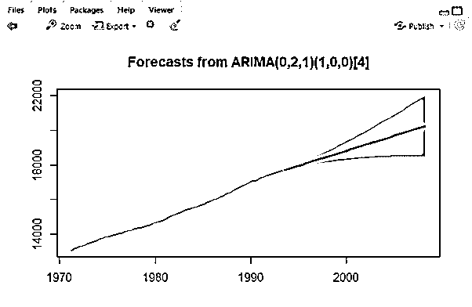

# R 中的时序

> 原文：<https://www.educba.com/time-series-in-r/>

## R 中的时间序列介绍

R 中的时间序列被定义为一系列值，每个值都与时间戳相关联，也是定期(每月、每天)测量的，如天气预报和销售分析。R 将时间序列数据存储在时间序列对象中，并使用 ts()函数作为基本分布来创建。

**语法**

<small>Hadoop、数据科学、统计学&其他</small>

时序函数的语法声明如下所示:

`<-  ts(data, start, end, frequency)`

这里，数据指定时间序列中的值。

开始指定时间序列值中的第一个预测观测值。

结束指定时间序列中的最后一个观察值。

频率指定观察周期(月、季度、年)。

### R 中的时间序列是如何工作的？

r 有一个强大的内置包来分析时间序列或预测。这里，它构建了一个函数来获取流程中的不同元素。最后，我们应该找到一个更好的数据拟合。我们这里使用的输入数据是整数值。并非所有数据都有时间值，但是它们的值可以作为时间序列数据。这些数据由定期的观察数据组成。在它被模型化之前，它需要几次变换。时间序列包含以下元素:

1.  **趋势:**归入正弦效应一类，指数据在一个长时期内减少或增加。
2.  季节性:这是与日历相关的影响。观察到的数据必须通过序列中的真实运动进行季节性调整。所以它每年都会经历一些高峰和低谷。
3.  **级别:**表示系列的基线值。
4.  噪声:可预见的错误或不规则变化。

拟合序列最常见的方法是使用自回归、移动平均或两者并用。另一种访问方法是分别使用自协方差和部分自协方差函数。

让我们看看 R 中的时间序列是如何预测的

**准备时间序列**

1.  创建一个数据数组来分析它。例如，根据季度、半年度或年度的预测销售额给出数据框架。

`y<-c(1.8, 1.1, 3, 3.5, 4.8, 4.2, 5.8, 6.4, 5, 7, 7.4, NA, NA, NA, NA)
data <- data.frame(t=x, cases=y)
data
2.          t cases
3.      1   1   1.8
4.      2   2   1.1
5.      3   3   3.0
6.      4   4   3.5
7.      5   5   4.8
8.      6   6   4.2
9.      7   7   5.8
10.   8   8   6.4
11.   9   9   5.0
12.   10 10   7.0
13.   11 11   7.4
14.   12 12    NA
15.   13 13    NA
16.   14 14    NA
17.   15 15    NA
NA are the values that we need to forecast.`

**天真的预测**

`naiv_ex <- naive(data, h = 12)
summary(naiv_ex)`

**ARIMA 模式**

`Auto.arima()`

分解:时间序列有多种模式，分离它们的过程称为分解。

**绘制时间序列**

`Plot (x)`

**注:**

在用于旧观测值的 R head()中，数据集中的一个现有值。tail()–给出更新的观察结果。修正预测值。

### 例子

这里的代码已经使用 RStudio 实现并安装了必要的包。最重要的是，预测库用于预测未来事件。我们可以用 R 个内置数据集来进行时间序列分析。

#### 示例#1

`stockrate <- c(480, 6813, 27466, 49287,
7710, 96820, 96114, 236214,
2088743, 381497, 927251,
1407615, 1972113)
> stockrate.timeseries <- ts(stockrate,start = c(2019,1),frequency = 12)
> print(stockrate.timeseries)
Jan     Feb     Mar     Apr     May     Jun     Jul
2019     480    6813   27466   49287    7710   96820   96114
2020 1972113
Aug     Sep     Oct     Nov     Dec
2019  236214 2088743  381497  927251 1407615
2020
> plot(stockrate.timeseries)`

**解释**

这里显示了完整的输出，它预测了 2019 年的库存率。

**输出:**

**时间序列图如**所示

#### 实施例 2

**演示多个时间序列**

`stockrate <- c(450, 613, 466, 205.7,
571.0, 622.0, 851.4, 621.4,
875.3, 979.7, 927.5,
14.45, 12.23)
> stockrate2 <- c(550, 713, 566, 687.2,
110, 120, 72.4, 814.4,
423.5, 98.7, 741.4,
345.3, 323.2)
> combined.stockrate <-  matrix(c(stockrate,stockrate2),nrow = 12)
Warning message:
In matrix(c(stockrate, stockrate2), nrow = 12) :
data length [26] is not a sub-multiple or multiple of the number of rows [12] > stockrate2 <- c(550, 713, 566, 687.2,
110, 120, 72.4, 814.4,
423.5, 98.7, 741.4,
345.3)
> stockrate <- c(450, 613, 466, 205.7,
571.0, 622.0, 851.4, 621.4,
875.3, 979.7, 927.5,
14.45)
> combined.stockrate <-  matrix(c(stockrate,stockrate2),nrow = 12)
> stockrate.timeseries <- ts(combined.stockrate,start = c(2014,1),frequency = 12)
> plot(stockrate.timeseries, main = "Showing Mutiple series")
> print(stockrate.timeseries)
Series 1 Series 2
Jan 2014   450.00    550.0
Feb 2014   613.00    713.0
Mar 2014   466.00    566.0
Apr 2014   205.70    687.2
May 2014   571.00    110.0
Jun 2014   622.00    120.0
Jul 2014   851.40     72.4
Aug 2014   621.40    814.4
Sep 2014   875.30    423.5
Oct 2014   979.70     98.7
Nov 2014   927.50    741.4
Dec 2014    14.45    345.3`

**解释**

这显示了采用两个预测值的时间序列图。

**输出:**

**多个时间序列图如**所示

#### 实施例 3

`data("austres")
> start(austres)
[1] 1971    2
> end(austres)
[1] 1993    2
> sum(is.na(austres))
[1] 0
> summary(austres)
Min. 1st Qu.  Median    Mean 3rd Qu.    Max.
13067   14110   15184   15273   16399   17662
> plot(austres)
> tsdata <- ts(austres, frequency = 12)
> dcdata <- decompose(tsdata, "multiplicative")
> plot(dcdata)
> head(austres)
Qtr1    Qtr2    Qtr3    Qtr4
1971         13067.3 13130.5 13198.4
1972 13254.2 13303.7 13353.9
> newmodel=auto.arima(austres)
> newmodel
Series: austres
ARIMA(0,2,1)(1,0,0)[4] Coefficients:
ma1    sar1
-0.6051  0.1921
s.e.   0.0974  0.1075
sigma^2 estimated as 103.7:  log likelihood=-322.93
AIC=651.86   AICc=652.15   BIC=659.26
> plot.ts(newmodel$residuals)
> ffcast <- forecast(newmodel, level=c(80), h=5*12)
> plot(ffcast)
// Taking ACF and PACF
acf(ffcast$residuals)
> pacf(ffcast$residuals)
> coef(ffcast)
NULL
predict(ffcast, n.ahead=5, se.fit=TRUE)
forecast(object=ffcast, h=5)
Point Forecast    Lo 80    Hi 80
1993 Q3       17704.82 17691.77 17717.87
1993 Q4       17748.00 17725.60 17770.40
1994 Q1       17794.20 17761.83 17826.56
1994 Q2       17835.79 17792.65 17878.92
1994 Q3       17879.09 17822.79 17935.39`

**解释**

在上面的 R 代码中，我们将使用包含 1971 年到 1993 年销售信息的数据集 austres。利用 ARIMA，我们预测了 2000 年(未来五年)的销售额，它显示在带有蓝色指示器的图中。

**Plot:**

**绘制新的模型残差**

**使用 ARIMA 进行预测**

### 结论

因此，在本文中，我们讨论了 R 中时间序列的许多细节，还学习了平稳过程和实现中的更多内容。时间序列执行一项重要的统计技术，按时间顺序收集数据点。

### 推荐文章

这是 r 中时间序列的指南，这里；我们讨论了 R 中的时间序列是如何工作的，以及例子和输出。您也可以看看以下文章，了解更多信息–

1.  [熊猫时间序列](https://www.educba.com/pandas-time-series/)
2.  [时间序列分析](https://www.educba.com/time-series-analysis/)
3.  [熊猫时间戳](https://www.educba.com/pandas-timestamp/)
4.  [c#中的斐波那契数列](https://www.educba.com/fibonacci-series-in-c-sharp/)

