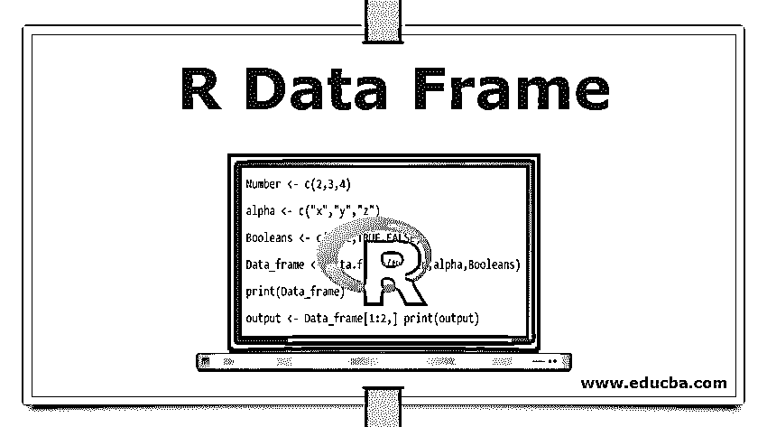

# r 数据帧

> 原文：<https://www.educba.com/r-data-frame/>

## R 数据帧概述

数据帧是长度相等的向量列表。但是，矩阵和数据框之间的区别在于，数据框接受各种类型的数据。(字符、数字等。).在这个主题中，我们将学习 R 数据框架。

**使用数据帧的优势**

<small>Hadoop、数据科学、统计学&其他</small>

*   分布式数据收集和组织。
*   与关系数据库相比，它有更好的优化。
*   保存各种不同种类的数据。

### 在 R 中创建数据框

我们创建一个数据帧。以下是声明数据框的示例。

`Data_frame <- data.frame (variable 1,variable 2, variable n…)`

在上面的例子中，我们还没有定义变量。现在让我们来看看如何给变量赋值并将其存储在数据框中。

`Number <- c(2,3,4)
alpha <- c("x","y","z")
Booleans <- c(TRUE,TRUE,FALSE)
Data_frame <- data.frame(Number,alpha,Booleans)
print(Data_frame)`

**输出:**

数字阿尔法布尔

1 2 x 真实

2 3 y 真的

3 4 z 假

### 结论

数据帧是 R 编程中的一个重要概念。它在创建可以轻松修改和访问的数据集方面既简单又强大。就像 matrix 一样，可以通过行名和列名访问数据集，添加和删除数据变得很容易。

### 推荐文章

这是一个 R 数据框架的指南。在这里，我们讨论用 R 结构创建数据帧，并从数据帧中提取特定的数据。您也可以看看以下文章，了解更多信息–

1.  [C 语言中的数据类型](https://www.educba.com/data-types-in-c/)
2.  [数据科学职业](https://www.educba.com/data-science-career/)
3.  [大数据技术](https://www.educba.com/big-data-technologies/)
4.  [数据科学平台](https://www.educba.com/data-science-platform/)
5.  [Java 布尔函数](https://www.educba.com/java-booleans/)

