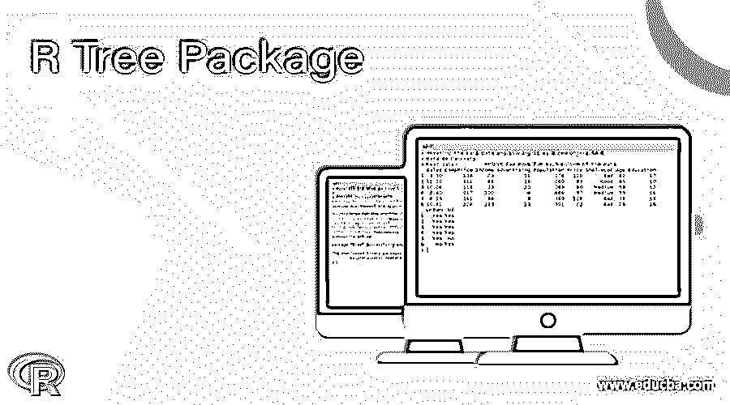
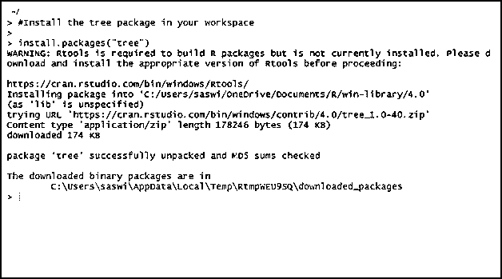
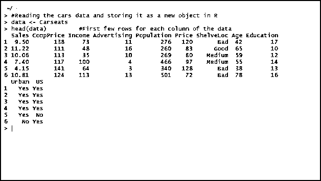
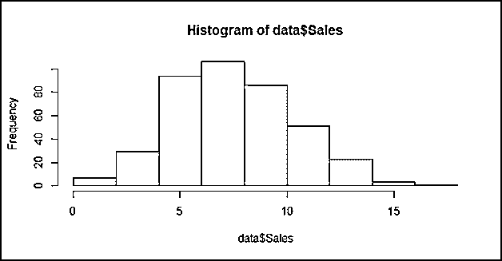
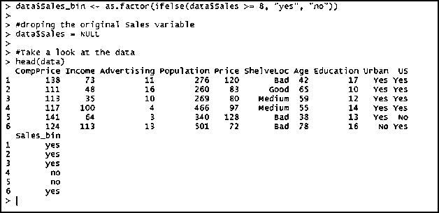
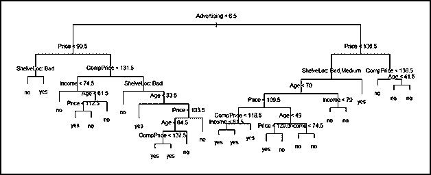
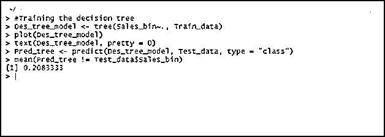

# r 树包

> 原文：<https://www.educba.com/r-tree-package/>

## R 树包介绍

R tree 包是一个专门设计用于决策树的包。这个包允许我们在 R 编程中开发、修改和处理分类以及回归树，这将帮助我们做出与业务问题相关的精确决策。

本文将带您浏览 R 中的 tree 包，如何安装它，如何用它来运行决策树、分类树和回归树，并提供一些实际例子。

<small>Hadoop、数据科学、统计学&其他</small>

### 如何安装树包？

要在 R 工作区中安装包，请遵循下面的代码:

`#Install the tree package in your workspace
install.packages("tree")`

查看安装的输出，如下所示:

### 树包是如何工作的？

对于本文，我们将使用 carseats 数据。这是 r 中内置包附带的内置数据集。我们现在将读取该数据，并尝试将其作为副本存储在新对象下。

`#Reading the cars data and storing it as a new object in R
data **<-** Carseats
head(data)         #First few rows for each column of the data`

上面的代码读取 Carseats 数据，并将其存储在数据对象下。head()函数返回该数据集的前六行。请参见下面这段代码的输出:

此处，该数据代表了大约 400 家不同商店的儿童座椅数据，变量如下:

**销售额:**每家商店售出的单位(以千计)。

**CompPrice:** 竞争对手在每个地点收取的价格

**收入:**竞争对手集团的收入(千美元)

**广告:**公司的广告预算(千美元)

**人口:**本地区人口(以千计)

**价格:**公司对每个座位收取的价格

**ShelveLoc:** 测量汽车座椅在搁置位置的质量(差、中、好)。一个因素。

**年龄:**每个地点人口的平均年龄。

**教育:**每个地点人员的教育水平

**市区:**表示商店是否在市区。有两个值的因子，是和否。

**美国:**商店所在的国家。有两个值“是”和“否”的因子。

在这里，我们将使用树包来生成决策树，这有助于我们获得对销售变量影响更大的变量的信息。

因为我们的核心目标与销售变量一致，所以让我们使用 hist()函数来查看它的分布。

`#Looking at the distribution of the Sales variable
hist(data$Sales)`

如果您运行此代码，您可以看到如下所示的直方图:

如果仔细观察该图，可以看到该图以销售额 8 为中心，近似呈正态分布。我们需要将这个数字销售数据转换成二进制(yes，no type)。

如果销售值大于或等于 8，我们将创建一个采用二进制值“yes”的新变量。如果不是，变量将采用二进制值“no”。这个新变量将被命名为 Sales_bin，我们将删除原来的 Sales 变量。

`#creating Sales_bin based on the Sales variable
data$Sales_bin <- as.factor(ifelse(data$Sales >= 8, "yes", "no"))
#droping the original Sales variable
data$Sales = NULL
#Take a look at the data
head(data)`

让我们看看这段代码的输出:

任何统计分析的重要部分是创建数据的两个部分。一个是训练数据；另一个是测试数据。我们基本上在训练数据上训练模型，然后在部署它之前，我们在测试数据上测试它。将模型分为训练数据和测试数据的标准比例是 70: 30。也就是说，我们用 70%的数据来训练一个模型，用 30%的数据来测试这个模型。让我们按照给定的比例将数据分成训练和测试模型。请记住，这种拆分需要随机发生。我们将使用 sample()和 rm()函数的组合来实现随机性。

`set.seed(200)
#Developing the model
train_m <- sample(1: nrow(data), nrow(data)*0.70)
#Making the split
Train_data <- data[train_m,] Test_data <- data[-train_m,] rm(data, train_m)
head(Train_data)
head(Test_data)`

请参见下面这段代码的输出:

现在，时间是运行决策树模型，它是 r 中树包的一部分。

我们将使用 tree()函数在训练数据集上生成一棵树，并在测试数据集上使用同一棵树来预测未来的值。请参见下面的示例:

`#Training the decision tree
Des_tree_model <- tree(Sales_bin~., Train_data)
plot(Des_tree_model)
text(Des_tree_model, pretty = 0)
#Using the model on testing dataset to check how good it is going
Pred_tree <- predict(Des_tree_model, Test_data, type = "class"
mean(Pred_tree != Test_data$Sales_bin)`

这里，我们根据 Train_data 在 Sales_bin 变量上创建了决策树模型。我们还使用了 plot 函数来绘制决策树。请参见下图，该图显示了生成的决策树。

在此之后，我们尝试使用这个模型对数据进行测试，以生成预测。最后，我们使用了 mean()函数来获得预测树在测试数据集上生成的百分比误差值。

为了更好地实现，请参见下面的输出:

该图显示，预测决策树中约 21%的观察结果与实际数据不匹配。换句话说，模型有 21%的误差，或者说模型有 79%的精度。为了这个例子，这是一个巨大的成就，我将使用这个模型所做的预测。

注意:需要记住的一点是，由于训练和测试数据集的划分是随机进行的，因此您在实际使用相同数据时获得的最终结果在不同的时间会有所不同。我不期望得到和我一样的精确度(你知道，这里和那里都有细微的差别)。

本文到此结束。我们使用树包来生成、分析和预测决策树。

让我们用几个结论来总结一下

### 结论

*   R 中的树包可用于生成、分析和使用决策树进行预测。
*   这个包中的 tree()函数允许我们根据提供的输入数据生成一个决策树。
*   总是建议把数据分成两部分，即训练和测试。
*   训练和测试数据集划分的一般比例是 70:30。

### 推荐文章

这是一个 R 树包的指南。在这里，我们讨论 R 中的树包，如何安装它，如何用它来运行决策树、分类树和回归树，并给出实际例子。您也可以看看以下文章，了解更多信息–

1.  数据结构中的 B 树
2.  [R 数据类型](https://www.educba.com/r-data-types/)
3.  [数据可视化的类型](https://www.educba.com/types-of-data-visualization/)
4.  [数据结构中的 B+树](https://www.educba.com/b-plus-tree-in-data-structure/)

