# R 中的向量

> 原文：<https://www.educba.com/vectors-in-r/>

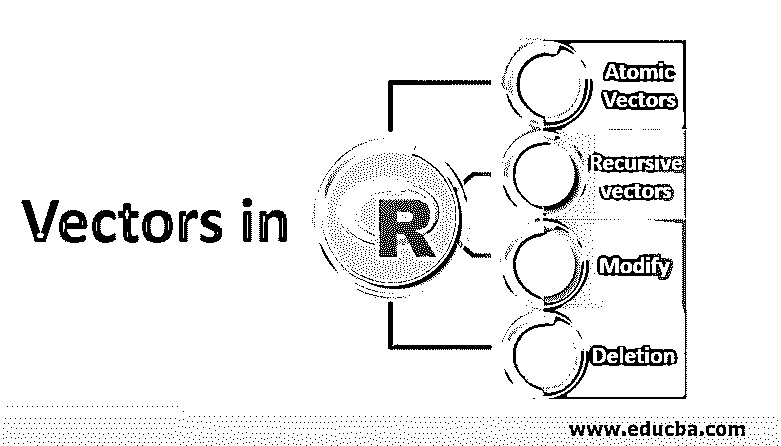

## R 中的向量介绍

R 语言中的 Vectors 是一种标准的数据结构，用于存储和检索相似类型的数据。这是 R 语言中最简单的一维变量存储形式。r 语言支持多种内置语法来创建向量变量并将元素赋给它。这些语言支持所有原始数据类型，如整数、字符、双精度和复杂数据类型。它提供了有效的索引来访问其中的元素。R 语言用户在开发 R 脚本时，大多使用 R 中的 c()函数来创建向量。

在向量中，索引总是从 1 开始，我们使用[]进行索引，通过使用索引，我们可以访问向量的分量。

<small>Hadoop、数据科学、统计学&其他</small>

有各种类型的索引:

*   **使用位置索引:**索引从 1 开始，我们可以使用这些索引来打印/访问向量中的特定元素。
*   **逻辑索引:**索引是通过给元素分配真/假来完成的。错误的索引表示从结果中删除该元素。
*   **负值索引:**索引被赋予从-1 开始的负值。用负索引来获取输出的元素将从结果中删除。
*   **0/1 索引:**这类似于逻辑索引，其中 0 对应于假，1 对应于真。

现在我们已经学习了基础知识，让我们深入研究向量，学习它们的类型和我们可以在 r 中执行的不同操作技术。

### R 中向量的类型

载体大致分为两类:

#### 1.原子向量

现在，让我们尝试理解 r 中的原子向量。原子向量在本质上是同质的，有 4 种重要的原子向量类型，它们是:

##### 逻辑学的

它们是向量的最简单形式，因为它们只有 3 个值，即真、假和 NA。这些向量是使用 combine 函数或在比较运算符的帮助下构建的。

**举例:**

下面是一些逻辑向量的例子:

`X<- c(TRUE, FALSE, NA)
X`

**输出:**

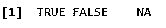

`X<- c(TRUE, FALSE, NA)
x<- 1:6 %% 3 == 0
x`

**输出:**

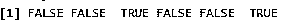

##### 数字的

数字属性是整数和双精度数。浮点数用 double 表示，在 R 中所有的数字都被认为是 double，默认情况下，要定义一个整数，我们必须在数字后面加上关键字 L。

**举例:**

下面是数字向量的一些例子，解释如下:

`typeof(2)`

**输出:**

`typeof(2L)`

**输出:**

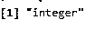

双精度通常有 4 个特殊值，如(-Inf，NA，NaN，Inf)，而整数只有一个特殊值，即 NA。

`c(-1, 0, 1)/0`

**输出:**

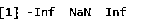

##### 字符

这是最复杂的原子向量类型，因为字符只不过是一个字符串，它们可以包含任意数量的数据。在 R 中，每个唯一的字符串将只被存储一次，因为它被用作全局字符串池，并且每当该字符串被使用时，它都指向该表示，这样，我们减少了 R 中任何重复字符串的内存量。

**举例:**

以下是字符向量的一些示例:

`x<- 'attribute'
typeof(x)`

**输出:**

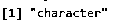

#### 2.递归向量(列表)

列表本质上是异构的；一个列表可以包含另一个列表作为其元素。使用 r 中的关键字 list()创建一个列表。它也可以包含不同类型的对象，这是原子向量的一个优点。

**举例:**

`x<-c(list(1, 'a' , 2.5))
x`

**输出:**

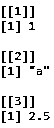

现在，我们将看到向量的两个重要性质:

##### 类型

向量的类型可以通过使用 R 中的 type of()函数来确定，

`typeof(2);`

**输出:**

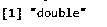

##### 长度

使用函数 length()来确定向量的长度，

`x<-c(1,2,3);
length(x)`

**输出:**

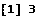

### R 中的向量函数

函数被定义为用于执行任务的一段代码。函数被视为其他类型的对象。

#### 1.R rep()函数

顾名思义，该函数用于重复函数中作为输入给出的值。

**语法:** `rep()`

**例子**

`rep(c(1, 2, 3), times = 4)`

**输出:**

[1] 1 2 3 1 2 3 1 2 3 1 2 3

实现 rep 函数有不同的方法。

我们还可以输入特定值需要重复的次数。

**例子**

`rep(c(1, 2), times = c(4,3))`

**输出:**

[1] 1 1 1 1 2 2 2

实现 rep 函数的第三种方法是指定长度。

**例子**

`rep(1:2,length.out=9)`

**输出:**

[1] 1 2 1 2 1 2 1 2 1

#### 2.r 序列功能

sequence 函数用于创建一组顺序值。

假设我们想要创建一组连续的整数。我们可以使用序列函数来创建它们。

**语法** : `seq()`

**举例:**

`seq(from = 3.5, to = 1, by = -0.3)`

**输出:**

[1] 3.5 3.2 2.9 2.6 2.3 2.0 1.7 1.4 1.1

此外，我们还可以向函数的输入添加另一个属性(即长度)

**例子**

`seq(from = 3.5, to = 1, length.out = 6)`

**输出；**

[1] 3.5 3.0 2.5 2.0 1.5 1.0

#### 3.R any()函数

Any()函数接受输入值并返回逻辑向量，该向量为真或假。

**语法** : `any()`

假设我们已经给 x 赋值了一组值。

x = 1，2，3，4，5

**语法**:

`x <- 1:5`

现在，我们使用 any()函数来查看是否有大于 5 的值。

`any(x > 5)`

**输出**:

从类似的例子中，我们也可以通过将值从 5 改为 3 来输出 TRUE。

任何(x > 3)

**输出:**

真实的

#### 4.R all()函数

all()函数类似于 any()函数。这里的区别是它检查每个值，然后打印输出。即使单个值不满足指定的条件，它也会打印为 FALSE。

**语法:** `all()`

**例子**

**1。当所有值都满足条件**时

`x <- 1:5all(x > 0)`

**输出:**真

**2。当值不满足条件**时

`x <- 1:5all(x > 3)`

**输出:**假

在上面的例子中，只有两个值大于 3。R 中的函数由 Rf_ 或 R_ 定义

**5。:'运算符:**'**:'**运算符用于创建连续数字的向量。

**举例:**

`x<- 1:7;
x`

**输出:**

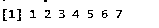

### 向量运算

我们可以在 R 中执行各种向量运算，下面解释其中的一些:

#### 1.算术运算

与任何数据结构相似，所有的算术运算，如加、减、乘、除，都可以用相同长度的向量在 R 中执行。

下面解释一些算术运算的例子。

**加法**

`A<- c(2, 4, 6, 8)
B<- c(4, 16, 36, 64)
print(A+B)`

**输出:**

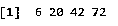

**减法**

`A<- c(2, 4, 6, 8)
B<- c(4, 16, 36, 64)
print(A-B)`

**输出:**

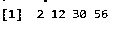

**乘法运算**

`A<- c(2, 4, 6, 8)
B<- c(4, 16, 36, 64)
print(A *B)`

**输出:**

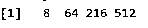

**分部**

`A<- c(2, 4, 6, 8)
B<- c(4, 16, 36, 64)
print(A/B)`

**输出:**

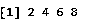

#### 2.元素回收

当两个不同长度的不同向量被用于任何上述算术运算时，则较短尺寸的向量被循环以完成运算，

**举例:**

`X<- c(1, 2, 3)
Y<- c(5)
print(X+Y)`

**输出:**

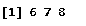

#### 3.整理

通过使用包提供的 sort()函数，我们可以对元素进行排序。默认情况下，如果我们使用 sort 函数，它将按升序对向量进行排序，要获得降序，我们需要使用关键字 revsort()并提到 decreasing = TRUE。

**举例:**

`Z<- c(-1, -8, 3, 2, 9)
sort(Z);`

**输出:**

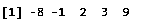

`Z<- c(-1, -8, 3, 2, 9)
sort(Z, decreasing=TRUE);`

**输出:**

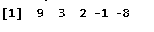

#### 4.修改

我们也可以通过使用索引技术在赋值操作符的帮助下修改我们的向量元素，并且我们也可以在重新赋值的帮助下截断向量的元素。

**举例:**

`W<-c(-5, -2, 0, 3, 6)
W[2] <- 1;
W`

**输出:**

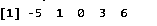

`W<-c(-5, -2, 0, 3, 6)
W[W<0]<- 2;`

**输出:**

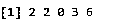

`W<-c(-5, -2, 0, 3, 6)
W<- W[1:4];`

**输出:**

#### 4.删除

任何可以被创建的东西也可以被删除。在 R 中，我们只需要给任意一个向量赋值 NULL 来删除这个向量。

**举例:**

`V<- c(1, 2, 3, 4, 5)
V<- NULL;
V`

**输出:**

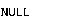

### 结论

R 向量的应用在自然界非常丰富。它主要用于主成分分析，这是最重要的特征约简技术之一。它也广泛用于 SVM 和神经网络。通过以上内容，我们已经了解了什么是向量以及如何定义向量，我们还讨论了各种向量操作技术。

### 推荐文章

这是 R 中向量的指南。这里我们讨论 R 中向量的类型和向量运算，以及各种例子和它们的功能。您也可以阅读以下文章，了解更多信息——

1.  [Matlab 中的向量](https://www.educba.com/vectors-in-matlab/)
2.  [Matlab 中的条形图](https://www.educba.com/bar-graph-in-matlab/)
3.  [R 列表](https://www.educba.com/r-list/)
4.  [JavaScript 中的向量](https://www.educba.com/vectors-in-javascript/)

