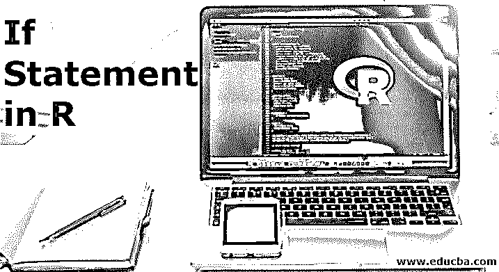
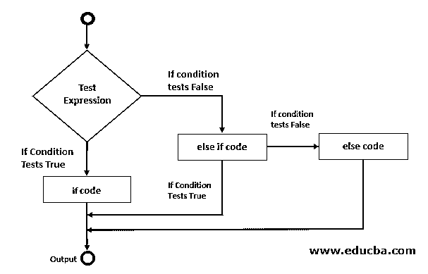
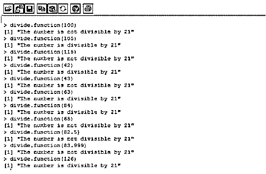
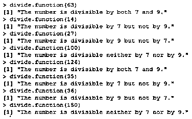
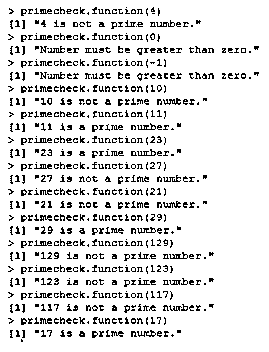

# R 中的 If 语句

> 原文：<https://www.educba.com/if-statement-in-r/>

## R 中 If 语句介绍

R 中的 If 语句是一种控制结构，用于检查编程逻辑中的某些条件。if 语句的工作方式是在 if 块的开头检查条件是真还是假，如果它发现条件为真，那么只有它允许 R 评估在 if 范围内写入的语句，类似地，当条件被发现为假时，if 语句忽略其范围内的 R 语句，并将程序控制移出 If 块。R 中的 if 语句通常与 else 块一起开发逻辑。

**语法**

<small>Hadoop、数据科学、统计学&其他</small>

R 中 if-else 语句的语法如下:

`if (condition) {
statement_1 # This statement will execute if the condition is satisfied.
}
else {
statement_2 # This section will execute if the condition is not satisfied.
}`

R 中 if-else if-else 语句的语法如下:

`if (condition_1) {
statement_block_1 # This block will execute if condition 1 is met.
}
else if (condition_2) {
statement_block_2 # This block will execute if condition 2 is met.
}
else {
statement_block_3 # This block will execute if none of the conditions is met.
}`

**流程图**

这是下面提到的流程图

### R 中 If 语句的例子

通过实例理解 R 中的 if 语句

R 中的 if 语句可以在各种情况下使用，它可以处理各种类型的数据。我们将尝试实现它，以便从基本到最复杂的情况了解它的工作原理。让我们更详细地理解这一点。

#### 示例#1

在这个例子中，我们将检查一个数是否能被 21 整除。我们将创建一个函数，使用 if-else 语句测试这个除法条件。然后，我们将要测试的数字传递到函数中。

下面的屏幕截图显示了 R 中嵌入 if-else 的函数，用于验证一个数的整除性测试。

`divide.function <- function(x) {
if (x %% 21 == 0)
{
print(“The number is divisible by 21”)
}
else {
print(“The number is not divisible by 21”)
}
}`

在上面的代码中，传递给函数的数字将首先根据 if 语句中的条件进行验证。因此，如果数除以 21 后返回零作为余数，那么 if 块中的代码将打印为输出，否则将执行。

在上述函数中传递不同的数字会产生如下所示的结果:

#### 实施例 2

在第二个例子中，我们将把 if-else 循环扩展到 if-else if-else 语句。这里，我们打算检查一个数是能被 7 和 9 整除，还是只能被 7 整除而不能被 9 整除，或者只能被 9 整除而不能被 7 整除，或者不能被这两个数整除。如果满足任何条件，将执行相应的代码块。可以有多个 else-if 语句。如前所述，else 中的代码块仅在不满足任何条件时执行。相应块中的 Output 语句必须正确传达意思。

`divide.function <- function(x) {
if (x %% 7 == 0 && x %% 9 == 0)
{
print("The number is divisible by both 7 and 9.")
}
else if (x %% 7 == 0) {
print("The number is divisible by 7 but not by 9.")
}
else if (x %% 9 == 0) {
print("The number is divisible by 9 but not by 7.")
}
else {
print("The number is divisible neither by 7 nor by 9.")
}
}`

在使用上述代码定义的函数中传递不同的数字会生成输出，如下面的屏幕截图所示。

在用户定义的函数 divide.function()中传递不同的数字，结果如上。这里，四种类型的数字是可能的；首先是能被 7 和 9 整除的，如 63 和 126；其次是能被 7 整除但不能被 9 整除的，如 14 和 35；第三是能被 9 整除但不能被 7 整除的，如 18 和 36；最后是不能被两个整数整除的，即 7 和 9。最后一个条件构成了 else 语句的一部分，因为在前面的 if 和 else ifs 中检查了所有其他可能的条件。

#### 实施例 3

在这个例子中，我们将检查一个数是否是质数。任何只能被它自己和一整除的数叫做质数。然而，必须注意，1 不是素数，因为它不满足一个数是素数的条件，因为在 1 的情况下，两个数，即它本身和 1 是相同的。更进一步，如果用户向函数中传递一个负数来检查它是否是质数呢？因此，在实现该功能时，必须考虑上述所有条件。让我们看看这个函数实现后的样子，如下所示。

`primecheck.function <- function(x) {
flag <- 1
if (x <= 0)
{
print("Number must be greater than zero.")
}
else if (x == 1)
{
print("1 is not a prime number.")
}
else
{
for (i in 3:x-1)
{
if (x %% i == 0)
{
flag <- 0
}
}
if (flag == 0)
{
paste(x,"is not a prime number.")
}
else
{
paste(x, "is a prime number.")
}
}
}`

*   上面的截图展示了 r 中的用户自定义函数 primecheck.function()，可以看出，代码使用嵌套的 if-else 来完成任务。让我们看看代码是如何工作的。函数 primecheck.function()只有一个参数。最初，标志变量被设置为 1。然后开始 if-else if-else 部分。if 语句检查数字是否大于零。这是一个很重要的条件，需要成为首要条件。
*   如果不是，则由该函数生成适当的消息。接下来，else-if 检查数字是否等于 1，并告诉用户 1 不是素数；原因已在前一节中给出。如果以上两个条件都不满足，那么将执行 else 部分中的代码块。在 else 中，现在，我们主要通过 for 循环来检查数字是否是质数。
*   for 循环将从 2 到 number-1 范围内的数除以增量变量，在此范围内，如果被除，则标志被设置为零，这意味着该数不是质数。for 循环外部的 if-else 语句测试标志上的条件并生成适当的输出。

该函数工作并给出结果，如下图所示。

### 结论

在 R 编程中，if-else 或 if-else if-else 语句可以有效地用于处理与条件相关的方面。R 脚本可能不会像其他[编程语言提供的](https://www.educba.com/best-programming-languages/)那样方便 if 语句的实现。但是，if-else 可以漂亮地嵌入到函数中，以获得所有可能的结果。

### 推荐文章

这是一个 r 中 If 语句的指南。这里我们讨论 if-else 或 if-else if-else 语句可以有效地用于与条件相关的方面。您也可以看看以下文章，了解更多信息–

1.  [什么是 R 编程语言？](https://www.educba.com/what-is-r-programming-language/)
2.  [R 包](https://www.educba.com/r-packages/)
3.  [R 数据类型](https://www.educba.com/r-data-types/)
4.  [C 语言中的 If-else 语句](https://www.educba.com/if-else-statement-in-c/)
5.  [Matlab 中的 IF-Else 语句](https://www.educba.com/if-else-statement-in-matlab/)
6.  [学习 Java 中 Else-If 语句的例子](https://www.educba.com/else-if-statement-in-java/)

