# R 中的 If Else 语句

> 原文：<https://www.educba.com/if-else-statement-in-r/>

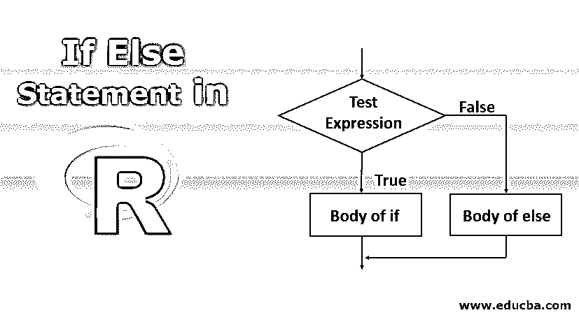

## R 中 If Else 语句介绍

R 语言中的 If Else 语句是一种控制语句，用于检查逻辑条件，并在条件返回真布尔值时在 If 块范围内处理 R 语句，在条件表达式返回假布尔值时在 Else 块范围内处理 R 语句。在 R 语言中，if 语句支持多个 else 语句作为复杂逻辑场景的一部分。R 语言中有一个内置的函数 ifelse()，它接受条件表达式，以及针对 if 和 else 场景的 R 语句。在开发程序逻辑时，R 中的 if-else 语句对于语句选择和数据处理非常有用且易于使用。

if 语句的语法

<small>Hadoop、数据科学、统计学&其他</small>

`If ( cond ) {
Statement 1
Statement 2
Statement n
}`

如果 cond 为真，那么执行主体内部的所有语句；否则，什么都不会被执行(没有输出)。cond 是可以是数字或逻辑向量的条件。全数字向量将除零以外的值视为真，并接受逻辑向量、真向量或假向量。

if 语句的流程图

### if 语句是如何工作的？

让我们看一些 if 语句的例子

#### 示例#1

**代码:**

`no <- 10
if (no > 0) {
print(" Number is positive ")
}`

**输出:**

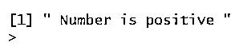

上面的代码检查 no 是否大于零；如果为真，则打印“数字为正”，否则不打印。

就像上面的代码一样，如果 no 不大于零，就不执行任何操作，但是如果我们需要执行抚慰，我们可以执行 else body。

if-else 语句的语法

`if ( cond ) {
statement 1
} else {
Statement 2
}`

如果 cond 为真，那么执行主体内部的所有语句；否则，如果 cond 为 false，则执行 else 主体中的所有语句。

这里要注意的是 else 应该和 if 语句的右括号在同一行。

if-else 语句的流程图

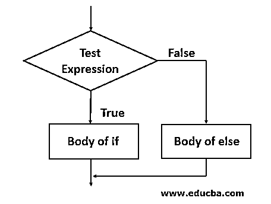

#### 实施例 2

查看 if-else 语句如何在 no = 10 的情况下工作的 R 代码示例

**代码:**

`no <- 10
if (no > 0) {
print(" Number is positive ")
} else {
print(" Number is Negative ")
}`

**输出:**

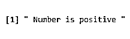

#### 实施例 3

r 代码示例，看看 if-else 语句如何与 no = -10 一起工作

**代码:**

`no <- -10
if (no > 0) {
print(" Number is positive ")
} else {
print(" Number is Negative ")
}`

**输出:**

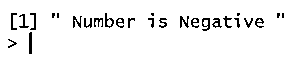

#### 实施例 4

上面的 R 代码可以重写为三元运算符

`no <- -10
if (no > 0) print(" Number is positive ") else print(" Number is Negative ")`

if-else if 语句

如果不是只有一个条件，如果要检查多个条件，并且基于特定条件要执行特定语句，那么可以使用 if-else if 语句。

if-else if 语句的语法

`if ( cond1 ) {
statement 1
} else if ( cond2 ) {
Statement 2
} else if (cond3 ) {
Statement 3
} else {
Statement 4
}`

if 语句检查条件，但是如果要检查多个 or 替代条件，则可以使用 else if 语句检查替代条件。在所有条件中，只有一个条件为真，因此只有一条语句可以执行。

#### 实施例 5

**代码:**

`no <- 6
if (no < 0) {
print(" Number is negative ")
} else if (no > 10) {
print(" Number is positive and greater than 10 ")
} else
print(" Number is positive and less than 10 ")`

**输出:**

#### 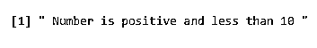

**嵌套 if 语句**

if 语句中可以有另一个 if 语句，甚至可以有 if-else 语句；它被称为嵌套 if 语句，不仅在 if 中，else 部分也可以有嵌套 if，也可以有嵌套 if-else 语句。

r 代码示例，首先检查否是否为正，如果否为正，则检查否是否为偶数。比如我们取 no 值为 6，那么 no 为正。

#### 实施例 6

**代码:**

`no <- 6
if( no>0 ){
print(" Number is positive ")
if( no %% 2==0 ){
print(" and Number is even ")
}
}`

**输出:**

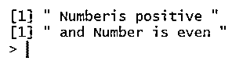

**no = 5 时的输出**

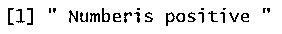

所以输出显示只有数字是正数。

接下来，我们看一些带有 if-else 语句的 R 程序例子；首先，我们编写程序来打印更大的 no。

#### 实施例 7

**代码:**

`a <- as.integer(readline(prompt="Enter a value "))
b <- as.integer(readline(prompt="Enter b value "))
if( a>b ){
print(" a is greater than b ")
} else {
print(" b is greater than a ")
}`

**输出:**

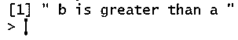

#### 实施例 8

程序接受的标志和显示代码，如果标志是在 100 和 80 之间，然后 A 级，否则如果标志在 80 和 50 之间，然后 B 级，否则 c 级。

**代码:**

`mark <- as.integer(readline(prompt="Enter mark "))
if( mark<=100 && mark>80 ){
print(" Your grade is A ")
} else if ( mark<=80 && mark>50 ) {
print(" Your grade is B ")
} else {
print(" Your grade is C")
}`

**输出:**

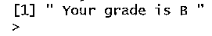

#### 实施例 9

检查输入字符是大写字母还是小写字母的程序。

**代码:**

`ch <- readline(prompt=" Enter Character ")
if( ch>='A' && ch<='Z' ){
print(" Entered character is upper case ")
} else if ( ch>='a' && ch<='z' ) {
print(" Entered character is lower case ")
} else {
print(" You have not entered a Character ")
}`

**输出:**

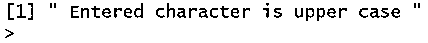

### 结论

if-else 语句是一个条件结构，语句的执行顺序根据条件决定。在 if 语句中，如果 cond 为 true，则执行主体内的所有语句，否则不执行任何内容(不输出)。cond 是可以是数字或逻辑向量的条件。一个 if-else 语句，如果 cond 为真，那么执行主体内部的所有语句，否则如果 cond 为假，那么执行 else 主体内部的所有语句。

用于检查多个条件的 if-else if 语句。if 语句中可以包含另一个 if 语句，甚至可以包含 if–else 语句，或者 and else 语句中可以包含另一个 if-else 语句，这种语句称为嵌套 if 语句。

### 推荐文章

这是 R 中 If Else 语句的指南，在这里，我们讨论 R 代码示例，看看 If 语句如何与程序和输出一起工作。您也可以阅读以下文章，了解更多信息——

1.  [Python 中的 If Else 语句](https://www.educba.com/if-else-statement-in-python/)
2.  [C 语言中的 If-else 语句](https://www.educba.com/if-else-statement-in-c/)
3.  [C# if 语句](https://www.educba.com/c-sharp-if-statement/)
4.  [Tableau IF 语句](https://www.educba.com/tableau-if-statement/)

