# R 中的 Switch 语句

> 原文：<https://www.educba.com/switch-statement-in-r/>

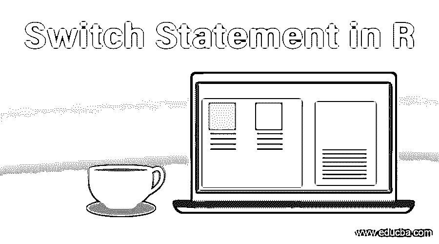

## R 中 Switch 语句介绍

R 语言中的 Switch 语句是一种控制语句，用于根据程序中指定的条件，将程序控制从一个代码行或模块移动到另一个代码行或模块。在 R 语言中，switch 语句主要用于对值列表进行多条件检查的情况。与 switch 语句相关联的值列表称为 cases。R 语言支持一个名为 switch()的内置函数，该函数用于在 R 程序中应用 switch case 逻辑。R 中的 switch 语句接受表达式和案例作为函数参数，用于评估开发程序逻辑的案例。

所以我们可以在 r 中使用 Switch 语句，它有很多优点，比如

<small>Hadoop、数据科学、统计学&其他</small>

*   switch 语句可以测试基于字符串对象、列表值或单个整数的表达式，简单来说，我们可以说 switch 语句最适合固定数据值。
*   Switch 语句更适合多路分支。
*   当我们使用 switch 语句时，代码的处理速度很快(这在有大量情况时是可见的)；一般来说，如果有大量的情况，if-else 语句会花费时间。
*   Switch 语句不太容易出错，因为当我们必须组合用例时，它们要干净得多。

**定义**

switch 语句将比较表达式值和列表中的值，并为我们提供满足所有要求的最佳输出。现在我们将看到一些可以使用 switch 语句的例子。

**语法:**

R 中 switch 语句的基本语法如下:

`switch(expression, Value 1, Value 2, Value 3.... Value n)`

这里，代码将比较表达式值和列表中的值，最佳匹配将作为满足问题陈述的每个条件的输出返回。

### Switch 语句规则

Switch 语句中适用的规则有:

1.开关内的 case 语句没有限制，就像可以形成 n 个 case 语句一样，唯一的限制是每个 case 后面都跟有要比较的值，或者在字符串所在的位置跟有冒号。

2.如果 switch 语句中有多个匹配项，则第一个匹配的 case 语句将作为输出返回。

#### 示例#1

**代码:**

`x <- switch("color","color" = "red", "shape" = "square","color" = "blue")
x`

**输出:**

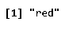

**代码:**

`x <- switch("color","color" = "blue", "shape" = "square","color" = "red")
x`

**输出:**

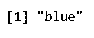

3.如果代码中要计算的值是一个数字，并且数值超出范围(值大于列表中的项目数或小于 1)。那么返回给我们的结果是“NULL”。

#### 实施例 2

**代码:**

`x <- switch(4,"Ball","Bat","Wickets")
x`

**输出:**

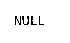

**代码:**

`x <- switch(0, "Ball","Bat","Wickets")
x`

**输出:**

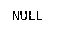

4.如果我们必须计算一个字符串，那么字符串应该与元素的名称完全匹配。

#### 实施例 3

**代码:**

`x <- switch("color","color" = "red", "shape" = "square")
x`

**输出:**

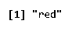

**代码:**

`x <- switch("coler", "color" = "red", "shape" = "square")
x`

**输出:**

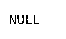

5.只有当不止一个 case 语句拼写错误，或者表达式不在列表中，或者缺少 case 语句的相应值时，我们才会得到错误结果。

### R 中 Switch 语句的流程图

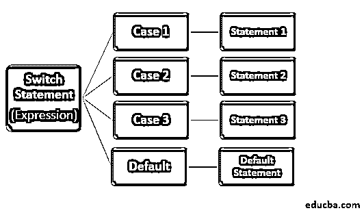

*   如果表达式= Case 1，则执行语句 1。
*   如果表达式= Case 2，则执行语句 2。
*   如果表达式= Case 3，则执行语句 3。
*   如果情况 1、情况 2 和情况 3 失败，则执行默认语句。

### Switch 语句的用例

我们可以使用 switch 语句的一些情况。

#### 类型 1:如果表达式是数字

**代码:**

`switch(2, "Ball","Bat","Wickets")`

**输出:**

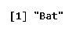

**代码:**

`switch(3, "Ball","Bat","Wickets")`

**输出:**

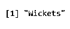

在上面的例子中，我们有一个由三个元素组成的列表(Ball、Bat 和 Wickets)，switch 语句函数将把相应的项返回给我们作为表达式输入的数值。

在这里，我们必须严格遵守使用 Switch 语句的规则，最基本和最常见的错误是:

"如果计算的值是一个数字，并且数值超出范围(值大于列表中的项目数或小于 1)。返回给我们的结果是“NULL”。

**代码:**

`x <- switch(4,"Ball","Bat","Wickets")
x`

**输出:**

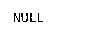

#### 类型 2:如果表达式是字符串

**代码:**

`switch("Wickets", "Ball" = "Red", "Bat" = "Rectangle", "Wickets" = "Out")`

**输出:**

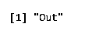

该示例的流程图如下所示:

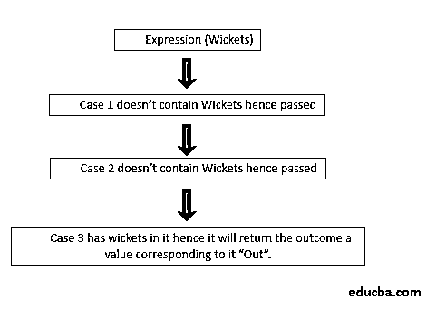

#### 类型 3:混合搭配

**例#1:**

`x= 1
y = 2
z = switch(x+y,  "Hello Abhinav", "Hello Mayank", "Hello Naman", "Hello Hardik")`

在这里，我们给 x 和 y 赋值，然后在 switch 语句中添加表达式作为等式。

所以 x+y = 1+2 = 3。

这意味着列表中的第 3 个 rd 值将作为输出。在我们的例子中，3 值是“Hello Naman”。

**代码:**

上述示例的代码如下所示:

`x= 1
y = 2
z = switch(x+y,  "Hello Abhinav", "Hello Mayank", "Hello Naman", "Hello Hardik")
z`

**输出:**

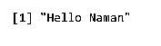

**例 2:**

`Where x= 1 and y= 7
a = switch(paste(x,y,sep=""),  "7"="Hello Abhinav", "12"="Hello Mayank", "17"="Hello Naman", "21"="Hello Hardik")`

当我们在 R 中运行这个函数时。

**代码:**

`x= 1
y= 7
a = switch(paste(x,y,sep=""),  "7"="Hello Abhinav", "12"="Hello Mayank", "17"="Hello Naman", "21"="Hello Hardik")
a`

**输出:**

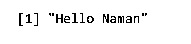

### 结论

*   Switch 语句更容易阅读。
*   如果我们将其与 If-Else 语句进行比较，Switch 语句会更有效。
*   Switch 语句易于维护和编写。
*   借助 Switch 语句，我们可以制作一个跳转表。
*   Switch 语句有助于我们非常方便地编写大型代码，如果代码中有错误，可以很容易地跟踪到。

尽管有一些限制，比如 Switch 语句不能用于浮点，也不能用于范围(除非明确提到)。

### 推荐文章

这是一个 R 中 switch 语句的指南，这里我们用例子讨论 R 中 Switch 语句的规则、流程图以及不同的用例。您也可以阅读以下文章，了解更多信息——

1.  [C 语言中的 Switch 语句](https://www.educba.com/switch-statement-in-c/)
2.  [c++中的 Switch 语句](https://www.educba.com/switch-statement-in-c-plus-plus/)
3.  [JavaScript 中的 Switch 语句](https://www.educba.com/switch-statement-in-javascript/)
4.  [Matlab 中的 Switch 语句](https://www.educba.com/switch-statement-in-matlab/)
5.  [c#中的 Switch 语句](https://www.educba.com/switch-statement-in-c-sharp/)
6.  [PowerShell 开关声明](https://www.educba.com/powershell-switch-statement/)

