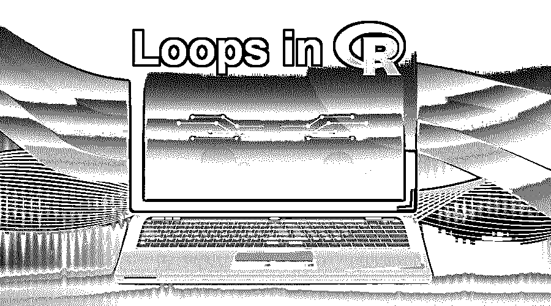
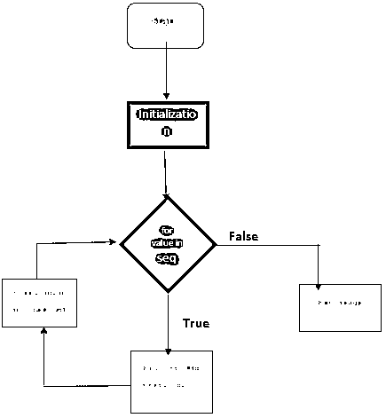
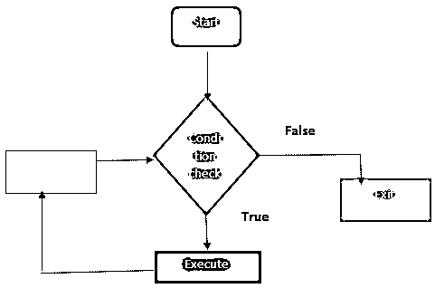
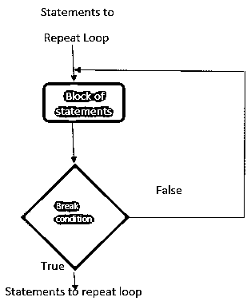

# R 中的循环

> 原文：<https://www.educba.com/loops-in-r/>

## R 中的循环是什么？

R 编程语言中的循环是用来为业务逻辑处理多个数据元素的基本特性。这是 R 语言支持的通用编程逻辑，用于处理迭代 R 语句。r 语言支持几种循环，比如 while 循环、for 循环和 repeat 循环。循环帮助 R 程序员实现复杂的逻辑，同时为重复步骤的需求开发代码。这些是特定于语法的，支持 R 编程中的各种用例。这些由循环条件检查控制，循环条件检查确定循环迭代、循环范围的进入和退出。

### 解释 R 编程中的循环

r 是数据科学家和数据挖掘者用于统计分析和报告的编程语言。它们是加深理解 R 的一个重要概念。在 R 循环中执行蒙特卡罗方法是有帮助的。特别是 for 循环对模拟部分很有用——例如马尔可夫链过程，它使用一组随机变量。状态空间在原点包含许多有限循环。在机器学习模型中，使用生成器节省内存是关键的好处。这是通过定义一个函数来完成的，该函数在其定义的元素上循环。在数据科学中，代码重复会对代码错误产生影响。有必要识别并移除数据集中的重复值。用来减少它们的工具是迭代，它在不同的数据集上执行多个样本输入。因此，有必要使用三种迭代范例:for 循环、repeat 和 while 循环。

<small>Hadoop、数据科学、统计学&其他</small>

#### 1.对于 R 中的循环

For 循环适用于许多数据结构，如数组、矩阵、列表和向量。下面给出了 R 编程中 For 循环的基本语法

**语法:**

`for ( i in 1:n)
{
Body of the statements
}
Nested For loops
for (i in 1: n)
{
for ( i in 1:n)
{
Body of the statements
}
}`

### For 循环中的流程图

对于序列中的每个值，循环在下图中执行。当没有更多的值时，它返回退出。

**举例:**

下面是一个打印数字的简单例子。

`for (n in 1:6)
{
print (5 * n)
}`

**输出:**

Five

Ten

Fifteen

Twenty

Twenty-five

Thirty

计算列表中奇数值的个数

`a <- c (2,7,3,13,8,11,6)
ct <- 0
for (val in a) {
if (! val %% 2 == 0)
ct = ct+1
}
print(ct)`

**输出:**

[1] 4

##### 1.嵌套 for 循环

**举例:**

`for (i in 1: 4)
{
for ( j in 1:3)
{
print (i*j)
}
}`

**输出:**

1 2 3 2 4 6 3 6 9 4 8 12

##### 2.使用列表的 For 循环

**举例:**

使用三个向量创建列表

`a <- list ("Sunday", "Monday", c (24,63,01), FALSE, 33.9, 12.6)
print (a)`

**输出:**

[[1]] [1] “Sunday” [[2]] [1] “Monday” [[3]] [1] 24 36 1 [[4]] [1] False [[5]] [1] 33.9 [[6]] [1] 12.6

##### 3.使用矢量

`x<- 1:6
y<- 1:6
tw <- numeric (length = length(x))
for (i in seq_along(x)) {
tw[i] <- x[i] + y[i] }
tw`

**输出:**

2 4 6 8 10 12

上述计划有三个组成部分:

1.  分配向量长度()。有必要分配足够的空间来保持效率。向量有一种数据类型。
2.  其次，是确定每个元素指数的顺序。
3.  第三是报表的主体。这是代码执行工作的地方；它每次都以不同的 I 值迭代运行。

#### 2.在 R 中循环时

执行代码块，直到条件为假(逻辑条件)，这给出了比较表达式。

**语法:**

`While (test condition)
{
Body of the statement
}`

**While 循环中的流程图**

下图显示了 r 中 while 循环的流程图。

**举例:**

这是一个 While 循环的例子。计算数字的平方，直到 3。

`i <- 1
while(i<=3)
{
print(i*i)
i=i+1
}`

**输出:**

One

Four

Nine

在上面的示例中，很明显“I”最初声明为 1，这里的条件是(i<3)，因为 1 小于 3，所以检查是否为真。执行语句体，I 值递增。执行循环，直到条件为假，while 循环退出。

#### 3.重复 R 中的循环

这个循环有助于重复执行代码，直到达到停止条件(中断)。下面的流程图给出了清晰的工作流程或重复语句。它使用一个重复的关键字，后跟可执行语句和 if 语句来描述约束条件。最后，执行 break 语句是终止循环的唯一方法。它是传统编程中 do-while 关键字的替代。

**语法:**

`repeat
{
commands
if (condition expression) {
break}}`

**流程图**

**举例:**

让我们看一个理解重复语句的例子

`s  <- 1
repeat
{
s <- s+3;
print (s);
if (s>10)
break;
}`

**输出:**

Four

Seven

Ten

Thirteen

**举例:**

`s <- 0
repeat {
s = s+1
print(s)
if (s == 4) {
print (" ends");
break
}
}`

**输出:**

One

Two

Three

Four

"结束"

### 结论

现在已经理解了 r 中循环的基本概念和例子。总之，使用这些可以减少时间和内存的节省。另一个争议是 R 中的循环有点慢。如果你试图在循环中放置少量代码是好的，R 中的重复语句应该适当终止。并且当要重复手术时优选使用它。读完所有要点后，在 r 的实现过程中要小心，为了提高循环的性能，要避免在密集型对象上使用循环。For 循环非常简单，但是我们应该避免使用它们，使用矢量化概念，这样更快。

### 推荐文章

这是一个关于 r 中循环的指南。在这里，我们已经讨论了 r 中循环的概念、类型和例子。你也可以看看下面的文章来了解更多信息

1.  [c++中的循环与示例](https://www.educba.com/loops-in-c-plus-plus/)
2.  [XGBoost 算法](https://www.educba.com/xgboost-algorithm/)
3.  [R 中 While 循环介绍](https://www.educba.com/while-loop-in-r/)
4.  [PowerShell 中不同类型的循环](https://www.educba.com/loops-in-powershell/)
5.  [Shell 脚本中最常见的三种循环类型](https://www.educba.com/loops-in-shell-scripting/)

