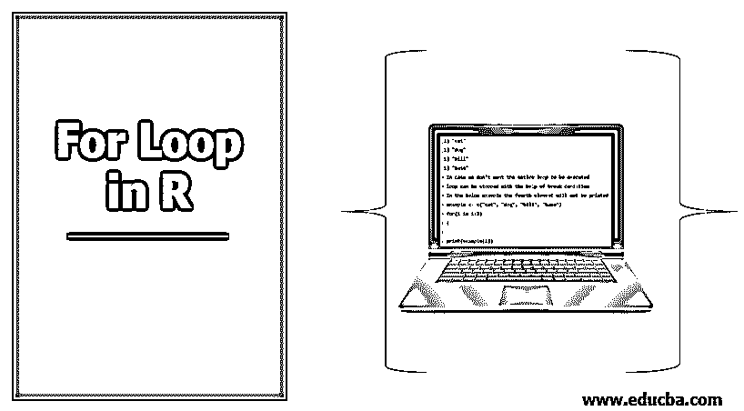
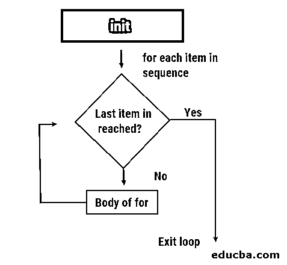

# R 中的 For 循环

> 原文：<https://www.educba.com/for-loop-in-r/>

## R 中的 For 循环介绍

R 语言中的一个概念，用于轻松处理超大向量或矩阵的每个元素的选择，也可用于打印特定范围的数字或多次打印某些语句，但其实际功能是促进大规模分析中复杂任务的有效处理，这在 R 语言中称为 for 循环。它在语法上与其他编程语言中的相同概念略有不同，属于 R 语言中的循环功能家族。

### For 循环语法

R 中的 for 循环语法类似于 python 或任何其他语言的语法。

<small>Hadoop、数据科学、统计学&其他</small>

比如下面是 r 中 For 循环的语法。

**语法:**

`for (val in sequence) {
Statement
}`

在上面的语法中，向量由 sequence 表示，val 是 For 循环期间向量的值。

现在，让我们借助流程图来看看 for 循环条件所执行的过程。首先，循环对序列中的每个项目重复进行，直到达到所需的条件。然后，检查条件，当到达最后一项时，编译器退出循环。

该结构由显示为“init”的初始化、菱形、一个决策框和一个矩形框组成，该矩形框是 for 循环的主体。在 for 循环条件下执行一组命令时，编译器在指定条件之前不会开始循环。如果没有可用的条件，将执行循环后的下一条指令。对于序列中的每一项，条件都是匹配的。直到条件不匹配，循环一遍又一遍。一旦最后一项或条件得到满足，编译器就存在于循环中。

### R 中的 For 循环是如何工作的？

在学习 R 中 For 循环如何工作之前，我们先来看看什么是循环或循环。循环或迭代，基本上是重复的指令，其起源可以追溯到很久以前。简而言之，它是通过将某些必需的功能分组到一批部件中来实现过程的自动化。大多数现代的[编程语言都有一个内置的](https://www.educba.com/what-is-a-programming-language/)循环函数，允许构建一个自动化的函数。循环功能可分为两部分，受控循环和可执行所需次数的循环属于循环系列。另一方面，基于一组条件的循环属于 while 循环族。

在本文中，我们将研究 R 中用于循环的不同方法。我们将进一步查看使用 R 库中可用函数的不同循环示例。当[在 R 语言](https://www.educba.com/r-programming-language/)中工作时，For 循环只是你需要的循环条件，很少会需要其他的循环条件，比如 While。让我们看看如何使用 For 循环来迭代数值。

**代码:**

`# for printing number from 9 to 99 usinf for loop
> for(i in 9:99){
+   print(i)
+ }
[1] 9
[1] 10
[1] 11
[1] 12
[1] 13
[1] 14
[1] 15
[1] 16
[1] 17
[1] 18
[1] 19
[1] 20
[1] 21`

在上面的例子中，变量“I”被循环采用，并迭代直到满足条件。在循环中打印变量“I ”,得到的值范围是从 9 到 99。现在，让我们看另一个使用字符的例子。

**代码:**

`# for printing and looping items in example vector
> example <- c("cat", "dog", "bill", "base")
> for(i in 1:4)
+ {
+
+   print(example[i])
+ }
[1] "cat"
[1] "dog"
[1] "bill"
[1] "base"
# In case we don’t want the entire loop to be executed
# loop can be stopped with the help of break condition
# In the below example the fourth element will not be printed.
> example <- c("cat", "dog", "bill", "base")
> for(i in 1:3)
+ {
+
+ print(example[i])
+ }
[1] "cat"
[1] "dog"
[1] "bill"`

在上面的例子中，我们打印出例子中想要的元素。在第一个例子中，序列中调用了四个元素；因此，当执行 print 语句时，所有的元素都被打印出来了。在第二个例子中，序列一直被调用，直到第三个元素；因此，打印了前三个元素。

另一方面，存在重复循环条件，其具有与循环类似的功能。但是，重复条件用于在没有条件检查的情况下连续迭代代码。

用户需要在循环内部定义一个条件，并且必须使用“break”语句来退出循环。不使用“break”语句将导致无限循环。

**代码:**

`# illustrating repeat statement to print numbers from 5 to 15
> n <- 5
> repeat
+   {
+   print(n)
+   n = n+1
+   if (n == 16){
+     break
+   }
+ }
[1] 5
[1] 6
[1] 7
[1] 8
[1] 9
[1] 10
[1] 11
[1] 12
[1] 13
[1] 14
[1] 15`

在上面的例子中，我们已经指定了条件 n == 16，这样当达到 n == 6 时，编译器就会停止循环。

### 对于循环示例

为了介绍 R 中的 For 循环，让我们举一个从 vector 中提取元素或项的例子。

**代码:**

`> states <- c('Oregon', 'Florida', 'Texas', 'Lowa', 'Nebraska', 'utah')
>
>
> for (str in states) {
+   print(paste("States in USA: ",str))
+ }
[1] "States in USA: Oregon"
[1] "States in USA: Florida"
[1] "States in USA: Texas"
[1] "States in USA: Lowa"
[1] "States in USA: Nebraska"
[1] "States in USA: utah"
# to illustrate the print operation outside the loop
> print("----prints outside the loop---")
[1] "----prints outside the loop---"`

**第一步**

定义了名为状态的向量，它由不同的状态组成

`> states <- c('Oregon', 'Florida', 'Texas', 'Lowa', 'Nebraska', 'Utah')`

**第二步**

在下一步中，for 循环用于迭代状态向量，并显示各个状态的名称。

`> for (str in states) {
+   print(paste("States in USA: ",str))
+ }`

由于 print 语句包含在循环中，我们得到了想要的结果，并且打印出了所有州的名称。在下一步中，在循环外部使用了另一个 print 语句，该语句实际上是在 for 循环结束后执行的。

现在让我们看看代码执行过程中每一次迭代背后的逻辑。

*   在第一次迭代中，State = Oregon，向量中还有元素。因此，print 语句由编译器在循环内部执行。
*   在第二次迭代中，State = Florida，向量中还有四个元素。因此，print 语句由编译器在循环内部执行。
*   在第三次迭代中，State = Texas，向量中还有三个元素。因此，print 语句由编译器在循环内部执行。
*   在第四次迭代期间，State = Lowa，向量中还剩下两个元素。因此，print 语句由编译器在循环内部执行。
*   在第五次迭代中，State = Nebraska，向量中还有一个元素。因此，print 语句由编译器在循环内部执行。
*   在第六次迭代期间，State = Utah，向量中可能还有剩余的元素。因此，print 语句由编译器在循环内部执行。
*   在第七次迭代中，由于没有更多的元素分配给状态变量，编译器将退出循环。

在下一个例子中，让我们看看整数情况下的循环功能。

**代码:**

`> num <- c(1:5)
>
> for (i in num) {
+   print(i)
+ }
[1] 1
[1] 2
[1] 3
[1] 4
[1] 5`

**第一步:**已经定义了名为 num 的向量，由 1 到 5 的整数组成。

`> num <- c(1:5)`

**第二步:**在下一步中，循环用于迭代 num 向量并显示各个整数。

`> for (i in num) {
+   print(i)
+ }`

因为 print 语句包含在循环中，所以我们得到了想要的结果，并且来自向量 num 的所有整数都被打印出来。

现在让我们看看代码执行过程中每一次迭代背后的逻辑。

*   在第一次迭代“1”期间，向量中还有剩余的元素。因此，print 语句由编译器在循环内部执行。
*   在第二次迭代“2”期间，向量中还剩下三个元素。因此，print 语句由编译器在循环内部执行。
*   在第三次迭代“3”期间，向量中还剩下两个元素。因此，print 语句由编译器在循环内部执行。
*   在第四次迭代“4”期间，向量中还剩下一个元素。因此，print 语句由编译器在循环内部执行。
*   在第五次迭代“5”期间，向量中可能还有剩余的元素。因此，print 语句由编译器在循环内部执行。
*   在第六次迭代中，由于没有更多的元素可分配给 num 变量，编译器将退出循环。

### 结论

在本文中，我们已经看到了如何使用 R 来执行 for 循环条件，R studio 已经用于执行上述操作，并且结果已经显示出来。我们还看到了一个从向量中提取元素或项目的例子，文章中研究了每一步的评估。

### 推荐文章

这是一个 R 中 for 循环的指南。这里我们分别用适当的例子和语法讨论 For 循环在 R 中是如何工作的。您也可以看看以下文章，了解更多信息–

1.  [Python 中的 For 循环](https://www.educba.com/for-loop-in-python/)
2.  [R 中的循环](https://www.educba.com/loops-in-r/)
3.  [对于 C 中的循环](https://www.educba.com/for-loop-in-c/)
4.  [Matlab 中的 For 循环|示例](https://www.educba.com/for-loop-in-matlab/)

