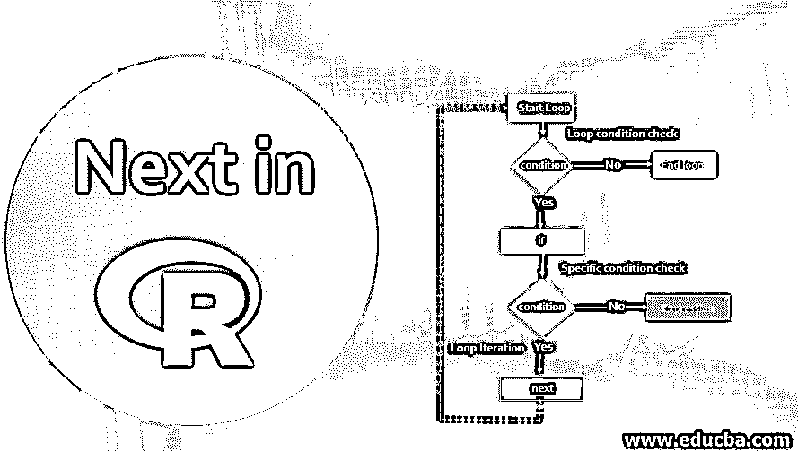
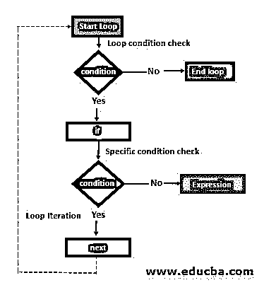
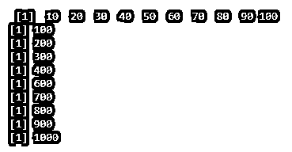

# 接下来是 R

> 原文：<https://www.educba.com/next-in-r/>

## R 中的 Next 简介

R 中的下一个是 R 语句，它与循环语句一起使用，为运行时的循环处理逻辑提供额外的控制指令。它提供了在 R 语句中循环时跳过语句或逻辑步骤的任何特定迭代的特性。next 是 R 语言中的保留关键字。R 语言中的 next 语句类似于其他标准编程语言中的 continue 语句。下一条语句是非常重要的编程范例，用于实现要被忽略的业务规则，通过循环语句处理某些敏感的业务数据。

### R 中 Next 的语法

下一条语句总是与循环和 if 语句相关联。循环可以是 while 循环、for 循环或 repeat 循环。以下语法表示 R 编程中 next 语句的用法。

<small>Hadoop、数据科学、统计学&其他</small>

`loop(condition){
if (condition) {
next
}
Expression statement
}`

语法显示 next 关键字出现在 if 语句中。if block 语句出现在 loop 语句中。下一条语句也可以用在 if-else 场景的 else 块中，通过 R 编程实现更复杂的业务逻辑。R 代码中的循环条件和 if 语句通常由一些变量和运算符组成。

基于多个 if 语句和条件评估，可以有多个 next 语句。在某些业务需求场景中，一个循环可能包含另一个循环逻辑，或者称为嵌套循环。下一条语句可以在 R 语言的嵌套循环中使用。

### 下一步流程图

1.  R 编程中下一个语句的流程图代表了一个一般的循环场景。
2.  它从循环条件检查开始，然后是 if 语句和 if 条件检查。
3.  与下一条语句关联的 if 语句块。下一条语句限定了特定迭代的范围，并管理循环的控制流。
4.  表达式语句与循环范围相关联。
5.  Next 应用于特定的 if 条件，它控制嵌套循环场景的最内层循环，以防循环代码中没有实现其他 next 语句。
6.  与结束循环流程相关的流程图。

### R 中的 Next 语句是如何工作的？

我们来讨论下一个 in R 是如何工作的:

*   下一条语句用于 R 语言中的流控制。
*   下一个是保留关键字，用于根据条件的返回值暂停当前循环迭代的处理。
*   下一条语句提高了 R 编程中的循环索引。
*   r 运行时或解析器解释循环代码并检查相关的循环条件。
*   如果循环条件返回真布尔值，则流程控制进入循环块内部。
*   如果循环条件返回假布尔值，它将循环条件视为无效，并立即结束和退出循环。
*   一旦控制进入循环条件，它就检查相关的 if 条件。
*   在循环条件返回假布尔值的情况下，在迭代完成后，R 解析器将其视为循环逻辑的完成并终止循环。

### R 中实现 Next 的示例

我们将讨论使用 R studio IDE 的例子，并查看 R 控制台中的输出。

**代码:**

`# Assigning Vector variables #
SequenceNum <- c(10,20,30,40,50,60,70,80,90,100)
#Printing the Ventor Variables
print(SequenceNum)
#Generating sequence number by multiplying by 10, excluding sequence number 50
for (value in SequenceNum) {
if(value==50){
next
}
print(value*10)
}`

**输出:**

**代码解释:**

*   上例中的 R 脚本使用了一个名为‘sequence num’的向量变量，它存储 10 到 100 之间的数字。
*   print 函数用于打印矢量变量中存储的值。
*   输出显示了在 R 控制台中打印向量值的 print 语句。
*   R 脚本实现 for 循环，通过在每个向量值上乘以数字 10 来打印序列号的值，序列号 50 除外。
*   为了实现 skip 条件，在 for 循环块中添加了一个 if 语句块。
*   next 关键字出现在 if 语句块中。
*   计算值 10 与每个向量值的乘积的表达式在 print 函数中表示。
*   当 R 脚本运行时，它的解析器检查 for 循环条件，并遍历每个向量值，对于这个 R 代码是 10 次迭代。
*   解析器检查 if 条件相应的向量值是否为 50，
    *   根据序列号输入数据，对于第 5 次迭代布尔值，它的条件返回 TRUE，并且流控制在 If 块内传播。
    *   R parser 找到了该迭代的下一条语句。
    *   next 关键字会停止这个迭代，并跳过后续打印函数中乘法计算的计算。
    *   在第 6 次迭代中，r 解析器控制返回到 for 循环条件，并继续程序。
*   输出打印乘法序列号，不包括序列号 50 的计算值。

### 结论

在为循环逻辑开发代码时，下一条语句是 R 编程不可或缺的组成部分。它有助于解决多重条件检查，并根据条件处理循环迭代。它通过消除多个 if 语句来实现编程中的跳过场景，从而简化了 R 代码。

### 推荐文章

这是 next in R 的指南，在这里我们讨论了 next in R 的语法、流程图和工作方式，以及示例和代码实现。您也可以浏览我们推荐的其他文章，了解更多信息——

1.  [R 中不同类型的绘图函数](https://www.educba.com/plot-function-in-r/)
2.  [OLS 模型中使用的重要命令](https://www.educba.com/ols-regression-in-r/)
3.  [实施泊松回归](https://www.educba.com/poisson-regression-in-r/)
4.  [一个因素的优势](https://www.educba.com/factors-in-r/)
5.  [JavaScript 中的矢量指南](https://www.educba.com/vectors-in-javascript/)
6.  [c++中的嵌套循环](https://www.educba.com/nested-loop-in-c-plus-plus/)

