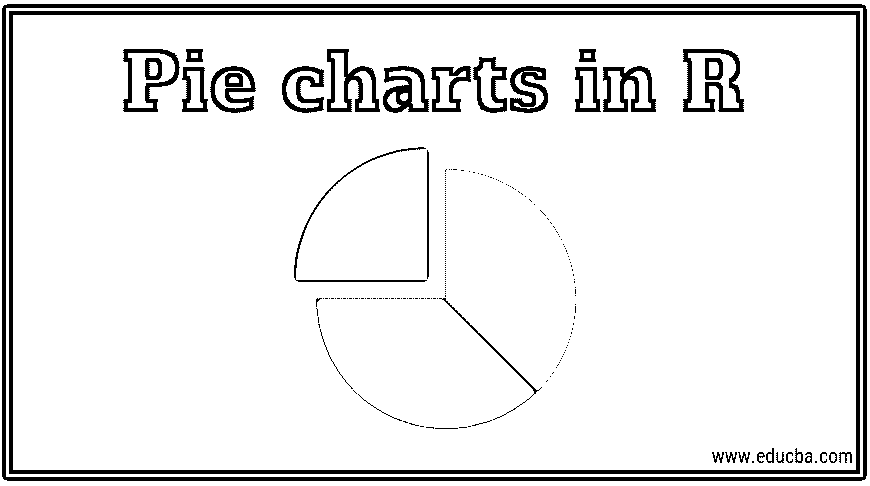
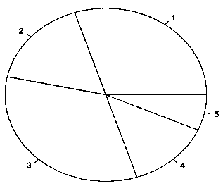
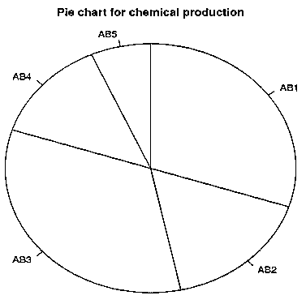
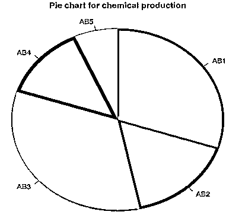
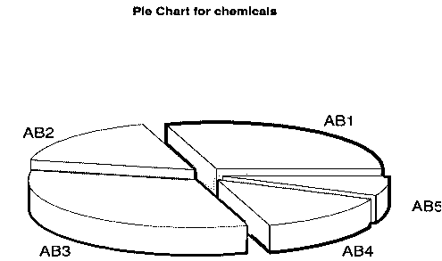

# R 中的饼图

> 原文：<https://www.educba.com/pie-chart-in-r/>

## R 中的饼图介绍

R 中的饼图是用圆形图表符号表示的基本图表特征之一。圆圈部分显示了数据值的比例。饼图的各个部分可以用有意义的名称来标记。饼图通常是小尺寸向量变量的首选。饼图可以是二维视图，也可以是基于 R 包的三维视图。Pie 是 R 语言中支持二维饼图的函数。饼图对于数据分析非常有用。R 中的饼图可以使用 main 作为 Pie 函数中的一个参数来分配一个有意义的标题。

使用饼图，可以很容易地理解数据中的模式，而如果我们浏览数字，通常需要一段时间才能理解。比如我们把上面的例子绘制成饼状图，就可以了解一分钟内的产量和产量比例。

<small>Hadoop、数据科学、统计学&其他</small>

在 R 中有各种各样的用于绘制饼状图的包，在这些选项中，我们将在本文中重点讨论两种方法。

**语法**

上一节简要介绍了饼图及其用途。在这一节中，我们将具体学习 R 中的饼图。对于那些不熟悉 R 的人来说，它是一种主要用于数据分析和机器学习的编程语言。r 的功能非常丰富，为各种用例提供了数百个库。

在 R 中，可以通过使用一个简单的内置函数来创建它，下面给出了相同的语法。

`pie(x, labels, radius, main, col, clockwise)`

在哪里，

*   x 被称为向量，它包含将在饼图中使用的数值，例如上面示例中的生产数字。
*   标签为 X 中的值取一个名字，比如化学药品的名字。
*   半径参数是饼图圆的半径。其典型值介于 1 和+1 之间。
*   主参数可用于提供图表的标题。
*   col 参数可用于为图表提供颜色。
*   顺时针是一个逻辑值，取值为 True 或 False，表示图表切片是以顺时针还是逆时针方式绘制的。

**Note:** That X is a mandatory argument, and the rest all are optional.

### 如何在 R 中创建饼状图？

现在我们已经理解了饼图的语法，让我们来构建一个饼图。为此，我们将再次使用上面介绍部分中的相同示例。

首先，为了便于理解，我们把上面的例子转换成表格的形式。

| 化学品名称 | 产量(公吨) |
| AB1 | Ninety |
| AB2 | Fifty |
| AB3 | One hundred |
| AB4 | Forty |
| AB5 | Twenty |
| 总数 | Three hundred |

首先，我们使用下面两行 R 代码将上面的表转换成两个向量，一个表示化学物质的名称，另一个表示化学物质的体积。

现在，我们通过仅提供上述语法中的 x 值来绘制一个简单的饼图:

*   化学
*   飞行
*   饼图(卷)

其输出如下图所示:

如果你观察输出，它不是很清楚什么代表什么。所以为了更直观，我们在 pie 函数中再输入几个参数，然后再次运行。

*   化学
*   飞行
*   饼图(x =体积，标签=化学，半径= 1，main = "化学生产饼图"，顺时针= T)

这幅图更好理解，因为它包含了化学药品的名称和标题。请注意，这两个图表中的配色方案是默认的，我们可以根据自己的需要或愿望进行更改。我们将在下一节中完成这项工作。

### 如何改变饼图和填充颜色？

在本节中，让我们学习如何改变饼图。

首先，让我们在图表中显示化学物质的数量，而不是化学物质的名称。

*   饼图(x =体积，labels =体积，半径= 1，main = "化学生产饼图"，顺时针= T)
*   自己运行一下，看看输出。

接下来，让我们改变图表的颜色。

*   化学
*   飞行
*   pie(x=vol，labels = chem，radius = 1，main = "化学生产饼图"，col=c("红色"、"蓝色"、"绿色"、"黑色"、"黄色")，顺时针= T)

这里我们指定了我们想要的颜色。输出如下所示:

### 如何创建三维饼图？

在这一节中，我们将学习如何在 r 中构建一个 3D 饼图。我们需要先安装一个库，因为它不能从一个基本的内置功能。

您应该在运行饼图代码之前安装库 plotrix。要安装这个库，只需在 r。

*   install . packages(“plotrix”)

之后，运行下面两行得到一个 3d 图。

*   化学
*   飞行
*   图书馆(plotrix)
*   pie3D(vol，labels = chem，explode = 0.1，main = "化学物质饼图")

输出如下所示:

### 结论

饼状图用的很多，而且很直观，信息量也很大，我相信到现在已经很清楚了。在金融领域和许多其他领域，饼图是基本的可视化工具，几乎所有的分析都从这里开始。它简单却非常强大。在本文中，我们提供了足够多的细节，应该可以帮助任何人自信而轻松地开始构建饼图。还建议学生和学习者查看 R 的帮助菜单，在那里他们可以了解更多的细节和饼图的附加功能。R 中有一个很棒的可视化软件包 ggplot2，它提供了许多自定义饼状图和所有其他可视化的选项；建议候选人也考虑一下这个问题。最后，如果有任何问题或进一步的疑问，您可以随时对本文进行评论，并获得更多的解释、示例以及理论讨论。

### 推荐文章

这是 R. Here 中的饼状图指南；我们讨论了如何创建饼图，如何更改饼图和填充颜色，以及如何创建三维饼图。您也可以阅读以下文章，了解更多信息——

1.  [饼状图示例](https://www.educba.com/pie-chart-examples/)
2.  [R 中的二项分布](https://www.educba.com/binomial-distribution-in-r/)
3.  [图形 vs 图表](https://www.educba.com/graphs-vs-charts/)
4.  [R 中的线图指南](https://www.educba.com/line-graph-in-r/)

