# R 中的线图

> 原文：<https://www.educba.com/line-graph-in-r/>

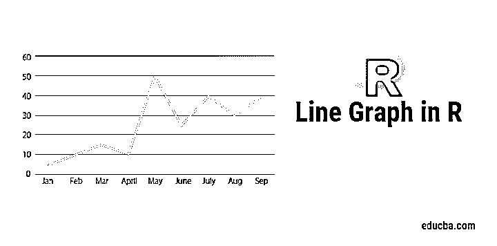

## R 中的线图介绍

R 中的线图是 R 语言中的基本图表，它通过连接数据集的数据点来形成线条。折线图可用于探索性数据分析，通过观察折线图的线型来检查数据趋势。线图是使用 R 语言中的 plot 函数绘制的。可以使用函数参数将折线图与有意义的标签和标题相关联。可以使用颜色参数给线图着色，以表示多线图[，从而获得更好的图形表示](https://www.educba.com/graph-representation/)。R 中的折线图对于时间序列数据分析很有用。

**图一。**显示了基本的线形图，其中值是一年内的“事件计数”。x 轴表示时间，而 y 轴表示“事件计数”。

<small>Hadoop、数据科学、统计学&其他</small>

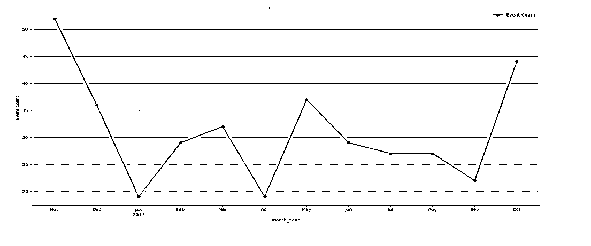

Fig 1 -Line graph

通过绘制线图，可以了解与数据相关的趋势、季节性。

**在 R 中绘制折线图的基本语法:**

`plot(vec,type,xlabel,ylabel)
vec: This is the vector, which has numeric values to be plotted
type: Its of three “p”, ”l” and “o”
p: It draws only points
l:It draws only line
o:It draws point as well as line
xlabel: Its label to the x axis
ylabel: Its label to the y-axis`

### 如何在 R 中创建线图？

现在，让我们通过一步一步地创建线图来开始我们的旅程。慢慢地，稳步地，它会给你一个好的把握，在其中多次调整的线图绘制。

在绘制线图之前，需要知道要使用的函数在 R 环境中是可用的还是必须安装的。

我们将学习的第一个函数是 plot()，另一个函数是 ggplot。对于 plot()，不需要安装任何库。但是，对于 ggplot，需要安装库“ggplot2”并像 R 环境中的“library(ggplot2)”一样读取该库。

用于在 RStudio 中安装。转到工具->安装包

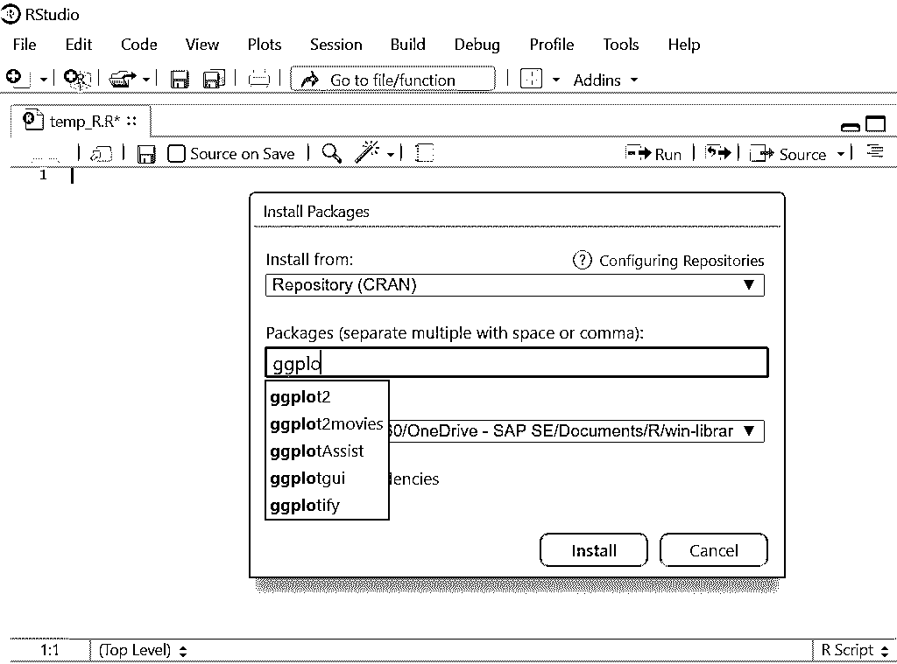

#### 1.R 代码中的简单线图(带绘图功能):

`Vec <- c(7,12,28,3,41) #Create the data for the chart
plot(Vec,type = "o")  # Plot the bar chart.`

**输出:**

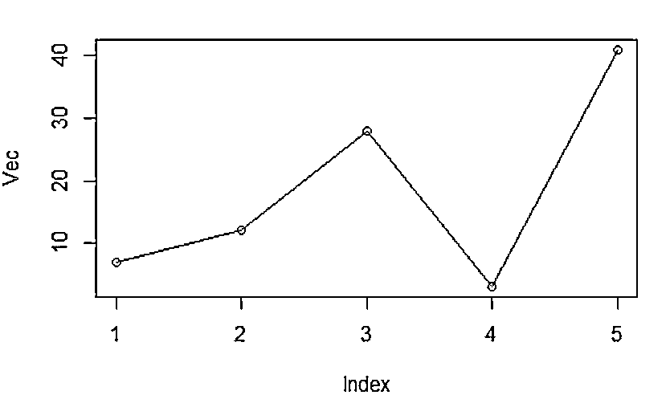

图 2:矢量图

在这里你会注意到 x 标签，y 标签还没有被赋值，所以默认的名字为 came。

假设现在 R 代码是:

`Vec <- c(7,12,28,3,41) #Create the data for the chart.
plot(Vec,type = "o",xlab = "Month", ylab = "Event Count", main = "Event Count by Month")`

**输出:**

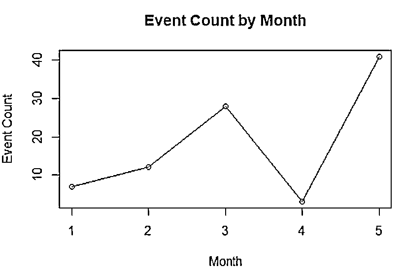

图 3:带有定制标签的矢量图

#### 2.在 PNG 文件中保存线图。

到目前为止绘制的线图都在 Rstudio 窗格中。但是，有时您需要将它以 png 文件的形式保存在本地系统中。

r 代码:

`#Create the data for chart.
Vec <- c(17,12,22,30,4)
# Name on PNG image.
png(file = "First_chart.jpg")
# Plot the line chart.
plot(Vec,type = "o",xlab = "Month", ylab = "Event Count", main = "Event Count by Month")
# Save the file.
dev.off()`

在这里，png 文件将保存在您当前的工作目录中，您可以根据需要随时检查和更改该目录。函数:getwd()和 setwd()可以帮你做到这一点。

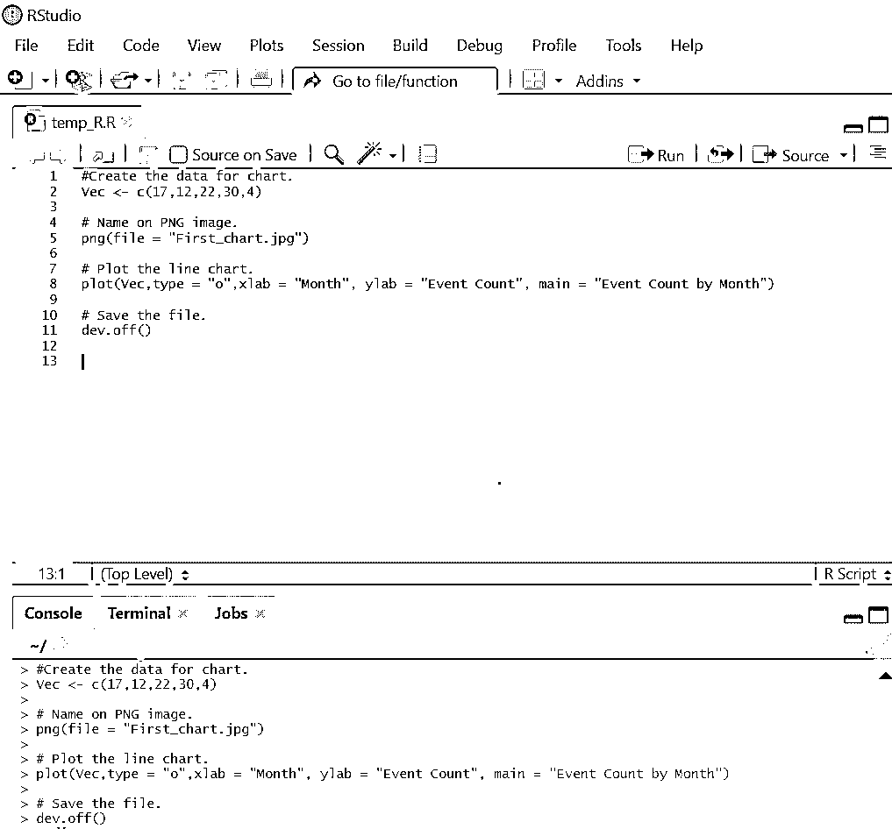

查看位置，你会发现“Line_chart.png”会被创建。

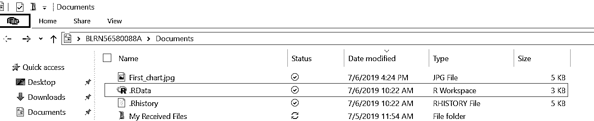

#### 3.折线图中的多条线

在现实世界中，各种折线图之间总是存在比较。为了在一个折线图中绘制多条线，下面是相关的 R 代码:

**R 代码:**

`events1 <- c(7,12,28,3,41)
events2 <- c(17,21,18,13,22)
# Plot the bar chart.
plot(events1,type = "o",col = "red", xlab = "Month", ylab = "Event Count",
main = "Event count chart")
lines(events2, type = "o", col = "blue")`

输出:

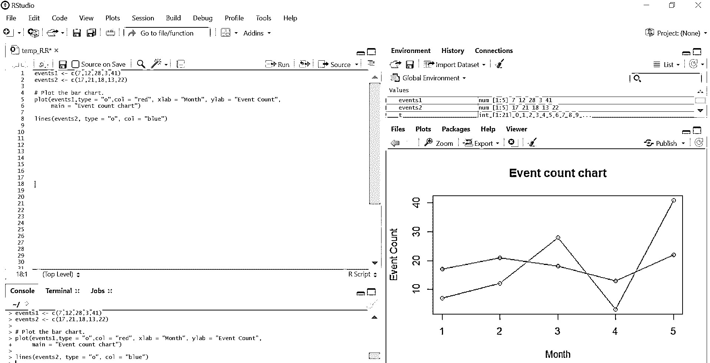

#### 4.向线形图添加图例

我们看到了如何在单个折线图中绘制多条线。当同一线图中有两行以上时，阅读起来就变得笨拙了。为了以清晰的方式理解绘制的数据，图例在其中起着至关重要的作用。

**R 代码:**

`events1 <- c(7,12,28,3,41)
events2 <- c(17,21,18,13,22)
# Plot the bar chart.
plot(events1,type = "o",col = "red", xlab = "Month", ylab = "Event Count",
main = "Event count chart")
lines(events2, type = "o", col = "blue")
# Add a legend
legend(3.5, 38, legend=c("Event 1", "Event 2"),
col=c("red", "blue"), lty=1:2, cex=0.8)`

**输出:**

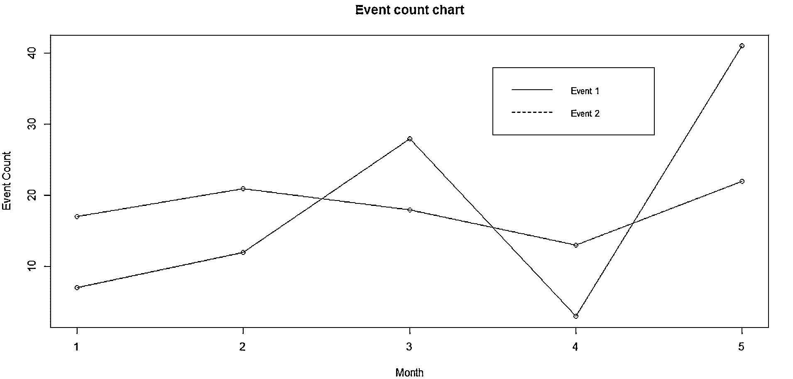

图例通常放在右上角。然而，从可读性的角度来看，它可以根据个人的舒适度来放置。图例函数中的前两个参数显示放置图例需求的 x 和 y 轴。

如果有些人不想处理坐标，可以用关键字来指定图例的位置，如:" bottom "、" bottomright "、" bottomleft "、" left "、" topleft "、" top "、" right "、" topright "和" center "。

也可以自定义图例，见下图:

**R 代码:**

`events1 <- c(7,12,28,3,41)
events2 <- c(17,21,18,13,22)
# Plot the bar chart.
plot(events1,type = "o",col = "red", xlab = "Month", ylab = "Event Count",
main = "Event count chart")
lines(events2, type = "o", col = "blue")
# Add a legend
legend(3.5, 38, legend=c("Event 1", "Event 2"),
col=c("red", "blue"), lty=1:2, cex=0.8,
title="Event types", text.font=3, bg='lightblue')`

**输出**:

注:上面绘制的所有线图都是通过函数图()绘制的。然而，也有其他库/函数可以帮助我们绘制线图。一个这样的库是“ggplot2”。

#### GGplot2 库

下面是 ggplot2 库，它有助于在 R 中绘制如下线图:

##### 1.简单线图

**R 代码:**

`temp = c(4, 25, 50, 85, 100)
enzyme_activity = c(0.543, 0.788, 0.800, 0.898, 0.882)
df <- as.data.frame(cbind(temp,enzyme_activity))
library(ggplot2)
ggplot(df, aes(x = temp, y = enzyme_activity)) + geom_line()`

**输出:**

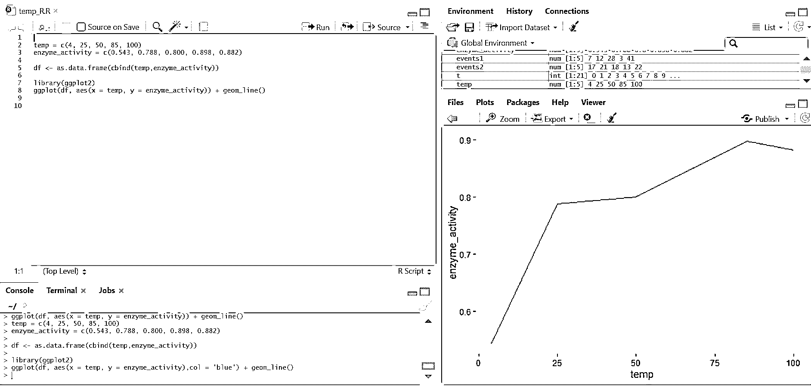

##### 2.线形图中的多条线

**R 代码:**

`library(ggplot2)
temp = c(4, 25, 50, 85, 100)
enzyme_one_activity = c(0.543, 0.788, 0.800, 0.898, 0.882)
enzyme_two_activity = c(0.702, 0.204, 0.400, 0.329, 0.443)
df <- as.data.frame(cbind(temp,enzyme_one_activity,enzyme_two_activity))
ggplot(df, aes(temp)) +
geom_line(aes(y = enzyme_one_activity),col ="red") +
geom_line(aes(y = enzyme_two_activity),col ="blue")`

**输出:**

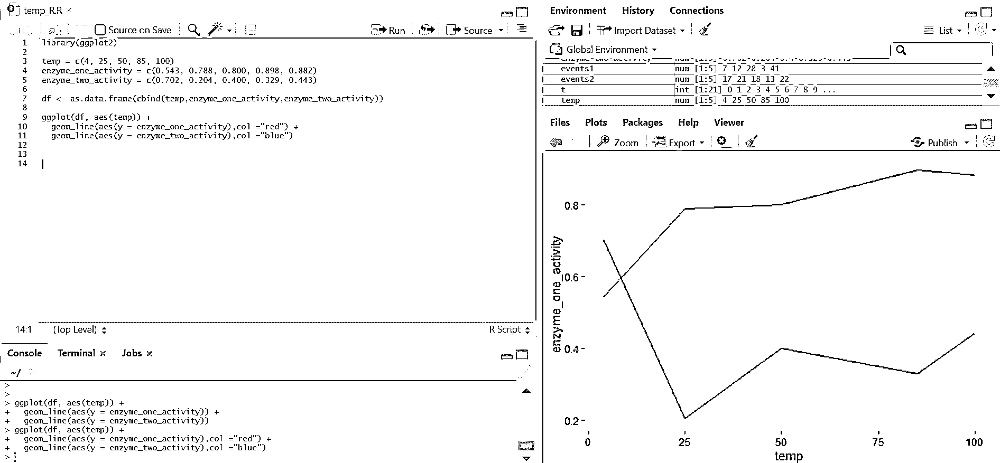

##### 3.要绘制的更多详细信息

**R 代码:**

`library(ggplot2)
temp = c(4, 25, 50, 85, 100)
enzyme_one_activity = c(0.543, 0.788, 0.800, 0.898, 0.882)
enzyme_two_activity = c(0.702, 0.204, 0.400, 0.329, 0.443)
df <- as.data.frame(cbind(temp,enzyme_one_activity,enzyme_two_activity))
ggplot(df, aes(temp)) +
geom_line(aes(y = enzyme_one_activity),col ="red") +
geom_line(aes(y = enzyme_two_activity),col ="blue")+
labs(title = "Enzyme activity w.r.t Temperature", x = "Temperature(in Celsius)", y = "Enzyme Type")`

**输出:**

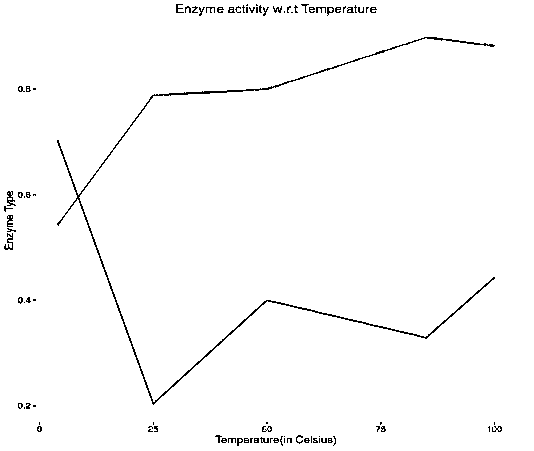

### 结论

折线图是一种基本但非常强大的图表，用于描述特定时间内的事件。r 作为一个流行的统计工具，一个人必须知道如何绘制折线图，以及如何定制其参数以获得符合自己要求的视图。一旦一个人熟悉了线图，其他的图也应该被探索，以便更好地掌握数据可视化。

### 推荐文章

这是一本 R 中线图的指南，这里我们讨论什么是 R 中的线图，在 R 中画线图的基本语法等等。您也可以浏览我们推荐的其他文章，了解更多信息——

1.  [图形 vs 图表](https://www.educba.com/graphs-vs-charts/)
2.  [Excel 图表类型](https://www.educba.com/excel-types-of-graphs/)
3.  [R 中的散点图](https://www.educba.com/scatterplots-in-r/)
4.  [R 中的绘图功能指南](https://www.educba.com/plot-function-in-r/)

