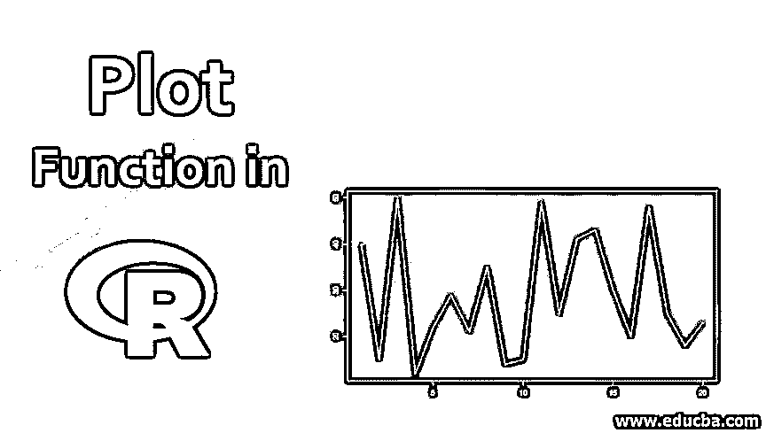
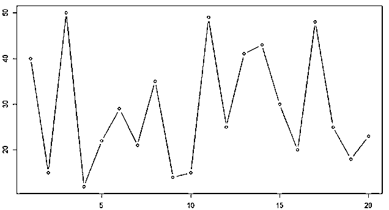

# R 中的绘图函数

> 原文：<https://www.educba.com/plot-function-in-r/>

## R 中的绘图功能概述

R 语言中的 Plot 函数是一个基本函数，用于创建可视化的图形和图表。在 R 编程语言中，它被实现为 plot()。plot 函数支持各种各样的函数参数，用于不同的场景和要传递给它的对象类型。R graphics package 中的 Plot 函数主要用于开发二维图形，以分析数据集分布或可视化数据变量之间的相关性。散点图和折线图是探索性数据分析的一些常用图表，它们是使用 r。

### R 中绘图函数的语法

Rstudio 中绘图的通用语法是:

<small>Hadoop、数据科学、统计学&其他</small>

`Plot(x,y,…)`

它的完整语法是:

`plot(x, y, type, main, sub,  xlab, ylab)`

" **x** 为我们提供了数据点，我们将使用上面的语法来绘制这些数据。有时 X 中的数据对于绘图来说是自给自足的，不需要任何其他变量。

" **y** 也为我们提供数据，我们用 X 变量数据绘制它。

情节是不同种类的。

Type 命令用于传递代码，例如我们需要哪种类型的绘图。

### 不同类型的绘图功能

图的类型有:

*   “p”:用于点绘图
*   “l”:用于线条图
*   “b”:用于单点绘图和线绘图
*   “c”:用于通过线条连接空点
*   “o”:用于线和过度绘制点
*   “h”:用于“直方图”
*   “s”:用于楼梯台阶
*   “n”:用于不绘图

对于情节的标题，我们必须通过“主”语法。同样，对于情节的副标题，我们必须传递“sub”语法。

如果 x 轴和 y 轴没有标记，该图就没有用。对于标注，我们将使用语法“xlab”表示 x 轴图例，使用“ylab”表示 y 轴图例。

### 数据集的绘图函数示例

这些图的基本示例如下:

#### 案例 1

我们有 10 班至两个不同班级的 20 名学生的成绩。x 是 10 级 A 段，Y 是 10 级 b 段。

X = 40，15，50，12，22，29，21，35，14，15，49，25，41，43，30，20，48，25，18，23

Y = 41，42，32，14，42，27，13，50，33，22，31，30，49，25，40，39，14，37，15，50

*   来看看 10 班 a 段的线图。

`X = c(40, 15, 50, 12, 22, 29, 21, 35, 14, 15, 49, 25, 41, 43, 30, 20, 48, 25, 18, 23)
plot(X ,type = "l")`
T2】

*   让我们看看 10 班 b 区的线图。

`Y = c(41, 42, 32, 14, 42, 27, 13, 50, 33, 22, 31, 30, 49, 25, 40, 39, 14, 37, 15, 50)
plot(Y, type = "l")`
T2】

*   来看看 10 班 a 段的点图。

`X = c(40, 15, 50, 12, 22, 29, 21, 35, 14, 15, 49, 25, 41, 43, 30, 20, 48, 25, 18, 23)> plot(X ,type = "p")`
T2】

*   让我们看看 10 班 b 区的点图。

`Y = c(41, 42, 32, 14, 42, 27, 13, 50, 33, 22, 31, 30, 49, 25, 40, 39, 14, 37, 15, 50)> plot(Y, type = "p")`
T2】

最后，我们可以看到这两个截面的点和线的混合。

**10 班第一节**
`X = c(40, 15, 50, 12, 22, 29, 21, 35, 14, 15, 49, 25, 41, 43, 30, 20, 48, 25, 18, 23)> plot(X ,type = "b")`

**10 级 B 段**

`Y = c(41, 42, 32, 14, 42, 27, 13, 50, 33, 22, 31, 30, 49, 25, 40, 39, 14, 37, 15, 50)> plot(Y, type = "b")`
T2】

#### 案例 2

让我们考虑这样一种情况，我们必须绘制提供一个类的标记的数据。班上有 50 名学生。在这种情况下，我们将看到如何添加轴的名称，标题和所有。

| **卷号** | **标记** |
| One | Forty-three |
| Two | Fifty-five |
| Three | Sixty-two |
| Four | Eighty-six |
| Five | Ninety-nine |
| Six | Forty-three |
| Seven | Seventy-six |
| Eight | Twenty-nine |
| Nine | Eighty-four |
| Ten | Fifty-eight |
| Eleven | Sixty-eight |
| Twelve | Fifty-six |
| Thirteen | Eighty-nine |
| Fourteen | Thirty-one |
| Fifteen | Twenty |
| Sixteen | Seventy-seven |
| Seventeen | Seventy-five |
| Eighteen | Ninety-four |
| Nineteen | Sixty-one |
| Twenty | Thirty-five |
| Twenty-one | Fifty-four |
| Twenty-two | Forty-one |
| Twenty-three | Sixty-three |
| Twenty-four | Thirty-two |
| Twenty-five | Seventy-three |
| Twenty-six | Fifty-eight |
| Twenty-seven | Twenty-six |
| Twenty-eight | Forty-five |
| Twenty-nine | Sixty |
| Thirty | Eighty-one |
| Thirty-one | Fifty-two |
| Thirty-two | Twenty-nine |
| Thirty-three | Forty-eight |
| Thirty-four | Thirty-six |
| Thirty-five | Fifty-one |
| Thirty-six | Fifty-three |
| Thirty-seven | Ninety-nine |
| Thirty-eight | Twenty |
| Thirty-nine | Fifty-seven |
| Forty | Twenty-eight |
| Forty-one | Sixty-four |
| Forty-two | Thirty-nine |
| Forty-three | Fifty-nine |
| Forty-four | Thirty-one |
| Forty-five | Eighty-four |
| Forty-six | Seventy-six |
| Forty-seven | Twenty-eight |
| Forty-eight | Seventy-four |
| Forty-nine | Sixty-eight |
| Fifty | Sixty-four |

现在我们必须在图中呈现这些数据。

**Note:** Code, in this case, is based on the situation where the data is in excel, by doing this I like to showcase how we upload the data into R and process it if we have to make a plot out of it.

`plot_data = read.csv("Plots in R.csv",header = TRUE) > plot(plot_data$Roll.number, plot_data$Marks, type = "p", xlab = 'Marks', ylab = 'Roll Number')`

在这个图中，我们可以看到书名。在 x 轴上，我们有标记，在 y 轴上我们有卷数。就像在同一行上，我们可以添加情节的标题，我们将在下面的代码中看到。

`plot(plot_data$Roll.number, plot_data$Marks, type = "p", xlab = 'Marks', ylab = 'Roll Number', main = 'Result')`
T2】

### R 函数中 Plot 的优势

剧情优势:

*   以建设性的方式向利益相关者传达调查结果。
*   容易理解
*   人脑处理视觉信息比处理书面信息更容易。
*   快速获取相关信息
*   轻松识别最新趋势
*   对数据的简单理解

### 结论

可以获得大量的数据。将数据转换成能提供一些有意义见解的结构并不容易。将数据转换成精确和有意义的格式的最佳结构之一是绘图(如果我们用大的“可视化”来说)。如果研究人员、数据科学家、经济学家想要展示任何数据，他们总是更喜欢图表。情节很容易理解，从情节中获得的知识可以在头脑中持续很长时间。

如果你认为有太多的数据，你想把从这些数据中学到的东西传递给你的观众，最好的方法就是使用图表。你必须采取的唯一预防措施是找到哪种类型的图最适合你的数据点。一旦找到了正确的类型，编写代码或语法就不难了。

### 推荐文章

这是一个 R 中绘图函数的指南。这里我们讨论 R 中绘图函数的介绍、语法、绘图的例子和它们的类型以及优点。您也可以浏览我们推荐的其他文章，了解更多信息——

1.  [R Boxplot labels](https://www.educba.com/r-boxplot-labels/)
2.  [Matlab 中的分段函数](https://www.educba.com/piecewise-function-in-matlab/)
3.  [Matlab 中的滤波函数](https://www.educba.com/filter-function-in-matlab/)
4.  [R 中的散点图](https://www.educba.com/scatterplots-in-r/)
5.  [MATLAB 绘图功能完整指南](https://www.educba.com/matlab-plot-function/)

