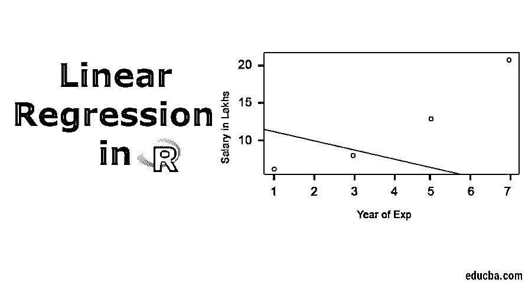
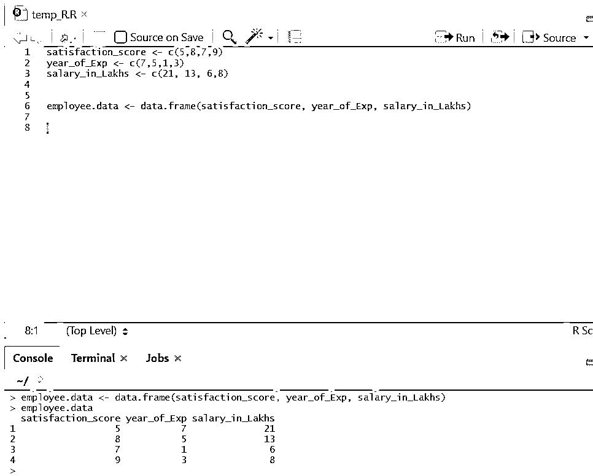
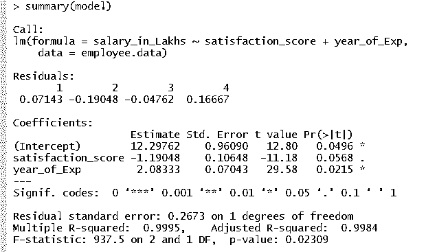
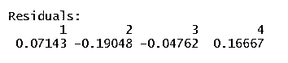
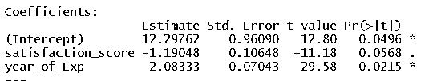
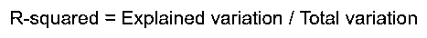
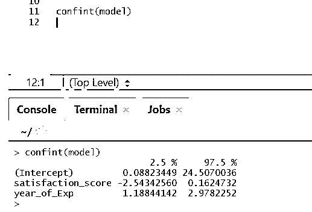
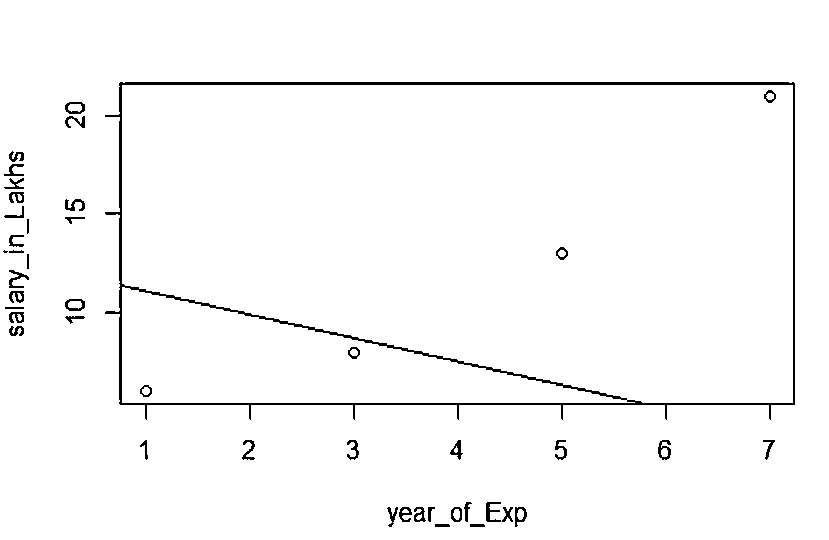

# R 中的线性回归

> 原文：<https://www.educba.com/linear-regression-in-r/>

## R 中的线性回归是什么？

R 中的线性回归是一种无监督的机器学习算法。r 语言有一个名为 lm()的内置函数，用于评估和生成用于分析的线性回归模型。R 中的回归模型通过使用一个或多个预测变量作为 x 来表示一个变量(称为连续变量 Y 的结果)之间的关系。它为数据点的二维轴视图生成一个直线方程。基于数据集的质量，R 中的模型为模型准确性生成更好的回归系数。使用 R 的模型可以是用于预测特定产品范围的组织下一季度的销售收入的良好拟合机器学习模型。

R 中的线性回归可以分为两类。

<small>Hadoop、数据科学、统计学&其他</small>

#### **1。简单线性回归**

这是一种回归，其中输出变量是单个输入变量的函数。简单线性回归的表示:

y = c0 + c1*x1

#### 2.多元线性回归

这是一种回归，其中输出变量是多输入变量的函数。

y = c0 + c1*x1 + c2*x2

在上述两种情况下，c0、c1、c2 是代表回归权重的系数。

### R 中的线性回归

r 是一个非常强大的统计工具。所以让我们看看它在 R 中是如何执行的，以及它的输出值是如何解释的。现在，让我们准备一个数据集来深入执行和理解回归。

#### 

现在我们有了一个数据集，其中“满意度得分”和“年支出”是独立变量。“年薪十万卢比”是输出变量。

参考上述数据集，我们希望通过线性回归解决的问题是:

根据员工一年的工作经验和对公司的满意度对其工资的评估。

**R 代码:**

`model <- lm(salary_in_Lakhs ~ satisfaction_score + year_of_Exp, data = employee.data)
summary(model)`

**上述代码的输出将是:**

#### 回归公式变成了

y = 12.29-1.19 *满意度得分+2.08×2 *年支出

如果模型有多个输入。

那么 R 代码可以是:

`model <- lm(salary_in_Lakhs ~ ., data = employee.data)`

但是，如果有人想从多个输入变量中选择一个变量，有多种技术，如“[后向淘汰](https://www.educba.com/backward-elimination/)”、“前向选择”等。也可以做到这一点。

### R 中线性回归的解释

以下是 r 中的一些解读，具体如下:

#### 1.残差

这是指模型的实际响应和预测响应之间的差异。所以对于每个点，都会有一个实际响应和一个预测响应。因此，残差将和观测值一样多。在我们的例子中，我们有四个观测值，因此有四个残差。

#### 2.系数

再往前，我们会看到系数部分，它描述了截距和斜率。如果一个人想根据他的经验和满意度得分来预测员工的工资，他需要开发一个基于斜率和截距的模型公式。这个公式将有助于你预测薪水。截距和斜率有助于分析师提出最适合数据点的模型。

**斜率:**描绘直线的陡度。
**截距:**直线与轴线相交的位置。

我们来了解一下基于斜率和截距的公式形成是如何完成的。

假设截距为 3，斜率为 5。

所以，公式是 **y = 3+5x。这意味着如果 x 增加一个单位，y 就会增加 5。**

**a .系数——估计:**在此，截距表示所有输入变为零时输出变量的平均值。因此，在我们的情况下，考虑到满意度得分和经验为零，平均工资为 12.29 万卢比。这里斜率代表输入变量单位变化时输出变量的变化。

**b .系数——标准误差:**标准误差是在计算我们的响应变量的实际值和预测值之间的差值时，我们可以得到的误差估计值。反过来，这说明了相关输入和输出变量的置信度。

**c .系数–t 值:**该值给出了拒绝零假设的置信度。远离零的值越大，拒绝零假设并在输出和输入变量之间建立关系的置信度就越大。在我们的例子中，值也远离零。

**d . Coefficient–Pr(>t):**这个缩写基本上描述了 p 值。它越接近零，我们就越容易拒绝零假设。我们看到的这条线，这个值接近于零；我们可以说，薪酬待遇、满意度和工作年限之间存在着一定的关系。

### 多重 R 平方、调整 R 平方

R-squared 是一种非常重要的统计方法，用于了解数据与模型的拟合程度。因此，在我们的案例中，我们的线性回归模型代表数据集的好坏。

r 平方值始终介于 0 和 1 之间。公式为:

该值越接近 1，模型对数据集及其方差的描述就越好。

然而，当不止一个输入变量出现时，调整后的 R 平方值是首选。

#### f 统计量

这是确定输入和响应变量之间关系的一种强有力的方法。该值大于 1 时，输入和输出变量之间关系的可信度越高。

在我们的例子中，它是“937.5”，考虑到数据的大小，它相对较大。因此，拒绝零假设变得更容易。

如果有人想知道模型系数的置信区间，可以这样做

#### 

### 回归可视化

**R 代码:**

`plot(salary_in_Lakhs ~ satisfaction_score + year_of_Exp, data = employee.data)
abline(model)`

在拟合模型之前，收集越来越多的点总是更好的。

### 结论

线性回归简单、易于拟合、易于理解，但却是一个非常强大的模型。我们看到了如何对 r 执行线性回归。我们还尝试解释结果，这可以帮助您优化模型。一旦你习惯了简单的线性回归，你应该尝试多元线性回归。与此同时，由于线性回归对异常值很敏感，在直接进行线性回归拟合之前，必须对其进行研究。

### 推荐文章

这是一个 R 中线性回归的指南，在这里，我们讨论了什么是 R 中的线性回归？r 的分类、可视化和解释。您还可以浏览我们推荐的其他文章，了解更多信息——

1.  [预测建模](https://www.educba.com/predictive-modeling/)
2.  [R 中的逻辑回归](https://www.educba.com/logistic-regression-in-r/)
3.  [R 中的决策树](https://www.educba.com/decision-tree-in-r/)
4.  [R 面试问题](https://www.educba.com/r-interview-questions/)

