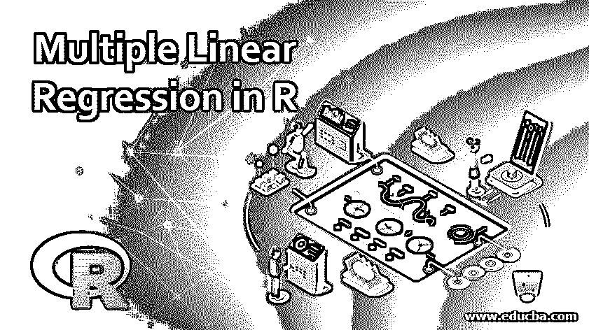
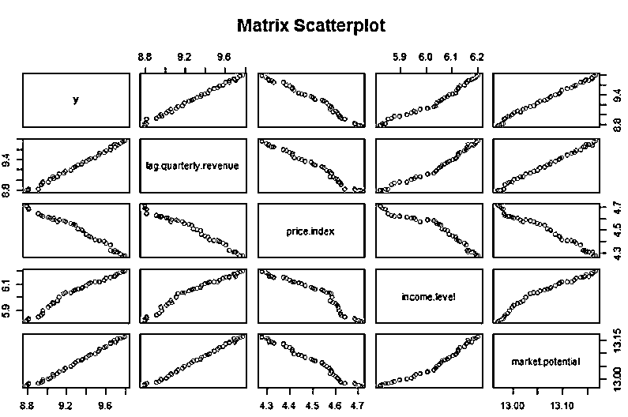
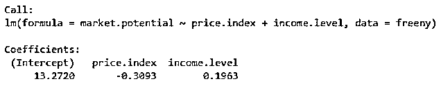
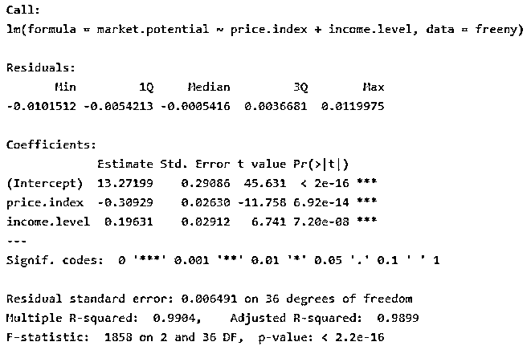

# R 中的多元线性回归

> 原文：<https://www.educba.com/multiple-linear-regression-in-r/>

## 多元线性回归导论

多元线性回归是发现大型数据集中变量之间隐藏模式和关系的数据挖掘技术之一。多元线性回归是回归方法之一，属于预测挖掘技术。它用于发现关系，并假设目标和预测值之间的线性关系。然而，它们之间的关系并不总是线性的。因此，重要的是确定一种统计方法来拟合数据，并可以用来发现无偏的结果。多元线性回归是线性回归的扩展版本，它允许用户确定两个或多个变量之间的关系，而不像线性回归那样只能用于确定两个变量之间的关系。在这个主题中，我们将学习 r 中的多元线性回归。

**语法**

<small>Hadoop、数据科学、统计学&其他</small>

Lm()函数是多元回归语法中使用的基本函数。该函数用于建立预测变量和响应变量之间的关系。

`lm( y ~ x1+x2+x3…, data)`

公式表示响应变量和预测变量之间的关系，数据表示公式所应用的向量。

对于有两个或更多预测因子和单个响应变量的模型，我们保留术语多元回归。也有回归模型，有两个或两个以上的反应变量。这种模型通常被称为多元回归模型。现在让我们看看多重回归模型适用的实时例子。

例如，房子的销售价格将取决于位置的可取性，卧室的数量，浴室的数量，建造年份，以及其他一些因素。孩子的身高可能取决于母亲的身高、父亲的身高、饮食和环境因素。

现在让我们看看多元线性回归的一般数学方程

`Y= a + b1x1 + b2x2 +…bnxn`

*   其中 Y 代表响应变量
*   a、b1、b2 和 bn 是系数
*   x1、x2 和 xn 是预测变量。

### R 中多元线性回归的例子

当用两个以上的预测器构建原型时，可以使用 lm()方法。本质上，人们可以不断地向公式语句中添加另一个变量，直到它们都被考虑在内。在本节中，我们将使用 R studio 中可用的 freeny 数据库来理解具有两个以上变量的预测模型之间的关系。该模型试图借助费率指数和收入水平来预测市场潜力。

#### 示例# 1–收集和捕获 R 中的数据

在这个例子中，我们使用了 r 中的内置数据，在现实场景中，可能需要从 CSV 文件中导入数据。这可以使用 read.csv 轻松完成。

**语法**:read . csv(" CSV 文件真实世界的路径\ \文件名. CSV ")

#### 示例 2–检查线性度

在应用线性回归模型之前，必须验证多个因素并确保假设得到满足。最重要的是，必须确保数据集中的变量之间存在线性关系。检查线性的最快方法之一是使用散点图。

在我们的数据集中，市场潜力是因变量，而比率、收入和收益是自变量。现在让我们看看建立这些变量之间关系的代码。

`# extracting data from freeny database
data("freeny")
# plotting the data to determine the linearity
plot(freeny, col="navy", main="Matrix Scatterplot")`

**输出:**

从上面的散点图中，我们可以确定数据库中的变量是线性的。

`# Constructing a model that predicts the market potential using the help of revenue price.index
and income.level
> model <- lm(market.potential ~ price.index + income.level, data = freeny)
> model`

**输出:**

上面的示例代码显示了如何构建一个带有两个预测器的线性模型。在这个例子中，价格指数和收入水平是两个

用于预测市场潜力的预测指标。根据上面的输出，我们已经确定截距是 13.2720，即

比率指数系数为-0.3093，收入水平系数为 0.1963。因此，完整的回归方程是市场

潜力= 13.270+(-0.3093)* price . index+0.1963 *收入水平。

`model <- lm(market.potential ~ price.index + income.level, data = freeny)
model
using summary(OBJECT) to display information about the linear model
summary(model)`

**输出:**

### 汇总评估

#### 1.调整后的 R 平方

该值反映了模型的拟合程度。值越高，拟合越好。我们数据集的调整后的 R 平方值是 0.9899

#### 2.p 值

使用 R 的大多数分析依赖于使用称为 p 值的统计来确定我们是否应该拒绝零假设或

拒绝失败。假设零假设有效，p 值被表征为获得 a 的概率

与实际观察到的数据相等或更极端的结果。从外部数据得出的 p 值 0.9899 被认为是

具有统计学意义。

#### 3.Std。错误

标准误差是指标准偏差的估计值。标准误差系数计算出

模型决定了系数的不确定值。系数标准误差总是正的。人们可以用这个系数

计算系数计算精度的标准误差。

分析师不应该像律师那样在分析数据时处理工作。换句话说，研究者不应该

寻找有意义的影响和实验，而是像一个独立的调查者使用证据线来找出

给定可用数据、图形分析和统计分析，什么最有可能是真的。

### 结论

在本文中，我们看到了多元线性回归模型如何在两个或更多自变量的帮助下预测因变量的值。示例中考虑了初始线性测试，以满足线性要求。由于变量之间具有线性关系，我们进一步发展了多元线性回归模型。我们能够借助预测变量(即利率和收入)来预测市场潜力。

### 推荐文章

这是 r 中多元线性回归的指南，这里我们讨论如何利用多元线性回归模型预测因变量的值。您也可以阅读以下文章，了解更多信息——

1.  [R 中的线性模型](https://www.educba.com/linear-model-in-r/)
2.  [R 程序功能](https://www.educba.com/functions-in-r/)
3.  [什么是回归？](https://www.educba.com/what-is-regression/)
4.  [统计分析回归](https://www.educba.com/statistical-analysis-regression/)
5.  [什么是线性回归？](https://www.educba.com/what-is-linear-regression/)

