# R 中的泊松回归

> 原文：<https://www.educba.com/poisson-regression-in-r/>

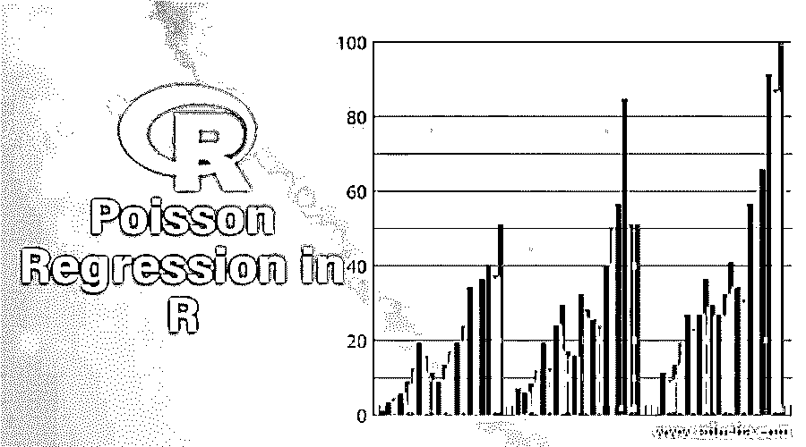

## R 中泊松回归的介绍

R 中的泊松回归是一种回归分析模型，用于预测分析，其中有多个可计数的预期可能结果。r 语言提供了计算和评估泊松回归模型的内置函数。泊松回归有助于通过使用一个或多个解释变量 x 来预测响应变量 Y 的值。这是一种离散类型的首选概率分布。泊松回归模型的一个用例是预测在一个组织的特定时间范围内将转化为客户的销售线索的数量。

### 实施泊松回归

我们现在将继续了解如何应用该模型。下一节给出了一步一步的过程。在这个演示中，我们考虑来自“远方”包的“gala”数据集。它与加拉帕戈斯群岛的物种多样性有关。数据集中总共有 7 个变量。我们将使用泊松回归来定义植物物种数与数据集中其他变量之间的关系。

<small>Hadoop、数据科学、统计学&其他</small>

1.首先加载“远方”包。如果软件包不存在，使用 install.packages()函数下载它。

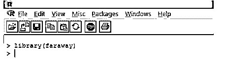

2.一旦加载了包，就使用 data()函数将“gala”数据集加载到 R 中，如下所示。

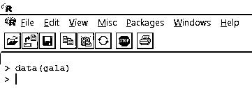

3.加载的数据应该可视化，以研究变量并验证是否有任何差异。我们可以使用 head()函数来可视化整个数据或者只是前几行，如下图所示。

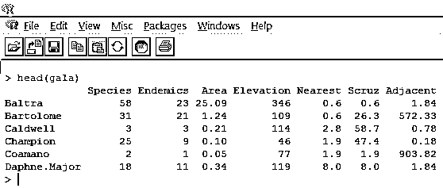

4.为了更深入地了解数据集，我们可以使用 R 中的帮助功能，如下所示。它生成 R 文档，如下面的屏幕截图之后的屏幕截图所示。

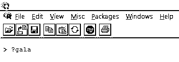

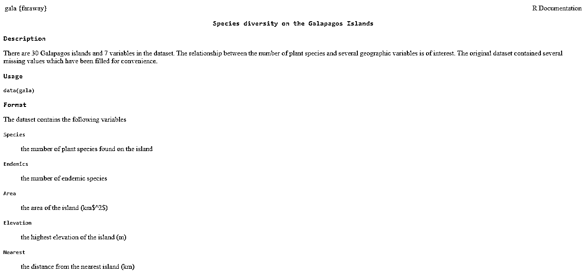

5.如果我们按照前面的步骤研究数据集，那么我们可以发现物种是一个响应变量。我们现在将研究预测变量的基本概要。

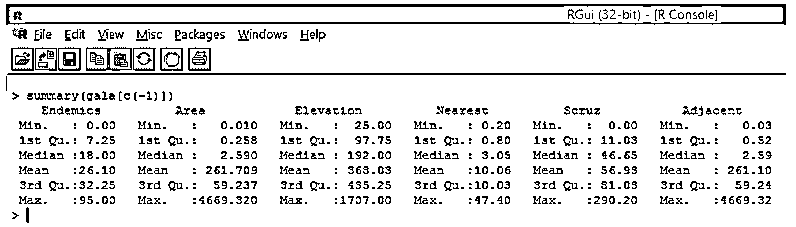

注意，从上面可以看出，我们已经排除了可变物种。汇总功能为我们提供了基本的见解。只要观察这些变量的中值，我们就可以发现，就值的范围而言，前半部分和后半部分之间存在巨大差异，例如，面积变量的中值为 2.59，但最大值为 4669.320。

6.现在我们已经完成了基本分析，我们将为物种生成一个直方图，以检查变量是否遵循泊松分布。如下图所示。

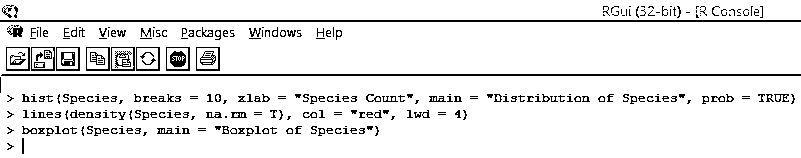

上面的代码为物种变量生成一个直方图，并在其上叠加一条密度曲线。

上面的可视化显示，物种遵循泊松分布，因为数据是右偏的。我们还可以生成一个箱线图，以便更深入地了解分布模式，如下所示。

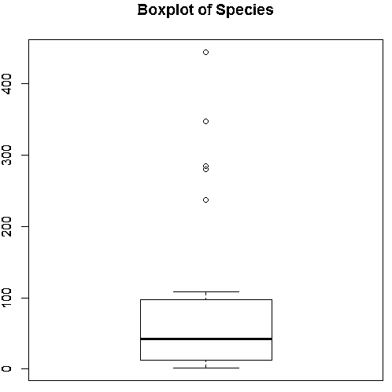

7.完成初步分析后，我们现在将应用泊松回归，如下所示

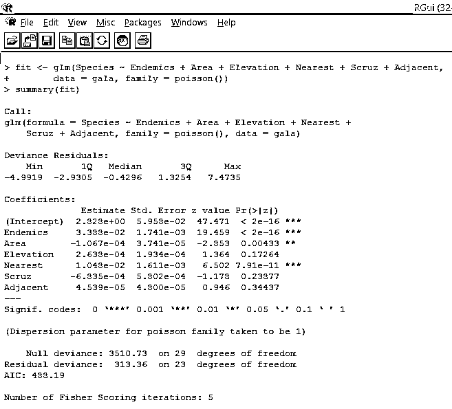

基于上述分析，我们发现变量地方病，面积和最近的是显着的，只有他们的包含足以建立正确的泊松回归模型。

8.我们将建立一个修正的泊松回归模型，只考虑三个变量，即。地方病、地区和最近的。让我们看看我们得到了什么结果。

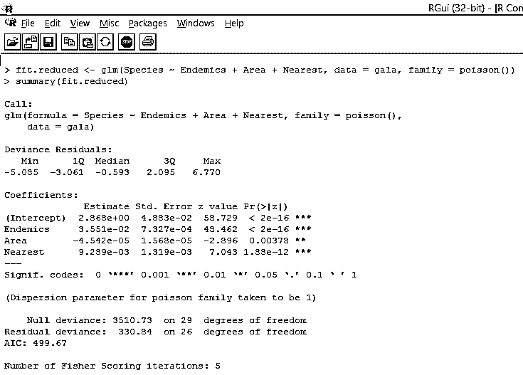

输出产生偏差、回归参数和标准误差。我们可以看到，每个参数在 p < 0.05 的水平上是显著的。

9.下一步是解释模型参数。可以通过检查上述输出中的系数或使用 coef()函数来获得模型系数。

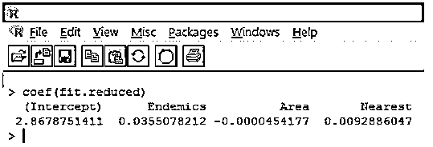

在泊松回归中，因变量被建模为条件均值 loge(l)的对数。地方病的回归参数 0.0355 表明，在其他变量保持不变的情况下，变量每增加一个单位，物种对数平均数就会增加 0.04。当每个预测因子等于零时，截距是物种的对数平均数。

10.然而，用因变量的原始标度(物种数，而不是物种对数)来解释回归系数要容易得多。系数的幂将允许容易的解释。这是按如下方式完成的。

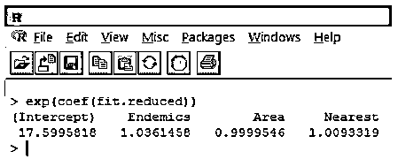

根据上述发现，我们可以说，面积每增加一个单位，预期物种数就增加 0.9999 倍，而以特有物种为代表的特有物种数每增加一个单位，物种数就增加 1.0361 倍。泊松回归最重要的一点是指数参数对响应变量的影响是乘法而不是加法。

11.使用上述步骤，我们获得了预测加拉帕戈斯群岛植物物种数量的泊松回归模型。然而，检查过度分散是非常重要的。在泊松回归中，方差和均值是相等的。

当观察到的响应变量的方差大于泊松分布预测的方差时，就会出现过度离散。分析过度离散变得很重要，因为它在计数数据中很常见，并且会对最终结果产生负面影响。在 R 中，可以使用“qcc”包来分析过度分散。分析如下图所示。

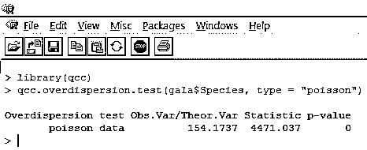

上述显著性检验显示 p 值小于 0.05，这强烈表明存在过度分散。我们将尝试使用 glm()函数拟合模型，将 family = "Poisson "替换为 family = "quasipoisson "。如下图所示。

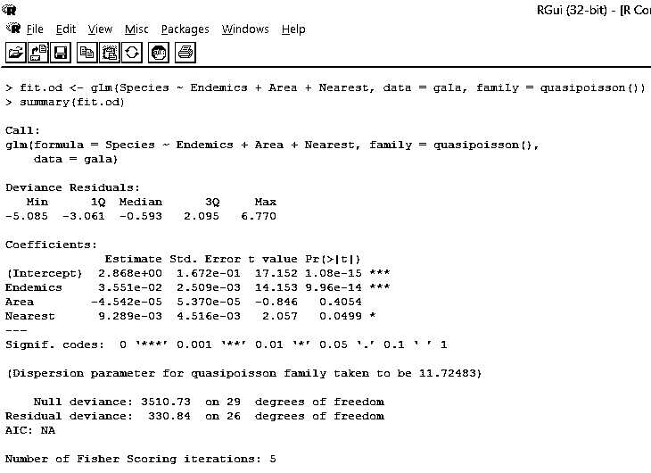

仔细研究上述输出，我们可以看到，准泊松方法中的参数估计与泊松方法产生的参数估计相同，尽管两种方法的标准误差不同。此外，在这种情况下，对于面积，p 值大于 0.05，这是由于较大的标准误差。

### 泊松回归的重要性

*   R 中的泊松回归对于正确预测离散/计数变量非常有用。
*   它帮助我们识别那些对响应变量有统计显著影响的解释变量。
*   R 中的泊松回归最适合于“罕见”性质的事件，因为它们往往遵循泊松分布，而普通事件通常遵循正态分布。
*   它适用于响应变量为小整数的情况。
*   它有广泛的应用，因为离散变量的预测在许多情况下是至关重要的。在医学上，它可以用来预测药物对健康的影响。它在生存分析中大量使用[，如生物有机体的死亡、机械系统的故障等。](https://www.educba.com/survival-analysis-in-r/)

### 结论

泊松回归是基于泊松分布的概念。它是回归技术中的另一类，结合了线性回归和逻辑回归的特性。然而，与仅生成二进制输出的逻辑回归不同，它用于预测离散变量。

### 推荐文章

这是 r 中泊松回归的指南，这里我们讨论实现泊松回归的介绍和泊松回归的重要性。您也可以浏览我们推荐的其他文章，了解更多信息——

1.  [GLM 在 R](https://www.educba.com/glm-in-r/)
2.  [R 中的随机数发生器](https://www.educba.com/random-number-generator-in-r/)
3.  [回归公式](https://www.educba.com/regression-formula/)
4.  [R 中的逻辑回归](https://www.educba.com/logistic-regression-in-r/)
5.  [线性回归与逻辑回归|最大差异](https://www.educba.com/linear-regression-vs-logistic-regression/)
6.  [学习机器学习中回归的概念](https://www.educba.com/regression-in-machine-learning/)
7.  [Matlab 中的箱线图指南](https://www.educba.com/boxplot-in-matlab/)

