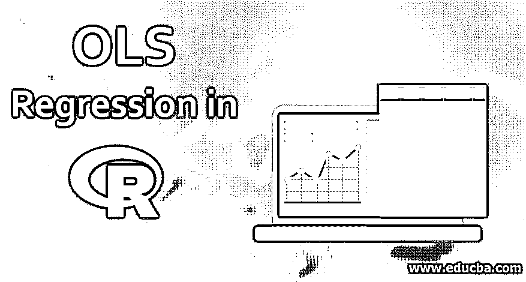

# R 中的 OLS 回归

> 原文：<https://www.educba.com/ols-regression-in-r/>

## R 中的 OLS 回归介绍

R 中的 OLS 回归是基于普通最小二乘计算方法的标准回归算法。OLS 回归可用于通过使用一个或多个自变量 x 来分析一个因变量 Y 的预测值。R 语言提供了内置函数来生成 OLS 回归模型并检查模型的准确性。诸如 lm()之类的 R 函数用于创建 OLS 回归模型。如果模型生成一个直线方程，它类似于线性回归。OLS 回归是一个很好的适合数值数据集的机器学习模型。

二元回归采用以下方程的形式。

<small>Hadoop、数据科学、统计学&其他</small>

**方程式:**

`y = mx + c`

*   y =是因变量
*   m =坡度(斜率)
*   x =独立变量
*   c =截距

当斜率和系数最适合时，OLS 线性侵略允许我们通过改变预测值来预测响应变量的值。为了计算 R 中的斜率和截距系数，我们使用 lm()函数。我们需要输入五个变量来计算斜率和系数截距，它们是 x 和 y 的标准差、x 和 y 的平均值、x 和 y 变量之间的皮尔逊相关系数。

斜率和截距的数学公式如下。

**数学公式:**

`slope <- cor(x, y) * (sd(y) / sd(x))
intercept <- mean(y) - (slope * mean(x))`

为了确定两个数值之间的线性关系，我们使用了最适合此目的的散点图。散点图很容易帮助我们发现一段关系的强度和方向。要在 R 中执行 OLS 回归，我们需要将数据传递给 lm()和 predict()基本函数。我们还使用需要导入的 ggplot 2 和 dplyr 包。

### OLS 的实施

以下是我们需要遵循的一些 OLS 实施步骤:

**第一步:**通过 lm()函数实现 OLS，我们需要导入执行 OLS 回归所需的库。

**语法:**

`library(catools)`

Catools 库包含执行统计功能的基本工具。

**第二步:**导入所需的库后，我们导入执行线性回归所需的数据。下面是语法。

**语法:**

`data = read.csv(“path/filename”)`

我们使用上述语法导入数据，并将其存储在名为 data 的变量中。

**第三步:**数据导入后，我们通过 str()函数分析数据，该函数显示导入数据的结构。

**语法**:

`str(data)`

**第四步:**我们已经看到了数据的结构，我们将输出部分数据，以便我们对数据集有一个清晰的概念。

**语法:**

`head(data)`

**第 5 步:**了解均值、中值等统计特征以及标注数据非常重要。我们可以使用 summary()函数来查看标签和数据的完整摘要。

**语法:**

`summary(data)`

**步骤 6:** 现在，一旦我们完成了上述所有步骤。我们现在试图从数据中建立一个线性模型。我们从生成用于模拟和建模数据的随机数开始。

**语法:**

`set.seed(x)`

我们使用 seed()生成随机数，用于模拟和建模，其中 x 可以是生成值的任意随机数。

**第 7 步:**在我们对数据建模之前，重要的一步是将数据一分为二，一个是训练数据，另一个是测试数据。训练数据 75%，测试数据 25 %，构成了我们 100%的数据。这一步称为数据分割。

**语法:**

`data_split = sample.split(data, SplitRatio = 0.75)
training <- subset(data, data_split == TRUE)
test <-subset(data, data_split == FALSE)`

**第 8 步:**最后一步是使用 lm()函数实现一个线性数据模型。

**语法:**

`model <- lm(X1.1 ~ X0.00631 + X6.572 + X16.3 + X25, data = training)`

**第九步:**最后，我们通过一个汇总函数显示模型的汇总。

**语法:**

`Summary (model)`

### OLS 模型中使用的重要命令

这里我们将讨论关于 R 中 OLS 回归的一些重要命令，给出如下:

#### 1.读取数据

以下是读取数据所需的命令。

*   **read . csv:****T3】从 CSV 文件中读取数据。**
*   **read.table:** 从文本文件中读取数据。

#### 2.显示数据的命令

下面是显示数据所需的命令。

*   **Head():** 显示数据的前六行
*   **Str():** 显示变量及其数据类型的信息。
*   **Rename():** 通过函数重命名已有的变量。
*   **Names():** 显示变量的名称。
*   **Attach():** 用于附加数据，使变量搜索更容易。

#### 3.显示统计数据

下面是显示统计数据所需的命令。

*   **mean():** 计算变量 x 的平均值。
*   **median():** 计算变量 x 的中值
*   **sd(x):** 计算变量 x 的标准差
*   **cor(矩阵):**计算矩阵的相关性。

#### 4.图形命令

下面是显示图形数据所需的命令。

*   **Hist():** 为变量 x 创建直方图
*   **箱线图(x):** 为变量 x 创建箱线图。
*   **Plot(x):** 为 x 创建散点图。
*   **Stem(x):** 为变量 x 创建一个 Stem 图

### R 中的 OLS 诊断

以下是 R 语言中对 OLS 的一些诊断:

*   OLS 模型建立后，我们必须确保对建立的模型进行后评估分析。
*   我们使用诊断工具根据数据创建不同的图表，以检查这是哪种数据以及数据背后推动数据前进的力量。
*   异常值在数据中很重要，因为它被视为不寻常的观察值。
*   改变回归线斜率的能力称为杠杆。
*   数据的影响是杠杆和异常值的结合。

### 推荐文章

这是 r 中的 OLS 回归的指南。这里我们讨论 r 中的 OLS 回归的介绍和实现步骤以及它的重要命令。你也可以看看下面的文章来了解更多-

1.  [回归测试工具](https://www.educba.com/regression-testing-tools/)
2.  [简单线性回归](https://www.educba.com/simple-linear-regression/)
3.  [逆向工程工具](https://www.educba.com/reverse-engineering-tools/)
4.  [云安全工具](https://www.educba.com/cloud-security-tools/)
5.  [什么是回归？|类型](https://www.educba.com/what-is-regression/)
6.  [简单线性回归中 R |类相关分析](https://www.educba.com/simple-linear-regression-in-r/)
7.  [机器学习回归完全指南](https://www.educba.com/regression-in-machine-learning/)

