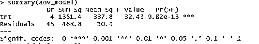
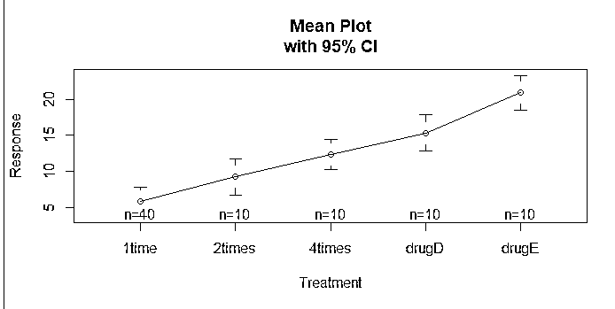
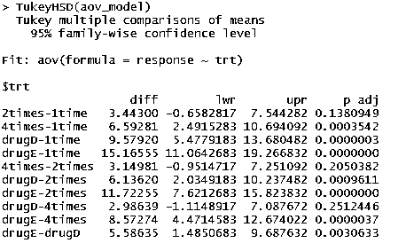
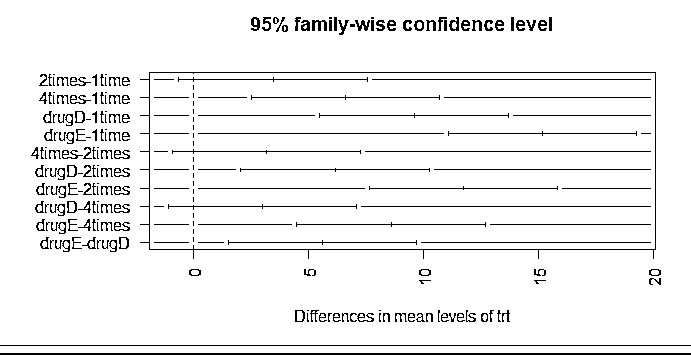
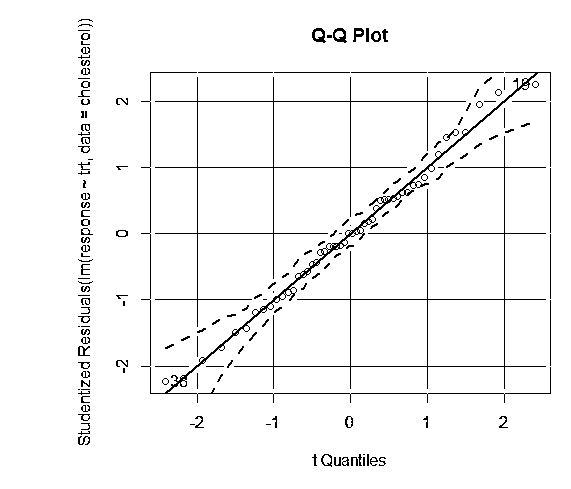
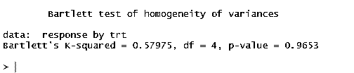
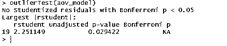
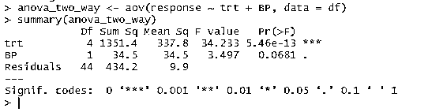

# R 中的方差分析

> 原文：<https://www.educba.com/anova-in-r/>

## R 中方差分析的介绍

R 中的 ANOVA 是一种由 R 编程促进的机制，用于实现 ANOVA 的统计概念，即方差分析，这是一种允许用户通过制定零假设和替代假设来检查各种人群中特定指标的平均值是否相等的技术，R 编程提供了有效的功能来通过各种函数和软件包实现该概念。

### 为什么是 ANOVA？

*   这种技术用于在分析多组数据时回答假设。有多种统计方法；然而，当需要对两个以上的独立组进行比较时，R 中的 ANOVA 是适用的，如在我们前面的例子中，三个不同的年龄组。
*   ANOVA 技术测量独立组的平均值，为研究者提供假设的结果。为了获得准确的结果，必须考虑每个个体组的样本均值、样本大小和标准偏差。
*   可以分别观察三组的平均值进行比较。然而，这种方法有局限性，可能证明是不正确的，因为这三种比较没有考虑全部数据，因此可能导致类型 1 错误。r 为我们提供了进行 ANOVA 分析的功能，以检查独立数据组之间的可变性。进行方差分析有五个阶段。在第一阶段，数据以 csv 格式排列，并为每个变量生成列。其中一列是因变量，剩下的一列是自变量。第二阶段，在 R studio 中读取数据并适当命名。在第三阶段，数据集被附加到单个变量上，并由内存读取。最后，定义并分析了 R 中的方差分析。在下面的部分中，我提供了几个应该使用 ANOVA 技术的案例研究例子。
*   六种杀虫剂分别在 12 块地里进行了测试，研究人员计算了每块地里残留的虫子数量。现在，农民们需要知道杀虫剂是否有作用，以及他们最好使用哪一种。您可以通过使用 aov()函数执行 ANOVA 来回答这个问题。
*   五十名患者接受了五种降胆固醇药物治疗(trt)中的一种。三种治疗条件涉及相同的药物，每天一次 20 毫克(1 次)，每天两次 10 毫克(2 次)，每天四次 5 毫克(4 次)。剩下的两个条件(drugD 和 drugE)代表竞争药物。哪种药物治疗产生了最大的胆固醇降低(反应)？

### R 中单向方差分析

*   单向法是应用方差分析的基本 ANOVA 技术之一，用于比较多个群体的平均值。
*   单向方差分析因单向分类数据的可用性而得名。在单因素方差分析中，可能有一个因变量和一个或多个自变量可用。
*   例如，我们将对胆固醇数据集执行 ANOVA 技术。数据集由两个变量 TRT(5 个不同水平的处理)和反应变量组成。自变量-药物治疗组，因变量-2 组或更多组方差分析的平均值。从这些结果中，您可以确认每天服用 4 次 5 毫克的剂量比每天服用一次 20 毫克的剂量更好。与药物 e 相比，药物 D 具有更好的效果

与药物 E 相比，如果以 20 mg 的剂量服用，药物 D 提供了更好的结果，

<small>Hadoop、数据科学、统计学&其他</small>

使用 multcomp 包中的胆固醇数据集。

**代码:**

`install.packages('multcomp')
library(multcomp)
str(cholesterol)
attach(cholesterol)
aov_model <- aov(response ~ trt)`

治疗的 ANOVA F 检验(trt)是显著的(p < .0001)，提供了五种治疗并不都同样有效的证据。

摘要(aov_model)
分离(胆固醇)

gplots 包中的 plotmeans()函数可用于生成组均值及其置信区间的图形。这清楚地显示了治疗差异。

**代码:**

`install.packages('gplots')
library(gplots)
plotmeans(response ~ trt, xlab="Treatment", ylab="Response",
main="Mean Plot\nwith 95% CI")`

**输出:**

让我们检查 TukeyHSD()的输出，看组平均值之间的成对差异。

TukeyHSD(aov_model)

1 次和 2 次的平均胆固醇降低彼此没有显著差异(p = 0.138)，而 1 次和 4 次之间的差异有显著差异(p < .001).
par(mar=c(5，8，4，2)) #增加左边界图(TukeyHSD(aov_model)，las = 2)

对结果的信心取决于您的数据满足统计测试所依据的假设的程度。在单因素方差分析中，因变量被假定为正态分布，并且在每组中具有相等的方差。您可以使用 Q-Q 图来评估正态假设库(car)。
Q-Q 图(lm(response ~ trt，data =胆固醇)，simulate =真，main="Q-Q 图"，labels =假)

虚线= 95%置信区间，表明正态假设得到了很好的满足。ANOVA 假设组或样本之间的方差相等。Bartlett 检验可以用来验证这个假设
bartlett.test(response ~ trt，data =胆固醇)。Bartlett 检验表明，五组的方差没有显著差异(p = 0.97)。

ANOVA 还对使用 car 包中的 outlierTest()函数的异常值测试敏感。您可能不需要运行此包来更新您的汽车库。
`update.packages(checkBuilt = TRUE)
install.packages("car", dependencies = TRUE)
library(car)
outlierTest(aov_model)`

从输出中，您可以看到胆固醇数据中没有异常值的迹象(当 p > 1 时出现 NA)。将 Q-Q 图、Bartlett 检验和异常值检验结合在一起，数据似乎非常符合 ANOVA 模型。

### R 中的双向方差分析

在双向方差分析测试中增加了另一个变量。当有两个自变量时，我们将需要使用双向方差分析，而不是在前面的情况中使用的单向方差分析技术，在前面的情况中，我们有一个连续的因变量和多个自变量。为了验证双向方差分析，需要满足多个假设。

*   独立观察的可用性
*   观察值应呈正态分布
*   观测值中的方差应该相等
*   异常值不应出现
*   独立误差

为了验证双向方差分析，另一个名为 BP 的变量被添加到数据集中。该变量表示患者的血压率。我们希望验证血压和给患者的剂量之间是否存在任何统计差异。

dfdf
anova_two_way<-aov(response ~ TRT+BP，data = df)
汇总(ANOVA _ two _ way)

从输出可以得出结论，trt 和 BP 在统计上均不同于 0。因此，可以拒绝零假设。

### R 中方差分析的益处

*   ANOVA 检验确定两个或多个独立组之间的平均值差异。这种技术对于市场分析中必不可少的多项目分析非常有用。使用 ANOVA 测试，可以从数据中获得必要的见解。
*   例如，在产品调查期间，从用户那里收集诸如购物清单、客户喜欢和不喜欢的多种信息。
*   方差分析测试有助于我们比较人群。该组可以是男性对女性，也可以是各种年龄组。方差分析技术有助于区分不同人群的平均值，它们确实是不同的。

### 结论

方差分析是假设检验最常用的方法之一。本文对接受降胆固醇药物治疗的 50 名患者的数据集进行了方差分析测试，并进一步了解了在有额外自变量的情况下如何进行双向方差分析。

### 推荐文章

这是 r 中方差分析的指南。这里我们讨论单向和双向方差分析模型以及各自的例子和方差分析的好处。您也可以浏览我们推荐的其他文章，了解更多信息——

1.  [回归与方差分析](https://www.educba.com/regression-vs-anova/)
2.  [什么是 SPSS？](https://www.educba.com/what-is-spss/)
3.  [如何使用 ANOVA 测试解释结果](https://www.educba.com/interpreting-results-using-anova/)
4.  [R 中的函数](https://www.educba.com/functions-in-r/)

