# R 中的单向方差分析

> 原文：<https://www.educba.com/one-way-anova-in-r/>

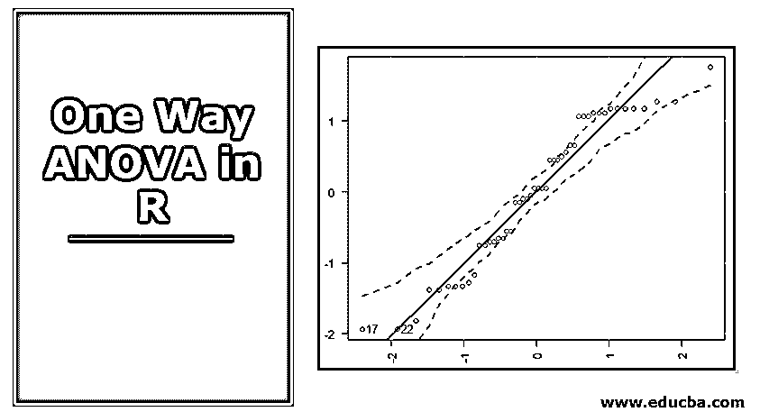

## 单向方差分析

统计概念，即 R 中的单向 ANOVA，在比较不同组的特定指标的平均值时证明是有用的，并且特别有助于仅分析因子或变量，具有与总体的正态分布、方差或标准差的相等性以及样本的随机和独立性质相关的某些假设，这些假设必须作为先决条件来遵循，R 编程为概念的实施提供了一套非常稳健和有效的方法，称为。

### 方差分析的假设

以下是应用单向方差分析时必须满足的假设:

<small>Hadoop、数据科学、统计学&其他</small>

*   从中抽取样本的总体是正态分布的。
*   从中抽取样本的总体具有相同的方差或标准差。
*   从不同人群中抽取的样本是随机和独立的。

### R 中的单向方差分析是如何工作的？

在我们的演示中，我们使用包含两个变量的数据，即品牌和销售。有四个品牌——ATB、JKV、MKL 和 PRQ。给出了这些品牌的月销售额。我们需要检查四个品牌的平均销售额是否相等，或者是否彼此不同。为了验证这一点，我们将使用单向方差分析。实施方差分析的逐步程序如下:

**1。**首先，将数据导入 r。数据以 CSV 格式呈现。因此，为了导入它，我们将使用 read.csv()函数。

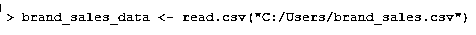

**2。**查看数据的前几条记录。这对于检查数据是否正确地导入到 r 中很重要。同样，我们将对数据应用 summary()函数，以获得对数据的基本了解。

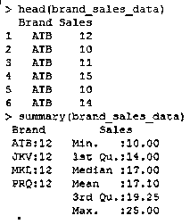

**3。**每次我们使用数据集变量时，都需要明确地提及数据集的名称，如 brand_sales_data$Brand 或 brand_sales_data$Sales。为了克服这个问题，我们将使用 attach 函数。该功能必须按如下方式应用。

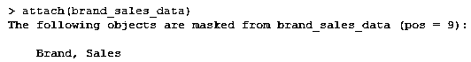

**4。**让我们使用平均值或标准差来汇总各品牌的销售额。聚合帮助我们获得数据的基本概念。

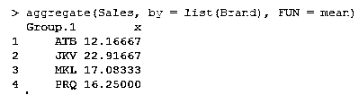

上述结果表明，四个不同组的平均值并不相等。JKV 的平均销售额最高。

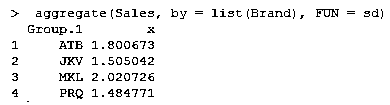

如上所示，四组的标准偏差没有显示出任何显著差异，MKL 品牌的标准偏差最高。

**5。**现在，我们将应用 ANOVA 来验证三个群体的平均值是否相等，或者是否存在任何差异。

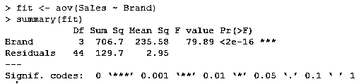

从上面的结果中，我们可以看到，由于 p < 0.0001，品牌的 ANOVA 测试是显著的。我们可以解释为，所有品牌在市场上的偏好水平并不相同，这影响了这些品牌在市场上的销售。这可能是由于许多因素和人们对特定品牌的喜好。

**6。上述结果可以形象化，并使解释变得容易。为此，我们将使用 gplots()库中的 plotmeans()函数。它的工作原理如下:**

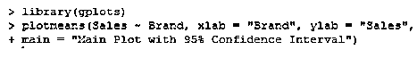

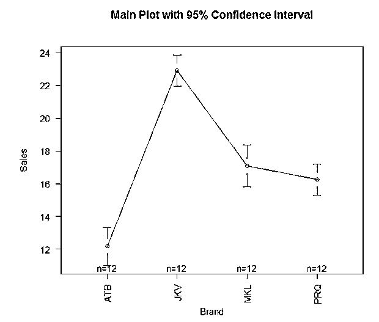

正如我们在上面看到的，gplots 包中的 plotmeans()函数使我们能够直观地比较不同组的平均值。我们可以看到，四个品牌的方法并不相同。然而，MKL 和 PRQ 品牌的平均值相差不大。

**7。**以上分析有助于我们检验品牌是否具有同等手段；然而，进行成对比较是困难的。我们可以使用 TukeyHSD()函数对不同的品牌进行成对比较，这有助于检查一个品牌是否与其他品牌有显著差异。

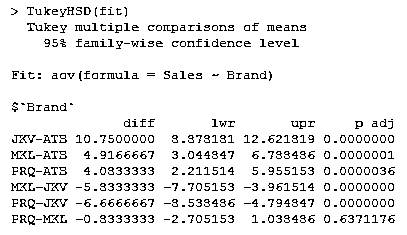

如上所述的成对比较。如果 p < 0.001，任何两组之间的差异都是显著的。正如我们在上面看到的，PRQ-MKL 对的 p 值要高得多，这表明这两个品牌彼此之间没有显著差异。

为了可视化成对比较，我们将把上述结果绘制如下:

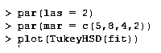

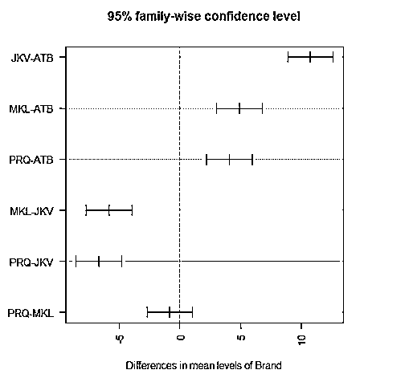

第一个 par 函数旋转轴标签，使其水平，第二个 par 语句调整边距，使标签合适。否则，他们将退出屏幕。

上图提供了很好的见解，但我们可以将结果绘制成箱线图，以获得更好的见解和更清晰的解释，如下所示。

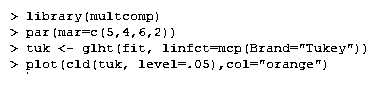

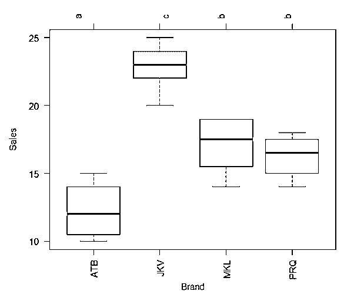

上面使用的 glht()函数提供了一套全面的方法来比较多个平均值。注意，cld()函数中的级别选项与显著性级别有关，例如 0.05 或 95%的置信度)

使用上面的图，可以很容易地比较各组的平均值，并促进系统的解释。在图的上方，每个品牌都有字母。如果两个品牌有相同的字母，他们没有明显不同的含义，因为品牌 MKL 和 PRQ 有相同的字母 b

**8。**到目前为止，我们实施了 ANOVA 并使用图来可视化结果。然而，测试假设也同样重要。首先，我们将验证正态假设。

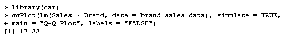

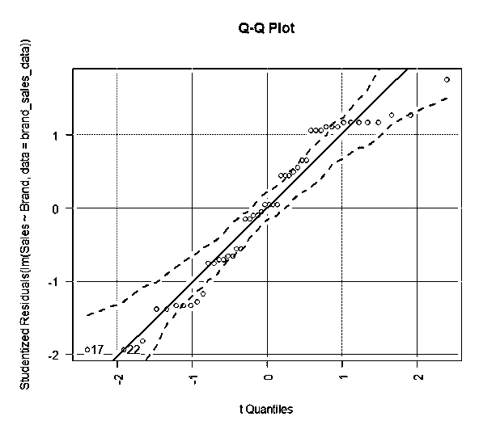

R 中的车包提供了函数 qqPlot()。上图显示数据落在 95%的置信范围内。这表明正态性假设几乎已经满足。

接下来，我们将验证不同品牌之间的差异是否相等。为此，我们将使用巴特利特的测试。

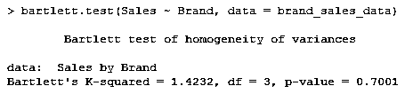

p 值显示组内的方差没有显著差异。

最后但同样重要的是，我们将检查是否有任何异常值影响方差分析结果。

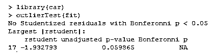

从上面的结果中，我们可以看到数据中没有异常值的迹象(当 p > 1 时出现 NA)

考虑到 QQ 图、Bartlett 检验和异常值检验的结果，我们可以说数据满足所有方差分析假设，并且获得的结果是有效的。

### 结论——R 中的单因素方差分析

ANOVA 是一种方便的统计技术，可用于比较多个群体的平均值。r 提供了一个全面的软件包来实现方差分析，得出结果和验证假设。在 R 中，统计结果可以以可视化的形式进行解释，从而提供更深入的见解。

### 推荐文章

这是一个单向方差分析的指南。在这里，我们讨论单向方差分析的工作原理和方差分析的假设。您也可以看看以下文章，了解更多信息–

1.  [R 编程语言](https://www.educba.com/r-programming-language/)
2.  [回归与方差分析](https://www.educba.com/regression-vs-anova/)
3.  [如何使用 ANOVA 测试解释结果](https://www.educba.com/interpreting-results-using-anova/)
4.  [GLM 在 R](https://www.educba.com/glm-in-r/)

