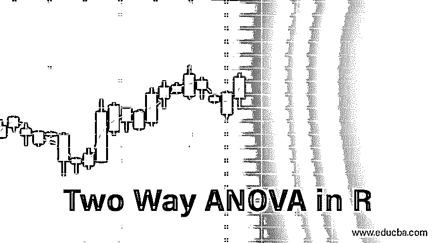

# R 中的双向方差分析

> 原文：<https://www.educba.com/two-way-anova-in-r/>

## R 中的双向方差分析概述

一种统计概念，有助于理解一个连续因变量和两个分类自变量之间的关系，通常通过制定无效假设和替代假设对来自不同人群的样本进行研究，并且某些考虑因素如与样本的独立性、正态分布、方差相等、异常值等相关。必须跟随感兴趣的变量，R 编程提供了非常有效的功能来利用该概念，称为双向 ANOVA，即 R 的双向方差分析。

**Note: **We need to transform our data if normality and equal variance is violated.

### R 中的双向方差分析示例

让我们对包含 48 行和 3 个数据变量的癌症水平数据集进行单向 ANOVA 检验:

<small>Hadoop、数据科学、统计学&其他</small>

耗时:动物的存活时间

不同级别的癌症 1-3

治疗:使用 1-3 种治疗方法

在测试之前，我们需要以下数据。

*   导入数据
*   删除不必要的变量
*   将变量(癌症级别)转换为有序级别。

下面是数据集。

意见:48 份

变量:3

存活时间 <dbl>0.31，0.45，0.46，0.43，0.36，0.29，0.40，0.23，0.22，0…</dbl>

癌症级别 <ord>1，1，1，1，2，2，2，2，3，3，3，3，1，1，1，2，2…</ord>

治疗 <fctr>A，A，A，A，A，A，A，A，A，A，A，B，B，B，B，B，…</fctr>

#### 目标

1.  **H₀:** 组间平均存活时间无变化
2.  **H₀:** 至少有一组的存活时间是不同的。

#### 步伐

*   检查癌症水平。我们可以看到三个字符值，因为我们用一个变异动词将它们转换成因子。

`levels(df$cancerlevels)
output: [1] "1" "2" "3"`

*   计算平均值和标准偏差

`df % > %
group_by(cancerlevels) % > %
summarise(
count_ cancerlevels = n(),
mean_time = mean(time, na.rm = TRUE),
sd_time = sd(time, na.rm = TRUE)
)`

**输出:**

提伯尔特:3 x 4

癌症级别计数 _ 癌症级别均值 _ 时间标清 _ 时间

<ord><int><dbl>T3】</dbl></int></ord>

1      1           16  0.617500 0.20942779

2      2           16  0.544375 0.28936641

3      3           16  0.276250 0.06227627

*   在第三步中，您可以图形化地检查分布之间是否有差异。请再次注意，您包括了抖动的点。
*   用 AOV 命令运行测试。

`aov(formula, data)
Arguments:
- formula: The equation you want to estimate
- data: The dataset used`

#### 语法:

y ~ X1+ X2+…+Xn (X1 + X2 +…指自变量)

y ~。将所有剩余变量作为独立变量

确保保存模型并打印摘要。

**代码**

*   aov(time ~ cancerlevels，data = df):使用以下公式运行 ANOVA 测试
*   summary (anova_one_way):打印测试摘要

Df Sum Sq Mean Sq F 值 Pr(>F)

癌症水平 2 1.033 0.5165 11.79 7.66e-05 ***

残差 45 1.972 0.0438

—

意义重大。代码:0 ' * * ' 0.001 ' * * ' 0.01 ' * ' 0.05 '0.1 ' ' 1

p 值低于阈值 0.05。在上述情况下，统计差异用“*”表示。

### R 中单向检验到双向方差分析

让我们看看如何将单向检验扩展到双向方差分析。该测试类似于单向方差分析，但公式不同，并在公式中添加了另一个组变量。

**y = x1 + x2**

*   **H0** :两个变量(因子变量)的均值相等
*   H3:这两个变量的平均值是不同的

您在我们的模型中添加了 treat 变量。该变量表示给予患者的治疗。您有兴趣了解癌症水平和患者接受的治疗之间是否存在统计相关性。

我们通过添加另一个自变量来调整代码。

Df Sum Sq Mean Sq F 值 Pr(>F)

癌症等级 2 1.0330 0.5165 20.64 5.7e-07 ***

治疗 3 0.9212 0.3071 12.27 6.7e-06 ***

残差 42 1.0509 0.0250

癌症水平和治疗在统计上均不同于 0。由此，我们可以拒绝零假设。此外，确认改变治疗或癌症类型会影响生存时间。

#### 试验

单因素方差分析:至少一组的 H3 平均值不同

双因素方差分析:两组的 H3 平均值不同。

### 单向和双向方差分析的区别

单向方差分析和双向方差分析的区别如下。

| **单向方差分析** | **双向方差分析** |
| 旨在实现 3 个或更多平均值之间的相等测试 | 旨在评估两个自变量对因变量的相互关系。 |
| 涉及一个独立变量 | 涉及两个独立变量 |
| 在 3 个或更多分类组中进行分析。 | 比较多组两个因素 |
| 必须满足两个原则——复制和随机化 | 它必须满足三个原则，即复制、随机化和局部控制。 |

### 双向方差分析的优点

一些优点如下。

*   在上面的例子中，我们例子中的年龄和性别有助于减少误差变化，使设计更有效。
*   双向方差分析使我们能够同时检验两个因素的影响。

### 方差分析的应用

下面列出了 ANOVA 的应用。

1.  比较不同车辆、燃料和道路类型的里程。
2.  了解温度、压力或化学浓度对某些化学反应(动力反应堆、化工厂等)的影响。)
3.  不同催化剂对化学反应速率的影响
4.  理解商业广告的影响和不同数量的顾客反应。
5.  生物学中性能、质量和速度制造的影响(基于细胞分裂数量的过程)

### 推荐文章

这是一个双向方差分析的指南。在这里，我们讨论的例子，目标，步骤，以及单向和双向方差分析之间的差异。您也可以看看以下文章，了解更多信息–

1.  [R 中的方差分析](https://www.educba.com/anova-in-r/)
2.  [如何使用 ANOVA 测试解释结果](https://www.educba.com/interpreting-results-using-anova/)
3.  [回归与方差分析](https://www.educba.com/regression-vs-anova/)
4.  [GLM 在 R](https://www.educba.com/glm-in-r/)

