# R 中的数组

> 原文：<https://www.educba.com/arrays-in-r/>

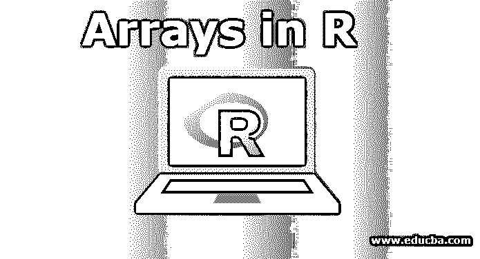

## R 中的数组介绍

R 中的数组是存储相似类型的数据以供处理的特性。它接受任意数量的元素进行存储。数组可以是一维或多维的。使用一维向量创建的数组称为一维数组。类似地，在 R 语言中用来存储数据的矩阵被认为是一个二维数组。数组提供了使用数组索引访问存储的数据元素的便利。在为多个数据元素开发数据处理时，R 语言中的数组是首选的编程组件。r 语言支持数组函数来构造数组和分配数据值。

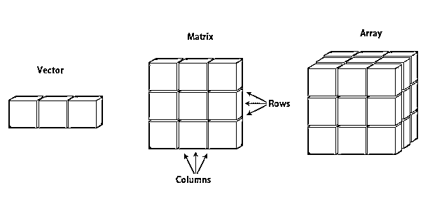

<small>Hadoop、数据科学、统计学&其他</small>

**图形表示:向量、矩阵、数组**

*   称为向量的一维数组。
*   称为矩阵的二维数组。

**语法:**

下面是数组的语法:

`Array_NAME <- **array**(data, dim = (row_Size, column_Size, matrices, dimnames)`

*   数据–数据是输入到数组的输入向量。
*   矩阵——这是指矩阵的维度。R 中数组可以是多维矩阵。
*   row _ Size–row _ Size 描述了一个数组将包含的行数。
*   column _ Size–column _ Size 描述数组将包含的列数。
*   dim names–该字段用于根据用户的意愿/偏好更改行和列的默认名称。

**属性:**

*   是同质的。这意味着它可以存储相同类型的数据。
*   它将数据存储在连续的内存中
*   知道索引号就可以访问数组元素。

### 如何在 R 中创建数组？

下面是如何在 r 中创建数组的不同场景，如下所示:

#### 场景 1

让我们创建一个 3×4 矩阵的数组。这里 3 个是行，4 个是列，矩阵是一个。作为我们的初始步骤，让我们保持 dimnames = NULL(如果没有指定，这是一个默认值)。

这是一个一维矩阵

**R 代码:**

`vector1 <- c(2,18,30)
vector2 <- c(10,14,17,13,11,15,22,11,33)
print(array(c(vector1, vector2),dim = c(3,4,1)))`

**输出:**

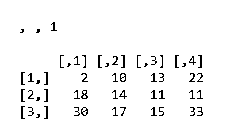

以便检查最终创建的数组是否已创建。

创建阵列后:

**结果**

函数“类”可以帮助你做到这一点。

类别(结果)

**R 代码:**

`vector1 <- c(2,18,30)
vector2 <- c(10,14,17,13,11,15,22,11,33)
print(array(c(vector1, vector2),dim = c(3,4,1)))
Result <- array(c(vector1, vector2),dim = c(3,4,1))
class(Result)`

**输出:**

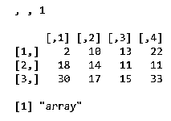

为了检查数组的维数乘积，可以使用函数:length。

**R 代码:**

`vector1 <- c(2,18,30)
vector2 <- c(10,14,17,13,11,15,22,11,33)
print(array(c(vector1, vector2),dim = c(3,4,1)))
Result <- array(c(vector1, vector2),dim = c(3,4,1))
length(Result)`

**输出:**

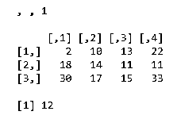

#### 场景 2

让我们创建同一个 3×4 矩阵的数组。这里，3 将是一行，4 将是列，但是矩阵将是两个。让我们保持 dimnames = NULL(如果没有指定，这是一个默认值)。

**R 代码:**

`vector1 <- c(2,18,30)
vector2 <- c(10,14,17,13,11,15,22,11,33)
print(array(c(vector1,vector2),dim = c(3,4,2)))`

**输出:**

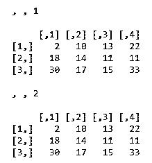

#### 场景 3

让我们创建同一个 3×4 矩阵的数组。这里，3 将是行，4 将是列，但是矩阵将是两个。让我们看看分配给 dimnames 的值。

**R 代码:**

`vector1 <- c(2,18,30)
vector2 <- c(10,14,17,13,11,15,22,11,33)
column.names <- c("COL1","COL2","COL3","COL4")
row.names <- c("ROW1","ROW2","ROW3")
matrix.names <- c("Matrix1","Matrix2")
array(c(vector1,vector2),dim = c(3,4,2),dimnames = list(row.names,column.names,
matrix.names ))`

**输出:**

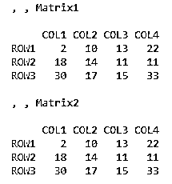

现在我们擅长创建任意维度的数组。现在让我们关注访问数组中任何元素的方式。

### 如何在 R 中创建一个访问元素数组？

下面是关于如何在 r 中创建数组的不同访问元素，如下所示

#### 场景 1

假设我们在 R 中有相同的数组:

**R 代码:**

`vector1 <- c(2,18,30)
vector2 <- c(10,14,17,13,11,15,22,11,33)
column.names <- c("COL1","COL2","COL3","COL4")
row.names <- c("ROW1","ROW2","ROW3")
matrix.names <- c("Matrix1","Matrix2")
result <- array(c(vector1,vector2),dim = c(3,4,2),dimnames = list(row.names,column.names,
matrix.names))`

**输出:**

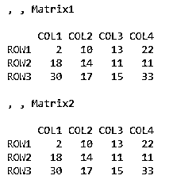

现在，我们需要访问数组中第二个矩阵的第 3 行，第 3 列。

**R 代码:**

`vector1 <- c(2,18,30)
vector2 <- c(10,14,17,13,11,15,22,11,33)
column.names <- c("COL1","COL2","COL3","COL4")
row.names <- c("ROW1","ROW2","ROW3")
matrix.names <- c("Matrix1","Matrix2")
result <- array(c(vector1,vector2),dim = c(3,4,2),dimnames = list(row.names,column.names,
matrix.names))
result[3,3,2]`

**输出:**

概括地说，方括号用于表示索引。要指定数组中的索引，有四种选择:正整数、负整数、逻辑值、元素名

#### 场景 2

需要访问整个第一阵列矩阵:

**R 代码:**

`vector1 <- c(2,18,30)
vector2 <- c(10,14,17,13,11,15,22,11,33)
column.names <- c("COL1","COL2","COL3","COL4")
row.names <- c("ROW1","ROW2","ROW3")
matrix.names <- c("Matrix1","Matrix2")
result <- array(c(vector1,vector2),dim = c(3,4,2),dimnames = list(row.names,column.names,
matrix.names))
result[,,1]`

**输出:**

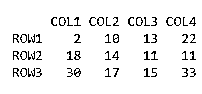

### 不同的数组操作示例

本节将向您介绍为实现各种结果而在阵列上执行的各种操作。

#### 1.加法和减法

为了相加或相减，多维矩阵必须转换成一维矩阵。

*   **添加:**

r 代码:

`vector1 <- c(2,18,30)
vector2 <- c(10,14,17,13,11,15,22,11,33)
column.names <- c("COL1","COL2","COL3","COL4")
row.names <- c("ROW1","ROW2","ROW3")
matrix.names <- c("Matrix1","Matrix2")
result <- array(c(vector1,vector2),dim = c(3,4,2),dimnames = list(row.names,column.names,
matrix.names))
result[,,1] result[,,2] print(result[,,1] + result[,,2])`

**输出:**

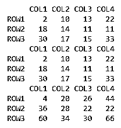

*   **减法:**

**R 代码:**

`vector1 <- c(2,18,30)
vector2 <- c(10,14,17,13,11,15,22,11,33)
column.names <- c("COL1","COL2","COL3","COL4")
row.names <- c("ROW1","ROW2","ROW3")
matrix.names <- c("Matrix1","Matrix2")
result <- array(c(vector1,vector2),dim = c(3,4,2),dimnames = list(row.names,column.names,
matrix.names))
result[,,1] result[,,2] print(result[,,1] - result[,,2])`

**输出:**

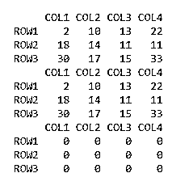

#### 2.数组元素的计算

一个名为 apply()的函数有助于跨数组元素应用任何操作。

**语法:**

`apply(x, margin, fun)`

这里 x 是一个数组，这里的边距指的是行或列。

*   对于逐行操作，MARGIN=1
*   对于按列操作，MARGIN=2
*   两者的 MARGIN=c(1，2)。

Fun 是应用于数据框数组中元素的函数。这些可以是 R 的标准函数，也可以是自定义函数(用户定义的)

**例 1:**

行式 R 代码:

`vector1 <- c(2,18,30)
vector2 <- c(10,14,17,13,11,15,22,11,33)
column.names <- c("COL1","COL2","COL3","COL4")
row.names <- c("ROW1","ROW2","ROW3")
matrix.names <- c("Matrix1","Matrix2")
result <- array(c(vector1,vector2),dim = c(3,4,2),dimnames = list(row.names,column.names,
matrix.names))
result[,,1] result[,,2] apply(result[,,1],1,sum)`

**输出:**

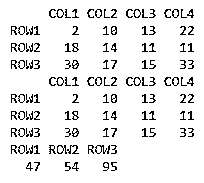

**列式–R 代码:**

`vector1 <- c(2,18,30)
vector2 <- c(10,14,17,13,11,15,22,11,33)
column.names <- c("COL1","COL2","COL3","COL4")
row.names <- c("ROW1","ROW2","ROW3")
matrix.names <- c("Matrix1","Matrix2")
result <- array(c(vector1,vector2),dim = c(3,4,2),dimnames = list(row.names,column.names,
matrix.names))
result[,,1] result[,,2] apply(result[,,1],2,sum)`

**输出:**

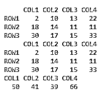

这给出了向量形式的输出，其中包含各个列的总和。这里“sum”是标准的 R 函数。

**例 2**

r 代码:

`vector1 <- c(2,18,30)
vector2 <- c(10,14,17,13,11,15,22,11,33)
column.names <- c("COL1","COL2","COL3","COL4")
row.names <- c("ROW1","ROW2","ROW3")
matrix.names <- c("Matrix1","Matrix2")
result <- array(c(vector1,vector2),dim = c(3,4,2),dimnames = list(row.names,column.names,
matrix.names))
result[,,1] result[,,2] apply(result[,,1],1,function(x)  x+10)`

**输出:**

**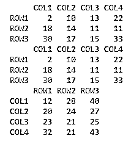

** 

这给出了相同维度的输出。这里要注意的是，我们应用了一个用户定义的函数。这个函数在解决实际问题时非常有用和强大。应用的函数也是其他复杂函数的基础，如 lapply()、rapply()等。

#### 3.检查数组

检查对象是否为数组。函数名是. array()是一个允许您这样做的基本函数。它以真或假的形式给出输出

**R 代码:**

`vector1 <- c(2,18,30)
vector2 <- c(10,14,17,13,11,15,22,11,33)
column.names <- c("COL1","COL2","COL3","COL4")
row.names <- c("ROW1","ROW2","ROW3")
matrix.names <- c("Matrix1","Matrix2")
result <- array(c(vector1,vector2),dim = c(3,4,2),dimnames = list(row.names,column.names,
matrix.names))
result[,,1] result[,,2] is.array(result)`

**输出:**

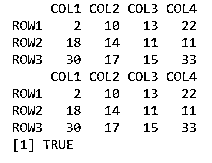

#### 4.检查数组的大小

了解数组的维数、行数和列数有助于对数据进行切片和切块。这里有一些函数可以做到这一点:dim，nrow，ncol

**R 代码:**

`vector1 <- c(2,18,30)
vector2 <- c(10,14,17,13,11,15,22,11,33)
result <- array(c(vector1,vector2),dim = c(3,4,2))
print(result)
dim(result)
nrow(result)
ncol(result)`

**输出:**

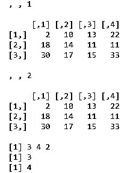

#### 5.检查行和列的名称

为了知道一个数组的行名、列名和维名。下面是它的实现。

**R 代码:**

`vector1 <- c(2,18,30)
vector2 <- c(10,14,17,13,11,15,22,11,33)
column.names <- c("COL1","COL2","COL3","COL4")
row.names <- c("ROW1","ROW2","ROW3")
matrix.names <- c("Matrix1","Matrix2")
result <- array(c(vector1,vector2),dim = c(3,4,2),dimnames = list(row.names,column.names,
matrix.names))
rownames(result)
colnames(result)
dimnames(result)`

**输出:**

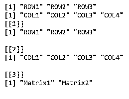

### 结论

浏览以上内容会让你对 R 中的数组有一个清晰的理解，R 是一种统计语言，数组是经常使用的数据对象。这意味着，处理各种操作，如加、减、应用等。现在，在任何应用程序中使用数组对您来说都是轻而易举的事情。

### 推荐文章

这里我们讨论 R 中数组的介绍，R 的属性，如何在 R 中创建一个数组，以及一些例子。您也可以浏览我们推荐的其他文章，了解更多信息——

1.  [安装 R](https://www.educba.com/install-r/)
2.  [VBA 阵列](https://www.educba.com/vba-arrays/)
3.  [MATLAB 中的数据类型](https://www.educba.com/data-types-in-matlab/)
4.  [VBA 数组列表](https://www.educba.com/vba-arraylist/)

