# R 中的数据帧

> 原文：<https://www.educba.com/data-frames-in-r/>

## R 中的数据帧介绍

R 语言中的数据帧是一种用于以二维表格形式存储数据的数据结构。数据帧是列表数据结构的特殊类别，其中的组成部分长度相等。r 语言支持内置函数 data.frame()来创建数据帧和分配数据元素。r 语言支持数据帧名来修改和检索数据帧中的数据元素。R 中的数据框按组件名构造为列名，也按组件值构造为行。R 中的数据框架是在数据科学项目中开发机器学习模型时广泛使用的数据结构。

数据帧有一些特征。

<small>Hadoop、数据科学、统计学&其他</small>

*   列名是必需的
*   行名应该是唯一的
*   每列中的项目数应该相同

### 在 R 中创建数据框的步骤

让我们从创建一个数据帧开始，这将在下面解释，

**第一步:**创建一个学校班级的数据框。

**代码:**

`tenthclass = data.frame(roll_number = c(1:5),Name = c("John","Sam","Casey","Ronald","Mathew"),
Marks = c(77,87,45,68,95), stringsAsFactors = FALSE)
print(tenthclass)`

当我们运行这段代码时，我们将得到这样一个数据帧。

**输出:**

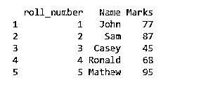

在我们的例子中，数据框架非常小，但是在现实生活中，在处理问题时，我们有大量的数据。为了理解数据的结构，我们传递函数 Str()。

第二步:我们在代码中添加下面一行。

**代码:**

`Str(tenthclass)`

当我们运行整个代码时，我们将得到输出。

**输出:**

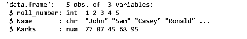

上面的输出意味着我们有 3 个变量的 5 个观察值。然后解释每个变量的数据类型。就像在我们的例子中，卷号是整数，名称是字符，标记是编号的。

一旦我们理解了数据的结构，那么我们将通过下面提到的代码来更统计地理解数据。

现在，我们将使用一个 summary()函数

**代码:**

`summary(tenthclass)`

**输出:**

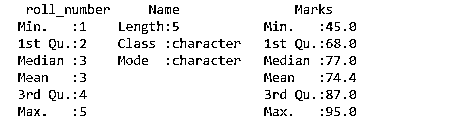

摘要提供了对我们数据的更好理解。它会告诉我们均值、中位数、四分位数、最大值和最小值。这些事情会帮助我们做出更好的决定。

### 结构

当我们想知道特定数据帧的结构时。我们可以使用下面的函数。

**星()**

`str(Data_frame)`

**输出:**

数量:2 号 3 号 4 号

alpha:系数 w/ 3 级别“x”、“y”、“z”:1 2 3

布尔值:徽标

### 如何在 R 中从数据帧中提取数据？

这里我们继续上面的案例。假设我们想知道第十班学生的名字，只要名字。那么我们将如何提取？

我们的数据框看起来像这样。

姓名标记

约翰福音 1 1 章 77 节

2 2 Sam 87

3 3 凯西 45

罗纳德 68 岁

马修 95

为了获得名称作为输出，我们将传递下面的代码。

**代码:**

`onlyname = tenthclass$Name
print(onlyname)`

**输出:**

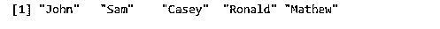

在这里，如果我们破解了代码，我们只需将美元符号放在我们的数据框名称和我们希望作为输出的变量名称之间。

现在考虑一种情况，老师想知道关于 2 号卷的所有事情，比如他的名字和分数。

这里我们需要第 2 卷的所有信息，所以我们将传递下面提到的代码。

**代码:**

`result_rollnumber2 = tenthclass[c(2),c(1:3)] print(result_rollnumber2)`

**输出:**

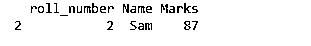

### 在数据框中展开

可以通过添加或删除列和行来增大和减小数据框的大小。

#### 1.添加行

我们有两个数据帧。一个数据帧属于第十类区段 A，而另一个数据帧属于第十类区段 b。现在，这些不同的区段正在合并成单个类别。

##### 示例#1

10 A 级

**代码:**

`tenthclass_sectionA = data.frame(roll_number = c(1:5),
Name = c("John","Sam","Casey","Ronald","Mathew"),
Marks = c(77,87,45,68,95), stringsAsFactors = FALSE)
print(tenthclass_sectionA)`

**输出:**

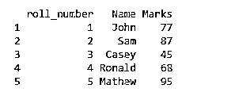

##### 实施例 2

10 B 级

**代码:**

`tenthclass_sectionB = data.frame(roll_number = c(6:10),Name = c("Ria","Justin","Bon","Tim","joe"),
Marks = c(68,98,54,68,42), stringsAsFactors = FALSE)
print(tenthclass_sectionB)`

**输出:**

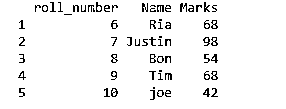

##### 实施例 3

rbind()函数

现在我们必须将这两个类合并成一个类。这里我们将使用 rbind()函数。添加新行的唯一限制是，我们需要在与现有数据框相同的结构中引入新行。

**代码:**

`new_tenthclass = rbind(tenthclass_sectionA,tenthclass_sectionB)
print(new_tenthclass)`

**输出:**

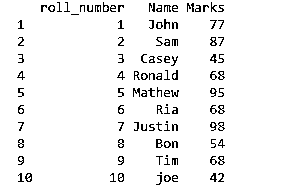

#### 2.添加列

现在考虑这样一种情况，我们必须添加班级 10 中每个学生的血型详细信息。我们将为它添加一个新列，并将其命名为“Blood_group”。

我们的数据框看起来像这样。

**代码:**

`tenthclass = data.frame(roll_number = c(1:5),Name = c("John","Sam","Casey","Ronald","Mathew"),
Marks = c(77,87,45,68,95), stringsAsFactors = FALSE)
print(tenthclass)`

**输出:**

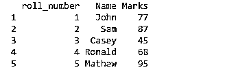

**代码:**

`tenthclass$Blood_group = c("O","AB","B+","A+","AB")
print(tenthclass)`

**输出:**

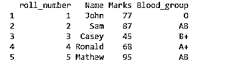

#### 3.删除列

**代码:**

`print(tenthclass)`

**输出:**

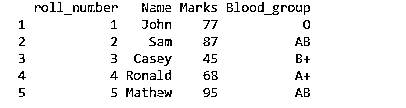

在此数据框中，如果我们必须删除血型变量(最右边一列),我们将传递以下代码。

**代码:**

`tenthclass$Blood_group = NULL
print(tenthclass)`

**输出:**

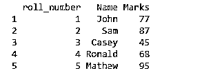

绕过空命令，我们可以直接从数据框中删除变量。

#### 4.删除行

**代码:**

`print(tenthclass)`

**输出:**

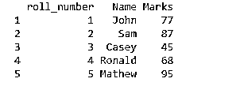

现在考虑一种情况，我们不需要约翰的标记，所以我们必须删除最上面的行。

**代码:**

`tenthclass = tenthclass[-1,] print(tenthclass)`

**输出:**

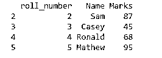

#### 5.更新数据框中的数据

**代码:**

`print(tenthclass)`

**输出:**

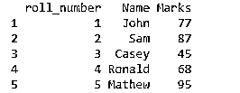

假设 Sam 得了 98 分，但根据我们的数据框架，他得了 87 分。所以我们可以通过下面的代码来纠正它。

**代码:**

`tenthclass$Marks[2] = 98
print(tenthclass)`

**输出:**

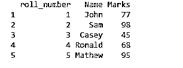

### 检查数据帧

以下是检查数据帧的不同方法，并提供了与上述 star 函数类似的数据帧信息。

**1。名称:**提供数据帧中变量的名称

**语法** : `names(data frame name)`

**例子**

`Number <- c(2,3,4)
alpha <- c("x","y","z")
Booleans <- c(TRUE,TRUE,FALSE)
Data_frame <- data.frame(Number,alpha,Booleans)
names(Data_frame)`

**输出**:【1】“数字”“阿尔法”“布尔”

**2。概要:**提供数据帧的统计。

**语法:** `summary(data frame name)`

**例子**

`Number <- c(2,3,4)
alpha <- c("x","y","z")
Booleans <- c(TRUE,TRUE,FALSE)
Data_frame <- data.frame(Number,alpha,Booleans)
summary(Data_frame)`

**输出:**

最小阿尔法布尔数
。:2.0 x:1 模式:逻辑
1 区。:2.5 y:1 假:1
中值:3.0 z:1 真:2
均值:3.0 纳氏:0
第三曲。:最大 3.5
。:4.0

**3。Head:** 提供前几行的数据。

**语法:** `Head( name of the data frame)`

**例子**

`Number <- c(2,3,4,5,6,7,8,9,10,11)
alpha <- c("x","y","z","a","b","c","d","f","g","j")
Booleans <- c(TRUE,TRUE,FALSE,TRUE,FALSE,FALSE,FALSE,FALSE,FALSE,FALSE)
Data_frame <- data.frame(Number,alpha,Booleans)
head(Data_frame)`

**输出:****T3】**

数字阿尔法布尔运算
1 2 x 真
2 3 y 真
3 4 z 假
4 5 a 真
5 6 b 假
6 7 c 假

**4。Tail:** 打印数据帧的最后几行。

**语法:** `tail( name of the data frame)`

`Number <- c(2,3,4,5,6,7,8,9,10,11)
alpha <- c("x","y","z","a","b","c","d","f","g","j")
Booleans <- c(TRUE,TRUE,FALSE,TRUE,FALSE,FALSE,FALSE,FALSE,FALSE,FALSE)
Data_frame <- data.frame(Number,alpha,Booleans)
tail(Data_frame)`

**输出:**

数α布尔型
5 6 b 假
6 7 c 假
7 8 d 假
8 9 f 假
9 10 g 假
10 11 j 假

### 从数据帧中提取特定数据

以下是从数据框中提取的一些具体数据:

#### 1.使用列名

我们可以从数据框中提取一组特定的数据。

从上面的例子中，我们只从数据帧中提取第一列，即 Number。

`Data_ frame <- data. Frame(Number)`

**输出:**

数字

1      2

2      3

3      4

#### 2.使用行

我们可以从行中提取数据，就像下面的例子一样。

假设我们只想打印数字列的两行。

`Number <- c(2,3,4)
alpha <- c("x","y","z")
Booleans <- c(TRUE,TRUE,FALSE)
Data_frame <- data.frame(Number,alpha,Booleans)
print(Data_frame)
output <- Data_frame[1:2,] print(output)`

**输出:**

数字阿尔法布尔

1 2 x 真实

2 3 y 真的

3 4 z 假

———————————-

数字阿尔法布尔

1 2 x 真实

2 3 y 真的

我们可以观察到第一次和第二次输出的差异。

#### 3.打印特定的行和列

我们还可以打印特定的行和列。

在下面的例子中，我们打印 1 个第一个和 2 个第二个行、列

`Number <- c(2,3,4)
alpha <- c("x","y","z")
Booleans <- c(TRUE,TRUE,FALSE)
Data_frame <- data.frame(Number,alpha,Booleans)
print(Data_frame)
output <- Data_frame[c(1,2),c(1,2)] print(output)`

**输出:**

数字阿尔法布尔

1 2 x 真实

2 3 y 真的

3 4 z 假

————————————-

数字α

1 2 x

2 3 y

#### 4.向数据框添加另一列

我们可以向数据框中添加另一列以及值。

`Number <- c(2,3,4)
alpha <- c("x","y","z")
Booleans <- c(TRUE,TRUE,FALSE)
Data_frame <- data.frame(Number,alpha,Booleans)
Data_frame$class <- c("A","B","C")
out <- Data_frame
print(out)`

**输出:**

数字阿尔法布尔类

1 2 x 真实 A

2 3 y TRUE B

3 4 z 假 C

#### 5.向数据框添加行

我们使用 rbind 函数向现有数据框中添加一个新行。

`Number <- c(2,3,4)
alpha <- c("x","y","z")
Booleans <- c(TRUE,TRUE,FALSE)
Data_frame <- data.frame(Number,alpha,Booleans)
Data_frame$class <- c("A","B","C")
out <- rbind(Data_frame,c(5,"x",FALSE,"D"))
print(out)`

**输出:**

数字阿尔法布尔类

1 2 x 真实 A

2 3 y TRUE B

3 4 z 假 C

4 5 x 假 D

#### 6.组合两个数据帧

我们也可以将两个数据帧组合起来，产生一个输出。

要合并两个数据框，我们需要数据框有相同的列。

`Number <- c(2,3,4)
alpha <- c("x","y","z")
Booleans <- c(TRUE,TRUE,FALSE)
Data_frame1 <- data.frame(Number,alpha,Booleans)
print(Data_frame1)
Number <- c(4,5,6)
alpha <- c("x","y","z")
Booleans <- c(TRUE,TRUE,FALSE)
Data_frame2 <- data.frame(Number,alpha,Booleans)
print(Data_frame2)
out <- rbind(Data_frame1,Data_frame2)
print(out)`

**输出:**

数字阿尔法布尔
1 2 x 真
2 3 y 真
3 4 z 假
————————————
数字阿尔法布尔
1 4 x 真
2 5 y 真
3 6 z 假

—————————————–

数字阿尔法布尔运算
1 2 x 真
2 3 y 真
3 4 z 假
4 4 x 真
5 5 y 真
6 6 z 假

### 结论

数据框是问题陈述的一种非常常见的形式。它是具有唯一行 id 的相同行数的变量列表。这篇文章帮助我们了解如何在数据框中添加一行、添加一列、删除一行、删除一列，并告诉我们如何更新数据框中的数据。

### 推荐文章

这是 r 中数据框的指南。在这里，我们讨论了创建数据框的不同步骤以及如何从 r 中的数据框提取数据。您也可以查看以下文章以了解更多信息——

1.  [R 中的前 5 种数据类型](https://www.educba.com/r-data-types/)
2.  [有用的 R 包列表](https://www.educba.com/r-packages/)
3.  [R CSV 文件](https://www.educba.com/r-csv-files/)
4.  [R 程序功能-重要性](https://www.educba.com/functions-in-r/)

