# R 中的因子

> 原文：<https://www.educba.com/factors-in-r/>

## R 中的因子介绍

R 编程语言中的因子是数据集中有限类型的变量类型。因素变量也类似于分类变量。R 中的因子变量对数据处理和数据分析有重大影响。与连续数据相比，机器学习算法处理这些因素的方式有所不同。作为因子变量的编程方法，在开发和生成机器学习模型时，变量被转换成相应的整数变量，并再次映射到其字符值以表示预测分析。R 中的因子的一个例子可以是特定产品的组类型，其在数据集中被表示为类别 1、类别 2、类别 3。

### 一个因素的优势

*   它可以存储整数和字符串

**1。在整数的情况下**

<small>Hadoop、数据科学、统计学&其他</small>

`data = c(5,6,6,6,7,5,7,6,7,5,6,7)
factor_data = factor(data)
factor_data`

**输出**

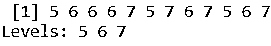

**2。在字符串**的情况下

`y = factor(c("Bike","Car","Cycle","Truck","Car","Bike","Cycle","Truck","Car","Bike"))
y`

**输出**

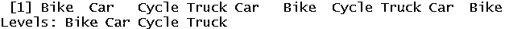

`y = factor(c("Bike","Car","Cycle","Truck","Car","Bike","Cycle","Truck","Car","Bike"),levels = c("Car","Bike","Cycle","Truck","Train"))
y`

**输出**

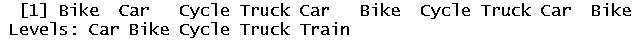

*   当列中的唯一值数量有限时，这非常有用

| **名称** | **出行方式** |
| 约翰 | 卡车 |
| 马铃薯等的枝叶部分 | 汽车 |
| 李 | 循环 |
| 三目 | 自行车 |
| 洛丝 | 卡车 |
| 丽雅 | 汽车 |
| Mij | 循环 |

这里，我们在第 2 列中有有限数量的唯一值。

*   它有助于纠正有错别字(打字错误)的字符串。

### 如何在 R 中创建一个因子？

我们可以通过使用代码因子()来创建因子。

了解有关 factor()的更多信息。

`factor(x = character(), levels, labels = levels, ordered = is.ordered(x))`

在哪里，

**X** 是一组分类数据。正如我们已经讨论过的，它应该是一个字符串或整数。

级别是 x 可以取的一组值。级别包含列(x)中所有可用的唯一值。

顾名思义，标签表示 x 处可用数据的标签。

Ordered 确定是否应按任何特定顺序对级别进行排序。

**例#1**

`y = factor(c("Bike","Car","Cycle","Truck","Car","Bike"))
y`

**输出:**

**例 2**

`y = factor(c("Bike","Car","Cycle","Truck","Car","Bike","Cycle","Truck","Car","Bike"),levels = c("Car","Bike","Cycle","Truck","Train"))
y`

**输出:**

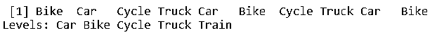

在示例 2 中，我们可以看到我们也可以定义“级别”。

现在让我们通过使用 Str(y)来了解更多关于因子的信息。

`y = factor(c("Bike","Car","Cycle","Truck","Car","Bike","Cycle","Truck","Car","Bike"),levels = c("Car","Bike","Cycle","Truck","Train"))
y`

**输出:**

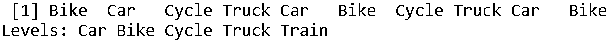

`str(y)`

**输出:**

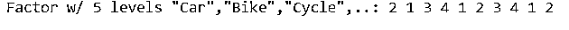

可以清楚地看到，因子存储为整数向量，级别存储为字符向量，而单个元素实际上存储为索引。

*   **现在我们将了解如何访问因子的组成部分**

`y = factor(c("Bike","Car","Cycle","Truck","Car","Bike","Cycle","Truck","Car","Bike"),levels = c("Car","Bike","Cycle","Truck","Train"))
y`

**输出:**

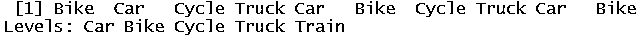

`y[2]     # helps to access 2nd element`

**输出:**

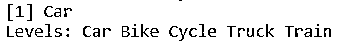

`x[c(3, 4)]     # helps to access 3rd and 4th element`

**输出**

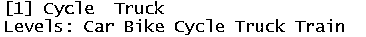

`x[-1]     # access all except 1st element`

**输出:**

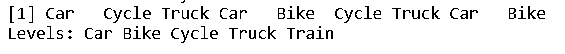

*   现在我们将看看如何修改因子。

`y = factor(c("Bike","Car","Cycle","Truck","Car","Bike","Cycle","Truck","Car","Bike"),levels = c("Car","Bike","Cycle","Truck","Train"))
y`

**输出:**

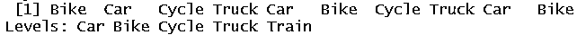

`y[3] = "Truck"       #modifty third element
y`

**输出**

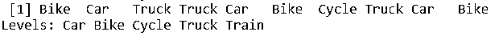

**添加到因子:**

`y[10] = "Car"
y`

**输出:**

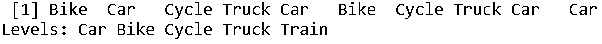

请注意，我们不能在不属于级别的因素中分配任何内容。

`y[4] = "Plane"Warning message:In `[<-.factor`(`*tmp*`, 4, value = "Plane") :  invalid factor level, NA generated`

**输出:**

在本例中，我们可以看到“平面”不是我们级别的一部分，因此我们得到一条警告消息，指出“平面”是无效的因子级别。

### 将数据转换成因子

数据是大量可用的，每次都很难在代码中写下一个完整的单词，因此为此，我们将首先将数据转换为一个因子，然后根据我们的方便将因子转换为一个字符或数字。

现在让我们研究一些真实的数据。我们有 50 个观察和申请人提供他们的工作方向。就像约翰为了他的工作职责向北方行进，或者山姆为了他的工作职责向南方行进。

`direction <- c("West", "East", "North","West", "South","East","South","East", "South","East", "South","West", "South","East","South","East", "South","South","West","East", "South","West", "South","East","South","East", "South","West","East", "South","West", "South","East","South","East", "South", "South","West", "South","West","East", "South","West", "South","East","South","East", "South", "South","West")
direction.factor = factor(direction)
direction.factor`

**输出:**

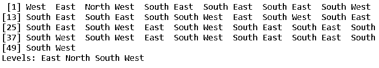

等级:东北西南

现在如果我们想把因子转换成一个字符向量:

我们将使用 as.character()代码。

`as.character(direction.factor)`

**输出:**

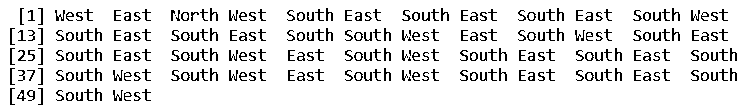

或者我们想把因子转换成一个数字向量:

我们将使用 as.numeric()代码。

`as.numeric(direction.factor)`

**输出:**

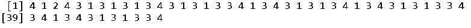

### 推荐文章

这是一个 R 中因子的指南。在这里，我们讨论了因子的介绍、优势，以及如何创建 R 中的因子和输出。您也可以浏览我们推荐的其他文章，了解更多信息——

1.  [Spark SQL 数据帧](https://www.educba.com/spark-sql-dataframe/)
2.  [R 数据类型](https://www.educba.com/r-data-types/)
3.  [多维数据库](https://www.educba.com/multidimensional-database/)
4.  [AWS 数据管道](https://www.educba.com/aws-data-pipeline/)

