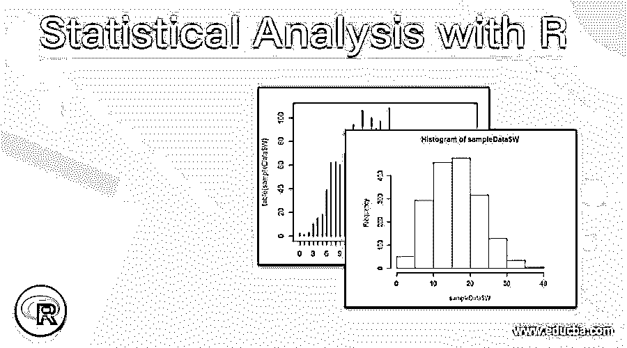
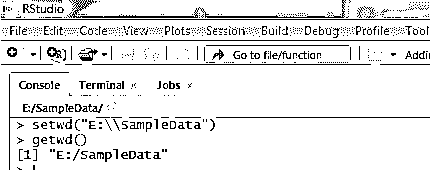
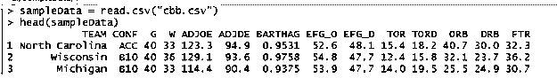
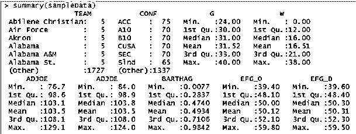
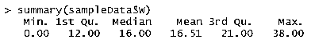
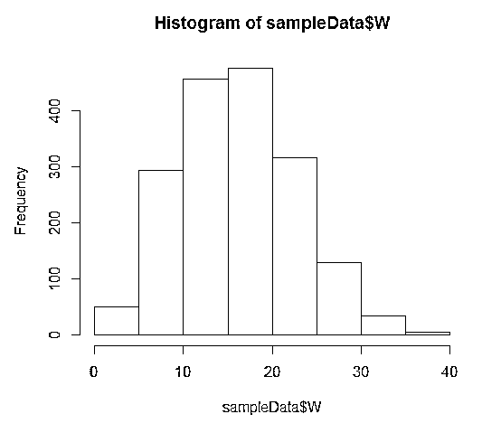
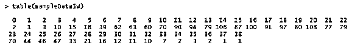
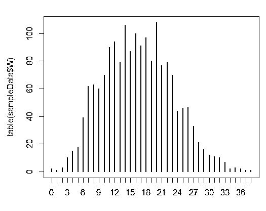
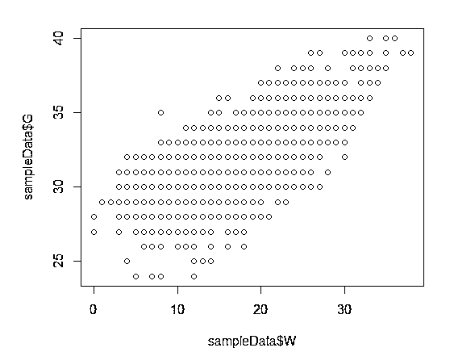
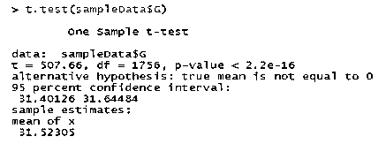

# R 统计分析

> 原文：<https://www.educba.com/statistical-analysis-with-r/>

## R 统计分析导论

R 统计分析是统计学家、数据分析师和数据科学家在分析统计数据时的最佳实践之一。r 语言是一种流行的开源编程语言，它广泛支持用于统计分析的内置包和外部包。R 语言本身支持探索性数据的基本统计计算，以及用于预测性数据分析的高级统计使用 R 进行统计分析是基于统计规则和业务约束来识别数据模式的重要部分。由于 R 语法的简单性和使用高级包的灵活性。统计分析首选 r 语言。

### 如何用 R 语言进行统计分析？

现在让我们讨论如何用 R 语言进行统计分析。

<small>Hadoop、数据科学、统计学&其他</small>

*   从 R 的统计数据分析开始，业务需求需要清晰，以便从可用数据中找到数据模式。
*   系统上需要安装 R 语言
    *   r 可以安装在 Windows、Linux 和 MAC OS X 中。
    *   R 的可安装文件可以从[https://cran.r-project.org/](https://cran.r-project.org/)下载。
*   接下来，需要在系统上安装 R Studio 等 IDE。
    *   R Studio 提供 GUI 支持以及一些企业级特性，如语法编译、调试、包和工作区管理。
*   R Studio 可以从[https://www.rstudio.com/](https://www.rstudio.com/)下载安装
    *   一旦安装了 R studio，它就可以直接用于开发 R 脚本，该脚本将在 R 语言的已安装版本上工作。
*   一旦环境准备就绪，下一步就是将数据集导入 R workspace。
    *   例如，我们将导入一个. csv 文件到 R studio 进行统计分析。
    *   为了这次演示，我们将从[https://www.kaggle.com/](https://www.kaggle.com/)下载一个开源数据集。
    *   我们将使用的数据文件是“cbb.csv ”,它是大学篮球数据集，

R 统计分析的实用方法

*   本节将使用 R studio 进行大学篮球数据集的实践。
    *   第一步是设置工作目录，该目录将用作读写数据集的首选位置。
    *   setwd()在 R 中用来设置工作目录
    *   getwd()来检查当前的工作目录
    *   下面是 R Studio 带有 setwd()和 getwd()函数的截图。

`setwd("E:\\SampleData")
getwd()`

*   接下来将使用 read.csv()命令导入数据集，并按以下语法分配给名为 SampleData 的数据帧
*   样本数据= read.csv("cbb.csv ")
*   要检查导入的数据集是否正确，并检查几行最上面的数据，请在 R

`sampleData = read.csv("cbb.csv")
head(sampleData)`

*   接下来，我们将使用 summary()命令进行基本的统计分析，这将显示每个定量变量的数据集的最小值、最大值、平均值、中间值和四分位间距信息。
*   篮球数据集的概要显示变量 G 的最小值为 24.00，最大值为 40.00，中间值为 31.00，平均值为 31.52

`summary(sampleData)`

*   接下来，我们将讨论单变量数据分析。
    *   r 数据帧是有效的数据存储引用，
    *   可以使用$ symbol 从数据框中评估特定变量
    *   例如，要查看 W 变量的统计汇总，我们将使用

`summary(sampleData$W)`

*   可以使用 hist 将数据绘制成直方图。default()命令查看整体数据分布

`hist.default(sampleData$W,col='gray')`

*   我们可以使用 table 函数来创建一个频率表，它显示了使用 Table 变量(sampleData$W)的数据的频率数

`table(sampleData$W)`

*   频率表显示值 20 在数据中具有最大频率。这个函数在统计分类变量时非常有用。
*   此外，我们在 R 中使用 plot 函数绘制了这个频率表

`plot(table(sampleData$W))`

*   接下来，我们将讨论 R 的二元统计分析
*   这种统计分析是对数据集中存在的两个变量进行比较。
*   它有助于确定两个变量之间的相关性和模式。
*   符号“~”用于 R 中的二元分析
*   在本例中，我们使用以下方法为 G 和 W 变量创建散点图或散点图

`plot(sampleData$G~sampleData$W,col='blue')`

*   该散点图代表双变量分析的图表

*   接下来，我们将讨论 t 检验，这是使用 r 的统计假设检验过程。
    *   在 R 中使用 t，test()函数来处理 t 测试
    *   我们将使用数据框架样本数据的 G 变量数据进行 t 检验
    *   test(sampleDat$G)是我们将在 R Studio 控制台上应用的语法。
    *   t 检验显示统计推断和置信区间。作为结果。
    *   p 值是对零假设有意义的概率值。百分比值是置信区间。

`t.test(sampleData$G)`

*   在这个 T 检验中，P 值< 2.2e-16，置信区间为 95%。它还显示了平均值 31.52205。
*   T 检验表明在假设检验过程中，另一个假设是正确的。

### 用 R 语言进行统计分析的重要性

*   r 是一种可靠的统计分析编程语言。
*   它有广泛的统计库支持，如 T 检验，线性回归，逻辑回归，时间序列数据分析。
*   r 提供了非常好的数据可视化特性，支持使用图形包(如 ggplot2)封装和绘制图形。
*   它是一种脚本语言，帮助统计学家和数据科学家开发代码和测试单个统计模型，以进行高效的数据分析。
*   用 R 编写的用于统计分析的代码易于解释，并且可以与组织的其他栈持有者和同事共享。
*   作为一种流行的、结构良好的语言，R 有几个代码可重用的组件和库，可以用来开始对输入数据集进行统计分析。
*   r 语言包括各种内置数据集，用于在使用实际业务数据进行统计分析之前学习和创建概念证明。

### 结论

这是数据科学项目的一个集成阶段。由于其对统计计算的本机支持，广泛的社区支持，它使其从 python 语言、SAS、IBM SPSS Statistics、MATLAB、Minitab 和 Microsoft Excel 等竞争对手中脱颖而出。使用 R 的统计分析随着版本的升级而发展。

### 推荐文章

这是一个用 R 进行统计分析的指南，这里我们讨论一下入门，如何用 R 语言进行统计分析？和统计分析的重要性。您也可以看看以下文章，了解更多信息–

1.  [统计分析工具](https://www.educba.com/statistical-analysis-tools/)
2.  [统计分析软件](https://www.educba.com/statistical-analysis-softwares/)
3.  [统计分析](https://www.educba.com/statistical-analysis/)
4.  [统计分析回归](https://www.educba.com/statistical-analysis-regression/)

