# R CSV 文件

> 原文：<https://www.educba.com/r-csv-files/>

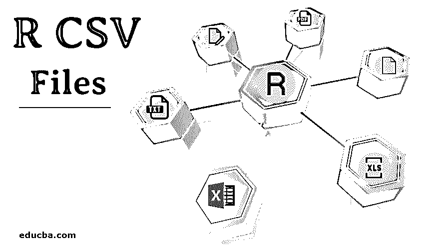

## R CSV 文件简介

CSV 文件广泛用于以表格形式存储信息，每一行都是数据记录。为了在 R 中读、写或操作数据，我们必须有一些可用的数据。数据可以在互联网上找到，也可以从调查等各种来源收集。使用 R 可以读取、写入和编辑存储在外部环境中的数据。r 可以读写各种格式的数据，比如 XML、CSV 和 excel。在本文中，我们将看到如何使用 R 来读取、写入和执行 CSV 文件上的不同操作。

### 在 R 中创建 CSV 文件

我们将看到如何在 r 中创建数据框并将其导出到 CSV 文件中。首先，我们将创建一个包含变量 employee 和相应 salary 的数据框。

<small>Hadoop、数据科学、统计学&其他</small>

**代码:**

`> df <- data.frame(Employee = c('Jonny', 'Grey', 'Mouni'),
+                  Salary = c(23000,41000,32344))
> print (df)`

**输出:**

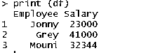

一旦创建了数据帧，就该使用 R 的导出函数在 R 中创建 CSV 文件了。

**代码:**

`> write.csv(df, 'C:\\Users\\Pantar User\\Desktop\\Employee.csv', row.names = FALSE)`

在上面的代码行中，我们为数据帧提供了一个路径目录，并以 CSV 格式存储数据帧。在上面的例子中，CSV 文件保存在我的个人桌面上。这个特殊的文件将在我们的教程中用于执行多个操作。

### 在 R 中读取 CSV 文件

当使用 R 执行分析时，在许多情况下，我们需要从 CSV 文件中读取数据。r 在读取 CSV 文件时非常可靠。在上面的例子中，我们已经创建了文件，我们将使用 read.csv 命令读取该文件。

下面是在 R 中这样做的例子:

**代码:**

`> df <- read.csv(file="C:\\Users\\Pantar User\\Desktop\\Employee.csv", header=TRUE,
sep=",")
> df`

**输出:**

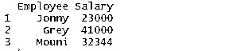

上面的命令读取桌面上的 Employee 文件，并在 R studio 中显示出来。Header 命令意味着标题可用于数据集，sep 命令意味着数据用逗号分隔。

### 用 R 编写 CSV 文件

对数据分析师来说，写入 CSV 文件是 R [中最有用的功能之一。这可用于将已编辑的 CSV 文件写入新的 CSV 文件，以便分析数据。Write.csv 命令用于将文件写入 csv。](https://www.educba.com/what-is-data-analyst/)

在下面的代码 df 中，我们的数据所在的数据帧中，append 用于指定创建新文件，而不是在旧文件中追加或覆盖。Append false 表示创建了新的 CSV 文件。Sep 表示用逗号分隔的字段。

**代码:**

`# Writing CSV file in R
write.csv(df, 'C:\\Users\\Pantar User\\Desktop\\Employee.csv' append = FALSE, sep = “,”)`

### CSV 操作

一旦数据加载到系统中，CSV 操作就需要检查数据。r 有几个内置的功能来验证和检查数据。这些操作提供了关于数据集的完整信息。

最常用的命令之一是摘要。

**代码:**

`> summary(df)`

**输出:**

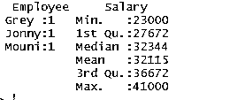

summary 命令为我们提供了列级统计信息。数字变量以统计方式描述，包括统计结果，如平均值、最小值、中值和最大值。在上面的例子中，两个变量 Employee 和 Salary 是分开的，数字变量 Salary 的统计数据显示给我们。

View()命令用于在另一个选项卡中打开数据集并手动验证它。

**代码:**

`> View(df)`

**输出:**

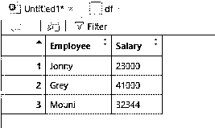

Str 函数将为用户提供关于数据集列的更多细节。在下面的示例中，我们可以看到 Employee 变量的数据类型为 Factor，而 Salary 变量的数据类型为 int (integer)。

**代码:**

`> str(df)`

**输出:**

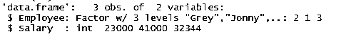

在许多情况下，我们需要查看大数据集的可用总行数，为此我们可以使用 nrow()命令。

**代码:**

`> # to show the total number of rows in the dataset
> nrow(df)`

**输出:**

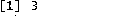

以类似的方式显示总列数，我们可以使用 ncol()命令。

**代码:**

`> ncol(df)`

**输出:**

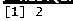

r 允许我们在下面命令的帮助下显示所需的行数。当数据集中有 n 行可用时，我们可以指定要显示的行的范围。

**代码:**

`> # to display first 2 rows of the data
> df[1:2,]`

**输出:**

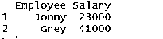

对大数据集进行数据操作。举例来说，我从网上下载了 NI 邮政编码的开源数据集。

**代码:**

`> NiPostCode <- read.csv("NIPostcodes.csv",na.strings="",header=FALSE)`

**输出:**

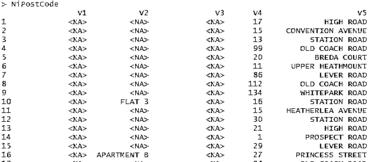

在上面的数据集中，我们可以看到缺少标题名，并且存在许多空值。数据集需要清理，以便为分析做好准备。在下一步中，标题将被相应地命名。

**代码:**

`> # adding headers/title
> names(NiPostCode)[1] <-"OrganisationName"
> names(NiPostCode)[2] <-"Sub-buildingName"
> names(NiPostCode)[3] <-"BuildingName"
> names(NiPostCode)[4] <-"Number"
> names(NiPostCode)[5] <-"Location"
> names(NiPostCode)[6] <-"Alt Thorfare"
> names(NiPostCode)[7] <-"Secondary Thorfare"
> names(NiPostCode)[8] <-"Locality"
> names(NiPostCode)[9] <-"Townland"
> names(NiPostCode)[10] <-"Town"
> names(NiPostCode)[11] <-"County"
> names(NiPostCode)[12] <-"Postcode"
> names(NiPostCode)[13] <-"x-coordinates"
> names(NiPostCode)[14] <-"y-coordinates"
> names(NiPostCode)[15] <-"Primary Key"`

**输出:**

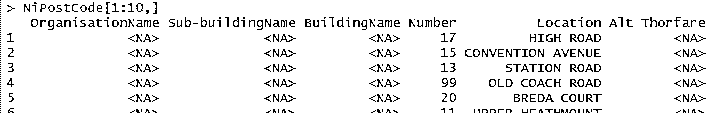

现在，让我们计算数据帧中缺失值的数量，然后相应地删除它们。

**代码:**

`> # count of all missing values
> table(is.na (NiPostCode))`

**输出:**

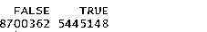

从上面的命令中，我们可以看到数据帧中空白或 NA 的总数接近 5445148。删除所有的空值将导致大量数据的丢失，因此删除丢失了 50%以上数据的列是明智的。

**代码:**

`> # delete columns with more than 50% missing values
> NiPostcodes <- NiPostCode[, -which(colMeans(is.na(NiPostCode)) > 0.5)] > (NiPostcodes)`

**输出:**

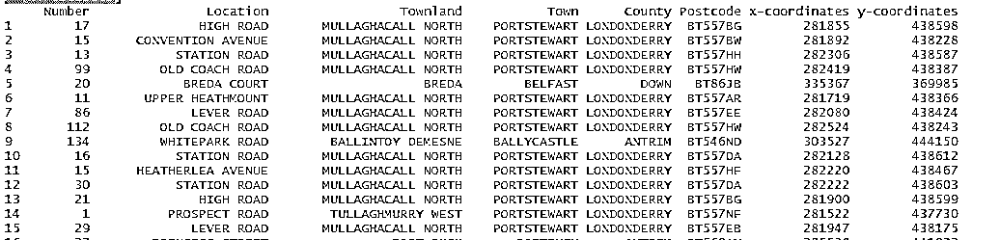

### 结论

在本教程中，我们看到了如何使用 R 中的操作创建、读取和追加 CSV 文件。我们看到了如何在 R 中创建新的数据集，然后将其导入 CSV 格式。我们还看到了多种操作，如重命名标题和计算行数和列数。

### 推荐文章

这是一个 R CSV 文件的指南。这里我们分别讨论在 R 中用 CSV 操作创建、读取和写入 CSV 文件。您也可以阅读以下文章，了解更多信息——

1.  [JSON vs CSV](https://www.educba.com/json-vs-csv/)
2.  [数据挖掘过程](https://www.educba.com/data-mining-process/)
3.  [数据分析职业](https://www.educba.com/careers-in-data-analytics/)
4.  [Excel vs CSV](https://www.educba.com/excel-vs-csv/)

