# 在 R 中排序

> 原文：<https://www.educba.com/sorting-in-r/>

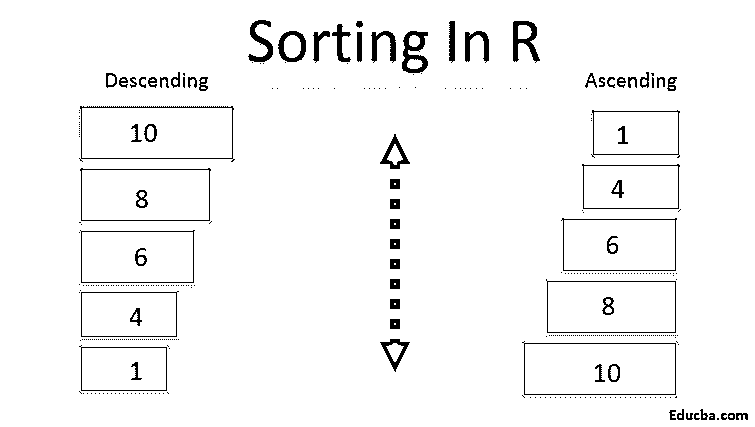

## R 中的排序介绍

R 编程提供的一种机制，通过这种机制，向量的元素可以按特定的顺序排列，通常由 order()函数提供，但不仅限于此，该函数可以根据需要帮助按升序或降序对元素进行排序，通常使用 order()函数按升序()对结果进行排序，否则按降序对结果进行排序，这就是 R 中的排序。

### 在 R 中执行的排序

有多种方法可以对 r 中的数据进行排序。由[数据分析师根据数据的结构考虑最合适的方法](https://www.educba.com/what-is-data-analyst/)。这是因为 R 语言有多种函数和方式对数据进行排序，比如 sort()、order()和 dplyrI()包。

<small>Hadoop、数据科学、统计学&其他</small>

整理数据前要记住的事情。

1.  数据需要按升序或降序排序的顺序。
2.  多列排序标准。
3.  在排序过程中计算缺失值和重复值。由分析师决定如何处理缺失和重复的值。在移除或替换空值之前，应该考虑对数据的整体影响。

### R 中的 Sort()函数

R 中的 Sort 函数用于对向量进行排序。默认情况下，该值按升序排列。让我们以一个教室里所有学生的分数栏为例。

对向量进行排序的语法是

`"sort (x, decreasing = FALSE)"`

这里 x 指的是向量，当必须按降序排序时，递减必须替换为 TRUE。排序功能用于按所需顺序排列数字或字符向量。排序函数的主要限制是它不能用于对数据框进行排序。为了克服这个限制，使用了 Order()函数。

使用 sort()函数的基本排序示例

`set.seed(1)
x <- sample(1:100,10)
x`

**输出**
[1] 68 39 1 34 87 43 14 82 59 51

排序(x)

**输出**

[1]  1 14 34 39 43 51 59 68 82 87

数据帧的排序可以借助 order()函数来完成。变量可以很容易地按升序或降序排序，但是，默认情况下，order 函数将按升序对变量进行排序。

`> df <- data.frame("Serial_number" = 1:5, "Age" = c(20, 21, 17, 18, 19), "Name" = c("Johnny","Dorian", "Linda", "Cathy", "Rick"))
>
> # Sort by age ascending order
> newdataAsc <- df[order(df$Age),] > newdataAsc
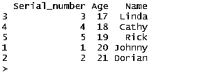

# sorting is descending order
> newdataDsc> newdataDsc <- df[order(-df$Age),] > newdataAsc`

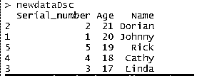

请注意，年龄列前面使用了负号(-df$Age)，以便按降序对年龄进行排序。或者，降序参数也可以用在这个位置。Order 函数用于引用列索引，而不是列名。例如，代替年龄，数据帧的索引参考将是“1”。记住索引值从“0”开始。

在少数情况下，我们可能需要使用多个标准对数据进行排序，这可以在 R 中借助变量名或索引号来实现。在下面的例子中，我使用了 R studio 中的 mtcars 数据集。

`df <- mtcars
> df
> # sort the dataframe by key disp
> df[with(df, order(mpg, disp)),]` 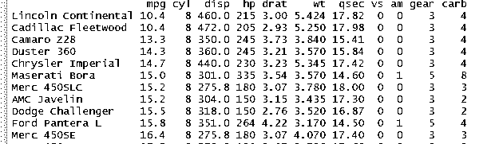

`> # Sort by column index values
> df[order( df[,1], df[,3] ),]`

在 R 中，排序数据的另一种方法是使用 dplyr 包。这个软件包是非常容易使用和可靠的准确指示可用。

`> install.packages("dplyr")
> library(dplyr)
> df <- mtcars
>
> # sort the dataframe by key disp
> arrange(mydata,disp)`

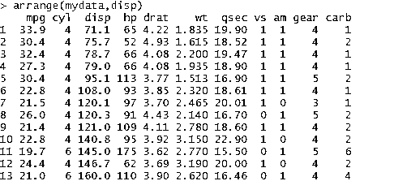

### R 中的排序类型

r 配备了多种算法来对数据进行排序。下面是不同类型的排序函数。为了说明不同类型的排序，使用了来自一个数组的 10 个随机数的样本。

#### 1.冒泡排序

在这个算法中，两个值被并排比较，当满足标准时，元素交换它们的位置。它可以是升序，也可以是降序。在冒泡排序中，对变量中可用的元素形成排序对，当一个元素大于另一个元素时，对元素进行相互比较。重复该过程，直到最后一个元素。

`> bubble_sort <- function (x,ascending = TRUE) {
+   n <- length(x)
+   if (ascending) {
+     for(i in 1:(n-1)){
+       for(j in 1:(n-i)) {
+         if(x[j+1] < x[j]) {
+           tmp <- x [j] +           x[j] <- x[ j+ 1] +           x[j+1] <- tmp
+         }
+       }
+     }
+   }
+   else {
+     for(i in 1:(n-1)){
+       for(j in 1:(n-i)) {
+         if(x[j+1] > x[j]) {
+           tmp <- x [j] +           x[j] <- x[ j+ 1] +           x[j+1] <- tmp
+         }
+       }
+     }
+   }
+   x
+ }
>
> x <-sample(1:100,10)
> example <- bubble_sort(x)
> example`

**输出**

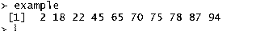

#### 2.插入排序

在插入排序算法中，对排序和未排序的元素进行比较，在每次迭代后将未排序的元素放在合适的位置。

在这个算法中，假设第一个元素被排序，第二个元素作为关键元素被单独存储。然后将排序后的元素与关键字进行比较。如果排序后的元素大于 key 元素，则交换位置，key 元素是第一个元素。

`> insertion_sort <- function(A){
+   for (j in 2:length(A)) {
+     key = A[j] +     i = j - 1
+     while (i > 0 && A[i] > key) {
+       A[(i + 1)] = A[i] +       i = i - 1
+     }
+     A[(i + 1)] = key
+   }
+   A
+ }
>
>
> # testing the insertion function
> x <-sample(1:100,10)
> example <- insertion_sort(x)
> example`

**输出**

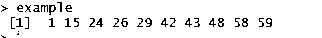

#### 3.选择排序

选择排序函数是 R 语言中广泛使用的排序算法。在这种排序中，未排序列表中的最小元素被推到列表的开头。在选择排序算法中，在每次迭代中，从未排序列表的数组中选择最小的元素，并将其放在未排序列表的开始处。例如，在以随机序列排列的一行数字中，起始元素或数字被选为最小值。在下一步中，将选定的最小数字与下一个元素或数字进行比较。如果比较的元素小于我们选择的最小值，则第二个元素成为最小值。重复这个过程，直到最后一个元素。

`> selection_sort <- function (x, ascending = TRUE) {
+   max <- length(x)
+   if (ascending) {
+     for (j in 1:(max-1)){
+       m <- x[j] +       p <- j
+       for(k in (j+1):max) {
+         if(x[k] < m) {
+           m <- x[k] +           p <- k
+         } ## end if
+       } ## end for k
+       x[p] <- x[j] +       x[j] <- m
+     } ## end for j
+   } ## end ascending if
+   else {
+     for (j in 1:(max-1)){
+       m <- x[j] +       p <- j
+       for(k in (j+1):max) {
+         if(x[k] > m) {
+           m <- x[k] +           p <- k
+         } ## end if
+       } ## end for k
+       x[p] <- x[j] +       x[j] <- m
+     } ## end for j
+   } ## end ascending else
+   x
+ }
>
>
> # testing the selectionsort function
> x <-sample(1:100,10)
>
> example <- selection_sort(x)
> example` 

**输出**

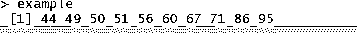

#### 4.快速排序

快速排序算法的工作原理类似分而治之。随机元素被选为数组中的中枢，然后除了中枢之外的所有其他元素被分成两个分区。在下一步中，小于和大于枢轴的所有元素被分成两个不同的分区。最后，使用递归对元素进行排序。

`> # Quick sort algorithm:
> quickSort <- function(arr) {
+   # Pick a number at random.
+   mid <- sample(arr, 1)
+
+   # Place-holders for left and right values.
+   left <- c()
+   right <- c()
+
+   # Move all the smaller values to the left, bigger values to the right.
+   lapply(arr[arr != mid], function(d) {
+     if (d < mid) {
+       left <<- c(left, d)
+     }
+     else {
+       right <<- c(right, d)
+     }
+   })
+
+   if (length(left) > 1) {
+     left <- quickSort(left)
+   }
+
+   if (length(right) > 1) {
+     right <- quickSort(right)
+   }
+
+   # Finally, return the sorted values.
+   c(left, mid, right)
+ }
>
> x <-sample(1:100,10)
>
> RES <- quickSort(x)
> RES`

**输出**

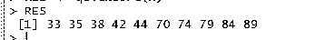

#### 5.合并排序

合并排序非常类似于快速排序，但是，这里数组被分成相等的两半。归并排序算法被分成两部分一个归并函数和一个排序函数。在归并排序中，一个列表被分解成多个子列表，直到每个子列表都由一个单独的元素组成。合并这些子列表的结果是一个排序列表。

`> mmerge<-function(a,b) {
+   r<-numeric(length(a)+length(b))
+   ai<-1; bi<-1; j<-1;
+   for(j in 1:length(r)) {
+     if((ai<=length(a) && a[ai]<b[bi]) || bi>length(b)) {
+       r[j] <- a[ai] +       ai <- ai+1
+     } else {
+       r[j] <- b[bi] +       bi <- bi+1
+     }
+   }
+   r
+ }
> mmergesort<-function(A) {
+   if(length(A)>1) {
+     q <- ceiling(length(A)/2)
+     a <- mmergesort(A[1:q])
+     b <- mmergesort(A[(q+1):length(A)])
+     mmerge(a,b)
+   } else {
+     A
+   }
+ }
>
> x <-sample(1:100,10)
>
> RES <- mmergesort(x)
> RES`

**输出**

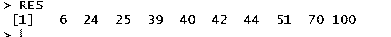

#### 6.堆排序

堆排序技术非常类似于选择排序技术，在选择排序中，在每次迭代中选择未排序列表中的最小元素，并将其放在列表的开头。然而，堆排序技术使用树的概念。

`> heap.structure<-function(vect)
+ {
+   le=length(vect)
+   heap=vec
+   for (k in le:1)
+   {
+     heap=modify_heap(heap,k)
+   }
+   return(heap)
+ }
>
>
> modify_heap<-function(heap, rooti)
+ {
+   le=length(heap)
+   flag=0
+
+   while (rooti*2 <= le && flag==1)
+   {
+     left.i=rooti*2
+     right.i=rooti*2+2
+     flag=1
+     child=c(heap[left.i],heap[right.i])
+     child=child[!is.na(child)] +     min.ind=which.min(child)
+     if (heap[rooti]>child[min.ind])
+     {
+       flag=1
+       heap.ind=c(left.i,right.i)[min.ind] +
+       tmp1=heap[heap.ind] +       heap[heap.ind]=heap[rooti] +       heap[rooti]=tmp1
+
+       rooti=heap.ind
+     }
+   }
+   return(heap)
+ }
>
> heap_sort<-function(heap)
+ {
+   sorted.heap=NULL
+   le=length(heap)
+   while(le>0)
+   {
+     sorted.heap=c(sorted.heap,heap[1])
+     le=length(heap)
+     heap[1]=heap[le] +     heap=heap[1:(le-1)] +     heap=modify_heap(heap,rooti=1)
+     le=le-1
+   }
+   return(sorted.heap)
+ }
>
>
> x <- sample(1:100,10)
> heap=heap.building(x)
> heap_sort=heap_sort(heap)
> heap_sort`

**输出**

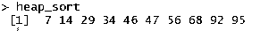

### 结论

在本文中，我们已经看到了使用 r 对数据进行排序的不同方法。我们已经看到了如何使用 sort and order 命令对数据帧进行排序，本文还展示了 sort 函数对 order 函数的进一步限制。不同排序算法的详细解释，如冒泡排序，选择排序和合并排序已经彻底讨论。排序是数据分析中最重要的步骤之一，具有不同的功能以满足不同的需求。完全由数据工程师根据可用数据选择最合适的排序方法。

### 推荐文章

这是一个 R 中排序的指南。这里我们讨论什么是 R 中排序，R 中排序的特性和类型。你也可以浏览我们推荐的其他文章来了解更多信息

1.  [数据科学语言](https://www.educba.com/data-science-languages/)
2.  [Tableau 排序介绍](https://www.educba.com/sorting-in-tableau/)
3.  [JavaScript 中的插入排序](https://www.educba.com/insertion-sort-in-javascript/)
4.  [Python 中的排序函数及示例](https://www.educba.com/sorting-in-python/)

