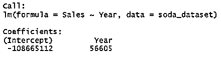
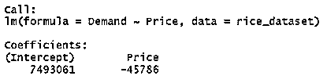

# R 中的 lm 函数

> 原文：<https://www.educba.com/lm-function-in-r/>

## 什么是 lm 函数？

在本文中，我们将讨论关于 lm 函数的 R. lm 函数有助于我们预测数据。让我们考虑这样一种情况，其中有一家汽水瓶制造厂，研究人员想要预测汽水瓶未来 5 年的需求。借助 lm 函数，我们可以解决这个问题。研究者必须向该函数提供一些信息来预测输出。在这个问题中，研究人员必须提供有关汽水瓶历史需求的信息，基本上是过去的数据。

该函数将处理过去的数据/历史数据，并预测汽水瓶的价值。模型预测的瓶子数量，制造厂必须制造出这个数量的瓶子。

<small>Hadoop、数据科学、统计学&其他</small>

我们再举一个零售店的例子。这里的问题陈述是一个商店想要估计大米的需求。基本上，商店想知道他们应该储存多少包才能满足需求。在这个问题中，研究人员首先收集过去的数据，然后将这些数据拟合到 lm 函数中。Lm 函数为我们提供了预测的数字。在这个预测数据集的帮助下，研究人员可以进行有效的呼叫，以确定他们必须储存多少大米包装才能满足需求。

**语法:**

`lm(formula, data, subset, weights, na.action,
method = "qr", model = TRUE, x = FALSE, y = FALSE, qr = TRUE,
singular.ok = TRUE, contrasts = NULL)`

在哪里，

公式是 lm 函数需要定义的一组变量。该函数中有一个因变量，也可以有多个自变量。例如，变量可以是距离和速度或财产比率、位置、财产大小和个人收入。

*   **数据:**它是一个设定的数据框架，基本上是为函数提取数据的环境。
*   **子集:**当我们必须从 lm 函数中使用的数据中选取特定的观察值时，这很有帮助。
*   **Weights:** 它是一个可选的向量，用于拟合过程。权重应为数字向量或空值。
*   **Na . function:**NA . function 用于当数据中有 NA 值时，研究人员必须传递指令，如该做什么。
*   **方法:**用于拟合过程，语法中预定义的方法是“qr”。
*   **模型:**这是一个逻辑函数，如果为真则返回相应的拟合分量。
*   **X:** 这是一个逻辑函数，如果为真，则返回相应的拟合分量。
*   **Y:** 这是一个逻辑函数，如果为真则返回相应的拟合分量。
*   **qr:** 这是一个逻辑函数，如果为真则返回相应的拟合分量。
*   好:它也是一个逻辑函数，如果它是假的，那么奇异拟合就是一个错误。

### R 中 lm 函数的例子

让我们在上面的例子中放一些数字。

#### 示例#1

问题陈述:有一家生产汽水瓶的工厂，研究人员想预测未来 5 年对汽水瓶的需求。

过去 20 年的历史数据如下:

| **年** | **销量(瓶数)** |
| Two thousand | Three million three hundred and ten thousand nine hundred and thirty-five |
| Two thousand and one | Five million seven hundred and nine thousand one hundred and eighty-four |
| Two thousand and two | Five million two hundred and seventy-four thousand five hundred and ten |
| Two thousand and three | Five million three hundred and forty-six thousand and sixty-four |
| Two thousand and four | Five million eight hundred and sixty-six thousand one hundred and seventeen |
| Two thousand and five | Three million four hundred and ten thousand two hundred and ninety-seven |
| Two thousand and six | Six million two hundred and eighty thousand nine hundred and seventy-five |
| Two thousand and seven | Three million nine hundred and thirty-eight thousand two hundred and forty-seven |
| Two thousand and eight | Three million three hundred and ninety-three thousand one hundred and twenty-three |
| Two thousand and nine | Three million seventy-one thousand two hundred and fifty-two |
| Two thousand and ten | Five million one hundred and seventy-six thousand three hundred and thirty-five |
| Two thousand and eleven | Seven million nine hundred and thirty-one thousand six hundred and fifty-two |
| Two thousand and twelve | Four million seven hundred and ninety-three thousand six hundred and forty-one |
| Two thousand and thirteen | Four million seven hundred and thirty-two thousand two hundred and eleven |
| Two thousand and fourteen | Four million three hundred and forty-nine thousand two hundred and eighty-six |
| Two thousand and fifteen | Six million seven hundred and seventy-two thousand eight hundred and ninety |
| Two thousand and sixteen | Six million nine hundred and sixty-six thousand eight hundred and eight |
| Two thousand and seventeen | Three million six hundred and forty thousand three hundred and eight |
| Two thousand and eighteen | Five million five hundred and two thousand six hundred and eighty-six |
| Two thousand and nineteen | Six million one hundred and eighty-seven thousand six hundred and ten |

**解决方案:**这里我们在使用这个历史数据的同时做一个 lm 函数。Lm 函数为我们提供了回归方程，借助于它我们可以预测数据。

回归方程:

**Y = β1 + β2X + ϵ**Where β1 is the intercept of the regression equation and β2 is the slope of the regression equation. β1 & β2 are also known as regression coefficients. ϵ is the error term.

*   **β1:** 回归方程的截距
*   **β2:** 回归方程的斜率
*   **Y:** 因变量
*   **X** :自变量

为了方便和简化步骤，我们将上述数据放在 CSV 文件中。

**问题的语法看起来像:**

`soda_dataset = read.csv("lm function in R.csv", header = TRUE)>
lm_soda_dataset = lm(Sales~Year, data = soda_dataset)>
lm_soda_dataset`

当我们在回归方程中拟合该输入时:

销售额=–108665112+56605 *年

当我们为这些信息提供更多数据时，我们将从中获得预测值。

#### 实施例 2

**问题陈述:**一家零售店想要估算大米的需求量。基本上，商店想知道他们应该储存多少包才能满足需求。但在此之前，他们会围绕大米的价格和需求进行一些研究。他们有过去 10 年大米价格和需求的数据。

**历史数据:**

| **年** | **价格** | **需求** |
| Two thousand and ten | Thirty-four | Three million four hundred and fifty-nine thousand two hundred and eighty-eight |
| Two thousand and eleven | Thirty-six | Five million three hundred and seventy-eight thousand seven hundred and sixty |
| Two thousand and twelve | Thirty-two | Seven million nine hundred and ninety-six thousand two hundred and thirteen |
| Two thousand and thirteen | Forty-five | Five million six hundred and twelve thousand two hundred and fifteen |
| Two thousand and fourteen | Thirty-eight | Five million three hundred and seventy-nine thousand four hundred and seventeen |
| Two thousand and fifteen | Forty-six | Five million six hundred and thirty-four thousand nine hundred and sixty-seven |
| Two thousand and sixteen | Thirty-four | Seven million six hundred and fifty thousand five hundred and seventy-two |
| Two thousand and seventeen | Forty-two | Four million eight hundred and seventy-five thousand six hundred and seventy-two |
| Two thousand and eighteen | Forty-four | Three million seven hundred and eighty-eight thousand three hundred and fifteen |
| Two thousand and nineteen | Forty-nine | Six million eight hundred and forty thousand eight hundred and fourteen |

**语法:**

`rice_dataset = read.csv("lm function in R.csv", header = TRUE)>
lm_rice_dataset = lm(Demand~Price, data = rice_dataset)>
lm_rice_dataset`

当我们在回归方程中拟合该输入时:

需求= 7493061–45786 *价格

当我们为这些信息提供更多数据时，我们将从中获得预测值。

### lm 函数的优势

lm 功能的优点如下:

*   这是一个简单而强大的统计函数。
*   帮助研究人员/学者/统计人员预测数据的功能之一。
*   帮助我们做出更好的商业决策。
*   它帮助我们分析数据。
*   帮助我们纠正错误。

### 结论

R 中的 lm 函数为我们提供了帮助我们预测数据的线性回归方程。它是统计学和数学中广泛使用的最重要的函数之一。lm 函数的唯一限制是，我们需要历史数据集来预测该函数中的值。但我们不能将此视为任何限制，因为如果我们必须预测任何事情，历史数据是必不可少的。历史数据向我们展示了趋势，在趋势的帮助下，我们可以预测数据。

### 推荐文章

这是 R 中 lm 函数的指南，在这里我们讨论 R 中 lm 函数的介绍和例子以及优点。您也可以看看以下文章，了解更多信息–

1.  [R 中预测函数的置信区间](https://www.educba.com/predict-function-in-r/)
2.  [Matlab 反函数示例](https://www.educba.com/matlab-inverse-function/)
3.  [R 中的内置函数](https://www.educba.com/functions-in-r/)
4.  [基本 AutoCAD 功能键](https://www.educba.com/autocad-function-keys/)

