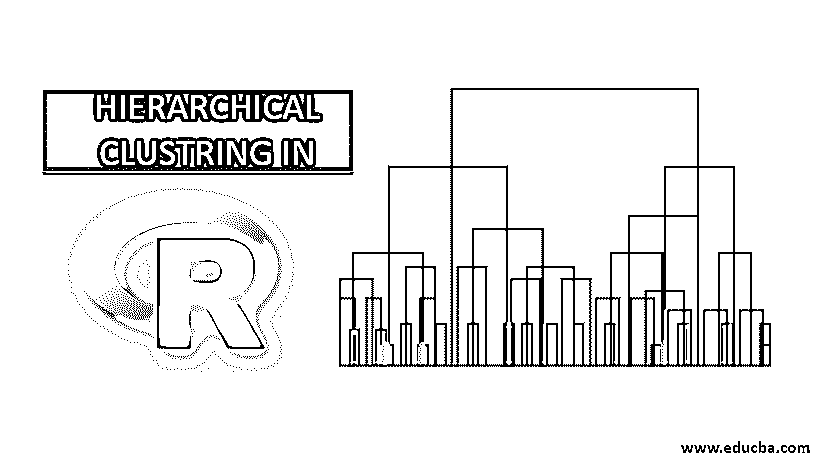
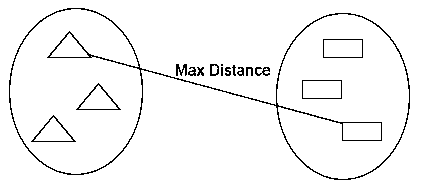
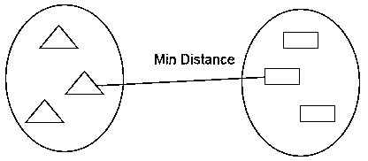
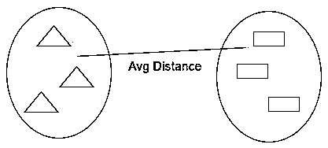
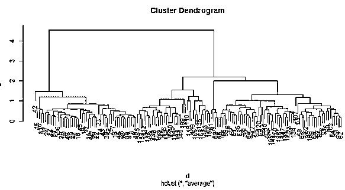

# R 中的层次聚类

> 原文：<https://www.educba.com/hierarchical-clustering-in-r/>

## R 中的层次聚类介绍

分级聚类机制允许将相似的对象分组为称为聚类的单元，并且作为商业问题研究的一部分，这使得用户能够单独研究它们以实现目标，并且算法概念可以非常有效地在 R 编程中实现，R 编程提供了一组健壮的方法，包括但不限于函数 hclust()，使得用户可以在聚类技术的分级性质的上下文中具体研究数据。

### 集群是如何工作的？

聚类算法将一组相似的数据点组成聚类。聚类算法的主要目标是创建特征相似的数据点的聚类。换句话说，一个聚类中的数据点是相似的，而一个聚类中的数据点与另一个聚类中的数据点不相似。

<small>Hadoop、数据科学、统计学&其他</small>

在[中主要有两种方法使用层次聚类算法](https://www.educba.com/hierarchical-clustering-algorithm/)，如下所示:

#### 1.结块的

它从单个集群中的每个观察开始。然后，观察中的相似性度量进一步合并聚类以形成单个聚类，直到不可能进一步合并；这种方法被称为凝聚法。

#### 2.分裂的

它从单个聚类中的所有观察开始，并基于相似性度量或相异度度量聚类进一步分裂，直到不可能分裂为止；这种方法被称为分裂法。

现在让我们开始层次聚类算法；分层[聚类可以](https://www.educba.com/hierarchical-clustering/)自顶向下或自底向上执行。我们从自下而上或凝聚方法开始，开始为每个数据点创建一个聚类，然后根据数据点中的一些相似性度量来合并聚类。下一个要点是我们如何衡量相似性。有许多距离矩阵是可用的，如欧几里德，雅克卡，曼哈顿，堪培拉，闵可夫斯基等。，找出相异度。距离矩阵的选择取决于可用数据集的类型；例如，如果数据集包含连续的数值，那么好的选择是欧几里德距离矩阵，而如果数据集包含二进制数据，那么好的选择是 Jaccard 距离矩阵等等。

### 在 R 中实现层次聚类

在 R 中实现层次聚类所需执行的步骤是:

#### 1.安装所有需要的 R 包

我们将使用以下软件包，因此在使用之前安装所有这些软件包:

`install.packages ( "cluster" ) # for clustering algorithms
install.packages ( "tidyverse" ) # for data manipulation
install.packages ( "factoextra" ) # for clustering visualization
# includes package in R as –
library ( "cluster" )
library( "tidyverse" )
library( "factoextra" )`

#### 2.数据准备

为系统聚类分析准备数据；这一步是非常基础和重要的；这里我们需要主要执行两项任务，即缩放和估计缺失值。必须对数据进行缩放、标准化或规范化，以使变量具有可比性。缩放、标准化或规范化是一个转换变量的过程，使它们的标准偏差为 1，平均值为零。

如果我们的数据集中存在任何缺失值，那么估算缺失值或删除数据点本身是非常重要的。有不同的选项可用于估算缺失值，如平均值、均值、中值来估算缺失值。例如，我们在这里使用 iris 内置数据集，其中我们要对 iris 类型的植物进行聚类；iris 数据集包含 3 个类，每个类 50 个实例。它包含 5 个特征，如萼片。长度，萼片。宽度，花瓣。长度，花瓣。宽度和种类。

**R 代码:**

`data <- iris
print(data)
# the sample of data set showing below which contain 1 sample for each class`

“萼片。长度" "萼片。宽度" "花瓣。长度" "花瓣。宽度" "种类"

1 4.9 3.5 1.3 0.2 濑户

51 7.0 3.1 4.5 1.3 云芝

弗吉尼亚 101 6.3 3.2 6.0 1.9

`data <- na.omit(data) # remove missing value
data <- scale(df) # scaling the variables or features`

#### 3.指定使用哪些分层聚类算法

r 中提供了不同类型的层次聚类算法，如凝聚层次聚类和分裂层次聚类。所需的函数有

*   **凝聚层次聚类(HC):** hclust 函数，在 stats 包中可用，Agnes 函数，在 cluster 包中可用】用于
*   **分裂式层次聚类:** Diana 函数，cluster 包中有。

#### 4.计算分层聚类

需要计算距离矩阵，将数据点放到正确的聚类中，计算层次聚类。我们可以用不同的方法计算集群之间的距离，如下所示:

**完全链接:**合并前计算聚类之间的最大距离。

**单链接:**合并前计算聚类之间的最小距离。

**平均链接:**计算合并前聚类之间的平均距离。

**R 代码:**

`cluster <- hclust(data, method = "average" )`

**质心连接:**在合并之前计算簇的两个质心之间的距离。

**R 代码:**

`# matrix of Dissimilarity
dis_mat <- dist(data, method = "euclidean")
# Hierarchical clustering using Complete Linkage
cluster <- hclust(data, method = "complete" )
#  or Compute with agnes
cluster <- agnes(data, method = "complete")`

#### 5.系统树图

树状图用于管理获得的聚类数。它的执行方式与 k-means 中的相同，k 用于控制多个聚类。我们可以用来切割树状图的当前函数。

**R 代码:**

`cutree(as.hclust(cluster), k = 3)`

**完整的 R 代码:**

`ibrary(scatterplot3d)
data <- iris
print( data )
data <- na.omit(data)
data <- scale(data)
# matrix of Dissimilarity
dis_mat <- dist(data, method = "euclidean")
# creating hierarchical clustering with Complete Linkage
cluster <- hclust(data, method = "complete" )
# Dendrogram plot
plot(cluster)
# or agnes can be used to compute hierarchical clustering
Cluster2 <- agnes(data, method = "complete")
# Dendrogram plot
plot(cluster2)`

**上面 R 码的剧情:**

### 结论

机器学习算法主要有监督学习算法和非监督学习算法两种。聚类算法是非监督学习算法的一个例子。聚类算法将一组相似的数据点组成聚类。在层次聚类算法中主要有两种方法的使用，如下面给出的凝聚层次聚类和分裂层次聚类。

### 推荐文章

这是 R. Here 中的层次聚类指南；我们将详细讨论集群的工作原理以及在 R 中实现层次集群。您也可以浏览我们的其他相关文章，了解更多信息-

1.  [聚类算法](https://www.educba.com/clustering-algorithm/)
2.  [什么是数据挖掘中的聚类？](https://www.educba.com/what-is-clustering-in-data-mining/)
3.  [聚类方法](https://www.educba.com/clustering-methods/)
4.  [机器学习方法](https://www.educba.com/machine-learning-methods/)
5.  [层次聚类分析概述](https://www.educba.com/hierarchical-clustering-analysis/)
6.  [R 包列表](https://www.educba.com/list-of-r-packages/)
7.  [数据挖掘聚类分析方法指南](https://www.educba.com/data-mining-cluster-analysis/)

