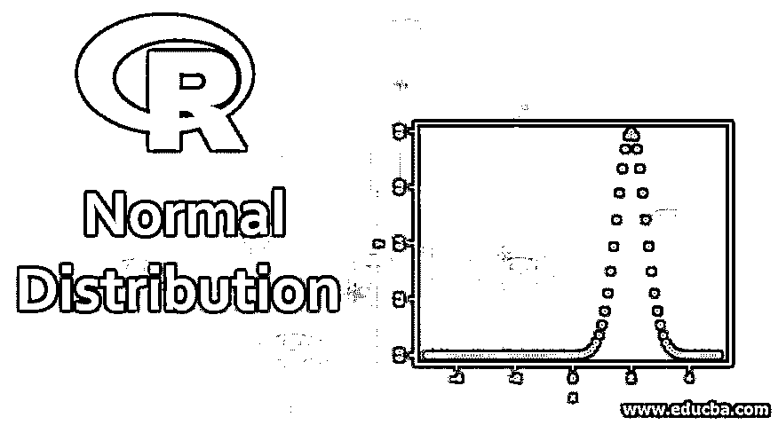
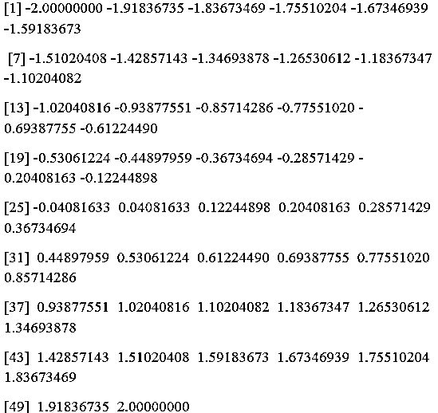
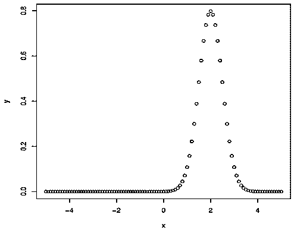
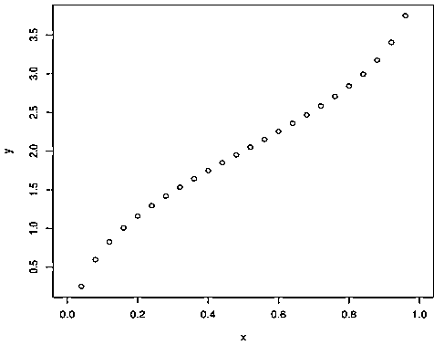
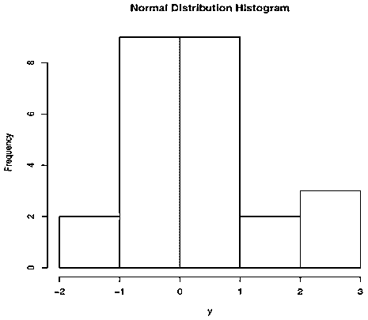
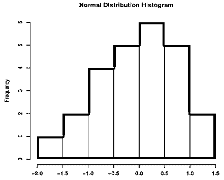

# r 正态分布

> 原文：<https://www.educba.com/r-normal-distribution/>

## R 正态分布简介

在这些文章中，我们将学习 R 正态分布。正态分布是统计学中的基本概念之一。它是由概率密度函数方程定义的。概率密度函数定义为具有平均值[和标准差](https://www.educba.com/standard-deviation-vs-mean/)的正态分布。

上述定义适用于统计学，但在 R 中，“它是来自不同独立来源的数据的集合。”变量被分配在水平轴上，这些值的计数在垂直轴上。曲线的中心代表平均值。在理想的正态分布图中，一半的变量值位于平均值的左边，一半位于平均值的右边。

<small>Hadoop、数据科学、统计学&其他</small>

### 绘制图表

在我们绘制图表之前，我们需要生成一系列值来绘制它们。

在 R 中，我们使用一个名为 seq()的函数来生成两个整数之间的一组随机值。让我们生成随机值，帮助我们绘制正态分布图。

**代码:**

`seq(-2,2,length=50)`

在上面的函数中，我们生成了介于-2 和 2 之间的 50 个值。下面是生成并存储在变量 x 中的值。

**输出:**

### R 正态分布中的函数

有四种不同的函数可以生成正态分布图。

*   **码数**
*   **pnorm**
*   **qnorm**
*   **rnorm**

**参数**

*   x 是一个数字向量。
*   p 是一组概率
*   n 是观察值的数量
*   平均值是数据的平均值。默认值为零。
*   sd 是标准偏差。默认值为 1。

#### 1.数据形式()

该函数用于给出指定平均值和标准偏差的概率分布。

**语法:** `dnorm(x, mean, sd)`

x-数字向量。平均值-数据的平均值。默认值为零。标准差。默认值为 1。

**代码:**

`# Create a sequence of numbers between -5 and 5 incrementing it by 0.2.
x <- seq(-5, 5, by = .1)
# The mean here is 2.0 and standard deviation as 0.5.
y <- dnorm(x, mean = 2.0, sd = 0.5)
#Plot the Graph
plot(x,y)
# Saving the file.
dev.off()`

**输出:**

**绘制正态分布图的步骤:**

1.  我们通过增加 x 数来创建序列。
2.  我们使用带有一组标准参数的函数，如平均值和标准差。
3.  用 x，y 值绘制图表。
4.  您可以使用以下命令创建图表并保存文件。

**给出文件名:** png(file = "disnorm.png ")

**保存文件:** dev.off()

#### 2 .诺玛()

pnorm 函数用于生成累积分布函数。随机变量 X 的累积分布函数，它是 X 值小于或等于 X 的概率。

**语法:** `pnorm(x, mean, sd)`

**代码:**

`# Create a sequence of numbers between -5 and 5 incrementing by 0.2.
x <- seq(-5,5,by = .2)
# mean is 2.0 and standard deviation as 1.
y <- pnorm(x, mean = 2.0, sd = 1)
# Plot the graph.
plot(x,y)
# Saving the file.
dev.off()`

**输出:**
T3】

#### 3.qnorm()

qnorm 函数获取概率值，并返回与概率值匹配的累积值。

**语法:** `qnorm(p, mean, sd)`

**代码:**

`# Creating a sequence of probability values incrementing by 0.04.
x <- seq(0, 1, by = 0.04)
# mean is 2 and standard deviation as 1.
y <- qnorm(x, mean = 2, sd = 1)
# Plotting the graph.
plot(x,y)
# Saving the file.
dev.off()`

**输出**

#### 4.Rnorm()

Rnorm 生成正态分布的随机数。我们使用随机数并将它们绘制在直方图上，以显示正态分布的数字。

**语法:** `rnorm(n, mean, sd)`

平均值-数据的平均值。默认值为零。标准差。默认值为 1。p 是一组概率。

**代码:**

`# Sample of 25 numbers which are normally distributed.
y <- rnorm(25)
# Plot the histogram for this sample.
hist(y, main = "Normal DIstribution Histogram")
# Save the file.
dev.off()`

**输出:**

现在让我们通过使用简单的参数 col:**“color”添加颜色来调整直方图**

**颜色:**可以输入任何颜色。上面的函数可以调整为纯色。

**代码:**

`hist(y, main = "Normal Distribution Histogram",col="blue" )`

**输出:**

我们可以将“col”参数用于上述四个函数中的任何一个。

### R 正态分布的优点

下面是 R 正态分布的优点:

*   大多数数量遵循正态分布，这符合正常现象，如身高，血压，智商水平。
*   当数据呈正态分布时，统计人员可以轻松处理数据。
*   它也可以用来控制质量。钟形曲线也称为高斯分布。

### 推荐文章

这是一个 R 正态分布的指南。这里我们用作图的方法来讨论 R 正态分布的作用和优点。您也可以浏览我们的其他相关文章，了解更多信息——

1.  [Matlab 中的随机数生成器](https://www.educba.com/random-number-generator-in-matlab/)
2.  [R 数据类型](https://www.educba.com/r-data-types/)
3.  [R 数据帧](https://www.educba.com/data-frames-in-r/)
4.  [R 中的数据帧](https://www.educba.com/data-frames-in-r/)

