# R 中的二项分布

> 原文：<https://www.educba.com/binomial-distribution-in-r/>

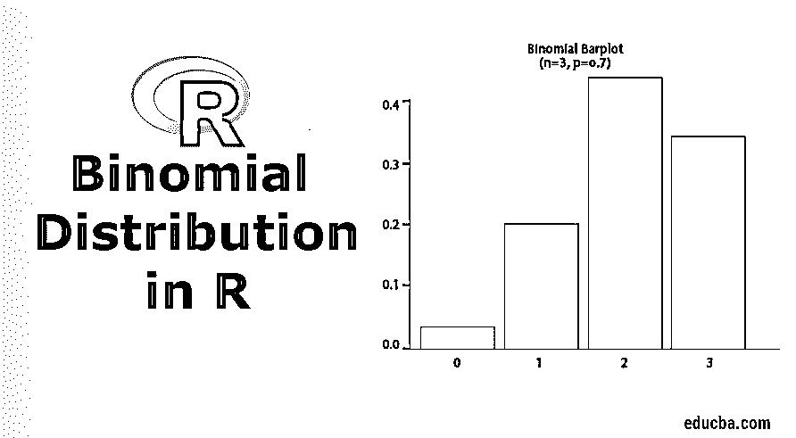

## R 中的二项分布简介

R 中的二项式分布是一种概率模型分析方法，用于检查只有两种可能结果的概率分布结果，它验证事件发生次数的成功可能性。它被归类为离散概率分布函数。R 语言中有内置函数可以用来评估数据集的二项式分布。R 中的二项分布是很好的拟合概率模型，其中结果是二分情景，例如投掷硬币十次并计算七次成功获得正面的概率，或者是十个顾客中有六个顾客在购物时购买特定产品的可能性。分别是 dbinom，pbinom，qbinom，rbinom。

格式化的语法如下所示:

<small>Hadoop、数据科学、统计学&其他</small>

### 句法

*   dbinom(x, size,prob)
*   pbinom(x, size,prob)
*   qbinom(x，size，prob)或 qbinom(x，size，prob，lower_tail，log_p)
*   rbinom(x, size,prob)

该函数有三个参数:值 x 是分位数的向量(从 0 到 n)，size 是尝试的次数，prob 表示每次尝试的概率。我们用一个例子一个一个来看。

#### 1.dbinom()

这是一个密度或分布函数。向量值必须是整数，不应该是负数。该函数试图在固定的试验次数中找到成功的次数。

二项式分布采用大小和 x 值。例如，size=6，可能的 X 值是 0，1，2，3，4，5，6，这意味着 P(X=x)。

`n <- 6; p<- 0.6; x <- 0:n
dbinom(x,n,p)`

**输出:**

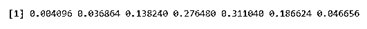

使概率为 1

`n <- 6; p<- 0.6; x <- 0:n
sum(dbinom(x,n,p))`

**输出:**

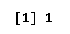

**例 1**–医院数据库显示，患癌症的病人中，65%死于癌症。随机选择 5 名患者，其中 3 名患者康复的概率是多少？

这里我们应用 dbinom 函数。使用所有点的密度分布，3 将恢复的概率。

n=5，p=0.65，x=3

`dbinom(3, size=5, prob=0.65)`

**输出:**

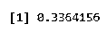

对于 0 到 3 的 x 值:

`dbinom(0, size=5, prob=0.65) +
+ dbinom(1, size=5, prob=0.65) +
+ dbinom(2, size=5, prob=0.65) +
+ dbinom(3, size=5, prob=0.65)`

**输出:**

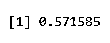

接下来，创建一个包含 40 篇论文的样本，增量为 2，同样使用 dbinom 创建二项式。

`a <- seq(0,40,by = 2)
b <- dbinom(a,40,0.4)
plot(a,b)`

执行上述代码后，它会产生以下输出，使用 plot()函数绘制二项式分布。

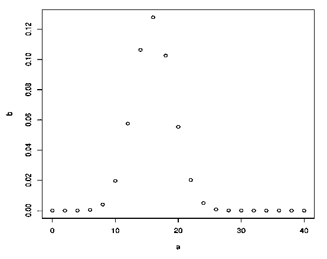

**示例 2—**考虑一个场景，假设学生从图书馆借书的概率是 0.7。图书馆里有 6 个学生，其中 3 个借一本书的概率是多少？

这里 P (X=3)

**代码:**

`n=3; p=.7; x=0:n; prob=dbinom(x,n,p);
barplot(prob,names.arg = x,main="Binomial Barplot\n(n=3, p=0.7)",col="lightgreen")`

下图显示了 p > 0.5 时的情况，因此二项式分布是正偏的。

**输出:**

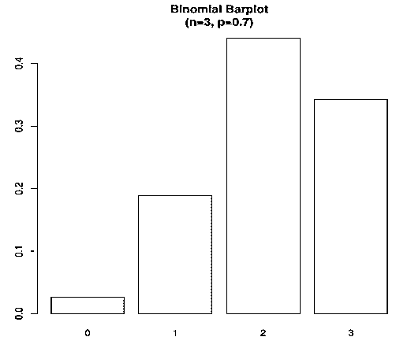

#### 2.Pbinom()

计算二项式或 CDF (P(X<=x))的累积概率。

**例 1:**

`x <- c(0,2,5,7,8,12,13)
pbinom(x,size=20,prob=.2)`

**输出:**

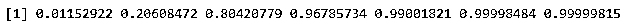

例 2: 当德拉维德投球时，他有 20%的机会得分。如果他投球 5 次，他得分 4 或更少的概率是多少？

这里成功的概率是 0.2，在 5 次尝试中我们得到

`pbinom(4, size=5, prob=.2)`

**输出:**

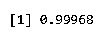

**例 3:** 4%的美国人是黑人。在没有替换的情况下，从一个 100 人的班级中随机选择 6 个学生，求 2 个黑人学生的概率。

当 R: x = 4 R: n = 6 R: p = 0 时。0 4

`pbinom(4,6,0.04)`

**输出:-**

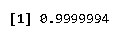

#### 3.qbinom()

这是一个分位数函数，与累积概率函数相反。累积值与概率值匹配。

**举例:**一枚硬币抛 61 次，有多少条尾巴会有 0.2 的概率。

`a <- qbinom(0.2,61,1/2)
print(a)`

**输出:-**

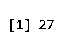

#### 4.rbinom()

它会产生随机数。不同的结果产生不同的随机输出，用于模拟过程。

**示例:-**

`rbinom(30,5,0.5)
rbinom(30,5,0.5)`

**输出:-**

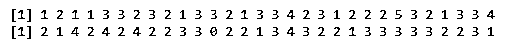

每次我们执行的时候都会产生随机的结果。

`rbinom(200,4,0.4)`

**输出:-**

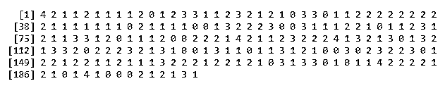

在这里，我们假设一次投掷 30 枚硬币的结果。

`rbinom(30,1,0.5)`

**输出:-**

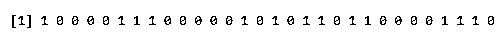

**使用柱状图:**

`a<-rbinom(30,1,0.5)
print(a)
barplot(table(a), border=FALSE)`

**输出:-**

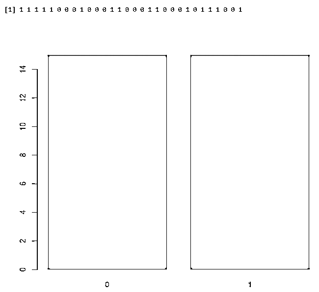

**寻找成功的意义**

`output <-rbinom(10,size=60,0.3)
mean(output)`

**输出:-**

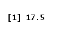

### 结论-R 中的二项分布

因此，在本文中，我们讨论了 R 中的二项式分布。我们使用 R studio 和 R snippets 中的各种示例进行了模拟，还描述了有助于生成二项式计算的内置函数。因此，二项式分布有助于使用二项式变量找到概率和随机搜索。

### 推荐文章

这是一个关于 r 中二项式分布的指南。在这里，我们讨论了与二项式分布相关的介绍及其功能，以及语法和适当的例子。您也可以浏览我们推荐的其他文章，了解更多信息——

1.  [二项式分布公式](https://www.educba.com/binomial-distribution-formula/)
2.  [经济 vs 商业](https://www.educba.com/economics-vs-business/)
3.  [商业分析技术](https://www.educba.com/business-analytics-techniques/)
4.  [Linux 发行版](https://www.educba.com/linux-distributions/)

