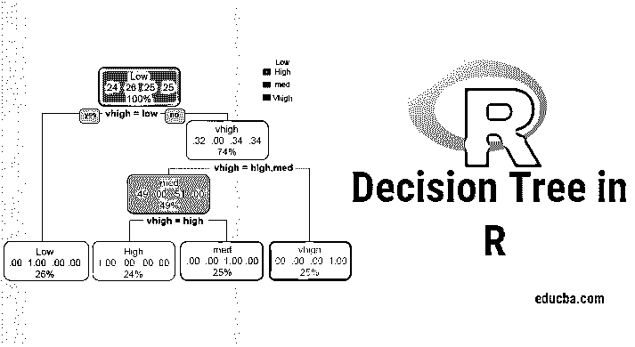
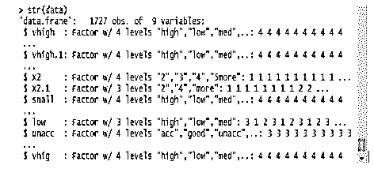
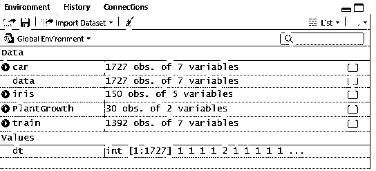
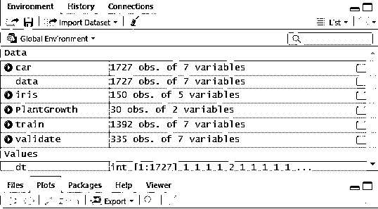
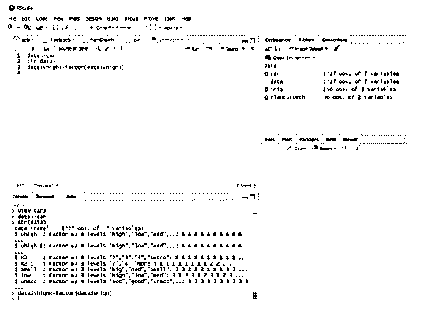
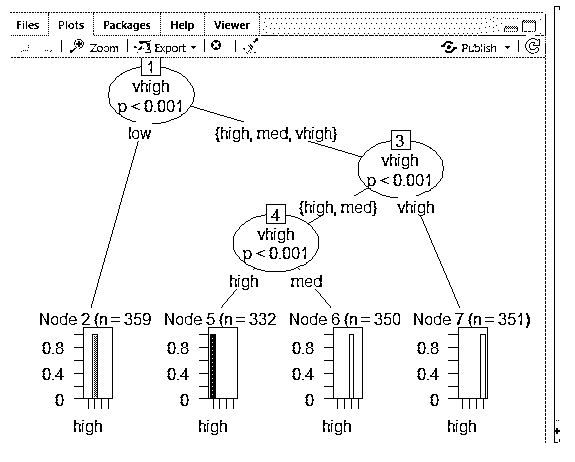
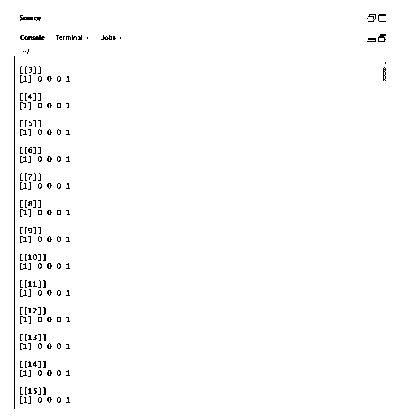
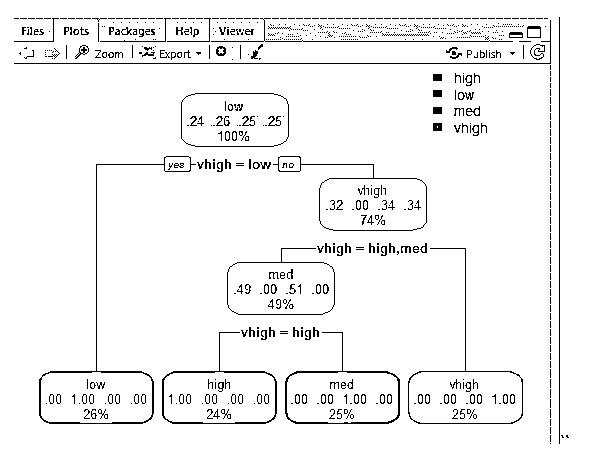
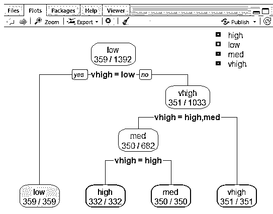

# R 中的决策树

> 原文：<https://www.educba.com/decision-tree-in-r/>

## R 中的决策树综述

R 中的决策树是一种机器学习算法，可以是分类或回归树分析。决策树可以通过图形表示来表示为具有叶子和分支结构的树。树叶通常是数据点，树枝是为数据集类别做出决策的条件。R 中的决策树被认为是受监督的机器学习模型，因为决策点的可能结果被很好地定义用于数据集。它也被称为 CART 模型或分类和回归树。有一个流行的 R 包叫做 rpart，用于在 R 中创建决策树。

### R 中的决策树

用 R 语言或者通俗的话来说，要使用决策树，有必要[使用大数据集](https://www.educba.com/what-is-big-data/)，直接使用内置的 R 包使工作变得更容易。决策树是一种非线性假设模型，它使用树形结构对关系进行分类。R 中的决策树使用两种类型的变量:分类变量(是或否)和连续变量。决策树的术语包括根节点(形成一个类别标签)、决策节点(子节点)、终端节点(不要进一步分割)。这种机器学习方法背后的独特概念是，他们将给定的数据分类成形成是或否流(if-else 方法)的类，并以树形结构表示结果。R 中决策树使用的算法是基尼指数、信息增益、熵。在 R: rpart(递归)、party、random Forest、CART(分类和回归)中有不同的包可以用来构建决策树。在 r 中实现决策树是相当容易的。

<small>Hadoop、数据科学、统计学&其他</small>

为了清楚地分析，树被分成组:训练集和测试集。以下实现使用汽车数据集。该数据集包含 1727 个 obs 和 9 个变量，并以此建立分类树。在这篇文章中，让我们树一个“党”包。函数 creates()使用绘图函数给出条件树。

### 使用 R 实现

目标是研究汽车数据集，以预测汽车价值是高/低还是中等。

#### 一.准备数据

安装软件包和加载库

该模块将数据集作为完整的数据帧读取，数据结构如下所示:

`data<-car // Reading the data as a data frame
str(data) // Displaying the structure and the result shows the predictor values.`

**输出:**

`Determining Factordata$vhigh<-factor(data$vhigh)> View(car)
> data<-car`

#### 二。将数据分区

使用训练数据集拆分数据。决策树被分割成子节点以具有良好的准确性。复杂度由树的大小和错误率决定。在这里进行复制并生成一些行。

`set. Seed (1234)
dt<-sample (2, nrow(data), replace = TRUE, prob=c (0.8,0.2))
validate<-data[dt==2,]`

图 *:* 显示数据值

接下来，使数据值为 2

`validate<-data[dt==2,]`

图 *:* 显示 R 工作室的 R 控制台

**在 R 中创建一个与包方的决策树**

*   点击软件包->安装->聚会。这里，我们从数据集上的 1727 个观察样本中提取了前三个输入。创建一个模型来预测输入中的高、低、中。

**实施:**

`library(party)
tree<-ctree(v~vhigh+vhigh.1+X2,data = train)
tree`

**输出:**

**使用 Ctree** 绘图

**预测:**

Prob 生成得分概率，

**实施:**

`predict(tree,validate,type="prob")
predict(tree,validate)`

[1] vhigh vhigh vhigh vhigh vhigh vhigh vhigh vhigh vhigh vhigh vhigh [12] vhigh vhigh vhigh vhigh vhigh vhigh vhigh vhigh vhigh vhigh vhigh [23] vhigh vhigh vhigh vhigh vhigh vhigh vhigh vhigh vhigh vhigh vhigh [34] vhigh vhigh vhigh vhigh vhigh vhigh vhigh vhigh vhigh vhigh vhigh [45] vhigh vhigh vhigh vhigh vhigh vhigh vhigh vhigh vhigh vhigh vhigh [56] vhigh vhigh vhigh vhigh vhigh vhigh vhigh vhigh vhigh vhigh vhigh [67] vhigh vhigh vhigh vhigh vhigh vhigh vhigh vhigh vhigh vhigh vhigh [78] vhigh vhigh vhigh high high high high high high high high [89] high high high high high high high high high high high [100] high  high  high  high  high  high  high  high  high  high  high[111] high  high  high  high  high  high  high  high  high  high  high [122] high  high  high  high  high  high  high  high  high  high  high [133] high  high  high  high  high  high  high  high  high  high  high [144] high  high  high  high  high  high  high  high  high  high  high [155] high  high  high  high  high  high  high  high  high  high  high [166] high  high  high  high  high  high  high  high  high  high  high [177] high  high  high  high  med   med   med   med   med   med   med [188] med   med   med   med   med   med   med   med   med   med   med [199] med   med   med   med   med   med   med   med   med   med   med [210] med   med   med   med   med   med   med   med   med   med   med [221] med med med med med med med med med med med [232] med med med med med med med med med med med [243] med med med med med med med med med med med [254] med   med   med   med   med   med   med   med   med   low   low [265] low   low   low   low   low   low   low   low   low   low   low [276] low   low   low   low   low   low   low   low   low   low   low [287] low   low   low   low   low   low   low   low   low   low   low [298] low   low   low   low   low   low   low   low   low   low   low [309] low   low   low   low   low   low   low   low   low   low   low [320] low   low   low   low   low   low   low   low   low   low   low [331] low   low   low   low   low

级别:高低中高

**使用 rpart 的决策树**

使用 rpart()函数为 class 方法预测类。rpart()使用基尼指数度量来分割节点。

`library(rpart)
tr<-rpart (v~vhigh+vhigh.1+X2, train)
library (rpart. plot)
rpart. plot(tr)`

“

`**rpart.plot(tr,extra=2)**`

这条线绘制了树，并显示了设置 2 的额外特征的概率，产生的结果如下所示。

**

** 

**分类错误**

误差率防止过拟合。

`tbl<-table(predict(tree), train $v)
print(tbl)
tepre<-predict(tree,new=validate)`

**输出:**

列印(tbl)

高低中高

高 332 0 0 0

低 0 359 0 0

地中海 0 0 350 0

vhigh 0 0 0 351

### 结论

决策树是 R 中的一个关键挑战，与其他模型相比，决策树的优点是易于理解和阅读。它们在数据科学问题中被广泛使用。这些是在统计分析中产生决策层次的工具。理解决策树的逻辑解释需要统计知识。正如我们所看到的，决策树很容易理解，当它有较少的类别标签时，结果是有效的，它们的另一个缺点是当有更多的类别标签时，计算变得复杂。这篇文章让你能够熟练地建立预测和基于树的学习模型。

### 推荐文章

这是一个用 R 语言编写的决策树的指南。在这里我们讨论入门，如何使用和实现使用 R 语言。您也可以浏览我们推荐的其他文章，了解更多信息——

1.  [Java 中的二叉树是什么？](https://www.educba.com/what-is-a-binary-tree-in-java/)
2.  [R 编程语言](https://www.educba.com/r-programming-language/)
3.  [什么是 Visual Studio 代码？](https://www.educba.com/what-is-visual-studio-code/)
4.  [R 中的线图介绍](https://www.educba.com/line-graph-in-r/)

