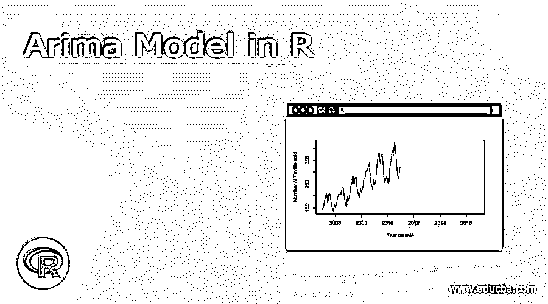
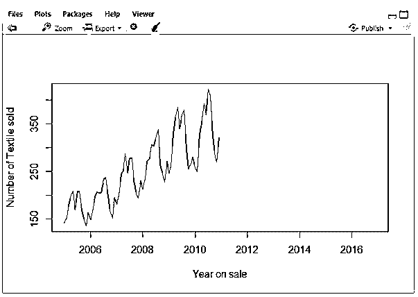
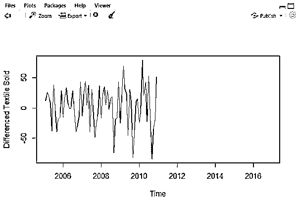
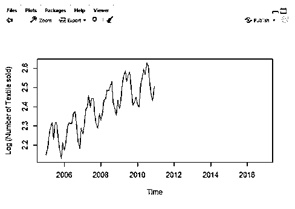
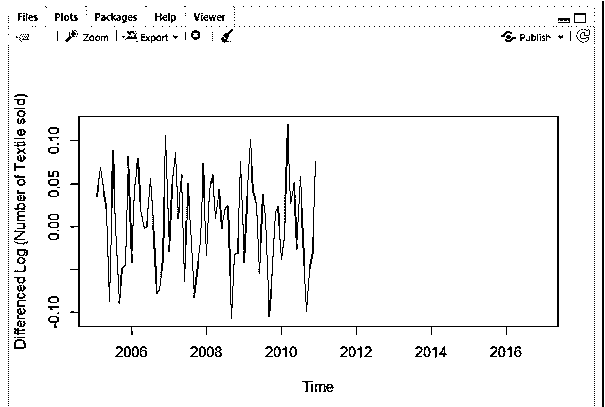
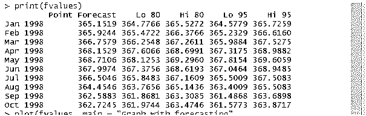
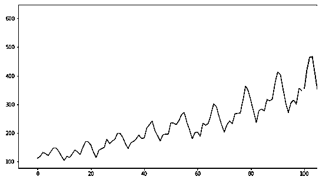

# R 中的 Arima 模型

> 原文：<https://www.educba.com/arima-model-in-r/>

## Arima 模型的定义

Arima，简称自回归综合移动平均(Auto-Regressive Integrated Moving Average ),是 R 编程语言中使用的一组模型，用于根据以前的预测值描述给定的时间序列，并专注于未来的值。时间序列分析用于发现一段时间内的数据行为。该模型是预测时间序列最广泛使用的方法。Arima()函数用于处理模型。

**语法:**

<small>Hadoop、数据科学、统计学&其他</small>

`Auto.arima()`

这将搜索订单参数。

### Arima 模型在 R 中是如何工作的？

ARIMA 模型是预测未来序列值的一种更简单的模型，它采用的时间序列数据是一段时间内间隔相等的点(值的模式、增长率、异常值或时间点之间的噪声)。最大似然估计(MLE)用于估计 ARIMA 模型。该模型采用了三个重要参数:p、d、q。MLE 有助于在计算参数估计时最大化这些参数的似然性。
ARIMA

p-是自回归或线性模型的阶次
q-是移动平均值/滞后值数量的阶次
d-使时间序列从非平稳变为平稳的差值。所以我们在这里执行 ARMA，而不是 ARIMA(意味着没有积分)。比 ARIMA 好的是季节性 ARIMA。
现在让我们看看这三个参数是如何相互关联的，最后，看看 ACF 和 PACF 的图。因为 AR 使用其滞后误差作为预测值。并且当所使用的预测器不是彼此独立时效果最佳。该模型基于两个重要的概念:
1。作为输入的数据序列应该是稳定的。
2。由于 ARIMA 采用过去的值来预测未来的输出，输入数据必须保持不变。

**实施步骤:**

1.安装程序包预测后加载数据集。
2。预处理的步骤已经完成，它创建了一个单独的时间序列或时间戳。
3。使时间序列平稳，并检查所需的转换。
4。将执行差值“d”。
5。在 ARIMA 的核心重要步骤是策划 ACF 和 PACF。
6。从图中确定两个参数 p 和 q。
7。以前创造的价值符合香气模型，并预测未来的价值。拟合过程也称为 Box-Jenkins 方法。
8。做验证。
自动。Arima()函数用于自动预测和 ARIMA 模型。该函数使用单位根检验、最小化 AIC 和最大似然估计来获得 ARIMA 模型。为了使序列平稳，我们需要区分以前的值和当前的值。
d= pval-cval，如果数值已经稳定，则 d=0。
predict()–用于根据所使用的各种拟合模型的结果来预测模型。
在本节中，我们将使用数据集的图形和图表来预测 ARIMA 的时间序列。以下各节分析了未来几年的预测。

**工作过程**

探索模型时要采取的以下步骤:

形容词（adjective 的缩写）探索性分析
b .适合度
c .诊断措施

最佳模型选择过程是必要的，因为在工业情况下，大量的时间序列需要预测。
1。在 R 中进行时间序列数据建模，使用下面的命令将原始数据转换成时间序列格式。如果数据集已经在时间序列中，则不需要 ts()。
ts(data[，2]，start = c(start time，1)，frequency =数值)
// ts 给出每日、每周、每月的观测数据。Start 给出了开始评估的时间，可能是一年。如果是每月计划，频率值将是 12。

### 例子

所有给定的 R 代码都在 RStudio 中执行，以绘制未来预测值。

#### 示例#1:纺织品数据集上的销售

以下是通过 ARIMA 建模预测情景的逐步过程。我在这里使用的案例研究是一个纺织品销售数据集。我已经单独附上了文件。

**代码:**

**步骤 1:** 加载实施所需的 R 包和数据集

`data=read.csv('C:/sale.csv')
data = ts(data[,2],start = c(2005,1),frequency = 12)
plot(data, xlab='Year on sale', ylab = 'Number of Textile sold')`

**第二步:**

`plot(diff(data),ylab='Differenced Textile Sold')`

情节会是:

**步骤-3:** 携带对数变换数据

`plot(log10(data),ylab='Log (Number of Textile sold)')`

现在这个系列看起来像

**第四步:**差值

`plot(diff(log10(data)),ylab='Differenced Log (Number of Textile sold)')`

**步骤 5:** 评估和迭代

`require(forecast)
> ARIMAfit = auto.arima(log10(data), approximation=FALSE,trace=FALSE)
> summary(ARIMAfit)
Series: log10(data)
ARIMA(0,1,1)(1,1,0)[12] Coefficients:
ma1 sar1
-0.5618 -0.6057
s.e. 0.1177 0.1078
sigma^2 estimated as 0.000444: log likelihood=142.17
AIC=-278.34 AICc=-277.91 BIC=-272.11
Training set error measures:
ME RMSE MAE MPE
Training set 0.000213508 0.01874871 0.01382765 0.009178474
MAPE MASE ACF1
Training set 0.5716986 0.2422678 0.0325363`

**步骤 6 :** 为了检查 P 和 Q 值，我们需要执行 acf()和 pacf()，这是一个自相关函数。

#### 示例 2

`library(forecast)
png(file = "TimeSeries1.png")
plot(CO2, main = "Plot with no forecasting",
col.main = "yellow")
dev.off()
png
2
png(file = "TimeSeries2.png")
fit <- auto.arima(co2)
fvalues <- forecast(fit, 10)
print(fvalues)
plot(fvalues, main = " Plot with forecasting",",
col.main = "red")
dev.off()
png
2`

**解释**

通过在 Rstudio 中执行上述代码，我们得到了以下输出。这里，使用 forecast()在 Co2 数据集中预测接下来的 10 个值。

**输出:**

#### 示例 3:使用汽车销售数据集

`library(forecast)
library(Metrics)
Attaching package: ‘Metrics’
The following object is masked from ‘package:forecast’:
accuracy
Warning message:
package ‘Metrics’ was built under R version 3.6.3
data = read.csv('https://raw.githubusercontent.com/jbrownlee/Datasets/master/monthly-car-sales.csv')
valid = data[51:nrow(data),] train = data[1:50,] valid = data[51:nrow(data),] train$Month = NULL
model = auto.arima(train)
summary(model)
Series: train
ARIMA(2,0,2) with non-zero mean
Coefficients:
ar1 ar2 ma1 ma2 mean
0.9409 -0.6368 -0.0249 0.4868 11921.2100
s.e. 0.1837 0.1611 0.2254 0.1606 636.7033
sigma^2 estimated as 5124639: log likelihood=-455.41
AIC=922.82 AICc=924.78 BIC=934.3
Training set error measures:
ME RMSE MAE MPE MAPE MASE
Training set 21.53119 2147.598 1627.823 -3.37804 15.03798 0.6857703
ACF1
Training set 0.02558285
forecast = predict(model,40)
rmse(valid$monthly-car-sales, forecast$pred)`

**输出:**

### 结论

结束时，ARIMA 模型有助于预测时间序列中的未来值，这有助于优化商业决策。我们已经介绍了许多关于预测和 AR、MR 模型的基本知识。时间序列预测是主要技能，数据科学家希望预测月环比支出值。

### 推荐文章

这是一个 R 中 Arima 模型的指南。在这里，我们讨论 Arima 模型的定义，语法，如何在 R？例如，代码实现。您也可以看看以下文章，了解更多信息–

1.  [费尔康模型](https://www.educba.com/phalcon-model/)
2.  [角的 ng 模型](https://www.educba.com/angularjs-ng-model/)
3.  [软件开发模型](https://www.educba.com/software-development-models/)
4.  [JavaScript 文档对象模型](https://www.educba.com/javascript-document-object-model/)

