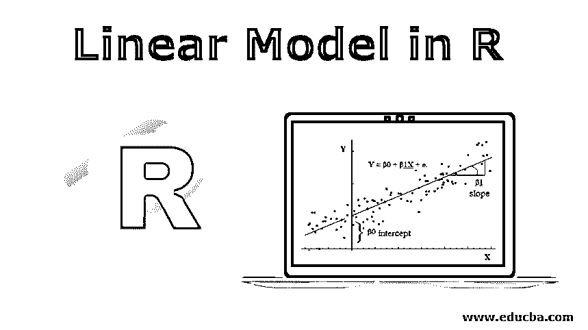
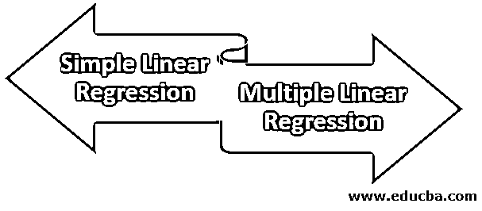
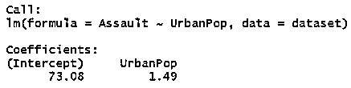
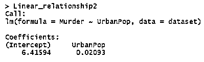

# R 中的线性模型

> 原文：<https://www.educba.com/linear-model-in-r/>

## R 中线性模型介绍

一种统计或数学模型，用于制定因变量与单个或多个自变量之间的关系，称为 r 中的线性模型。标准是模型形成中涉及的变量满足某些假设，这些假设是模型建立之前的必要前提，并且模型具有某些重要元素作为其组成部分，这些元素包括公式、数据、子集、权重、方法、模型、偏移等。没有必要每次都使用所有的工具，只需要在给定的上下文中使用那些足够的和必要的工具。

**线性模型的优点:**

<small>Hadoop、数据科学、统计学&其他</small>

*   帮助我们理解数据的类型和性质。
*   帮助我们预测数据。
*   帮助我们从数据中做出统计推断。

现在我们将学习线性回归，它基本上是一种用于创建这些模型的统计方法。这个模型的主要目的是解释因变量和自变量之间的关系。

### R 中线性模型的语法

下面是 R 中线性模型的语法。

**语法:**

`lm(formula, data, subset, weights, na.action,
method = "qr", model = TRUE, x = FALSE, y = FALSE, qr = TRUE,
singular.ok = TRUE,offset, ...)`

以下是线性模型的参数，解释如下:

*   **公式:**这里我们要输入我们数据集的变量，基本上就是我们打算追踪它们之间是否存在任何关系的那些变量。格式要像(因变量~自变量)一样固定。例如(距离~速度)，(需求~价格)等。
*   **数据:**当我们必须传递一个可选的数据列表、数据框或环境时，就会用到它。
*   当我们必须使用观察值的子集时，它帮助我们定义数据。
*   **权重:**它只接受数字向量或“空”命令。如果不为空，则“WLS(加权最小二乘法)”与权重一起使用，如果为空，则使用 OLS(普通最小二乘法)。
*   **Na.action:** 会给出数据点有 Na 值时应该怎么做的指令，比如 na.fail，na.omit，na.exclude 等。
*   **方法:**用于拟合。
*   **模型:**为逻辑向量，如果为真，则返回相应的拟合分量。
*   它是一个逻辑向量，如果它为真，则返回 f it 的相应分量。
*   **Y:** 如果为真，则返回相应的 f it 分量，这是一个逻辑向量。
*   **qr:** 它是一个逻辑向量，如果它为真，则返回 f it 的相应分量。
*   好的:它也是一个逻辑向量，如果它是假的，那么奇异拟合就是错误。
*   **偏移量:**可以是空，可以是数值向量，也可以是矩阵。这用于在拟合期间指定要包括在线性预测器中的先验已知分量。

### R 中线性模型的类型

现在让我们讨论不同类型的线性模型，如下所示:

#### 1.简单线性回归

这个模型帮助我们解释一个因变量和一个自变量之间的关系。在它的帮助下，我们还可以通过提供输入值来预测数据。一般来说，因变量也称为响应变量、回归变量、观察变量、响应变量、测量变量、解释变量、实验变量、结果变量和/或输出变量。以及被称为受控变量、回归变量、解释变量、操纵变量、暴露变量和/或输入变量独立变量。简单线性回归模型的方程式为:

Y = β1 + β2X + ϵ

其中，β1 是截距，β2 是斜率，ϵ是误差项。我们将使用“USArrest”数据集。

|  | **谋杀被捕人数(每 10 万人)** | **袭击逮捕(每 10 万人)** | **城市人口百分比** | **强奸被捕人数(每 10 万人)** |
| 亚拉巴马州 | Thirteen point two | Two hundred and thirty-six | Fifty-eight | Twenty-one point two |
| 阿拉斯加 | Ten | Two hundred and sixty-three | Forty-eight | Forty-four point five |
| 亚利桑那州 | Eight point one | Two hundred and ninety-four | Eighty | Thirty-one |
| 阿肯色州 | Eight point eight | One hundred and ninety | Fifty | Nineteen point five |
| 加利福尼亚 | Nine | Two hundred and seventy-six | Ninety-one | Forty point six |
| 科罗拉多州 | Seven point nine | Two hundred and four | Seventy-eight | Thirty-eight point seven |
| 康涅狄格州 | Three point three | One hundred and ten | Seventy-seven | Eleven point one |
| 特拉华河 | Five point nine | Two hundred and thirty-eight | Seventy-two | Fifteen point eight |
| 佛罗里达州 | Fifteen point four | Three hundred and thirty-five | Eighty | Thirty-one point nine |
| 格鲁吉亚 | Seventeen point four | Two hundred and eleven | Sixty | Twenty-five point eight |
| 夏威夷 | Five point three | Forty-six | Eighty-three | Twenty point two |
| 爱达荷 | Two point six | One hundred and twenty | Fifty-four | Fourteen point two |
| 伊利诺伊 | Ten point four | Two hundred and forty-nine | Eighty-three | Twenty-four |
| 印第安纳 | Seven point two | One hundred and thirteen | Sixty-five | Twenty-one |
| 艾奥瓦州 | Two point two | Fifty-six | Fifty-seven | Eleven point three |
| 堪萨斯州 | Six | One hundred and fifteen | Sixty-six | Eighteen |
| 肯塔基 | Nine point seven | One hundred and nine | Fifty-two | Sixteen point three |
| 路易斯安那 | Fifteen point four | Two hundred and forty-nine | Sixty-six | Twenty-two point two |
| 缅因州 | Two point one | Eighty-three | Fifty-one | Seven point eight |
| 马里兰州 | Eleven point three | Three hundred | Sixty-seven | Twenty-seven point eight |
| 马萨诸塞州 | Four point four | One hundred and forty-nine | Eighty-five | Sixteen point three |
| 密歇根 | Twelve point one | Two hundred and fifty-five | Seventy-four | Thirty-five point one |
| 明尼苏达州 | Two point seven | Seventy-two | Sixty-six | Fourteen point nine |
| 密西西比河 | Sixteen point one | Two hundred and fifty-nine | Forty-four | Seventeen point one |
| 密苏里河 | Nine | One hundred and seventy-eight | Seventy | Twenty-eight point two |
| 蒙大拿 | Six | One hundred and nine | Fifty-three | Sixteen point four |
| 内布拉斯加州 | Four point three | One hundred and two | Sixty-two | Sixteen point five |
| 内华达州 | Twelve point two | Two hundred and fifty-two | Eighty-one | Forty-six |
| 新罕布什尔州 | Two point one | Fifty-seven | Fifty-six | Nine point five |
| 新泽西州 | Seven point four | One hundred and fifty-nine | Eighty-nine | Eighteen point eight |
| 新墨西哥州 | Eleven point four | Two hundred and eighty-five | Seventy | Thirty-two point one |
| 纽约 | Eleven point one | Two hundred and fifty-four | Eighty-six | Twenty-six point one |
| 北卡罗来纳州 | Thirteen | Three hundred and thirty-seven | Forty-five | Sixteen point one |
| 北达科他州 | Zero point eight | Forty-five | Forty-four | Seven point three |
| 俄亥俄州 | Seven point three | One hundred and twenty | Seventy-five | Twenty-one point four |
| 俄克拉何马州 | Six point six | One hundred and fifty-one | Sixty-eight | Twenty |
| 俄勒冈州 | Four point nine | One hundred and fifty-nine | Sixty-seven | Twenty-nine point three |
| 宾夕法尼亚州 | Six point three | One hundred and six | Seventy-two | Fourteen point nine |
| 罗得岛 | Three point four | One hundred and seventy-four | Eighty-seven | Eight point three |
| 南卡罗来纳州 | Fourteen point four | Two hundred and seventy-nine | Forty-eight | Twenty-two point five |
| 南达科塔州 | Three point eight | Eighty-six | Forty-five | Twelve point eight |
| 田纳西州 | Thirteen point two | One hundred and eighty-eight | Fifty-nine | Twenty-six point nine |
| 得克萨斯州 | Twelve point seven | Two hundred and one | Eighty | Twenty-five point five |
| 犹他州 | Three point two | One hundred and twenty | Eighty | Twenty-two point nine |
| 佛蒙特州 | Two point two | Forty-eight | Thirty-two | Eleven point two |
| 弗吉尼亚 | Eight point five | One hundred and fifty-six | Sixty-three | Twenty point seven |
| 华盛顿 | Four | One hundred and forty-five | Seventy-three | Twenty-six point two |
| 西弗吉尼亚州 | Five point seven | Eighty-one | Thirty-nine | Nine point three |
| 威斯康星州 | Two point six | Fifty-three | Sixty-six | Ten point eight |
| 怀俄明州 | Six point eight | One hundred and sixty-one | Sixty | Fifteen point six |

现在我们将找到攻击变量和城市人口之间的关系。

> dataset = USArrests
>Linear _ relationship 1 = lm(突击~城市警察，数据= dataset)
>Linear _ relationship

等式看起来像:

Assault = β1 + β2(UrbanPop)

现在我们还有截距和斜率，突击= 73.08 + 1.49(UrbanPop)。这里我们有一个线性模型方程，我们必须以“UrbanPop”的形式提供输入，模型方程将自动为我们预测“Assualt”的值。让我们再举一个这个模型的例子，现在我们将在谋杀变量和城市人口变量上运行这个模型。

> View(USArrests)
>Linear _ relationship 2 = lm(Murder ~ urban pop，data=dataset)

等式看起来像:

Murder = β1 + β2(UrbanPop)

现在我们还有截距和斜率，谋杀= 6.41594 + 0.02093(UrbanPop)。这里我们有一个线性模型方程，我们要以“UrbanPop”的形式供给输入，模型方程会自动为我们预测“谋杀”的值。

#### 2.多元线性回归

在这个模型中，我们将有一个因变量和多个自变量。该模型使用多个自变量来预测一个因变量。我们来举一个这种模式的例子。这里我们也将使用“USArrests”数据集。

因变量=城市人口
自变量=袭击、强奸和谋杀

> Multiple _ Linear _ Relationship = lm(urban pop ~殴打+强奸+谋杀，data = dataset)
>Multiple _ Linear _ Relationship

等式看起来像:

UrbanPop = β1 + β2(Assault) + β3(Rape) + β4(Murder)

现在我们还有截距和斜率，UrbanPop= 52.8419 + 0.0519(攻击)+ 0.6984(强奸)-1.4115(谋杀)

### 结论

线性模型通常围绕两个参数工作:一个是斜率，通常称为变化率，另一个是截距，基本上是初始值。当我们处理数字数据时，这些模型非常常用。这些模型的结果很容易被分解以达到最终结果。因此，研究者、学者、经济学家更喜欢这些模型。

### 推荐文章

这是 R 中线性模型的指南。这里我们讨论 R 中线性模型的类型、语法和参数以及它的优点。您也可以浏览我们推荐的其他文章，了解更多信息——

1.  [什么是回归分析？|工作|福利](https://www.educba.com/what-is-regression-analysis/)
2.  [R 中的因子介绍](https://www.educba.com/factors-in-r/)
3.  [泊松回归中的 R](https://www.educba.com/poisson-regression-in-r/)
4.  [线性回归建模](https://www.educba.com/linear-regression-modeling/)
5.  [多元线性回归完全指南](https://www.educba.com/multiple-linear-regression/)
6.  [R 中多元线性回归指南](https://www.educba.com/multiple-linear-regression-in-r/)

