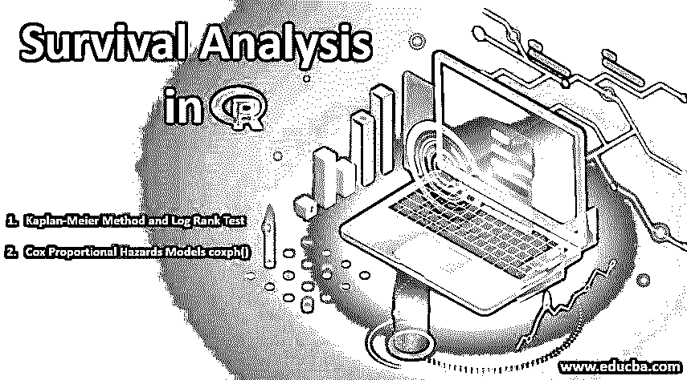
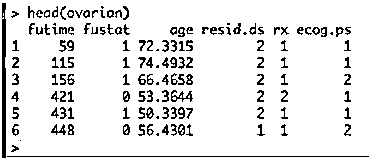
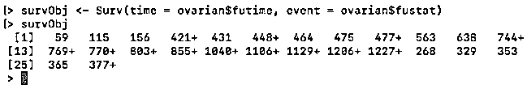
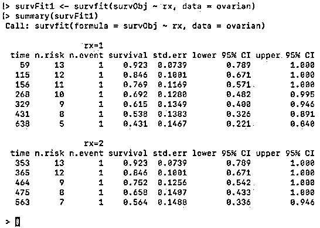
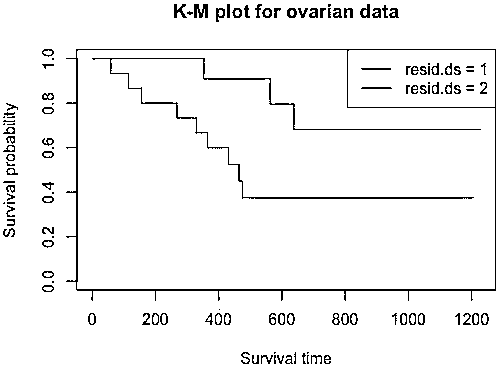
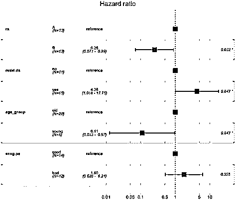

# R 中的生存分析

> 原文：<https://www.educba.com/survival-analysis-in-r/>

## R 中生存分析的介绍

R 中的生存分析用于估计所研究的特定人群的寿命。它也被称为**、**事件时间分析，因为目标是预测特定事件将要发生的时间。它也被称为死亡时间分析或故障时间分析。例如，我们可以考虑预测一个人的死亡时间或预测一台机器的寿命。从任何公司的角度来看，我们可以将出生事件视为员工或客户加入公司的时间，将相应的死亡事件视为员工或客户离开公司或组织的时间。

**数据:**存活数据集是由不同的开始和结束时间组成的事件时间数据。在实时数据集中，并非所有样本都从零时间开始。样本可以在任何时间进入进行研究。因此，受试者在时间 t 等于零时(t=0)被带到共同的起点。当用于生存分析的数据过大时，我们需要将数据分组，以便于分析。

<small>Hadoop，数据科学，统计学&其他</small>

生存分析是临床数据的主要关注点。在此帮助下，我们可以确定死亡或某些疾病复发等事件的时间。这对于比较两个患者或两组患者是有用的。数据可以被审查。术语“审查”是指不完整的数据。有时受试者退出研究，并且在整个研究期间没有经历感兴趣的事件。在这种情况下，当事件直到最后一个研究点才被经历时，该事件被审查。

### 必要的包装

R 中生存分析的必备包是“生存”和“生存者”。对于这些软件包，R 的版本必须高于或至少为 3.4。

*   **生存:**用于计算生存分析
*   **Survminer :** 用于总结和可视化生存分析的结果。

包名“survival”包含函数 Surv()。这个函数创建一个生存对象。函数 survfit()用于创建分析图。

R 中创建生存分析的基本语法如下:

`Surv(time,event)
survfit(formula)`

在哪里，

时间是事件发生前的后续时间。该事件指示预期事件发生的状态。公式是预测变量之间的关系。

### R 中生存分析的类型

生存分析主要有两种方法:

*   **Kaplan-Meier 方法和对数秩检验:**该方法可以使用函数 survfit()实现，plot()用于绘制生存对象。函数 ggsurvplot()也可用于绘制 survfit 的对象。
*   **Cox 比例风险模型 coxph():** 该函数用于获取生存对象，ggforest()用于绘制生存对象的图形。这是一片森林。

### 生存分析在 R 中的实现

首先，我们需要安装这些软件包。

`install.packages(“survival”)
install.packages(“survminer”)`

为了获取包，我们使用 library()函数导入它们。

`library(“survival”)
library(“survminer”)`

让我们加载数据集并检查它的结构。对于生存分析，我们将使用卵巢数据集。为了加载数据集，我们在 r 中使用 data()函数。

`data(“ovarian”)`

卵巢数据集包括卵巢癌患者和各自的临床信息。它还包括患者被跟踪直到死亡或失访的时间，患者是否被审查，患者年龄，治疗组分配，残余疾病的存在和表现状态。

为了检查数据集，让我们执行 head(ovarian ),它返回数据集的前六行。

`head(ovarian)​​`

**输出:**

这里，列是-futime-生存时间 fustat 生存时间是否被删截-患者年龄 rx-两种治疗方案之一 resid.ds 肿瘤消退 ecog.ps 根据标准 ecog 标准的患者表现。这里我们可以看到，年龄是一个连续的变量。所以这个应该转换成二进制变量。这个的门槛应该是什么？让我们计算它的平均值，这样我们就可以选择截止值。

`mean(ovarian$age)`

它的值等于 56。这里以 50 为门槛。我们将年龄> 50 岁视为“老”，否则视为“年轻”。

`ovarian <- ovarian %>% mutate(ageGroup = ifelse(age >=50, "old","young"))
ovarian$ageGroup <- factor(ovarian$ageGroup)`

现在，我们将使用 Surv()函数，并借助存活时间和截尾数据输入来创建存活对象。

`survObj <- Surv(time = ovarian$futime, event = ovarian$fustat)
survObj`

**输出:**

此处，附加在某些数据上的“+”号表示被删截的数据。

现在，为了将 Kaplan-Meier 曲线拟合到这个生存对象，我们使用函数 survfit()。我们可以根据分配给患者的治疗方案“rx”对曲线进行分层。生存对象的 summary()显示所有患者的生存时间和比例。

`survFit1 <- survfit(survObj ~ rx, data = ovarian)
summary(survFit1)`

**输出:**

要查看生存曲线，我们可以使用 plot()并将 survFit1 对象传递给它。legend()函数用于给绘图添加一个图例。

`plot(survFit1, main = "K-M plot for ovarian data", xlab="Survival time", ylab="Survival probability", col=c("red", "blue"))
legend('topright', legend=c("rx = 1","rx = 2"), col=c("red","blue"), lwd=1)`

**输出:**

现在让我们从相同的数据中再举一个例子来检验剩余疾病状态的预测值。

`survFit2 <- survfit(survObj ~ resid.ds, data = ovarian)
plot(survFit2, main = "K-M plot for ovarian data", xlab="Survival time", ylab="Survival probability", col=c("red", "blue"))
legend('topright', legend=c("resid.ds = 1","resid.ds = 2"), col=c("red", "blue"), lwd=1)`

**输出:**

这里我们可以看到，曲线很早就分叉了。这里，将 resid.ds=1 视为较少或没有残留疾病，而将 resid.ds=2 视为是或较高疾病，我们可以说具有较少残留疾病的患者具有较高的存活概率。现在让我们用 Cox 比例风险法进行生存分析。使用 coxph()得出风险比(HR)。如果 HR>1，则死亡概率高，如果小于 1，则死亡概率低。

`survCox <- coxph(survObj ~ rx + resid.ds + age_group + ecog.ps, data = ovarian)
ggforest(survCox, data = ovarian)`

首先，我们需要更改列 rx、resid.ds 和 ecog.ps 的标签，以便考虑将它们用于危险分析。

`ovarian$rx <- factor(ovarian$rx, levels = c("1", "2"), labels = c("A", "B"))
ovarian$resid.ds <- factor(ovarian$resid.ds, levels = c("1", "2"),
labels = c("no", "yes"))
ovarian$ecog.ps <- factor(ovarian$ecog.ps, levels = c("1", "2"), labels = c("good", "bad"))`

**输出:**

这里我们可以看到，方案 1 或“A”的患者比方案“B”的患者具有更高的风险。同样，年龄小的人死亡概率低，年龄大的人死亡概率高。

### 推荐文章

这是一个 R 中生存分析的指南。在这里，我们讨论 R 中生存分析的必要包和类型的基本概念及其实现。您也可以阅读以下文章，了解更多信息——

1.  [R 中的多元线性回归](https://www.educba.com/multiple-linear-regression-in-r/)
2.  [R 中的双向方差分析示例](https://www.educba.com/two-way-anova-in-r/)
3.  if 语句在 R 中如何工作？
4.  [R 中 lm 函数的例子](https://www.educba.com/lm-function-in-r/)

