# R 中的标准偏差

> 原文：<https://www.educba.com/standard-deviation-in-r/>

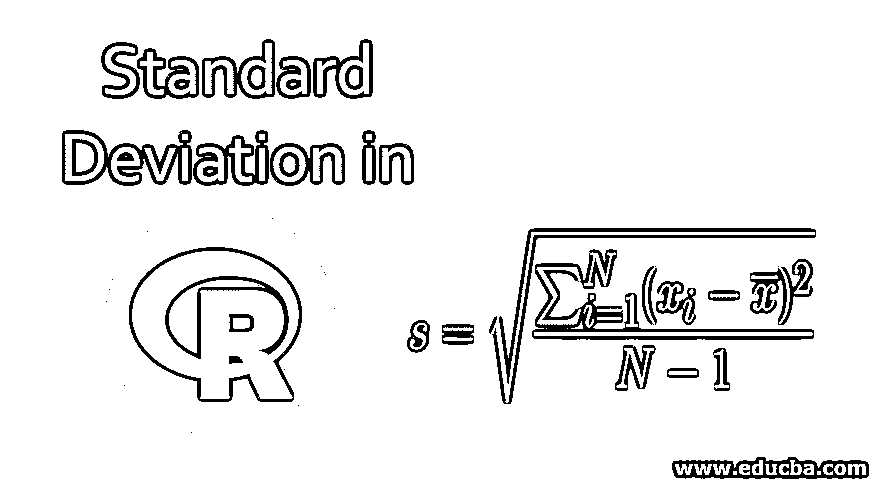

## R 中的标准差概述

R 中的标准差是一种统计量，用于测量一组值的离差或变化量。通常，当我们处理值时，需要找出值与平均值之间的差异时，就会用到它。

标准差的数学公式:

<small>Hadoop、数据科学、统计学&其他</small>

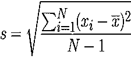

在哪里，

*   **S:** 样本标准差。
*   **N:** 观察次数。
*   **xi:** 样本项的观测值。
*   **x̅:** 观察值的平均值。

### 标准差怎么算？

计算标准差的步骤如下:

*   **第一步:**计算所有观测值的平均值。
*   **第二步:**然后对于每一次观察，减去平均值，将它的值加倍(平方)。
*   **第三步:**我们从观测值中扣除均值后得到一些值，对所有值求和。
*   **第四步:**最后，将求和除以观察次数减 1。

完成 4 个步骤后，您将获得标准偏差。

### 标准偏差步长示例

我们举个例子，按照这些步骤来。

#### 示例#1

数据集看起来像，

4,8,9,4,7,5,2,3,6,8,1,8,2,6,9,4,7,4,8,2

**第一步:**计算所有观测值的平均值，

*   均值=(4+8+9+4+7+5+2+3+6+8+1+8+2+6+9+4+7+4+8+2)/20
*   平均值= 107/20
*   平均值= **5.35**

**第二步:**对于每个观察值，减去平均值，为了方便起见，我们将其放在表格中，

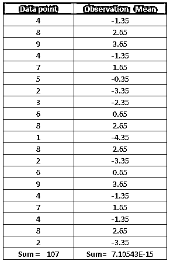

将第二列的值加倍(观察–mean)^2.

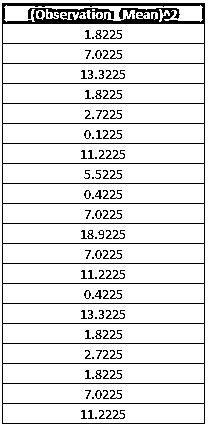

**第三步:**对上一列中出现的所有值求和。

1.8225+7.0225+13.3225+1.8225+2.7225+0.1225+11.2225+5.5225+0.4225+7.0225+18.9225+7.0225+11.2225+0.4225+13.3225+1.8225+2.7225+1

**第四步:**我们将计算标准偏差，将总和除以观察次数减 1，然后对结果求平方根。

标准差=(126.55/19)^0.5 =**2.58079**

#### 实施例 2

现在，我们来看看其他一些不同数据集的例子。在本例中，我们有两列。在一列中有一些我们分配给这些人的字母代码，在下一列中，我们有这些人的年龄。

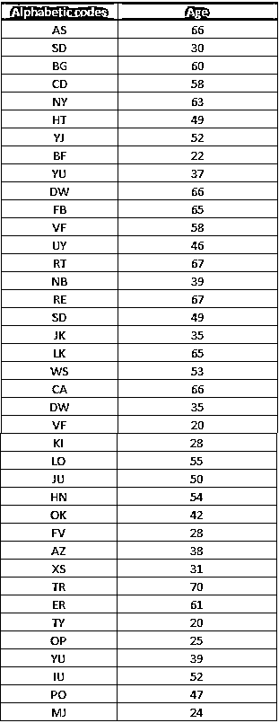

**第一步:**我们将在 r 中上传 excel 文件，这里我们将使用 read.csv 函数，因为我们的 excel 文件是 csv 格式的。假设这个表格在 excel 中，那么它如何在 Rstudio 中工作，我们将一步一步地讨论这个问题。excel 文件的名称是“字母代码”。

同样的功能看起来像，

`SD_age = read.csv("alphabetic code.csv")`

**第二步:**从 excel 文件中计算标准差。如我们所见，2 列包含一个数值。我们将专门在该列上运行我们的代码，

在 R 中，标准差的语法如下:

`standard_deviation_age = sd(SD_age)
standard_deviation_age`

代码的输出为我们提供了数据集的标准偏差。年龄的标准差为 **15.52926** 。

### R 中的标准差方法

有多种方法可以计算 r 中的标准差。我们将在这里讨论一种长方法和一种非常短的方法。

#### 1.长方法

这个方法将包含我们在本文前面所做的相同步骤，现在唯一的不同是我们将使用 R 命令。

**第一步:**计算所有观测值的平均值。

**代码:**

`dataset = c(4,8,9,4,7,5,2,3,6,8,1,8,2,6,9,4,7,4,8,2)
meandataset = mean(dataset)
meandataset`

**输出:**

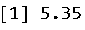

**第二步:**对于每个观测值，从数据集的所有观测值中减去平均值。为此，我们将在 R 中做一个函数，它将帮助我们找到[观察-均值]。

**代码:**

`dataset = c(4,8,9,4,7,5,2,3,6,8,1,8,2,6,9,4,7,4,8,2)
meandataset = mean(dataset)
sumdataset = function(dataset){dataset-meandataset}
Observation_Mean = sumdataset(dataset)
Observation_Mean`

**输出:**

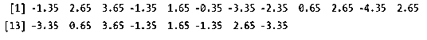

输出显示了数据集中所有值的观察平均值。现在，我们将对该输出的每个值求平方，然后求和。

**代码:**

`dataset = c(4,8,9,4,7,5,2,3,6,8,1,8,2,6,9,4,7,4,8,2)>
meandataset = mean(dataset)>
sumdataset = function(dataset){dataset-meandataset}
Observation_Mean = sumdataset(dataset)
square_Observation_Mean = Observation_Mean*Observation_Mean
square_Observation_Mean`

**输出:**

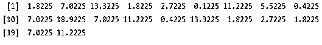

**第三步:**对上一列中出现的所有值求和。现在我们将添加所有这些[(观察-mean)^2].

**代码:**

`dataset = c(4,8,9,4,7,5,2,3,6,8,1,8,2,6,9,4,7,4,8,2)
meandataset = mean(dataset)
sumdataset = function(dataset){dataset-meandataset}
Observation_Mean = sumdataset(dataset)
square_Observation_Mean = Observation_Mean*Observation_Mean
sum_square_Observation_Mean = sum(square_Observation_Mean)
sum_square_Observation_Mean`

**输出:**

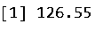

**第四步:**我们来计算标准差。不，我们将把在上述所有步骤中获得的所有必要信息放入该函数中:

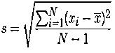

*   标准偏差= (126.55/19)^0.5
*   标准差= **2.58079**

在 R 中，标准差的语法如下:

**代码:**

`dataset = c(4,8,9,4,7,5,2,3,6,8,1,8,2,6,9,4,7,4,8,2)
meandataset = mean(dataset)
sumdataset = function(dataset){dataset-meandataset}
Observation_Mean = sumdataset(dataset)
square_Observation_Mean = Observation_Mean*Observation_Mean
sum_square_Observation_Mean = sum(square_Observation_Mean)
standard_deviation = sqrt(sum_square_Observation_Mean/19)
standard_deviation`

**输出:**

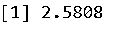

因此我们可以看到标准差和之前得到的是一样的。

#### 2.简短方法

R 中直接方法的语法如下所示:

`sd(x, na.rm = FALSE)`

其中 sd 是标准偏差。x 是我们需要找到标准偏差的那些设定值。na.rm，如果为真，则将从数据集/矩阵/数据框等中移除所有缺失值。如果它是假的，那么它不会从数据集中删除丢失的值。

**代码:**

`dataset = c(4,8,9,4,7,5,2,3,6,8,1,8,2,6,9,4,7,4,8,2)
sd(dataset)`

**输出:**

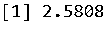

### 结论

标准差告诉我们数据集中的观察值与实际平均值相差多少。低标准差和高标准差的意义是:

*   高标准差告诉我们，数据集中的数字/观察值更加分散。
*   低标准差告诉我们，数据集中的数字/观察值分布较少，或者我们可以说它们接近平均值。

### 推荐文章

这是一个 R 中标准差的指南，这里我们讨论 R 中标准差的步骤和方法，以及例子和代码实现。您也可以看看以下文章，了解更多信息–

1.  [R 中线性模型的语法](https://www.educba.com/linear-model-in-r/)
2.  [R 中简单线性回归的优势](https://www.educba.com/simple-linear-regression-in-r/)
3.  [PowerShell 中 for 循环的 4 个主要部分](https://www.educba.com/for-loop-in-powershell/)
4.  [如何在 R 中创建一个因子？](https://www.educba.com/factors-in-r/)

