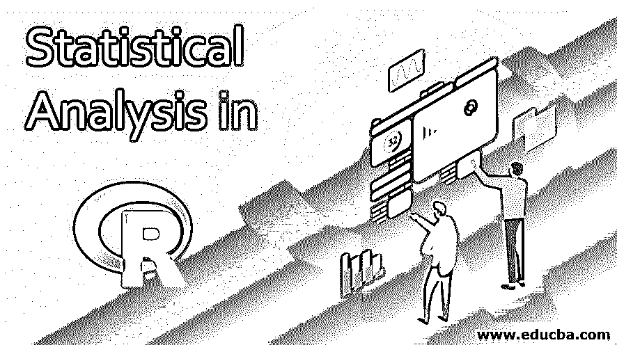
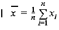
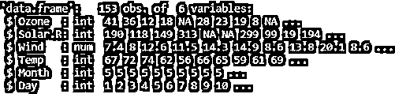
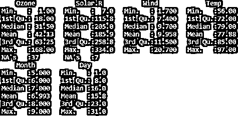
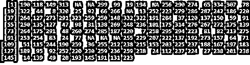

# R 中的统计分析

> 原文：<https://www.educba.com/statistical-analysis-in-r/>

## R 中的统计分析介绍

统计分析是应用统计技术和模型来分析数据以得出有意义的模式的过程。有几种概念、方法和工具可用于统计分析。常用的统计分析技术包括识别数据集上的数据分布。在对商业和研究工作进行统计分析时，会用到一些统计术语和符号。识别给定数据集的均值、中值和众数是分析数据的一些主要步骤。统计分析是数据科学项目的核心注释。有一些特定的编程语言，如广泛用于统计分析的 R 语言。

### 使用 R 的统计分析

统计分析是分析数据集的第一步。统计是在[上进行数据挖掘](https://www.educba.com/what-is-data-mining/)或任何其他数据相关操作的基础。R 统计分析可以在内置函数的帮助下进行，内置函数是 R 基础包的重要组成部分。均值、中值、众数、范围、总和、差异、均值和最大值等函数是 r 中用于统计分析的几个内置函数。处理大数据时，确定数据集的集中趋势至关重要，即用一个值表示整个数据集。在本文中，我们将查看内置的统计函数，如均值、中值和众数，并了解如何使用它们来确定数据集的中心趋势。

<small>Hadoop、数据科学、统计学&其他</small>

#### 1.平均

计算平均值是为了确定数据集中所有数值变量的平均值。平均值可以进一步分类为“集合中所有值的总和/特定集合中值的总数。”

例如，对于大小为 n 的数据集的样本均值，可以表示为:

*   **N** =数据集的大小
*   **X** =样本平均值
*   **Xi** =序列中的数字

现在让我们看看确定 r 中均值的基本语法。

**语法:**

`Mean(X, na.rm= False/True,…)`

在上面的语法中，均值运算可以借助 R 中的 mean()运算符来执行，X 是存储数据的输入向量，na.rm 是从数据集中移除空值的函数。默认情况下，R 在变量中有 NA 值。在确定平均值时，可以包括多个变量，例如用于从排序向量的两端丢弃一些观察值的 trim。

**举例:**

在下面的示例中，我们将创建一个名为 temp 的向量，然后使用 mean()函数使用该向量来确定平均值。

`# Creating a vector
temp <- c(12,9,6,4.1,19, 3, 44,-23,8,-3)
# to determine the mean
result.mean <- mean(temp)
print(result.mean)`

**输出:**

#### 2.中位数

中位数是定义低于百分之五十的观察值的值。为了手动确定中值，需要从最高的 50%中分离出最低的 50%。对于具有奇数个观察值的数据集，中间值是中值。对于具有偶数个观察值的数据集，中位数落在两个中间值的中间。

**语法:**

`Median(X, na.rm = FALSE)`

在上面的语法中，可以借助 R 中的 median()运算符执行中值运算，X 是存储数据的输入向量，na.rm 是从数据集中移除空值的函数。默认情况下，R 在变量中有 NA 值。类似于 mean 的语法，可以包含方法的多个进一步的参数。

**举例:**

`x <- c(5,2,3,4,5,2,4,5,2,3,1,1,2,3,5,6) # our data set
median(x)`

**输出:**

#### 3.方式

该模式是一个汇总统计，很少在实践中使用，但通常包括在任何工具和中位数的讨论。如果所选变量具有离散值，则 Mode 是出现频率最高的值。

**语法:**

`Mode(x, na.rm= False,...)`

在上面的语法中，Mode()运算符用于执行模式操作，na.rm 用于在执行模式操作时删除空值。

**举例:**

`#function to estimate mode
est_mode <- function(x) {
den <- density(x)
den$x[which.max(den$y)] }
# creating a test data set
x <- c(5, 5, 6, 4, 4, 2, 3, 1, 5, 3)
est_mode(x)`

**输出:**

### 数据集的统计分析

在本节中，我们将了解如何使用 r 对数据集进行统计分析。为了便于说明，我们将使用名为 AirQuality 的内置数据集。该数据集由多个变量组成，并包含空值。我们将考虑其中一个变量，并使用 R 内置工具确定均值、中值和众数。

`#Determining Mean, Median, and Mode using air quality dataset.
#To return the dimension of air quality dataset
dim(airquality)`

`# returning top 5 rows
head(airquality)`

`# to return the structure of the data
str(airquality)`

`# display dataframe Summary
summary(airquality)`

`# Determining the mean, median and mode from the Solar variable
x <- airquality$Solar.R
x`

`# Determining the mean, median and mode from the Solar variable
x <- airquality$Solar.R
x`

`# to determine mean Null values need to be removed from the variable
x <- airquality$Solar.R
mean(x, na.rm = TRUE)`

`# to determine the median
> x <- airquality$Solar.R
> median(x)`

`x <- airquality$Solar.R
median(x, na.rm = TRUE)`

`# to find mode
x <- airquality$Solar.R
sort(table(x))`

### 结论

在本文中，我们已经看到了如何使用 R 语言的内置工具 mean、median 和 mode 进行统计分析。我们已经分别讨论了均值、中值和众数以及它们的语法和一个简单的例子。我们还看到了对空气质量数据集进行统计分析的运行示例。

### 推荐文章

这是一个 R 中的统计分析指南。在这里，我们讨论使用 R 的统计分析，如均值、中值和众数，以及示例和代码实现。你也可以看看下面的文章来了解更多-

1.  [R 中的线性模型](https://www.educba.com/linear-model-in-r/)
2.  如何在 R 中创建散点图？
3.  [OLS 的实施](https://www.educba.com/ols-regression-in-r/)
4.  [实施泊松回归](https://www.educba.com/poisson-regression-in-r/)

