# R 中的 t 检验

> 原文：<https://www.educba.com/t-test-in-r/>

## R 中的 T-检验介绍

下面的文章提供了 r 中 T 检验的概要。T 检验用于测量两组的平均值，以检查它们是否相等。假设检验被数据研究人员大量用于找出他们的想法。在某些情况下，测量或比较单个项目实际上是不适用的，为了解决这个问题，开发了统计方法，在比较的情况下测试假设。一个最广为人知的假设是 T 检验，也称为学生 T 检验。T-test 倾向于使用数据均匀分布的正态分布。

### R 中 T 检验是如何进行的？

R 中的 T 检验是使用 t.test()函数执行的。它有助于比较组平均值。它是通过对数据进行一次或两次样本 T 检验来完成的。正态性检验是根据样本大小通过几种技术来完成的。使用 Q-Q 图和直方图进行视觉分析。

<small>Hadoop、数据科学、统计学&其他</small>

让我们举一个例子，作为一名工程学院的教授，想要分析男性和女性在计算机能力上的差异。计算机智能测试很费时间，因此很难对所有学生进行测试。因此，随机选择一名男性和一名女性候选人进行考察。这里的 T 检验计算两个样本的平均值。

T 检验可分为单样本检验、独立双样本检验(不相关)、配对检验(相关)。

*   **一个样本检验:**要检验的条件是给定的数据是否正态分布。对于单个平均值，将给出一个特殊公式。
*   **独立双样本检验(不相关):**该检验考虑两个样本的数据，方差相等或不相等。
*   **成对检验(相关):**该检验验证两样本数据之间的差异正态分布。

语法如下所示:

他们有不同的论点:

`t.test (x, y)`

其中 x 和 y 是数据。

### R 中的 T 检验示例

这里我们可以按照如何在 T-test 中实现 R。

**条件:**

*   数据应该是连续的。
*   观察值的随机选择。
*   检查数据是否正态分布。

#### 示例#1

实施单一样本测试。

在这种测试的情况下，t 检验可以用来计算学生的成绩。计算零假设的显著性水平。计算值小于指定值，则指定零假设，即与临界值进行比较。我们将用下面的代码和数据集来固化。这里使用的 CSV 文件是 grade.csv。

**代码:**

`data<-read.csv("grade.csv")
dim(data)`

**输出:**

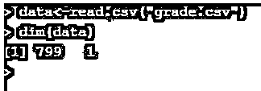

当考虑数据集中前 10 行时。

**代码:**

`data<-read.csv("grade.csv")
head(data,10)`

**输出:**

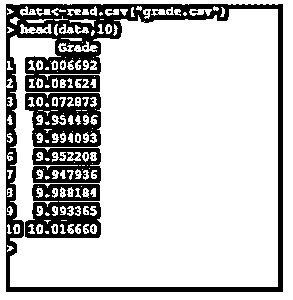

**代码:**

`data<-read.csv("grade.csv")
set.seed(123)
grade<-rnorm(30,mean=9.99,sd=0.04)
head(grade)`

**输出:**

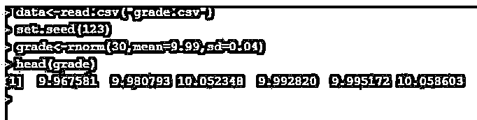

为了比较密度，使用了 q-q(分位数)图。这是一个样本的曲线图。

**代码:**

`qqnorm(data$Grade)
qqline(data$Grade,col="green")`

下面绘制的 Q 图显示了分位数。

**输出:**

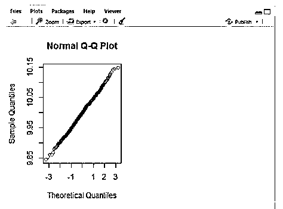

从上面的图中，用绿色画了一条直线，所有的点都在同一条线上。

考虑替代假设(以少、多作为参数)

**代码:**

`data<-read.csv("grade.csv")
t.test(data$Grade, mu = 10, alternative = "less")`

也可以使用给出正态分布值的 rquery.t.test()函数来执行该语句。

**输出:**

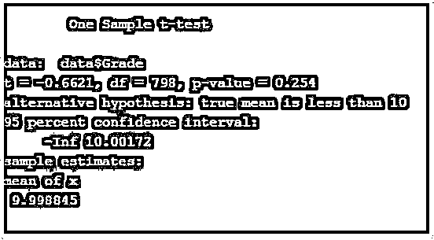

这里 df 表示自由度，t 表示统计量，值为负。概率小于 0.5。

**代码:**

`data<-read.csv("grade.csv")
set.seed(123)
y<-rnorm(10)
t.test(y,mu=10)`

**输出:**

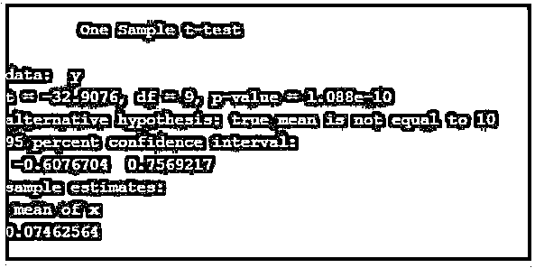

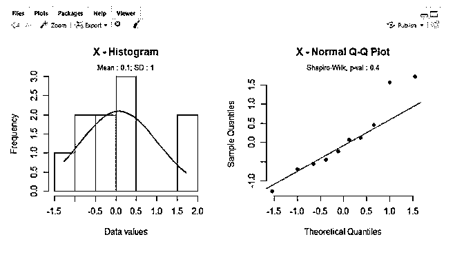

#### 实施例 2

实施双样本检验。

它用于比较两个不同样本数据的平均值。让我们假设男性的平均体重与女性的平均体重之比。这样做的男性和女性计数的数量应该是相同的。这里使用的 CSV 文件是 wt.csv。

**代码:**

`data<-read.csv("wt.csv")
dim(data)`

**输出:**

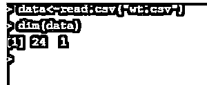

它有 1000 行和 2 列。

**代码:**

`data<-read.csv("wt.csv")
head(data,10)`

考虑到前十排。

**输出:**

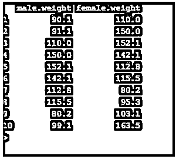

**检查同质性:**

**代码:**

`data<-read.csv("wt.csv")
var(data$male)`

**输出:**

**代码:**

`data<-read.csv("wt.csv")
var(data$female)`

**输出:**

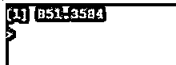

根据以上检查，方差相等。

**代码:**

`data<-read.csv("wt.csv")
t.test(data$male,data$female,var.equal = T)`

**输出:**

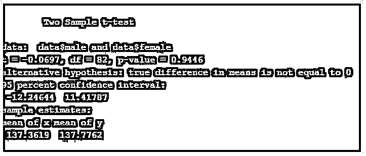

**代码:**

`data<-read.csv("wt.csv")
t.test(data$male,data$female,var.equal = F)`

**输出:**

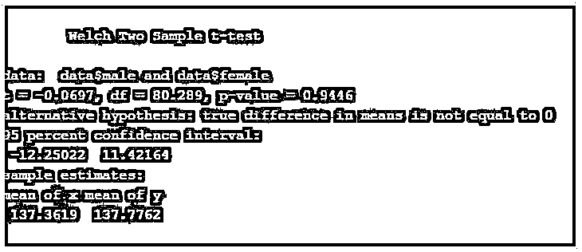

从上面的代码来看，两个值的平均值没有区别。

#### 实施例 3

实施配对 T 检验。

这里变量是成对出现的。T 检验用于比较两个变量。

一家软件公司愿意分析他们的项目在市场上的表现。他们决定每周监测一次销售情况。最后，公司有兴趣了解流程前后的区别。这里的价值来自同样的情况，叫做市场销售。

**代码:**

`data<-read.csv("wt.csv")
fbef <- rnorm(6, mean = 40000, sd = 40)
fafter <- rnorm(8, mean = 40075, sd = 40)
t.test(fbef,fafter,var.equal = TRUE) #Even we can assign  paired=TRUE using rquery statement.`

**输出:**

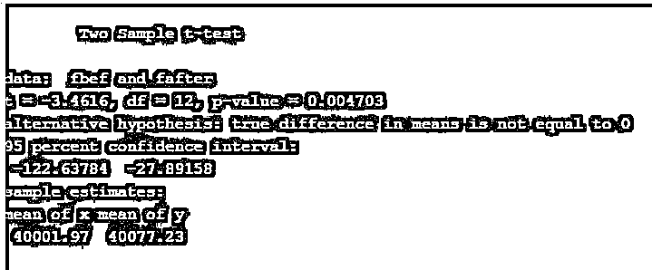

这里 p 值小于 0.5，因此平均值没有差异。

### R 中 T 检验的优势

*   T 检验易于理解，适用于所有场景(意味着灵活)。
*   t 检验有助于确定统计方法中的假设检验。T 检验在工业中的重要性在产品质量检验中起着重要的作用。
*   T 检验可以处理 n<30 时的样本量，以给出适当的结果。
*   为了生成许多统计值，R 使用 replicate()函数。

### 结论

因此，我们用零假设进行了 T 检验，并在 R studio 中进行了替代假设和模拟。此外，我们还学习了不同类型的 T 检验及其在 R 中的模拟。R 检验广泛应用于统计方法和实时应用中。r-检验通常被定义为找出两个不同组之间的均值差异。

### 推荐文章

这是一个 R 中 T-test 的指南。这里我们讨论 R 中 T-test 的介绍，它是如何在 R 中执行的，以及它的优点和相应的编程例子。您也可以看看以下文章，了解更多信息–

1.  [t-检验公式](https://www.educba.com/t-test-formula/)
2.  [R 包列表](https://www.educba.com/list-of-r-packages/)
3.  [瞬态测试](https://www.educba.com/transient-testing/)
4.  [梅文十拿九稳](https://www.educba.com/maven-surefire/)

