# R 中的数据库

> 原文：<https://www.educba.com/database-in-r/>

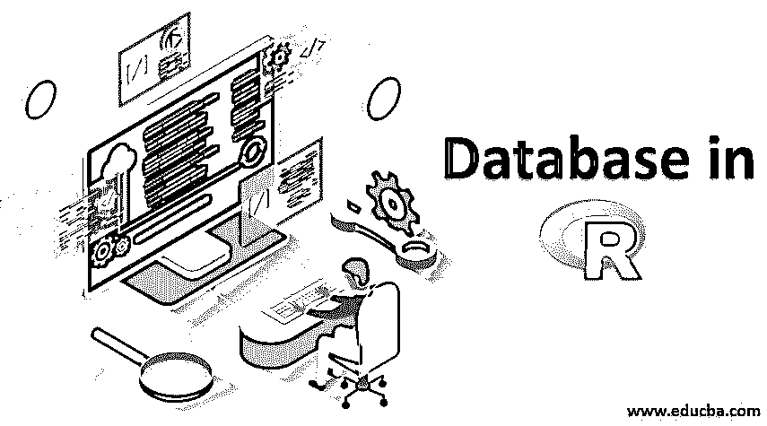

## R 中的数据库介绍

r 可以轻松连接多个[关系数据库如](https://www.educba.com/relational-database/) MySQL、Oracle、SQL Server 等。并以数据帧的形式从其中检索记录。一旦数据存在于 R 环境中，它就成为一个普通的 R 数据集，可以使用所有高效的包和函数进行控制或分析。数据是以结构化格式保存的关系数据库系统。

此外，我们将使用 MySql 作为连接到 r 的参考数据库。

<small>Hadoop、数据科学、统计学&其他</small>

### R 中数据集的操作

*   可以使用导入数据。csv 文件
*   数据可以在工作空间内部构建
*   数据可以从任何数据库导入

从任何导入到 R 环境中的数据源获取的数据都被更改为正常的数据集或数据帧。可以对这些数据帧进行分析和建模，以解决统计问题。这里用的数据库是 [MySQL 数据库。](https://www.educba.com/what-is-mysql-database/)

### R 中数据导入数据库的包

用于从数据库导入数据的包是“RMySQL”包。可以使用命令从 CRAN 本身下载这个包，

**代码:**

`install.packages (“RMySQL”)`

**输出:**

所以，这些包是从你的 R 库空间下载的。如果这个包已经可用，它可以在任何时候轻松地加载到工作区，否则，我们需要下载它以供进一步使用。

### 在 R 中加载包数据库

必须加载已安装的软件包才能继续工作。要加载包，可以使用下面的命令，

**代码:**

`library(RMySQL)`

**输出:**

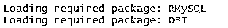

因此，所需的包被加载到 R 工作空间中。

### 如何读取 DB 表？

接下来的步骤允许我们将 DB 表的信息导入到 R workspace 中。数据库中的表格被转换为 r 中的[数据帧。](https://www.educba.com/data-frames-in-r/)以下是需要遵循的步骤。

#### 步骤 1:将 DB 连接到 R 工作区

MySQL 平台的数据库必须连接到 R 才能导入数据。

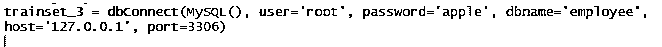

*   **这里的“trainset _ 3”**是存储 DB 连接到全局环境的工作区的变量。可以根据方便来命名
*   **语法解释为“db connect()”**是用于连接数据库的函数，它包含必须填写的参数。它使用给定的参数将 R 环境连接到 MySQL 数据库。
*   **“MySQL()”**提到用于连接的数据库类型
*   **“用户”**询问数据库的用户名以进行连接。基本上，它是用来连接数据库环境的凭证。这里给出了相同的用户名来连接 R workspace。
*   **“密码”**询问数据库的密码以进行连接。基本上，它是用来连接数据库环境的凭证。这里给出了相同的密码来连接 R workspace。
*   **"dbname"** 询问在 MYSQL 环境中创建的数据库的名称。
*   **“主机”**是你电脑机器的本地主机。
*   **“port”**是 MYSQL 应用使用的端口号。基本上，该端口监听应用程序。

通过执行这个命令，数据库连接到 r .并在全局环境中创建变量。

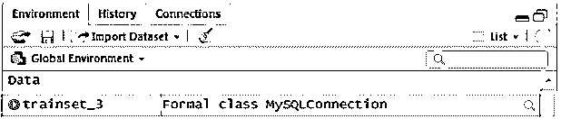

所以，它像一个类一样保存信息，可以随时调用，并且可以初始化类中的变量。如果像放大镜一样的图标被点击，它会像

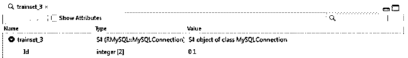

#### 步骤 2:将数据转换为 R 数据帧

在 R 工具中处理的问题有训练和测试数据。这些数据允许我们解释和解决问题。R 模型从训练数据中学习模式，而测试数据用于评估从测试数据中学习的模式。这里的命令用于从数据库表中导入数据。

##### 代码 1–列车数据

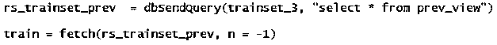

*   **在这里，“RS _ trainset _ prev”&“RS _ trainset _ curr”**是为获取数据库表而创建的变量。可以根据方便来命名。
*   **"dbSendQuery()"** 是包含数据加载到 r 的参数的函数，通过 SQL 查询使用数据库连接取数据。
*   **"trainset_3"** 第一步创建的类，包含数据库连接的所有信息。在这里，这标志着需要获取数据的位置。
*   **“select * from prev _ view”&“select * from curr _ view”**与 MySQL 中使用的读取表信息的 select 查询相同。

这是在全局环境中作为类创建的。

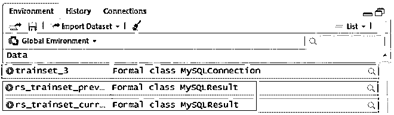

如果在 rs_trainset_prev 附近单击放大镜图标，它会像

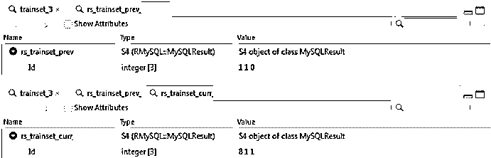

##### 代码 2–测试数据

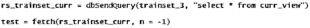

*   **这里“train”&“test”**是用来将完整的 DB 表存储到 R 数据帧中的变量名。基本上是建模的训练数据。
*   **“fetch()”**是使用给定的 SQL 查询从 DB 中提取数据的函数。它包含指示数据量和获取位置的参数。
*   **"rs_trainset_prev"** 是此处继承的类，用于获取数据库详细信息
*   **“n =-1”**表示要为 R 数据帧提取的 DB 表中的行数。这个“-1”表示该行需要一直提取到末尾。而且是 fetch()中非常重要的参数。

执行代码 2 后，创建了两个数据帧，包含行和列。这里，观察值表示数据库表中的行数，变量表示数据库表中的列数。

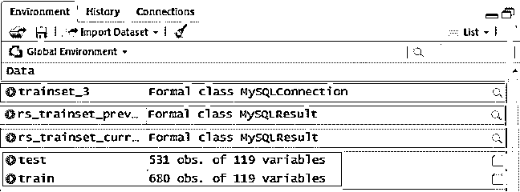

单击测试和训练图标时，会将数据框展开为一个窗口。

##### 列车数据帧

##### 测试数据框架

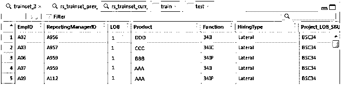

### 如何将 R 数据帧写入 DB？

R 工作空间中的数据帧可以导出为 DB:

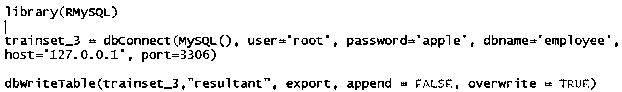

*   **"library(RMySQL)"** 如果包在环境中不可用，则加载该包。如果没有加载包，rest 代码会导致错误。
*   **“列车组 _ 3”**如上所述加载数据库连接
*   **“DB write table”**是用于将数据帧作为表格写入或导出到 DB 的函数。它有以下参数，需要正确给出。
*   **“列车组 _ 3”**是数据库连接类
*   **“结果”**是导出到数据库的表的名称。可以根据方便来命名
*   **【导出】**是 R 中可用的要导出的数据帧。可以根据方便来命名
*   **“append”**是值为真/假的参数。TRUE–追加导出表格&的行 FALSE–不追加表格。
*   **“overwrite”**是值为真/假的参数。TRUE–覆盖现有表格&FALSE–不覆盖表格。

以下是在 r 中使用 DB 包的步骤。

### 推荐文章

这是一个 R 语言的数据库指南，在这里我们讨论数据集的操作，如何读取数据库表的步骤，以及如何将 R 数据帧写入数据库？并附有相应的例子。您也可以浏览我们的其他相关文章，了解更多信息——

1.  [多元线性回归](https://www.educba.com/multiple-linear-regression/)
2.  [数据科学家所需的技能](https://www.educba.com/skills-required-for-data-scientist/)
3.  [数据库并行度](https://www.educba.com/database-parallelism/)
4.  [Oracle 示例数据库](https://www.educba.com/sample-database-for-oracle/)
5.  [R 中多元线性回归指南](https://www.educba.com/multiple-linear-regression-in-r/)

