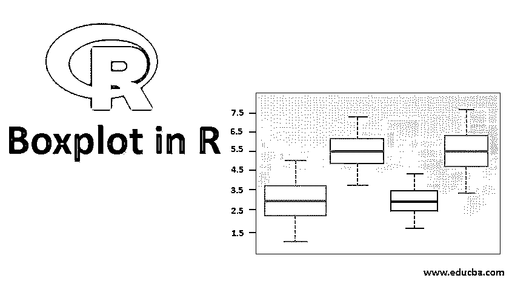
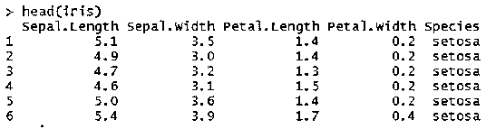
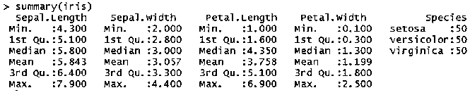
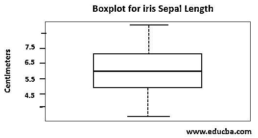

# R 中的箱线图

> 原文：<https://www.educba.com/boxplot-in-r/>

## R 中的箱线图介绍

箱线图是一种流行的可视化或图形格式，对于探索性数据分析非常有用。R 是一种开源的统计语言，广泛应用于分析行业，R 语言是生成箱线图的首选语言。它有一个内置的支持箱线图的库或包，也有额外的包可用于 R 来增强箱线图的创建和更好的箱线图的颜色表示。使用 R 的箱线图总是数据分析师或数据科学家专业人员理解数据分布的首选。

### 使用 R 理解箱线图

在讨论语法和创建箱线图的详细过程之前，从 R 语言和箱线图开始有一些基本概念，这将有助于理解使用 R 的箱线图。

<small>Hadoop、数据科学、统计学&其他</small>

*   R 语言作为内置[控制台或 GUI](https://www.educba.com/gui-testing/) 与 R 命令或包交互。
*   R studio 是 R
*   r 是一种脚本语言，它基于输入数据执行处理和计算，
*   要将数据输入到 R 环境或工作区，有几个选项可用，我们将讨论 CSV 文件输入，这是将数据导入 R 的最常见选项。
*   它将数据存储在变量中，也称为数据帧。
*   除了导入或获取外部数据之外，R 中还有几个默认数据集可用，这对 R 包或机器学习实践的学习和实践很有用。
    **举例:** iris，Toothgrowth，泰坦尼克号，rivers。可用数据集的完整列表可以在 R console 或 R studio 中使用 data()查看。
*   r 语言数据在数据帧中表示为表格结构。

#### 方框图

*   这些图形用矩形框、线和点表示，还可以选择颜色和标签。
*   箱线图可以垂直或水平表示。
*   它以四分位数表示数据范围，四分位数间范围(IQR)即 Q1 到第三季度在方框中表示。
*   数据中的异常值表现为胡须外的点或小圆圈。
*   胡须用虚线表示。

### 使用 R 语言创建箱线图的语法

使用 R 语言创建箱线图的语法如下所示:

**语法:**

`boxplot(x,...)
Package name: boxplot`

该软件包对于创建给定数据集或一组变量值的箱线图和须线图非常有用。它接受箱线图形成的几个参数。S3 方法用于为箱线图参数创建一个公式，如果公式中没有提到它将采用默认值。

#### R 中公式的 s3 方法的 Boxplot 语法

**语法:**

`boxplot(formula, data = NULL, ..., subset, na.action = NULL)`

#### R 中公式的默认 s3 方法的 Boxplot 语法

**语法:**

`boxplot(x,...,data, range = 1.5, width = NULL, varwidth = FALSE,
notch = FALSE, outline = TRUE, names, plot = TRUE,
border = par("fg"), col = NULL, log = "",
pars = list(boxwex = 0.8, staplewex = 0.5, outwex = 0.5),
horizontal = FALSE, add = FALSE, at = NULL)`

##### 基本参数描述

*   **x:** 该参数表示将在其上创建箱线图的数据向量。
*   这包括数字向量或包含数字向量的列表。这可能包括 NA 值或空值。
*   **数据:**R 中的数据帧或列表
*   **公式:**一个公式，比如 y ~ x，其中 y 是要根据分组变量 x 进行分组的数据值的数值向量
*   **… :** 对于公式方法，要传递给默认方法的命名参数这三个点用作参数。
*   **名称:**组级名称，将打印在组盒图上
*   **notch:** 这是一个布尔标志参数，用于在每个箱线图中绘制 notch，它代表两个分组箱线图的中值是否不同或重叠。

Note: Please refer to R documentation for a complete list of argument details that can be found from the help section of R studio.

此外，还有一个 ggplot2 包，它很受欢迎，可用于 R 语言的箱线图创建，具有图形表示的附加功能。

**语法:**

`ggplot(data, formula) +geom_boxplot()`

此处，数据表示将在其上创建箱线图的数据变量，公式是为箱线图的形成指定条件的参数。

geom_boxplot()用于指示 R 语言通过 ggplot2 包构建 boxplot

我们将在本文中进一步描述如何使用 boxplot 包创建一个 boxplot。

### 如何在 R 中创建 Boxplot？

1.在 R studio 中设置工作目录

`o    setwd(“path”)`

2.导入 CSV 数据或将默认数据集附加到 R 工作目录。

R 中的 read.csv 函数用于从本地、网络或 URL 读取文件

`datafame_name = read.csv(“file”)`

3.R 中的 Attach 函数对于快速访问数据框中的对象非常有用。

`attach(datafame_name)`

4.接下来查看数据集的结构，使用 head()函数。

默认情况下 head()将显示数据帧的第一部分或向量或矩阵。

`head(datafame_name)`

5.查看数据集的摘要，一些值将以图形方式绘制在箱线图中

`summary(datafame_name)`

Summary()显示了的结果值

*   部
*   最大
*   中位数
*   中间
*   第一个四分位数
*   第三四分位数

boxplot 使用通过 summary()显示的值来绘制图形，以表示数据分布。

6.画出基本的箱线图

*   boxplot(datafamename$variablename~datafamename$variablenameOne)
*   $ symbol 在 [R 语言](https://www.educba.com/what-is-r-programming-language/)中应用，用于从数据帧中识别特定变量或对象。
*   ~符号用于为属于数据框的组创建多个箱线图。

7.向 y 轴添加级别，并为箱线图提供标题，以便更有意义地表示

*   boxplot(datafamename$variablename,ylab=’labelname’,main=’title’)
*   lab 参数用于分配 y 轴标签
*   主参数用于指定图表的标题

### R 中的箱线图示例

对于箱线图示例，我们将使用默认的 iris 数据集。

最佳做法是附加数据集

*   附加(虹膜)
*   它不会显示任何输出

要查看虹膜数据集的结构，使用 head(虹膜)功能

要查看 iris 数据集的摘要，请使用摘要(iris)功能

该箱线图显示在图中。在该示例中，表示虹膜数据集的空间长度可变数据分布，y 轴水平为厘米，图形标题为虹膜萼片长度的箱线图。

箱线图(鸢尾属$萼片。长度，ylab= '厘米'，main= '鸢尾萼片长度的方框图')

### 结论

使用 R 语言的箱线图有助于通过识别机器学习模型开发和实现的异常值来清理行输入数据。这些对于向数据分析师展示数据分布和比较分析非常有用。统计学家和其他数据科学家更喜欢这个图表作为研究和分析的参考。

### 推荐文章

这是一个在 R 中创建盒状图的指南。这里我们讨论的是入门以及如何在 R？以及语法和示例。您也可以浏览我们推荐的其他文章，了解更多信息——

1.  [纳斯达克与道琼斯的区别](https://www.educba.com/nasdaq-vs-dow-jones/)
2.  [一级市场与二级市场的主要区别](https://www.educba.com/primary-market-vs-secondary-market/)
3.  [金融 vs 经济](https://www.educba.com/finance-vs-economics/)
4.  [资不抵债 vs 破产](https://www.educba.com/insolvency-vs-bankruptcy/)

