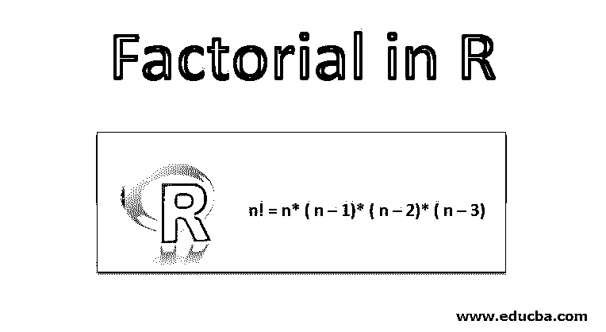
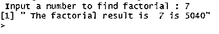
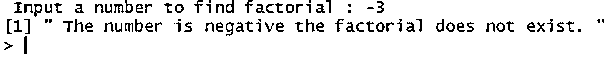
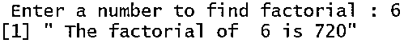
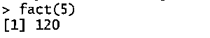
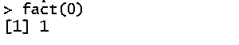
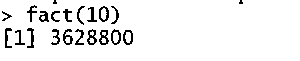

# R 中的阶乘

> 原文：<https://www.educba.com/factorial-in-r/>

## R 中阶乘的介绍

一个数学概念是基于从一个数到指定数的乘积的计算思想，乘法以相反的顺序工作，即从该数到一，在排列、组合和概率论中很常见，它可以通过用户定义的函数或利用内置函数通过 R 编程非常有效地实现，在 R 编程中称为阶乘。

让我们看一些例子来寻找阶乘

<small>Hadoop、数据科学、统计学&其他</small>

0 的阶乘= 0！= 1.

1 的阶乘= 1！= 1.

2 的阶乘= 2！= n *(n–1)= 2 *(2–1)= 2 * 1 = 2。

3 的阶乘= 3！= n *(n–1)*(n–2)= 3 *(3–1)*(3–2)= 3 * 2 * 1 = 6。

4 的阶乘= 4！= n *(n–1)*(n–2)*(n–3)= 4 *(4–1)*(4–2)*(4–3)= 4 * 3 * 2 * 1 = 24。

5 的阶乘= 5！= n *(n–1)*(n–2)*(n–3)*(n–4)= 5 *(5–1)*(5–2)*(5–3)*(5–4)= 5 * 4 * 3 * 2 * 1 = 120。诸如此类。

在上面的计算中，我们看到 0 的阶乘是 1，而负数的阶乘没有定义，在 R 中我们得到 NAN 作为负数阶乘的输出。

### R 编程中如何求阶乘？

这里我们将讨论使用各种方法计算阶乘的程序。

#### 示例 1–使用 if-else 语句的阶乘

**代码:**

`facto <- function(){
# accept the input provided by the user and convert to integer
no = as.integer( readline(" Input a number to find factorial : "))
fact = 1
# checking whether the number is negative, zero or positive
if(no < 0) {
print(" The number is negative the factorial does not exist. ")
} else if(no == 0) {
print(" The factorial result is 1 ")
} else {
for( i in 1:no) {
fact = fact * i
}
print(paste(" The factorial result is ", no ,"is", fact ))
}
}
facto()`

**输出:**

以上代码的输出为负数--

在上面的代码[中，if-else 语句](https://www.educba.com/if-else-statement-in-matlab/)首先检查 no 是否为负，如果 no 为负表示 no < 0 条件为真，则输出显示“数字为负，阶乘不存在”，而如果条件为假，则检查 else if no == 0 条件，如果为真，则输出显示“阶乘为 1”，否则用 for 循环计算阶乘，并将计算值显示为输出。

#### 示例 2–使用 for 循环的阶乘

**代码:**

`facto <- function(){
no = as.integer( readline(prompt=" Enter a number to find factorial : "))
fact = 1
for( i in 1:no) {
fact = fact * i
}
print(paste(" The factorial of ", no ,"is", fact ))
}
facto()`

**输出:**

在上面的代码中，它只是寻找阶乘，而不检查数字是否为负。

#### 示例 3–使用递归方法的阶乘

**代码:**

`fact <- function( no ) {
# check if no negative, zero or one then return 1
if( no <= 1) {
return(1)
} else {
return(no * fact(no-1))
}
}`

**输出:**

以上代码的输出为负数--

上述代码的输出为 0 号——

以上代码的输出为正数--

上面的代码使用了递归函数 fact()，fact()函数内的阶乘是通过行 return(no * fact(no-1))递归地求出每个数的乘积。假设我们将事实函数称为 fact(7)，那么函数 fact()递归如下所示

否= 7

如果(否<= 1) ->假

return no * fact(no-1)= > 7 * fact(6)= > 7 * 6 * fact(5)= > = > 7 * 6 * 5 * fact(4)= > 7 * 6 * 5 * 4 * fact(3)= > 7 * 6 * 5 * 4 * 3 * fact(2)= > 7 * 6 * 5 * 4 * 2 * fact(1)= > 7 * 6 * 5 * 4 * 3 * 2 * 1 = > 5040。所以最后结果是 5040。

#### 示例# 4–使用内置函数的阶乘

factorial()函数是 R 语言的内置函数，用于计算一个数的阶乘。该函数的语法是–

阶乘(否)

否–数字向量

具有不同参数的阶乘(无)函数的一些示例

`# find the factorial of -1
> factorial(-1)
[1] NaN
# find the factorial of 0
> factorial(0)
[1] 1
# find the factorial of 1
> factorial(1)
[1] 1
# find the factorial of 7
> factorial(7)
[1] 5040
# find the factorial for vector of each elements 2, 3, 4
> factorial(c(2,3,4))
[1]  2  6 24`

### 结论

*   从 1 到指定数的所有数的乘积称为指定数的阶乘。
*   用来求 n 个数的阶乘的公式或逻辑是 n！= n *(n–1)*(n–2)*(n–3)…。
*   0 的阶乘是 1，所有负数的阶乘不在 R 中定义，它输出 NAN。
*   在 R 语言中，一个数的阶乘有两种方法，一种是在循环中使用，另一种是使用递归(递归调用函数)。

### 推荐文章

这是一个关于 R 中阶乘的指南。这里我们讨论 R 中阶乘的介绍，以及用各种方法计算阶乘的例子。您也可以浏览我们推荐的其他文章，了解更多信息——

1.  [Python 中的阶乘](https://www.educba.com/factorial-in-python/)
2.  [C 语言中的阶乘](https://www.educba.com/factorial-in-c/)
3.  [反转 C 中的数字](https://www.educba.com/reverse-number-in-c/)
4.  [PHP 中的阶乘](https://www.educba.com/factorial-in-php/)
5.  [JavaScript 中的递归函数](https://www.educba.com/recursive-function-in-javascript/)

