# R 中的随机数生成器

> 原文：<https://www.educba.com/random-number-generator-in-r/>

## R 语言中随机数发生器介绍

R 中的随机数生成器是一种机制，它允许用户为各种应用程序生成随机数，例如采用各种值的事件的表示，或具有随机数的样本，这由 R 编程中的 runif()和 set.seed()等函数实现，这些函数使用户能够生成随机数并控制生成过程，从而使用户能够在现实生活问题的上下文中利用由此生成的随机数。

下面是一个使用 runif()函数生成并打印 1 到 99 之间的 50 个值的例子。

<small>Hadoop、数据科学、统计学&其他</small>

**代码**

`RandomNum <- runif(50, 1, 99)
RandomNum`

**输出:**

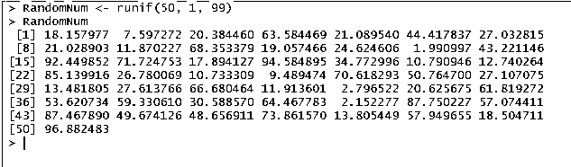

随机数生成器有助于生成一系列数字，这些数字可以保存为函数，以便在以后的操作中使用。随机数生成器实际上并不产生随机值，因为它需要一个称为种子的初始值。随机数的生成可以用 SET 来控制。SEED()函数。设置。SEED()命令使用一个整数来开始随机数的生成。此外，生成的随机数序列可以被保存并在以后使用。

例如，我们将使用代码对 1 到 100 之间的 10 个数字进行采样，并重复几次。

这是第一次。SEED()将从 SEED 5 开始，第二次从 SEED 12 开始。每次迭代都生成十个随机数。

**代码:**

`set.seed(5) # random number will generate from 5
TenRandomNumbers <- sort(sample.int(100, 10))
TenRandomNumbers`

**输出:**

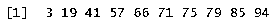

**代码:**

`set.seed(12) # random number will generate from 12
TenRandomNumbers <- sort(sample.int(100, 10))
TenRandomNumbers`

**输出:**

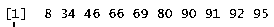

### 随机数发生器函数

R 中有[内置函数，用于从标准分布(如正态分布、均匀分布、二项式分布等)中生成一组随机数。在下一节中，我们将看到不同的函数，如 runif()、rnorm()、rbinom()和 rexp()来生成随机数。](https://www.educba.com/functions-in-r/)

#### 1.均匀分布的随机数

为了生成均匀分布的随机数，使用了 runif()。默认范围为 0–1。首先，我们将要求指定需要生成的数字。此外，可以使用 max 和 min 参数指定分布的范围。

**代码**

`# To get 5 uniformly distributed Random Numbers
runif(5)`

**输出:**

**代码**

`# Get 5 random Numbers from 5 to 99
runif(5, min=5, max=99)`

**输出:**

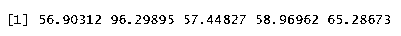

**代码**

`#To generate 5 integers from 0 to 100
floor(runif(5, min=0, max=101))`

**输出:**

**代码**

`# Generating integers without replacement
sample(1:100, 5, replace=FALSE)`

**输出:**

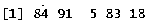

#### 2.正态分布随机数

要从正态分布中生成数字，需要使用 rnorm()。其中平均值为 0，标准偏差为 1。首先，我们将要求指定需要生成的数字。此外，mean 和 SD(标准偏差)可以是指定的参数。

**代码:**

`rnorm(5)`

**输出:**

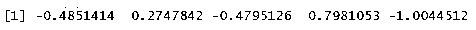

**代码:**

`# using a different mean and standard deviation
rnorm(4, mean=70, sd=10)`

**输出:**

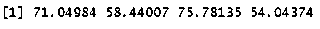

**代码:**

`# histogram of the numbers to verify the distribution
X <- rnorm(400, mean=70, sd=10)
hist(X)`

输出:

使用 rnorm()生成正态分布随机数

#### 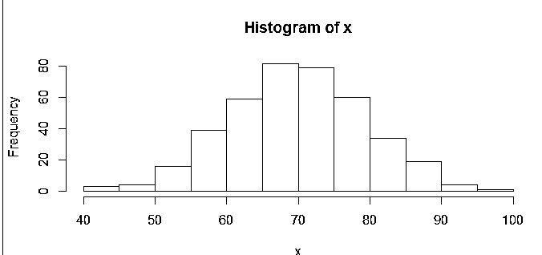

#### 3.二项式随机数

二项式随机数是一组离散的随机数。为了得到二项式数，n 的值被改变为期望的试验次数。例如试验 5，其中 n = 5

**代码:**

`n= 5
p=.5
rbinom(1 ,n, p)
# 1 success in 5 trails
n= 5
p=.5
rbinom(19, n, p) # 10 binomial numbers`

**输出:**

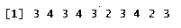

#### 4.指数分布随机数

指数分布用于描述电子元件的寿命。例如，电灯的平均寿命是 1500 小时。

**代码:**

`x=rexp(100, 1/1500)
hist(x, probability=TRUE, col= gray(.9), main="exponential mean=1500")
curve(dexp(x, 1/1500), add= T)`

**输出:**

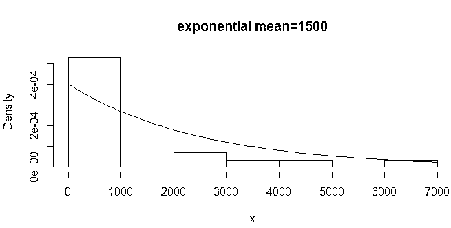

### 生成整数和浮点数

现在我们将学习为 r 中的两种类型的数生成随机数。它们是整数和浮点数。r 将自动检测这两个类别，并根据需要在它们之间移动。R 中的整数由可以是正数或负数的整数组成，而浮点数包括实数。它由一个指定离小数点最远的数字的值组成。该值是二进制的，并且可以指示要移动的二进制位数。生成随机整数的内置 sample()函数既可靠又快捷。业务需求要求您分析数据样本。要选择一个样本 R 有 sample()函数。为了生成 5 到 20 之间的随机整数，使用了下面的示例功能代码。

**代码:**

`rn = sample(5:20, 5)
rn`

**输出:**

生成 5 个随机样本

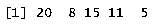

在上面的例子中，如参数所述，生成了五个值。我们已经看到如何在 r 中选择随机值的子集。在实时情况下，您将需要从现有数据帧中生成随机样本。从大型数据集中选择数据样本进行观察是数据工程师在日常生活中承担的工作之一。

**代码:**

`Height_Weight_Data <- read.csv("test.csv") # to test this please download csv file
Height_Weight_Data
# Height_Weight_Data sample data frame; selecting a random subset in r
Sample <- Height_Weight_Data[sample(nrow(Height_Weight_Data), 5), ] # pick 5 random rows from dataset
Sample`

**输出:**

根据数据框名称生成随机样本，如 Height_Weight_Data

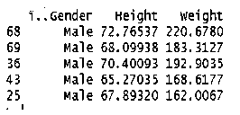

关于浮点数，有几件事需要记住。

*   它们本质上是二元的。
*   受限于所代表的实数。

现在让我们看看如何在-10 到 10 之间生成随机浮点数

**代码:**

`Random <- runif(n=10, min=-10, max=10)
Random`

**输出:**

生成随机浮点数

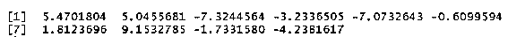

Runif()指的是随机均匀。在上面的例子中，我们在[-10:10]之间得到了 10 个随机分布的数字

### 结论

在本文中，我们已经讨论了 R 中的随机数发生器，并看到了如何设置。种子函数用于控制随机数的生成。我们已经了解了如何将 SEED 用于能够生成随机数序列的可再生随机数，以及如何使用 SET 设置随机数种子生成器。种子()。需要生成随机数的统计方法在分析过程中偶尔会用到。r 配备了多种函数，如均匀函数、正态函数、二项式函数、泊松函数、指数函数和伽马函数，可以模拟最常见的概率分布。

### 推荐文章

这是一个 R 中随机数发生器的指南。这里我们讨论 R 中随机数发生器的介绍和功能，以及相应的例子。您也可以浏览我们推荐的其他文章，了解更多信息——

1.  [R 中的线性回归](https://www.educba.com/linear-regression-in-r/)
2.  [R 中的二项分布](https://www.educba.com/binomial-distribution-in-r/)
3.  [R 中的逻辑回归](https://www.educba.com/logistic-regression-in-r/)
4.  [R 中的线图](https://www.educba.com/line-graph-in-r/)

