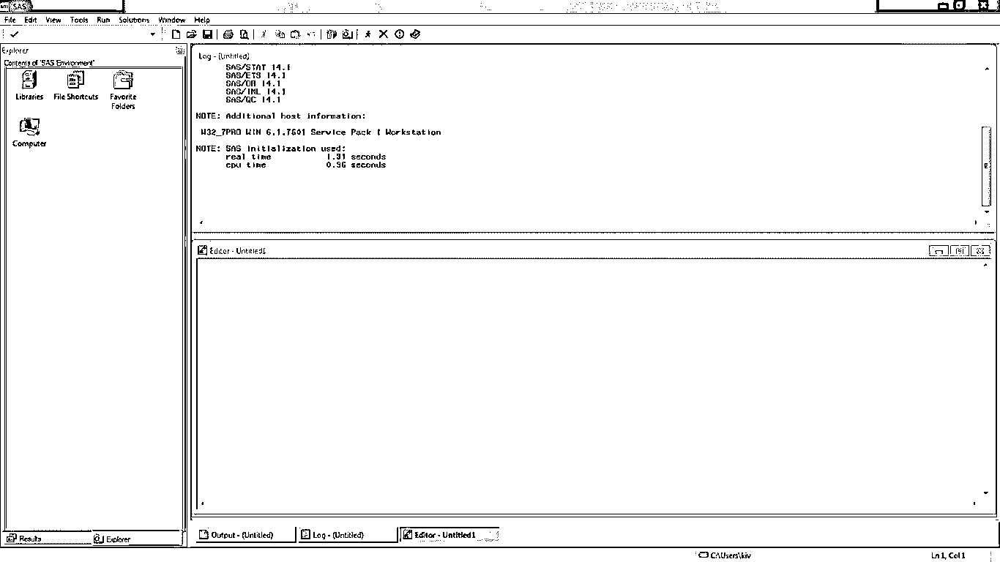
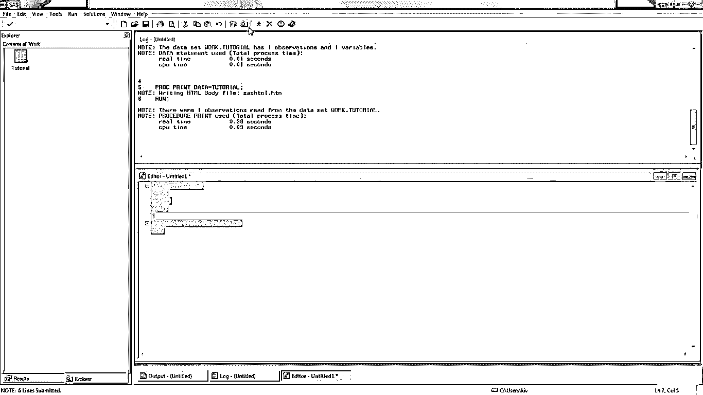
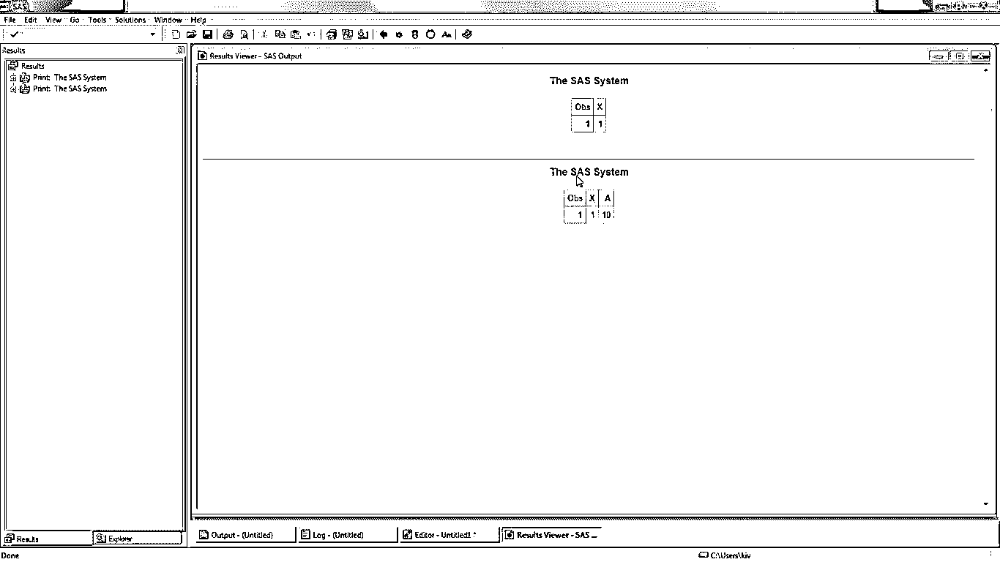

# 什么是 SAS

> 原文：<https://www.educba.com/what-is-sas/>

## SAS 简介

主要用于数据管理、分析和商业智能的统计软件称为 SAS。SAS 代表统计分析系统，它是用 C 语言编写的。SAS 用于大多数操作系统。SAS 可以用作编程语言，也可以用作图形界面。它是由安东尼·詹姆斯·巴尔开发的，可以从电子表格和数据库中读取数据。输出可以是表格、图形和文档。SAS 用于报告、检索和分析统计数据，也用于运行 SQL 查询。

### 什么是 SAS？

统计分析系统存在的原因是为了处理从许多来源获得的数据。来自各种的数据被收集在一起，并用于执行某种统计分析，以检索预期的结果。如前所述，我们可以使用软件来进行统计分析，但是我们也可以使用 SAS 编程语言。

<small>Hadoop、数据科学、统计学&其他</small>

### SAS 如何让工作变得如此简单？

SAS 使组织能够非常容易地处理粗略收集的数据，并将这些数据转化为一些有用的结果，从而在几个方面帮助业务。在这里，我们将了解统计分析在各种行业中的应用:

#### 信息技术管理

在信息技术领域，数据分析被非常积极地用于设计基于数据处理结果的解决方案。信息技术包括解决方案交付系统，如果不密切关注数据的变化趋势，这是不可能实现的。

#### 在 CRM 中

对于任何企业来说，客户关系管理都起着非常关键的作用，因为它是导致企业发展的唯一因素。对于处理大量客户的企业来说，了解他们的客户愿意与企业合作的方式非常重要，这可以通过分析来实现

#### 商业智能

在商业智能中，分析利用随机数据来获取一些宝贵的信息。所有这些都与 SAS 应用程序或平台引入的数据分析有关。

#### 金融管理

在管理财务数据时，代表们应该主要从事可视化分析，因为他们大部分时间都是非技术人员。SAS 让我们既可以使用图形界面，也可以使用编程语言，这使得任何类型的人都很容易，不管他们是否有技术背景。

#### 估计生产率

它让我们评估几个实体的性能，如员工、机器等，然后用于生成生产率报告。当需要进行数据比较时，估计数据大多被证明是有益的。

### 了解 SAS 软件环境

**

** 

在本节中，我们将看看 SAS 软件是由什么组成的。上图显示了我们打开软件后得到的 SAS 软件屏幕。下面，我们将看到屏幕上所有组件的一些详细信息。

#### 日志页签

图片中写有蓝色文字的窗口是日志。它显示开发人员编写和执行代码或程序时生成的所有日志。

#### 输出部分

输出是一个部分，可以使用图片底部的选项卡来填充。顾名思义，它是用来获取输出的。此部分可用于生成 SAS 程序的结果。

#### 编辑部分

在编辑器部分，程序将能够编写用于获得预期输出的代码。顾名思义，它实际上为开发人员提供了一个编辑代码的平台。这里写的代码必须遵循一些特定的语法，我们将会看到。

#### 资源管理器窗口

左侧的窗口由一些文件夹组成，是资源管理器，它拥有一些非常重要的文件夹，如图书馆。可以在 library 文件夹下看到创建的 SAS 表。它还存储可用于处理实际数据的样本数据集。

#### 结果选项卡

顾名思义，它是显示我们执行的一组代码或程序的结果的窗口。点击结果标签，它会给你一个我们执行的所有程序的列表，选择一个，我们会得到相应的输出。

### 你能用 SAS 做什么？

在使用 SAS 时，理解它是一种能力以便有效地利用它是非常重要的。由于它提供的功能，它帮助我们获得广泛的解决方案。下面是我们可以使用 SAS 做的一些事情。

#### 生成图形报告

统计分析软件允许我们使用原始数据来生成图形报告。由于它的特性，对于非技术人员来说也很容易使用。

#### 统计分析

通过数据处理获得的统计数据可以用于统计，实际上这是一种利用收集有用信息的结果来创建的方法。

#### 质量的提高

提高质量的最有效方法是将旧的结果与修改后生成的最新结果进行比较，以使系统更好。基于比较结果，需要采取适当的步骤来改进任何产品或服务的质量。

#### 执行运筹学

研究就是在做出最终决定之前考虑数据。使用 SAS 软件获得的信息有助于决策，以便最终确定研究的总结或结果。

#### 开发应用程序

我们在上面已经看到，该软件具有编辑器选项卡、输出选项卡、日志选项卡，这些选项卡用于提供编程平台。开发人员可以在软件中编写定制代码，根据需要设计报表生成。

### 使用 SAS

直到这一节，我们完全知道什么是 SAS，它如何帮助我们，以及 SAS 存在的目的是什么。现在我们将编写一个简单的程序来理解统计分析软件中的代码是如何编写的。为了给你一个开发环境和代码的精确视图，添加了一张图片。所以让我来帮你吧。我们走吧！

**输入**

**

** 

*   单词“数据”是关键字，教程是保存这个程序的文件名。
*   这里写的每个语句都要以分号结尾。
*   x 和 A 用于存储将要存储在行中的赋值。
*   PROC 是在行标记后的第一行中使用的关键字。
*   打印数据=教程，用于将教程程序存储在 explorer 选项卡中 library 文件夹下的 work 文件夹中。

**输出**

**

** 

*   程序完成后，只需点击图片顶部工具栏中的运行图标。
*   输出显示了使用程序包含的数据的可视化表示。
*   这里的输出有 2 行 3 列。
*   Obs 列在这里显示序列号，X 和 A 列显示分配给它的值。

### 优势

SAS 是众所周知的，因为它有几个优点。在本节中，我们将讨论 SAS 的一些优势，这些优势使它非常有用。

#### 图形交互

到目前为止，我们已经完成了 SAS 中的编码，但它也为我们提供了一个图形界面，任何人都可以使用提供的选项，它的工作方式与编写的程序相同。

#### 商业智能

它是商业智能中必须使用的工具。在处理数据时，这种分析软件被认为是生成信息的非常有用的工具。同样，由于简单的界面，业务分析师不需要学习编程，这也使他们的工作变得非常容易和高效。

#### 大型数据处理

SAS 应用程序为我们提供了一个平台，在这个平台上，我们可以处理数百万不同的数据，将它们转化为对业务有用的信息。这种同时处理大量数据的能力使其具有优势，同时也节省了大量时间。

#### 用于多个行业

该系统的使用不限于任何特定的行业。它可以很好地处理属于任何行业的数据。例如，它可以以与人力资源行业相同的效率用于金融业。

### 所需技能

SAS 的好处是，它不强制任何人学习任何技术来使用 SAS 软件。任何人，无论技术背景如何，都可以使用它。虽然这不需要很强的专业技能，但全方位的了解总是能提供优势。分析软件中的界面非常简单，这使得用户可以更方便地进行交互。

要用 SAS 编写程序，必须了解编程的基本原理。就像其他程序一样，用这个软件编写的程序也有像 DATA、PROC 等关键字。必须像在其他语言中使用关键字一样使用。对编码的基本理解将是在许多文件编辑器的标签页中编写你的代码。

### 为什么我们应该使用 SAS？

以我的理解，到现在为止你应该知道为什么你应该使用这个系统。但是再次提醒你，或者给你一个提示，我们可以再次重复这个概念。因此，当我们需要处理种类繁多、数量巨大的数据时，可以使用 SAS。它使用数据，并帮助将其转换成一些有用的信息。

此外，如果与其他处理数据的方法相比，SAS 总是首选，因为它倾向于处理数据池。当处理较少的数据时，有时也可以使用 Microsoft Excel，但当处理数百万客户的记录，使用他们的数据生成报告时，SAS 是我们可用的最佳选择。

### 范围

SAS 被大力用于提高任何业务的决策质量。任何精通分析系统的人都可以成为业务分析师，并在跨国组织中发展自己的事业。还有，我们知道在 SAS 工作不需要任何技术背景，任何不想学技术东西但想从事管理工作的人都可以选择统计分析作为他们的主流。

### 谁是学习 SAS 技术的合适受众？

这是一个假设的问题，完全基于一个人想要什么，知识渊博，愿意学习。这个系统对各种各样的人开放，不管他们的技术背景如何。如果有人想从事数据分析工作，那么他们可以利用简单的图形界面来处理数据。

而拥有编程技能的人可以开发他们定制的分析解决方案。这个系统给广大的人们提供了使用它的机会。此外，那些曾在其他技术领域工作过的人，现在希望愿意在这个系统中切换，也可以成为它的一部分，因为它有简单的交互界面。它只是让我们所有人的工作变得非常容易。

### 结论

SAS 提供了一个非常简单的机制来处理大量的数据。SAS 软件可以在市场上买到，有助于实现这一系统。它的最佳特性是将原始数据转换成可以可视化表示的有用信息，这使得它成为最佳选择。

### 推荐文章

这是一个关于什么是 SAS 的指南。这里我们讨论了情景应用程序的工作原理、定义、技巧和优点。您也可以浏览我们推荐的其他文章，了解更多信息——

1.  [什么是 SQL？|优势&各种子集](https://www.educba.com/what-is-sql/)
2.  [什么是阿帕奇？](https://www.educba.com/what-is-apache/)
3.  [什么是数据挖掘？|工作和概念](https://www.educba.com/what-is-data-mining/)
4.  什么是 Django？
5.  [SAS 的优缺点](https://www.educba.com/advantages-of-sas/)

