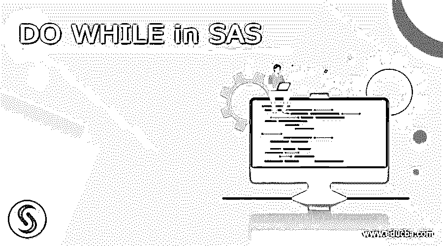
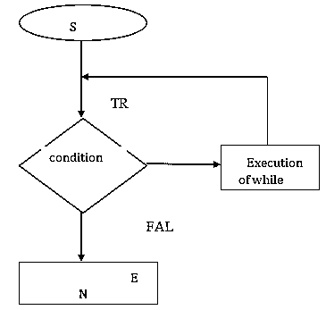
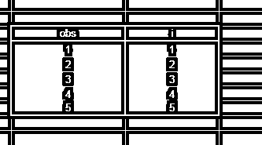
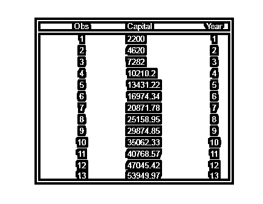

# 在 SAS 时执行

> 原文：<https://www.educba.com/do-while-in-sas/>

## SAS 中的待办事项介绍

SAS 是一个统计分析系统，借助强大的可视化和交互式仪表板，为业务分析(如分析、报告、数据挖掘和预测建模)提供完整的解决方案。主要用于医疗目的分析。对于编程，它有两个步骤数据步骤和程序步骤。在数据方面，我们必须解释我们给出的数据和它有助于执行的程序步骤。

在 SAS 中有三种基本循环，即 DO 循环、DO UNTIL 循环和 DO WHILE 循环，这里我们介绍 DO WHILE 循环。这是一个控制流语句。In SAS 语句根据条件重复执行，直到 while 条件变为 false。

<small>Hadoop、数据科学、统计学&其他</small>

**语法:**

`DO WHILE (condition); Statements;
END`；

在语法中，我们必须在括号内给出条件。在第二行中，我们必须给出执行语句，然后我们必须给出结束循环的 END 命令。

**流程图:**

In this flowchart clearly know that it stops the execution when the while condition becomes false For details please check below with the working and examples.

### 工作

你们都知道 DO WHILE 循环有助于根据条件多次重复计算。在 sa 中，当满足一定条件时，通常必须停止迭代。它通常有两个选项 DO UNTIL 和 DO WHILE 循环。在 DO WHILE 循环中，当 WHILE 条件失败时，它停止迭代。必须在每次迭代中检查条件，一旦失败就停止执行。In 编码对于重复情况和序列生成情况非常有用。根据条件轻松生成序列。为了便于理解，当我们在生活中进行金融活动时，大多数人都有贷款或 EMI。因此，我们必须计算还款，例如我们必须还款多少次，这可以通过 DO WHILE 循环轻松计算。我们只需要金额细节。这里我们只解释简单的程序。

#### 程序#1

`Data new; i=1;
do while(i<=5);output; i=i+1;
end;
proc print new; run;`

**说明:**

在这个程序中，我们只是给数据命名为 new。这里我们要打印 1 到 5。在命名数据后的数据步骤中，我们只是将 I 作为一个变量，并将值指定为 1，然后 DO WHILE 循环条件 I <=5。在它按照给定的条件迭代之后。在 while 循环突然失败并停止执行之后，它将生成多达 5 个。

**输出:**

#### 程序#2

`data Work* investment do while(capital<50000); capital+capital *,10; year+1;
Output; End;
Proc print Work*investment Run;`

**说明:**

在这个项目中，我只是给工作*投资。因为这个程序是计算每年的资本总额。通常情况下，我只是根据程序给出一个名称，因为这对于保存文件非常有用，之后我给出了 DO WHILE 循环的条件，即资本小于 50000，之后给出了计算和年度的语句，并给出了输出语句和过程步骤。它将逐年产生资本，直到 while 条件失效。

**输出:**

### 结论

通常所有类型的编程语言都有 DO WHILE 循环。SAS 也是一个商业分析软件。在 SAS 中编写和运行程序非常容易。因为允许使用小写和大写字符。它有两个步骤数据步骤和程序步骤。In DO WHILE 循环根据给定的条件迭代语句，直到 WHILE 条件出错。它在我们的日常生活中有着非常重要的作用。因为如果你是程序员，它有助于重复计算，如果你是正常人，它用于计算一些基本的财务计算，如 EMI 计算，我们已经偿还了多少个月的金额。因此，我们认为这是一个非常重要的部分，它有助于根据我们的需要进行一些逻辑计算。

### 推荐文章

这是在 SAS 中要做的指南。这里我们讨论一下简介，语法，流程图，如何工作？用程序。您也可以看看以下文章，了解更多信息–

1.  [SASS @for](https://www.educba.com/sass-for/)
2.  [萨斯地图](https://www.educba.com/sass-map/)
3.  [SASS @extend](https://www.educba.com/sass-extend/)
4.  [萨斯嵌套](https://www.educba.com/sass-nesting/)

